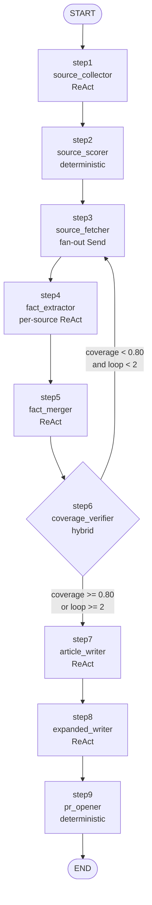
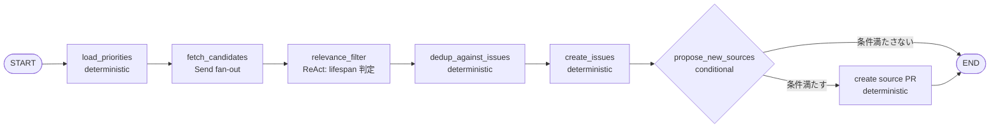
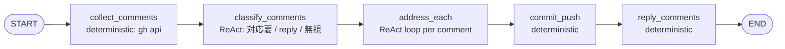

# libmatic ARCHITECTURE

**状態**: Phase 1.2 草案（2026-04-23）
**目的**: libmatic core の LangGraph hybrid アーキテクチャを全体俯瞰する。node 単位の詳細仕様は [SPEC.md](SPEC.md)、Phase 0 の意思決定は [`../../docs/libmatic-oss-plan.md`](../../docs/libmatic-oss-plan.md) を参照。

---

## 1. 全体像

libmatic は **3 つの workflow** を LangGraph `StateGraph` として定義し、それぞれの内部で必要に応じて ReAct agent を動かす hybrid 設計。Anthropic "Building Effective Agents" の workflow / agent の区分に準拠。

```
libmatic core
├── Workflows (StateGraph)        ← フローは固定、順序が予測可能
│   ├── suggest-topics  (週次)
│   ├── topic-debate    (夜次、9 step)
│   └── address-pr-comments (PR レビュー対応)
│
├── Nodes                         ← 各 step の実装単位
│   ├── ReAct agent node          (create_react_agent / custom)
│   ├── Deterministic node        (普通の Python 関数)
│   └── Hybrid node               (数値計算 + LLM judge)
│
├── Tools (@tool)                 ← LLM から呼ぶ道具
│   ├── File I/O      (Read/Edit/Write)
│   ├── Shell         (Bash)
│   ├── Web           (WebFetch/WebSearch)
│   ├── Source fetch  (fetch_source, fetch_x)
│   ├── Coverage      (verify_coverage)
│   └── GitHub        (gh_issue_*, gh_pr_*)
│
├── Provider (init_chat_model)    ← provider 差を吸収
│   └── v0.1: Anthropic only
│
└── Checkpointer (SqliteSaver)    ← session 永続化 / resume
```

---

## 2. Workflow と Agent の使い分け

- **Workflow** = 予め決まった順序でステップを直列 / 並列に実行。分岐も conditional edge で明示。
- **Agent** (ReAct) = LLM が「次にどの tool を呼ぶか」を自律判断してループ (think → act → observe → think …)。

libmatic の各 step について、どちらを採用するかは **Phase 0 で確定** ([`libmatic-oss-plan.md`](../../docs/libmatic-oss-plan.md) §3.3 a):

| step | 種別 | 理由 |
|---|---|---|
| 1 source_collector | **ReAct** | 探索戦略は issue により変わる |
| 2 source_scorer | **Deterministic** | `score = f(priority, published_at, relevance)` は関数 |
| 3 source_fetcher | **Deterministic (Send 並列)** | URL → fetch tool を呼ぶだけ |
| 4 fact_extractor | **ReAct (per source)** | source 種別で読み方が変わる |
| 5 fact_merger | **ReAct** | dedup + 衝突解決に判断必要 |
| 6 coverage_verifier | **Hybrid** | 数値計算 + LLM judge + loop 指示 |
| 7 article_writer | **ReAct** | 執筆が LLM の主仕事 |
| 8 expanded_writer | **ReAct** | 同上、拡張版 |
| 9 pr_opener | **Deterministic** | git / gh CLI 手続き |

---

## 3. Workflow B (topic-debate) の graph



### 3.1 Workflow A (suggest-topics) の graph



### 3.2 Workflow C (address-pr-comments) の graph



---

## 4. State の流れ (topic-debate)

各 node は `TopicDebateState` を input として受け取り、更新分だけを返す (LangGraph の reducer 経由でマージ)。

```
issue_number, issue_title, issue_body, lifespan
          │
          ▼
   [step1] → candidate_sources
          ▼
   [step2] → scored_sources
          ▼
   [step3] → fetched_sources           (Send で並列 fetch)
          ▼
   [step4] → raw_facts_per_source      (Send で並列 extract)
          ▼
   [step5] → merged_facts
          ▼
   [step6] → coverage_score, gaps      (閾値で step3 にループ or step7 へ)
          ▼
   [step7] → article_draft
          ▼
   [step8] → article_expanded
          ▼
   [step9] → pr_number, pr_url
          ▼
         END
```

State schema の pydantic 定義は [SPEC.md §3](SPEC.md#3-state-schema-topic-debate) 参照。

---

## 5. Tool レイヤー

tool は LangChain `@tool` で定義、`bind_tools()` で各 LLM に attach する。provider 差の吸収は LangChain に委譲。

| カテゴリ | tool | 責務 |
|---|---|---|
| File I/O | `read_file`, `edit_file`, `write_file` | プロジェクトファイルの読み書き |
| Shell | `bash` | subprocess 経由でコマンド実行 (timeout 付き) |
| Web | `web_fetch`, `web_search` | URL → text、検索 |
| Source | `fetch_source`, `fetch_x_thread` | URL dispatcher (YT/X/Zenn/Qiita/GitHub/RFC/generic) |
| Coverage | `verify_coverage` | facts / article の網羅率計算 + gap 列挙 |
| GitHub | `gh_issue_list`, `gh_issue_create`, `gh_pr_create`, `gh_pr_comments`, `gh_pr_reply` | gh CLI wrapper |

詳細 signature は [SPEC.md §4](SPEC.md#4-tool-一覧) 参照。

### 5.1 Tool の並列制御

- **Read-only tool** (`read_file`, `web_fetch`, `gh_issue_list` 等) は Send で並列可能
- **Write tool** (`edit_file`, `write_file`, `gh_pr_create` 等) は直列
- partition は node 側 dispatcher で実装（LangGraph の `Send` を使い分ける）

---

## 6. Provider 抽象化

```python
# libmatic/providers/factory.py
from langchain.chat_models import init_chat_model

def get_model(config: LibmaticConfig, step_name: str):
    model_name = resolve_model(step_name, config)
    return init_chat_model(f"{config.provider}:{model_name}")
```

- v0.1 は Anthropic のみ実装、OpenAI / Gemini は stub
- `cache_control` のような provider 固有拡張は `providers/cache_control.py` に helper を切る (Anthropic 専用)

### 6.1 Model preset + step override

Phase 0 で確定した 2 軸構造 ([`libmatic-oss-plan.md`](../../docs/libmatic-oss-plan.md) §6.7):

```yaml
preset: balanced   # quality / balanced / economy
models:
  overrides:
    step7_article_writer: claude-opus-4-7
```

| preset | default | cheap |
|---|---|---|
| quality | claude-opus-4-7 | claude-haiku-4-5 |
| balanced | claude-sonnet-4-6 | claude-haiku-4-5 |
| economy | claude-haiku-4-5 | claude-haiku-4-5 |

各 step が `default` / `cheap` どちらの tier を使うかはコード側で固定。user は overrides で step 単位で具体 model を指定して preset を上書きできる。

---

## 7. Checkpointer 戦略

- **v0.1**: `SqliteSaver` で `~/.libmatic/state.sqlite` に保存
- **thread_id**: `{workflow}-{issue_number or pr_number}-{YYYYMMDD}`
- **resume**: `libmatic resume <thread_id>` で任意 step から復元
- **GH Actions**: v0.1 では checkpoint なし (9 step 全体で 30 分程度なので失敗時は最初から)
- **v1.0**: GH Actions artifact で sqlite を up/down する wrapper を追加

---

## 8. Claude Code 対応 (L1)

libmatic core は Claude Code 非依存。ただし `libmatic init` で Claude Code 対応を選択すると、scaffold で以下を生成:

```
<user-project>/
└── .claude/
    ├── commands/
    │   ├── suggest-topics.md       # !libmatic suggest-topics を叩く thin skill
    │   ├── topic-debate.md         # !libmatic topic-debate $ARGUMENTS
    │   └── address-pr-comments.md  # !libmatic address-pr-comments $ARGUMENTS
    └── settings.json               # Bash(libmatic:*) permission allow
```

これにより Claude Code 利用者は `/topic-debate 18` で workflow を起動できる。

**却下した alternatives**:
- L2 (Claude Code の tool を LangGraph tool として expose): ReAct loop 二重化で得少ない
- L3 (Claude Agent SDK 使用): multi-provider 方針と矛盾

詳細は [`libmatic-oss-plan.md`](../../docs/libmatic-oss-plan.md) §6.5。

---

## 9. エラー処理 / リトライ

### 9.1 Step 内 (ReAct agent)

- `max_iterations` (default 15) で tool 呼び出し上限
- tool 例外は tool_result の `is_error: true` として LLM に fed back、LLM が retry を決める

### 9.2 Step 間

- **Fetch 失敗 (403, timeout)**: step 3 内で当該 source を skip、他 source で続行
- **Coverage 閾値未達**: step 6 で step 3 にループ (最大 2 回)
- **LLM API エラー**: workflow レベルで 3 回 retry、それでも失敗なら state を checkpoint に残して exit 1
- **gh CLI エラー (step 9)**: state に残る (記事は生成済み)。`libmatic resume` で step 9 だけやり直し可能

### 9.3 Workflow レベル

- dev: `SqliteSaver` で checkpoint、resume 可
- prod (GH Actions): checkpoint 無し、失敗したら batch 全体をやり直し (v0.1)

---

## 10. 将来の拡張ポイント

- **v0.2**: OpenAI 実装追加、provider factory の stub を実装で埋める
- **v0.3**: Gemini 実装追加
- **v1.0**: GH Actions artifact checkpointer、observability (token / step 時間)
- **v1.1**: prompt caching 最適化
- **v1.x**: plugin 拡張 (source type 追加、custom step 追加)、YouTube addon 切り出し

---

## 11. 参考

- Anthropic "Building Effective Agents" — workflow と agent の区分の出典
- LangGraph docs — StateGraph / create_react_agent / Send API / Checkpointer
- [libmatic-oss-plan.md](../../docs/libmatic-oss-plan.md) — Phase 0 意思決定全文
- [SPEC.md](SPEC.md) — node / tool / state / CLI の詳細仕様
