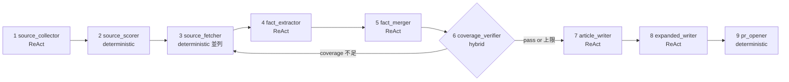

# libmatic CONCEPTS

libmatic の中核概念を 3 つにまとめる: **lifespan**, **9 step workflow**, **luck-ism**。
それぞれの背景と判断基準を理解すると、prompt 改変や node 拡張がしやすくなる。

## 1. Lifespan (universal / ephemeral)

記事の **賞味期限** を 2 段階で扱う:

| lifespan | 例 | 配置 | pruning |
|---|---|---|---|
| **universal** | 設計原則、トレードオフ俯瞰、歴史追跡 | `content/{category}/notes/<slug>.md` | しない (永続) |
| **ephemeral** | 特定バージョン比較、直近事件、一時トレンド | `content/digest/{year}/Q{quarter}/<slug>.md` | 2 年で候補 |

### なぜ分けるか

「普遍的に残る情報」と「今のキャッチアップ」の両方を 1 つの content/ に混ぜると、後者が前者を圧迫してノイズになる。lifespan を最初から分ける + ephemeral は隔離フォルダに置くことで:

- universal は時間が経っても価値が落ちない
- ephemeral は 2 年後に pruning でき、検索性を保てる

### Ephemeral → universal 昇華

ephemeral に見えるテーマでも、背景の普遍的な問いに昇華できれば universal として扱う:

| ephemeral 風 | → 昇華した universal |
|---|---|
| "Gemma 4 vs Llama 4" | "オープンモデル LLM 選定の永続トレードオフ (ライセンス × アーキ × コスト × 地政学)" |
| "Vercel 情報漏洩" | "メタフレームワーク選定における lockin と逃げ道" |
| "Next.js 15 新機能" | "メタフレームワーク設計の歴史的変遷" |

`step1_source_collector` / `suggest_a3_relevance_filter` の prompt にこの方針を埋め込んでいる。

### ジャンル別除外

- **LLM / API / SaaS**: ユーザー視点が版で変わりにくい。単純な版比較は記事化しない (起票除外)
- **フレームワーク / 言語 / 標準規格**: 版毎に出来ることが変わる。版比較も有効
- **ツール / ライブラリ**: breaking change の大きさで判断

## 2. 9 step workflow (topic-debate)

夜次の議論記事生成 workflow。`topic/ready` issue 1 件を入力して PR まで作る。



### 各 step の役割

| step | 種別 | 役割 | tier |
|---|---|---|---|
| 1 source_collector | ReAct | 信頼発信者 + Web 検索で candidate 集め | default |
| 2 source_scorer | deterministic | priority × recency × relevance でスコアリング → 上位 N 件 | - |
| 3 source_fetcher | deterministic 並列 | URL → text (ThreadPool) | - |
| 4 fact_extractor | ReAct | 各 source から claim を構造化抽出 | **cheap** |
| 5 fact_merger | ReAct | dedup + 衝突解決 + relevance 階層化 | default |
| 6 coverage_verifier | **hybrid** | verify_coverage 数値 + LLM judge で gap 言語化 | default |
| 7 article_writer | ReAct | 原本記事 (引用付き、論点整理) | default |
| 8 expanded_writer | ReAct | 初学者向け拡張版 (ストーリー仕立て + 原典引用集) | default |
| 9 pr_opener | deterministic | git branch + commit + push + gh pr create + label 遷移 | - |

### Workflow vs Agent (Anthropic "Building Effective Agents" に準拠)

- **Workflow** (= 9 step 全体): 順序が決まっていて、コードでフローを制御
- **Agent** (= 各 step 内部の ReAct): 「次にどの tool を呼ぶか」を LLM に委ねる

この hybrid 設計で「全体の予測可能性」と「step 内の柔軟性」を両立する。

### Coverage loop

step 6 で `coverage_score < threshold` (default 0.80) かつ `loop_count < 2` なら step 3 に loop back。これにより 1-2 回の追加 fetch で網羅率を上げる。上限に達したら諦めて step 7 へ進む (perfect でなくても記事化する)。

## 3. luck-ism

libmatic の "default philosophy"。`libmatic/prompts/philosophy.md` に集約され、各 step prompt に `{{PHILOSOPHY}}` で include される。

### 5 つのルール

1. **Lifespan 判定** (universal / ephemeral)
2. **Ephemeral → universal 昇華ルール** (上記 §1 参照)
3. **ジャンル別除外** (LLM/API/SaaS の純粋版比較は除外、etc)
4. **`content/digest/{year}/Q{quarter}/` への 2 年 pruning ルール**
5. **Source PR フロー**: 自動で `source_priorities.yml` を書き換えず、PR 提案 → user 承認

### Source PR フロー (詳細)

`suggest-topics` の A6 propose_new_sources で実装。priorities にない domain で 2 件以上登場したものを `state.new_sources_detected` に検出する。

v0.1 では検出のみで PR 作成は手動 (将来 v1.x で自動 PR 提案を実装予定):

```bash
# 検出された domain を確認して、追加するなら手動で source_priorities.yml に書く
gh pr create --title "proposal/sources-2026-04-28" --body "..."
```

これにより、user が知らないうちに source list が拡張されることがない。

### luck-ism のカスタマイズ

OSS 利用者は libmatic を fork して `libmatic/prompts/philosophy.md` を書き換えることで、自分の philosophy に差し替え可能。philosophy 自体を config 化する設計は overengineering と判断 (Phase 0 §3.1 #7)。

## 関連

- [SETUP.md](SETUP.md) — 導入手順
- [COST.md](COST.md) — 運用コスト
- [TROUBLESHOOTING.md](TROUBLESHOOTING.md) — ハマり所
- [ARCHITECTURE.md](ARCHITECTURE.md) — 全体俯瞰 (技術寄り)
- [SPEC.md](SPEC.md) — 詳細仕様
- 上位 repo の Phase 0 設計書: [`docs/libmatic-oss-plan.md`](../../docs/libmatic-oss-plan.md)
