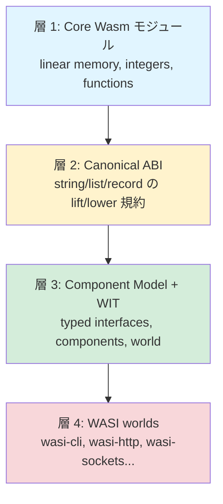
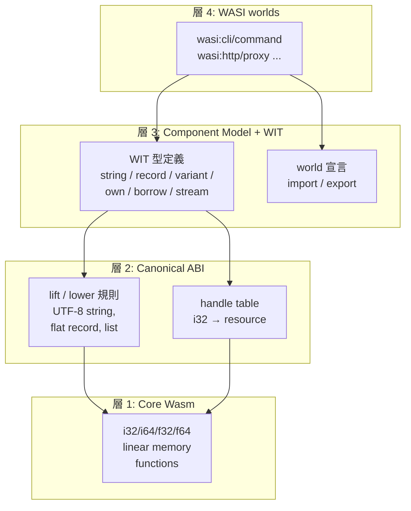

# WebAssembly Component Model と WASI 0.3 — マイクロサービスなしで多言語を合成する境界設計

2024 年に WASI 0.2 と Component Model が stable 化し、2026 年 2 月の WASI 0.3 で **composable concurrency**（async と stream / future が ABI 第一級型に）が加わったことで、WebAssembly はブラウザを離れて **server-side の多言語コンポーネント合成ランタイム**として実用フェーズに入りました。本ノートはこの「コンテナとマイクロサービスを使わずに多言語を合成する新しい境界設計」を、対立軸も込みで読み解く解説です。

## 対象読者と前提知識

| 想定読者 | 持っていてほしい前提 | このノートで得るもの |
|---|---|---|
| Web エンジニア（Rust / Go / TypeScript / Python） | 関数 / 型システム / async・await の基礎、HTTP マイクロサービス運用の感覚 | 言語境界をどう跨ぐかの設計選択肢、Component Model が解く問題、container との使い分け |
| クラウドネイティブ / プラットフォームエンジニア | k8s / container エコシステムの実運用、cold start・観測可能性の現場感 | Wasm が container を「置き換える / 補完する / hybrid で同居する」現実、SpinKube / wasmCloud / runwasi の方向性 |
| プラットフォーム / ライブラリ作者 | API 設計と互換性維持の苦労、IDL / FFI / serializer の経験 | WIT IDL で型を語ることの意味、resource handle の効果、capability 設計が安全性に与える影響 |
| 技術選定の意思決定者 | 既存資産（Java / Ruby / 大規模 monorepo）と新技術導入のトレードオフ | いつ Component Model を採用すべきか / いつ container に残すかの判断軸（チェックリストつき） |

WebAssembly のコア仕様（linear memory・型・命令セット）の細部は前提にしません。必要な箇所で平易に補足します。

## 学習目標

このノートを読み終えると、次のことができるようになります。

1. **Component Model の核心命題を 1 段落で説明**できる（「言語境界に共通の高水準型システムを置く」）
2. **WIT・Canonical ABI・resource (own/borrow handle) の三本柱**が何を解決するかを述べられる
3. **WASI 0.2 と 0.3 の違い**を「function coloring 問題と composable concurrency」という観点で説明できる
4. **Wasm vs container 論争で何が決着し、何が未解決か**を、cold start・メモリ・multi-threading・debug ツール の各軸で言える
5. **WASIX vs WASI Preview 2 の対立**で、Wasmer 側と Bytecode Alliance 側の正当な論拠を**両方**説明できる
6. **言語サポートの実情**（Rust / Go / Python / Java）を成熟度マトリクスで把握し、Cloudflare Pyodide が WASI を採用しなかった理由を理解する
7. **Fermyon Spin / Cloudflare Workers / Fastly Compute / wasmCloud / Zero-Syscall Network** の境界設計を比較できる
8. **懐疑論（multi-threading 不在、narrative fatigue、spec churn）**を矮小化せず受け止め、自分のチームが今 Component を導入すべきかを判断できる
9. 自分のワークロードについて **「Component を選ぶか / container に残すか」のチェックリスト**を回せる

---

## はじめに

### この記事を一言でいうと

> **「マイクロサービスを HTTP/JSON でつなぐ代わりに、言語の壁そのものを wasm の中に取り込んでしまう。これが Component Model だ」**

USB-C コネクタを思い出してください。ノート PC、スマートフォン、外部 SSD、モバイルバッテリー — メーカーも世代も違うこれらの機器が、**1 つの規格**で組み合わさります。Component Model はソフトウェアの世界で同じことを目指します。Rust で書いた認証コンポーネント、Python で書いた画像処理コンポーネント、JavaScript で書いた UI コンポーネント — 言語が違ってもそれらが「同じ規格のコネクタ（WIT）」を持っていれば、ホスト OS もネットワークも介さずに**同じプロセスの中で組み合わさる**わけです。

これは新しい話ではありません。1970 年代の C ABI、2000 年代の HTTP/REST、JVM や CLR の共通バイトコード — 言語境界をどう跨ぐかは半世紀続いている問題です。Component Model は「**4 つ目の答え**」を提案しています。

### なぜ今これを学ぶのか

3 つの実用的な理由があります。

**1. 2026 年 2 月、WASI 0.3 で composable concurrency が ABI 第一級になった。**
0.2 まではコンポーネント間の async 通信は「pollable」ハンドルを手で回すパターンで、複数のコンポーネントが I/O を並行して走らせると不公平な実行になりがちでした。0.3 では `stream<T>` と `future<T>` が WIT の組み込み型になり、Rust の tokio future と Go の goroutine が**互いを待たずに合成**できるようになりました。これは「Wasm で本物の async サーバーが書けるか」の最後の障壁を消します。

**2. Cloudflare Workers / Fastly Compute / Fermyon Spin / Shopify Functions が現に動いている。**
Fermyon の edge デプロイは ~75M req/sec、Fastly Compute@Edge は 10,000+ ユーザー、Cloudflare Workers は 330+ PoP — これは「将来の話」ではなく既に production で回っている実例です。一方で同じ時期に「3 年も almost ready のままじゃないか」という [narrative fatigue 批判](https://www.javacodegeeks.com/2026/04/webassembly-in-2026-three-years-of-almost-ready.html) も無視できないボリュームで出ています。

**3. WASIX 分派論争・Java/Ruby 未対応・dlopen 不在 — 弱点が直視され始めた。**
Wasmer の WASIX は Bytecode Alliance から「fork of WASI で non-standard」と公式に拒否される一方、現実的な POSIX アプリ（Bash / Nginx / Redis）を Wasm 化するには WASIX の方が動く。Cloudflare は Python を Workers に載せるとき、**WASI ではなく Emscripten + Pyodide** という別線を選んでいます。理想と現実のギャップが、ようやく公の議論として出てきた段階です。

### このノートの歩き方

全 9 章で次のように進みます。

| 章 | 焦点 | 何が分かるか |
|---|---|---|
| 第 1 章 | 歴史的位置づけ | なぜ今「4 つ目の言語境界アプローチ」が必要なのか |
| 第 2 章 | 中核技術 | WIT / Canonical ABI / Resource の三本柱 |
| 第 3 章 | 0.3 が解く問題 | function coloring と composable concurrency |
| 第 4 章 | 比較 | Wasm vs Container — 数値で見る境界 |
| 第 5 章 | 論争 | WASIX vs Bytecode Alliance — 両者の正当性 |
| 第 6 章 | 言語サポート | universal binary 神話の壁、Cloudflare Pyodide の選択 |
| 第 7 章 | 実例 | Spin / Workers / Compute / wasmCloud / Zero-Syscall の境界設計 |
| 第 8 章 | 懐疑論 | multi-threading・narrative fatigue・spec churn を直視 |
| 第 9 章 | 判断軸 | いつ Component を選ぶか / いつ container を残すか（チェックリスト） |

技術詳細を急ぎたい人は第 2-3 章、比較・採用判断を急ぎたい人は第 4・9 章から読むこともできます。各章末に **📝 ここまでのまとめ** ボックスを置くので、忙しい人はまずそこを拾って読むのもありです。後半の上級者向けセクションは「スキップ可」と注記してあります。

> **📝 ここまでのまとめ**
>
> - Component Model は「言語境界に共通の高水準型システムを置く」アプローチ。USB-C のソフトウェア版
> - 2026-02 の WASI 0.3 で composable concurrency が完成、production 実例も多数
> - 一方で「3 年 almost ready」批判、WASIX 分派、Java/Ruby 未対応という現実の弱点も同時にある
> - 本ノートは 19 ソース 437 論点から構成された解説。技術 → 比較 → 論争 → 実例 → 判断軸の順で進む

---

## 1. なぜ「マイクロサービスなしの多言語合成」が今議論になるか

ここまでで「WebAssembly Component Model / WASI 0.3 が、サーバサイドの多言語コンポーネントを HTTP 越しのマイクロサービスを介さずに合成できるか」という本記事の問いを共有しました。本章ではこの問いがそもそもどういう種類の問いなのかを、ソフトウェア史の文脈に置き直すことから始めます。「言語境界をどう跨ぐか」という問題は、実は 1970 年代から繰り返し挑戦されてきた古典的な難題です。それが 2026 年に再び議論の俎上に登っているのには理由があります。

### 1.1 言語境界という、半世紀越しの難問

ソフトウェアにおいて「ある言語で書いたモジュール」と「別の言語で書いたモジュール」を同居させる、という問題は、コンピュータが複数の高水準言語を持ち始めたときからずっとあります。Fortran で書かれた数値計算ライブラリを C から呼びたい、C で書かれた OS API を Rust から呼びたい、Java で書かれたビジネスロジックを Python から呼びたい — こうした要求は時代ごとに姿を変えながら、ソフトウェアエンジニアの日常を縛り続けてきました。

なぜこの問題は本質的に難しいのでしょうか。原因はざっくり三層に分けられます。

第一に、**データ表現が言語ごとに違う**こと。文字列ひとつ取っても、C は NUL 終端の `char*`、Rust は `(ptr, len, cap)` の三つ組で UTF-8 不変条件付き、JavaScript は UTF-16 ベースの Uint16 配列、Python は内部エンコーディングを動的に切り替える `PyObject` です（公式仕様 `component-model.bytecodealliance.org` の Why Component Model でも、「a string in C is represented entirely differently from a string in Rust or in JavaScript」と明示されています）。各言語の文字列を別言語に渡すには、毎回エンコーディング変換と所有権移譲のお作法を握る必要があります。

第二に、**メモリモデルが言語ごとに違う**こと。C や Rust は線形メモリ上に手で配置するスタイル、Java や Kotlin は GC が裏で object を移動させるスタイル、JavaScript もエンジン依存ですが基本は GC 管理です。GC 言語と線形メモリ言語のモジュールが同じアドレス空間を共有すると、GC がコンパクション（メモリ整理）を走らせた瞬間に C 側のポインタが宙に浮く、というバグが発生します。

第三に、**ランタイムが言語ごとに違う**こと。Go は M:N スレッドモデルと goroutine スケジューラ、Rust の async は tokio や async-std、JavaScript はイベントループ、Python は GIL と asyncio — 言語ごとに「並行性をどう扱うか」の前提が完全に違います。複数のランタイムを同じ OS プロセスに同居させると、誰がスレッドを作るか、誰がブロッキング呼び出しを許すか、で衝突します。

> **比喩: 多言語合成は「方言の違う三人での会議」**
>
> 想像してください。関西弁、博多弁、津軽弁を母語とする三人が、同じテーブルで議論しています。相互理解はできなくはないが、専門用語が出てくるたびに脳内変換のコストが乗る。話者が増えれば増えるほど、共通の標準語（=共通プロトコル）を決めるか、間に通訳官を立てるかの選択を迫られる。プログラミング言語の合成も構造的にはこれと同じで、「データ表現」「メモリ」「ランタイム」という三種類の方言を、いつ・どこで・誰が翻訳するかを決めなければなりません。

### 1.2 これまでの解決アプローチを並べてみる

この問題に対して、ソフトウェア業界はおおよそ 4 つのアプローチを試してきました。それぞれが何を達成し、何を諦めたかを並べると、Component Model がどこに位置するかが見えてきます。

```
言語境界アプローチの歴史的進化

  1970s ─ C ABI / FFI ───── 共通の "最低公分母" を作る
            │                  ・呼出規約 (calling convention) を OS/CPU 単位で標準化
            │                  ・但し型は int / pointer まで、文字列やオブジェクトは手動処理
            │
  1995  ─ JVM / CLR ─────── 単一ランタイムに揃える
            │                  ・Java/Scala/Kotlin/Groovy が同居 (JVM)
            │                  ・C#/F#/VB が同居 (CLR)
            │                  ・代償: そのランタイム言語以外は入れない
            │
  2010〜─ HTTP/JSON microservices ─ プロセスを分けてネットワークで繋ぐ
            │                  ・任意言語で書ける、サービス境界が明確
            │                  ・代償: 1 リクエスト 10〜100 RPC、ms 単位の遅延、シリアライズ税
            │
  2024〜─ WebAssembly Component Model ─ 型付きインターフェースで境界を切る
                              ・任意言語が同一プロセス・サンドボックス内で同居
                              ・WIT で型契約、Canonical ABI で表現変換
                              ・本記事のテーマ
```

#### 1.2.1 C ABI / FFI（1970s〜）：最低公分母路線

最も古典的なアプローチが「C 互換の呼出規約に揃える」というものです。OS のシステムコールも、共有ライブラリも、Python の C extension も、Rust の `extern "C"` も、すべて C ABI を共通言語として採用しています。これは強力でしたが、扱える型が `int` や `pointer` といった原始的なものに限定され、文字列・配列・オブジェクトは「先頭ポインタと長さを別々の引数で渡す」「メモリ管理規約はライブラリごとに文書で約束」という手作業に頼ります。

> **用語解説: ABI（Application Binary Interface）と FFI（Foreign Function Interface）**
>
> ABI は「コンパイル済みバイナリ同士がどう関数を呼び合うか」のルール — 引数をどのレジスタに乗せるか、戻り値をどう返すか、スタックフレームをどう積むか、といった機械語レベルの取り決め。FFI は ABI を使って異なる言語のコードを呼び出すための仕組み（Python の `ctypes`、Rust の `extern "C" fn`、Node.js の N-API など）。両者は表裏で、「ABI が約束、FFI がその約束を使う実装側のインターフェース」と捉えると整理しやすいです。

公式 spec がこの問題を真正面から認めているのが象徴的です。Component Model spec の「Why Component Model」ページでは、`remove-duplicates: func(offset: i32, length: i32) -> [i32, i32]` という関数シグネチャを例に挙げ、「型システムは offset と length を区別できない（両方 i32）→ 取り違えを検出できない」「memory の名前は convention にすぎない → 別の memory を index しても型システムは止めない」と core module（Wasm の素の関数表現）の限界を明示しています。これは C ABI の問題そのものを Wasm のレイヤで再生産していたわけです。

C ABI の系譜には、もう少し凝った後継もありました。COM（Component Object Model、Microsoft、1993）は仮想関数テーブルベースの interface を定義し、CORBA（Common Object Request Broker Architecture、OMG、1991）は IDL からマルチ言語の stub を生成する標準化を試みました。両者とも「言語間で typed interface を共有する」という野心は Component Model と同質ですが、(a) IDL とランタイムが密結合で「捨てて新しいランタイムに移る」が困難、(b) 設計が分散オブジェクト前提でローカル合成のオーバヘッドが高すぎる、(c) ガバナンスがベンダ寄りで標準化が固着しがち、という問題を抱えました。Component Model はこれらの教訓を踏まえて、ランタイム中立・ローカル合成優先・W3C ガバナンスという三点を明示的に選んでいます。

#### 1.2.2 JVM / CLR（1995〜）：単一ランタイム路線

次の世代が、「言語が違っても同じランタイムにコンパイルすれば、メモリも GC もスレッドも共有できる」というアプローチです。JVM は Java、Scala、Kotlin、Groovy、Clojure を同居させ、CLR は C#、F#、VB.NET、PowerShell を同居させました。これは、データ表現・メモリ・ランタイムの三層全部を「同じ仮想機械の流儀に揃える」ことで解決しています。

ただし代償があります。**そのランタイムが想定しなかった言語は入れない**。JVM に Rust や Go を素直に乗せることはできず、CLR に Python や Ruby を乗せると IronPython / IronRuby のような「CLR 用に再実装した版」を別途維持する必要があります。これは多言語合成の局所解で、グローバルには「JVM 言語の集まり」「CLR 言語の集まり」という分断を生んでいます。

> **比喩: JVM は「英語圏で開かれる国際会議」**
>
> 英語圏のホテルで開かれる国際会議には、フランス人もドイツ人も日本人も参加できますが、議論はすべて英語で行われます。母語を活かせる人もいれば、英語コストを払う人もいる。それでも会議は成立する。ただし、「中国語しか話せない人」「アラビア語しか話せない人」は最初から招待されない。JVM 言語の集まりはこれと同じで、JVM bytecode に乗せられる言語だけが会議のテーブルにつけます。Component Model はこれを「同時通訳機を全員に配る」方式に変えました。

JVM の系譜には興味深い発展もあります。GraalVM（2018〜）は単一の JVM 上で Java、JavaScript、Python、Ruby、R、LLVM 言語（C/C++、Rust、Wasm）を動かす野心的なプロジェクトで、Truffle というインタプリタフレームワークの上で各言語を協調動作させます。これは Component Model と非常に近い方向の試みですが、GraalVM 全体が単一ベンダ（Oracle）主導である点と、最終的に JVM の制約（GC、JIT、起動時間）を引き継ぐ点で、「universal runtime」を標榜するには制約があります。Component Model が GraalVM と異なるのは、(a) ガバナンスが W3C / Bytecode Alliance で中立、(b) ランタイムが言語より先に存在しない（Wasmtime、Wasmer、jco など複数実装が並走）、(c) JIT 戦略が各ホストランタイムに委ねられる、という三点です。

#### 1.2.3 HTTP/JSON microservices（2010 年代〜）：プロセス分離路線

2010 年代後半に主流になったのが、マイクロサービスです。各機能を独立プロセス、独立サーバとして切り出し、HTTP/JSON や gRPC でネットワーク越しに会話させる。サービス境界に言語の壁を一致させることで、各サービスの内部は完全に自由になります。

これは現代のクラウドアーキテクチャの主役で、Netflix・Google・Uber・Spotify といった企業のスケーリング戦略の中核を担いました。しかしコストもよく知られています。WASI 公式ドキュメントは「HTTP-based microservices」を `costly and clunky`（高コストで不格好）と形容し、`WASI provides a way to compose software written in different languages—without costly and clunky interface systems like HTTP-based microservices` と明文化しています。具体的には、(1) JSON / Protobuf へのシリアライズ、(2) TCP / TLS 確立、(3) HTTP ヘッダ・ステータス処理、(4) 受信側のデシリアライズ、という 4 段階のオーバヘッドが、すべての RPC ごとに発生します。1 リクエスト処理に内部的に 10〜100 個の RPC が走るアーキテクチャでは、これが律速段階になります。

数値で見るとさらに明白です。典型的なマイクロサービスアーキテクチャでは、各 RPC でのオーバヘッドは数 100 マイクロ秒〜数ミリ秒。Component Model の関数呼び出しは原理的にネイティブのインダイレクトコール 1 回 + Canonical ABI 変換のコストに収まり、桁違いに軽い。HK Lee（dev.to）が引く Wasm Spin の cold start は ~1ms、対する Docker Node.js の cold start は ~500ms — 100〜500 倍の差です。マイクロサービスの「不格好さ」は気分の問題ではなく、計算量の問題として実在します。

さらに見落とされがちなのは、マイクロサービスが要求する「**周辺装置のスタック**」のコストです。サービス境界を HTTP で切ると、自然な帰結として API Gateway、Service Mesh（Istio / Linkerd）、Load Balancer、Distributed Tracing（Jaeger / Zipkin）、Service Discovery（Consul / etcd）、Circuit Breaker（Hystrix / Resilience4j）、Retry / Timeout のフレームワーク、CORS / 認証 / Rate Limiting のミドルウェア — といった設備が次々に必要になります。これらは「マイクロサービスの本体ではない」のに運用負担と SRE コストを大きく押し上げる。Component Model はこれらの多くを「同一プロセス内のリンクで完結する」ことで構造的に不要にする可能性を持ちます。

### 1.2.3.5 寄り道：Docker と Solomon Hykes の「あの tweet」

マイクロサービスとコンテナの語りには、繰り返し引用される一節があります。Docker 共同創設者の Solomon Hykes が 2019 年に投稿した次の tweet です（後に削除）。

> "If WASM+WASI existed in 2008, we wouldn't have needed to create Docker. That's how important it is. WebAssembly on the server is the future of computing."

「もし 2008 年に WASM+WASI が存在していたなら、Docker を作る必要はなかった」 — Wasm 推進派が好んで引く強烈な一文ですが、Hykes 自身が後にトーンを下げ、「server-side Wasm is niche」と表現を撤回しています。さらに Hykes は Wasmer の investor でもあり、Bytecode Alliance / Wasmer / Docker の三方に近い position におり、tweet 撤回の文脈は単純ではありません。第 8 章でこの撤回劇を「narrative fatigue」の一例として詳しく扱いますが、本章で押さえておきたいのは、**Wasm vs container の論争は技術論であると同時に narrative の戦いでもある** という点です。CNCF blog（第 13 章）の「Components vs. Containers: Fight?」というタイトルが、最終的に「fight ではなく tag team」と着地するのも、この narrative の調整作業の一環と読めます。

> **用語解説: マイクロサービスとモノリス**
>
> 「マイクロサービス」とは、アプリケーションを機能単位の独立サービスに分解し、ネットワーク越しに連携させる設計手法です。対義語は「モノリス」（単一プロセス・単一プロセスメモリ内で全機能を抱える方式）。Component Model が提案するのは、その中間 — モノリスのように単一プロセスで動かしつつ、マイクロサービスのように機能を独立に切り出して合成する — という第三の道です。

#### 1.2.4 WebAssembly Component Model（2024〜）：型付き境界路線

Component Model のアプローチは、これら 3 つの先行例の長所を取り、短所を捨てようとしています。

- **C ABI 路線の長所**：単一プロセス・低オーバヘッド。**短所を回避**：WIT という IDL（Interface Definition Language）で `string`、`list<u8>`、`record`、`variant`、`option`、`result` といった高水準型を一級市民として扱う。
- **JVM 路線の長所**：メモリと並行性のセマンティクスが揃う。**短所を回避**：単一ランタイムを強制せず、各言語のコンパイラが自分の流儀で `.wasm` を吐けばよい。
- **マイクロサービス路線の長所**：境界が明示的で、再利用とサンドボックスが効く。**短所を回避**：ネットワーク越しではなく、同一プロセス内のリンクで境界を成立させる。

公式ドキュメントは Component Model を「`a broad-reaching architecture for building interoperable WebAssembly libraries, applications, and environments`」と定義しており、ここで `interoperable` と `libraries, applications, and environments` の三者を等しく並べているのが要点です。ライブラリ作者・アプリ作者・ランタイム実装者の三層が、同じ語彙（WIT と Canonical ABI）で会話できる、という設計です。

> **比喩: Component Model = USB-C 規格**
>
> USB-C は、機器側（電源、ディスプレイ、ストレージ、ネットワーク）と利用側（PC、スマホ、ドック）を、ベンダや用途を問わず一つのコネクタ形状で繋げます。端子が同じだから繋げる、というだけでなく、Power Delivery、DisplayPort Alt Mode、USB4 のようなプロトコルも同じケーブルに乗せられる。Component Model も同じ発想で、WIT という「コネクタ形状」と Canonical ABI という「電気特性」を標準化しているからこそ、Rust 製の component を Python の component に直接挿せる、という芸当が成立します。

Enrico Piovesan（Wasm Radar の論者）は別の比喩を使っています。「Component Model はソフトウェアエンジニアリングのモデルを *コンパイル* から *アセンブル* に変える。コンパイル = 自分のソースコードを 1 つのバイナリにする、アセンブル = 他人のバイナリを組み合わせて 1 つのアプリにする。後者は古典的にはリンカや動的ロード、近代的には DI コンテナや microservices で実現されてきたが、いずれも単一言語ないし IPC 越しだった。Component Model は型付きでクロスランゲージかつローカル合成を実現する」 — ハードウェアエンジニアがチップを基板上で配線するイメージで、各チップ（component）が内部実装をブラックボックスにしたまま、ピン配置（WIT）だけで動作する設計です。

### 1.3 では、なぜ 2026 年なのか

問題自体が古典的なら、なぜ 2026 年に「今こそ」の議論になっているのでしょうか。複数のソースを横断すると、3 つの収束点が見えてきます。

#### 1.3.1 標準化のマイルストーンが揃いつつある

WASI には公式に記録されたマイルストーンがあります。

```
2019-頃     WASI Preview 1 (0.1) — POSIX-like、networking なし
2024-01-25  WASI 0.2 (Preview 2) — Component Model 取り込み、WIT 標準化
2025-09     WebAssembly 3.0 が W3C 標準化 — GC、64-bit memory、tail call
2025-11     Fermyon Spin v3.5 が WASIp3 RC を初実装
2026-02 頃  WASI 0.3 完成予定 — composable concurrency、stream<T>/future<T>
2026 末〜   WASI 1.0 ターゲット (LTS、enterprise stable)
```

特に重要なのが 2024 年 1 月の WASI 0.2 リリースです。Bytecode Alliance 公式によれば、`WASI 0.2.0 is a stable set of WIT definitions that components can target` で、`users of the component model can now pin to any stable release >= v0.2.0` と謳われています。それ以前は破壊的変更が頻繁で、production 採用は事実上困難でした。Fastly のチームは「WASI 0.2 represents an official stabilization of the Component Model and collection of WASI APIs」と祝意を表明し、`LEGO ブロック型のアプリを構築できる基盤が整った` という言い方を独立に使っています。

そして 2026 年初頭に予定されている WASI 0.3 が、本記事の最重要マイルストーンです。`stream<T>` / `future<T>` 型の Canonical ABI 第一級化は、後述する「function coloring 問題」を構造的に解決する仕組みで、これが入って初めて「マイクロサービスなしの多言語合成」が非同期 RPC の世界にまで届きます。第 3 章で詳述します。

#### 1.3.2 採用事例が単なる試作を越えた

3 大エッジ事業者が production で WASI/Wasm を運用し始めています。

- **Cloudflare Workers**：330 以上の PoP（Point of Presence、世界中のエッジロケーション）で動く。Python Workers では Pyodide 経由で Python を裏で動かしている（公式 blog 2024-04 で実装が公開）。
- **Fastly Compute@Edge**：WASI 0.2 を `LEGO ブロック型の基盤` と評価し、production で採用。
- **Fermyon Cloud / Spin**：サーバーレス Wasm として 75M req/sec 規模を捌くと公表。

CNCF blog（2025-04）はこの状況を踏まえて「Components vs. Containers: Fight?」という挑発的タイトルの記事を公開し、最終的には `containers and components aren't rivals at all, but are instead a powerful, flexible team for combating infrastructure inefficiency` と結んでいます。Adobe や Akamai も wasmCloud を活用し、TM Forum の Catalyst プロジェクトでは「Kubernetes を wasmCloud で replace する」価値を実証中です。

DataDog の 2024 State of Cloud レポートが伝える `Over 80% of container spend is on idle infrastructure`（コンテナ支出の 80% 超は idle インフラに消える）という数字は、この流れの経済的な背骨です。コンテナはトラフィックスパイクとレイテンシ要求を満たすため "just in case" のインスタンスを常時走らせる必要があり、ms オーダーで起動する Wasm component はそこに刺さる。第 4 章でこのコスト構造を詳しく扱います。

#### 1.3.3 SaaS の裏側で「気付かれずに」動いている

Endor 創業者 Daniel Lopez が WasmCon 2025 でのインタビューで述べた言葉が象徴的です。

> 「Many users — and likely most — do not realize it is being used」
> （多くの、おそらくほとんどのユーザは、Wasm が使われていることに気づいていない）

これが TheNewStack の記事タイトル「You Won't Know When WebAssembly Is Everywhere in 2026」の由来です。Cloudflare Workers の Python サポート、Shopify Functions の merchant logic、Akamai EdgeWorkers、Figma のプラグイン、Zed Editor の拡張 — ユーザに見える層は「Python を書く」「JavaScript を書く」だけで、その下で Wasm component が動いている、という SaaS パターンが量産されています。

これは Docker が 2013 年に achieve した「`docker run` でどこでも動く」という magic moment とは別種の浸透の仕方で、ユーザの目の届かない場所での platform 採用が先行している、というのが 2026 年の現状です。本記事の問い「マイクロサービスなしの多言語合成」がもはや仮説ではなく現実の運用パターンとして観測される段階に入ったから、議論が活発化しているのです。

#### 1.3.4 周辺技術の足並みも揃いつつある

Component Model 単独ではなく、Wasm エコシステム全体のミッシングピースが同時に埋まりつつあるのも 2026 年の特徴です。WebAssembly 3.0 が 2025 年 9 月に W3C で標準化され、

- **WasmGC**：JVM 言語（Java、Kotlin、Scala）が Wasm に対応するための GC ヒープ機能
- **64-bit memory addressing**：4GB 制限を超える線形メモリ
- **Tail-call optimization**：関数型言語の末尾呼び出し最適化
- **Structured exception handling**：例外処理の標準化

といった、これまで「Component Model だけでは届かない」とされてきた基礎機能が core spec として整いました。これにより JVM 言語陣営も「Wasm 化の次の目標は GC を活かした Component Model 対応」というロードマップを描けるようになり、2026 年以降に Java の componentize 系ツールチェーンが本格化する見込みです。

ツーリング側も成熟が進んでいます。`wasm-tools`（Component Model の核 CLI）、`wit-bindgen`（WIT から各言語の bindings 生成）、`componentize-py`（Python の component ビルダ）、`jco`（JS の Component Model ツール）、`cargo-component`（Rust の cargo subcommand）— これらが標準化され、production 採用に耐えるバージョンに到達しました。HK Lee（dev.to, 2026-02）が「the tooling has finally crossed the 'actually usable' threshold」と表現するのは、この成熟を指しています。

### 1.4 4 つのアプローチを正確に並べる

ここまでをマトリックスにまとめると、Component Model がどのトレードオフを選んだかが鮮明になります。

| アプローチ | 言語自由度 | 同一プロセス | 型安全な境界 | サンドボックス | 並行性合成 |
|---|---|---|---|---|---|
| C ABI / FFI | 高 | はい | いいえ（手動） | いいえ | いいえ |
| JVM / CLR | 中（限定言語） | はい | はい | 部分的 | はい |
| HTTP microservices | 高 | いいえ（プロセス分離） | はい（OpenAPI 等） | はい（プロセス境界） | はい |
| Component Model | 高 | はい | はい（WIT） | はい（capability） | はい（WASI 0.3） |

Component Model の野心は、この 5 列すべてに「はい」を入れることです。WASI 0.3 が完成すれば最後の「並行性合成」も埋まる。これが本記事の問いに対する公式仕様側の回答です。

ただし「はい」の中身には濃淡があります。第 4 章で見る通り CPU バウンドな並列処理は弱く、第 8 章で見る通り threading や fork のような POSIX 機能は欠けています。「マイクロサービスなしの多言語合成」が成立する領域は、(1) CPU 主体のステートレスな関数、(2) capability で十分にスコープ可能な業務、(3) 早期採用ベンダーのプラットフォーム、に絞られます。本記事の議論はこの境界線をどこに引くかが核心です。

### 1.5 上級者向け深掘り：Bytecode Alliance というガバナンス

Component Model を技術的に理解する上で見逃せないのが、それを推進する「Bytecode Alliance」というガバナンス構造です。これは単なる技術団体ではなく、`Mozilla / Fastly / Intel / Red Hat` が 2019 年に共同設立し、その後 `Microsoft / Arm / Cosmonic / DFINITY / Fermyon / Shopify` などが参画した非営利団体で、Wasmtime ランタイム、WASI、Component Model の主要実装と仕様策定を中立的にホストしています。

#### 1.5.1 仕様書とユーザーガイドの 2 系統

Bytecode Alliance のドキュメントは意図的に 2 系統に分かれています。

- `component-model.bytecodealliance.org` の **ユーザーガイド** — ライブラリ作者・アプリ作者向け
- GitHub `WebAssembly/component-model` リポジトリの **仕様書**（Explainer.md / Binary.md / WIT.md / CanonicalABI.md） — コンパイラ・ランタイム実装者向け

この峻別は読み手にとって重要です。本記事のように「server-side で多言語合成が成立するか」という DX 寄りの問いはユーザーガイド側を一次情報にするのが正しく、Canonical ABI の効率や string lifting/lowering の bit-level 規定を fact_check するときは仕様書側を引きます。

#### 1.5.2 W3C との関係 — Phase 2/3 に居るということ

Component Model は 2026 年初頭時点で W3C WebAssembly Community Group 内で `Phase 2/3` に位置します。W3C 標準化プロセスは Phase 0（草案）→ Phase 1（feature proposal）→ Phase 2（spec text）→ Phase 3（実装公開）→ Phase 4（標準化候補）→ Phase 5（勧告）という 6 段階で、Phase 2/3 は「仕様文書がほぼ固まり、参照実装が進行中」の段階です。

これに対する評価は分かれます。Bytecode Alliance 共同創設者の Till Schneidereit は `the W3C is the right place for developing them as standards` と述べ、Wasmer の Syrus Akbary は `WASI is going through breaking changes that make it hard for Wasm runtime implementers to update` と述べる。前者は「正規プロセスを経てこそ堅牢」と見て、後者は「正規プロセスは遅すぎて現場が痛む」と見る。これは標準化の哲学的対立であり、第 5 章で WASIX 分派論争として詳細に論じます。

#### 1.5.3 release train モデルの意味

WASI Subgroup は公式 roadmap で明示している通り、`WASI point releases occur every two months, on the first Thursday of that month, on a release train model` という方式を採用しています。「ready なものを定期的に出す、ready でないものは次の train を待つ」 — Linux kernel や Rust と同じ釜の発想です。

これは「Wasmer が WASIX で必要な機能をベンダーバイパスして実装した」事態の構造的予防にもなっています。2 ヶ月ごとに point release が出るので、機能が「永遠に来ない」ことはない、という保証。ただし 0.3.0 のような major boundary は別タイムラインで、async + Canonical ABI の大改修という非互換変更を含むため、release train ではなく公式マイルストーン（2026 年 2 月予定）で出ます。

「provisional な living document」と公式自身が但し書きしているのも重要です。`Goals and projections are provisional and subject to revision` — 第 8 章で扱う「Three Years of Almost Ready」批判は、この living document 性をどう評価するかで読み方が分かれる、ということを覚えておいてください。

#### 1.5.4 Component Model の 4 層モデル — 議論の地図

最後に、本記事 9 章の議論を整理する地図として、Component Model の 4 層モデルを示します。これは公式仕様の暗黙の階層を抽出したもので、後続章で出てくる議論がどの層の話なのかを判別するための座標系です。



層 1 はブラウザの MVP Wasm（2017 年）からある低レイヤ。層 2 の Canonical ABI が「文字列をどう pointer + length で渡すか」を標準化したことで層 3 の WIT が表現可能になり、層 3 の上で層 4 の WASI worlds（具体的な API セット）が定義されます。本記事の問いの中で、

- **「Rust component が Go component を呼べる」** は層 3 の WIT の話
- **「文字列が pointer/length で渡されるのが web-unfriendly」** は層 2 の Canonical ABI の現状
- **「wasi-http が version 0.3 で stream を返す」** は層 4 の話
- **「Wasm モジュールは i32/i64 しか引数にできない」** は層 1 の話

公式ドキュメントが「ユーザーガイド」と「仕様書」を分けているのも、層 3〜4 をユーザーガイドが、層 1〜2 を仕様書が扱う棲み分けに対応しています。読者がソースを引くときは、自分の問いがどの層の話かを意識すると裏付けの一次情報を素早く特定できます。

> **📝 ここまでのまとめ**
>
> - 「言語境界を跨ぐ」問題は 1970 年代からあり、C ABI、JVM、マイクロサービスという 3 つの先行アプローチがそれぞれ局所解を提供してきた
> - Component Model はこれらの長所を継承しつつ、「単一プロセス・型安全境界・サンドボックス・並行性合成」をすべて成立させようとする第四の道
> - 2026 年に議論が活発化しているのは (a) WASI 0.2 stable リリースから 2 年経ち、(b) 0.3 で composable concurrency が来る予定で、(c) Cloudflare/Fastly/Fermyon が production 採用、(d) SaaS の裏側で「気付かれずに」浸透している、という 4 つの収束点があるため
> - 公式自身が `costly and clunky` と切り捨てるマイクロサービスを、型付き境界で代替する野心が、本記事の問いの中核
> - ただし「すべての境界を Component Model で代替する」のは現実的ではなく、判断軸の設計が後続章のテーマになる

---

## 2. Component Model の中核 — WIT / Canonical ABI / Resource

前章では「マイクロサービスなしの多言語合成」がなぜ 2026 年に議論されているのかを歴史的・現実的な文脈で示しました。本章ではその仕組みの中身に踏み込みます。Component Model が「言語間の高水準型受け渡し」をどう成立させているのか — その心臓部は **WIT（インターフェース定義言語）**、**Canonical ABI（共通の bit 表現規約）**、**Resource（リソースハンドル）** の三本柱です。順を追って、それぞれが解いている問題と、その解き方を見ていきます。

### 2.1 まず、core Wasm がなぜダメだったか

Component Model の意義を理解する最短距離は、その下にある「素の Wasm（core module）」が何を扱えなかったかを正確に押さえることです。Bytecode Alliance 公式の「Why Component Model」ページが、これを丁寧に説明しています。

core module は `version 0x1 (MVP)` という magic number を持つ単一 `.wasm` ファイルで、ブラウザの Wasm 仕様（2017 年）から続く伝統的形式です。

```bash
$ file adder.wasm
adder.wasm: WebAssembly (wasm) binary module version 0x1 (MVP)
$ wasm-tools print adder.wasm | head -1
(module
```

その制約は冷酷で、**関数の引数・戻り値は `i32` / `i64` / `f32` / `f64` の 4 種類しか使えません**。文字列も配列もオブジェクトもありません。文字列を渡すには、線形メモリ上に書いた byte 列の「先頭オフセット」と「長さ」を 2 つの `i32` として渡し、受け取る側が自分でその範囲を読みに行く、という手作業を毎回やる必要があります。

公式が例として挙げる関数シグネチャは次の通りです。

```wasm
;; 文字列の重複除去関数を core module で書こうとすると...
remove-duplicates: func(offset: i32, length: i32) -> [i32, i32]
;; 戻り値の i32 ペアは (新しい offset, 新しい length)

;; さらにメモリを共有する必要がある
;; 提供側
export "string_mem" (mem 1)
;; 利用側
import "strings" "string_mem"
```

この方式の何が問題かというと、

- **型システムが `offset` と `length` を区別しない**（両方 i32）。引数を取り違えても型チェッカは止めてくれません。
- **メモリの名前は convention にすぎない**。受け側が勝手に別のメモリを index しても型エラーになりません。
- **利用側は `(offset + length)` がメモリ範囲内である限り、任意の byte を読めます**。境界を超えたデータでも、たまたまアドレスが有効なら読めてしまいます。

そして言語ごとのデータ表現の差異が、ここに乗ってきます。

| 言語 | 文字列の内部表現 |
|---|---|
| C | NUL 終端の `char*`（長さは strlen で都度計測） |
| Rust | `(ptr, len, cap)` の triple、UTF-8 不変条件付き |
| JavaScript | UTF-16 ベースの Uint16 配列（surrogate pair あり） |
| Python (CPython) | `PyObject` + 参照カウント + 可変エンコーディング (PEP 393) |
| Java (JVM) | `char[]` ベースの `String`、UTF-16 |

これらを core module の `(offset, length)` で機械的に渡しても、受け側は「これは UTF-8 か、UTF-16 か、それとも何か独自の符号化か」を知る術がありません。Rust の文字列が UTF-8 不変条件を持つ前提のコードに、C 側から不正な byte 列を渡すと、Rust の `&str` の不変条件が破れて未定義動作（UB, undefined behavior）を引き起こします。

> **比喩: core module の文字列は「住所付きの白封筒」**
>
> 「3 番地のポストに 200 グラムの荷物がある」とだけ書かれた白封筒を渡されるイメージです。中身が手紙か食品か危険物か、何で書かれているか、誰が宛先か — まったく分かりません。受け取った側は信用するか、開封して中身を自前で解析するしかない。Component Model はこれを「中身の種類が表に書かれた箱」（型情報付き）に変えた、と言えます。

### 2.2 WIT — 型付きインターフェースの言語

Component Model の第一の柱は **WIT（WebAssembly Interface Types）** です。WIT は IDL（Interface Definition Language）の一種で、コンポーネントが何を import し、何を export し、どんな型を扱うかを言語非依存に記述します。

> **用語解説: IDL（Interface Definition Language）**
>
> プログラミング言語そのものではなく、「ある関数がどんな型の引数を取り、何を返すか」だけを記述するための言語のこと。CORBA の IDL、gRPC の Protocol Buffers、GraphQL の SDL、OpenAPI（Swagger）などが歴史的な親戚にあたります。WIT はこの系譜の Wasm 版で、特に「メモリレイアウトの規約とセットになっている」点が特徴です。

#### 2.2.1 WIT の最小例

たとえば、文字列を受け取って大文字化して返す簡単なコンポーネントを WIT で書くとこうなります。

```wit
// 名前空間 (package) の宣言
package example:greet@0.1.0;

// インターフェース (interface) の宣言
interface greeter {
  // 関数シグネチャ — string を受け取って string を返す
  hello: func(name: string) -> string;
}

// world (コンポーネントが満たす全体の輪郭)
world hello-world {
  export greeter;
}
```

この WIT 1 ファイルから、Rust / Go / Python / JavaScript すべての言語向けの bindings（橋渡しコード）が `wit-bindgen` というツールで生成されます。Bytecode Alliance 公式の言葉を引くと、`You write this WIT definition once... Implement it in Rust, Go, Python, JavaScript, C/C++, or C#. Consume it from any of those languages. No FFI, no serialization, no glue code` — つまり、WIT 1 つを書けば、各言語のネイティブな関数として実装でき、各言語のネイティブな関数として呼び出せる、というのが約束です。

#### 2.2.2 WIT の値型（defvaltype）— 共有メモリ前提を捨てた型カタログ

WIT で使える値型（spec 上は `defvaltype` と呼ばれる）は驚くほど豊富です。Component Model spec の Explainer.md から引用すると：

```
defvaltype ::=
    bool
  | s8 | u8 | s16 | u16 | s32 | u32 | s64 | u64
  | f32 | f64
  | char
  | string
  | error-context              // 📝 不透明なデバッグ用値
  | (record (field <name> <type>)*)
  | (variant (case <name> <type>?)*)
  | (list <type>)
  | (tuple <type>*)
  | (flags <name>*)
  | (enum <name>*)
  | (option <type>)
  | (result <type>? (error <type>)?)
  | (own <resource>)           // ← リソース所有ハンドル
  | (borrow <resource>)        // ← リソース借用ハンドル
  | (stream <type>)            // 🔀 WASI 0.3 で導入
  | (future <type>)            // 🔀 WASI 0.3 で導入
```

設計思想として最も重要なのは、**共有メモリを前提にしない高水準型のみを採用** している点です。`record` も `list` も `string` も、すべて「値そのもの」として境界を渡るのであって、ポインタを共有するわけではありません。これにより GC を持つ言語（Java、Kotlin、JS、Python）と線形メモリの言語（C、Rust、Go）が、互いのメモリモデルを意識せずに通信できます。

特化型（specialized type）は基本型に脱糖（desugar）されます。

| 特化型 | 脱糖先 |
|---|---|
| `tuple<T1, T2, ...>` | `record { 0: T1, 1: T2, ... }` |
| `flags { a, b, c }` | `record { a: bool, b: bool, c: bool }` |
| `enum { case1, case2 }` | `variant { case1, case2 }`（各 case は値なし） |
| `option<T>` | `variant { none, some(T) }` |
| `result<T, E>` | `variant { ok(T), error(E) }` |
| `string` | `list<char>`（実際には UTF-8 などにエンコード） |

意味論は脱糖前後で等価ですが、binary encoding は異なる場合があります（例：`flags` を bit-vector で表現するか byte-per-field で表現するか）。

#### 2.2.3 world — 「このコンポーネントは何者か」の宣言

WIT には「world」という概念があります。これは「あるコンポーネントがどの interface を import し、どの interface を export するか」のセットを束ねた名前空間です。たとえば `wasi:cli/command` という world は、stdin / stdout / 環境変数 / コマンドライン引数 / ファイルシステム / 時刻 / 乱数 など、伝統的な CLI ツールが必要とする一式をバンドルしています。

```wit
// 自分のコンポーネントが wasi:cli/command を満たすことを宣言
world my-cli-tool {
  include wasi:cli/command;

  // 自分独自の export を追加することもできる
  export my-business-logic;
}
```

> **比喩: world は「ジョブディスクリプション」**
>
> 求人票が「Python 3 年経験、Docker 触れる、AWS 知識」のように必要スキルを並べるのと同じです。world はコンポーネントに対して「お前はこの interface を呼べる必要があるし、こういう interface を提供しなければならない」というジョブディスクリプションを与えます。ホストランタイム側も「うちはこの world を実装しているホストです」と言えるので、求人と求職者がマッチングできるわけです。

### 2.3 Canonical ABI — 「同じ箱だが、底の構造は違う」を成立させる

WIT で「string を渡す」と書いても、Rust の string と Python の string は内部表現が違います。両者を実際に通信させるには、bit レベルでどう詰め直すかの規約が要ります。これが第二の柱、**Canonical ABI（カノニカル ABI、正準 ABI）** です。

公式仕様の整理を引くと：

> 「Interfaces are expressed in a separate language called WebAssembly Interface Types (WIT). [...] bit-level 表現は Canonical ABI が指定する」

つまり Component Model は **「型の形（shape）」と「型の表現（representation）」を意図的に分離** しています。WIT は何を渡すかだけ決め、Canonical ABI はどう渡すかを決める。両者が直交していることで、各言語のコンパイラは Canonical ABI に従う限り、内部表現を自由に選べます。

#### 2.3.1 lift と lower — 通訳官の入退室

Canonical ABI には **lift** と **lower** という対の操作があります。

- **lower**：自言語のネイティブな値を Canonical ABI 形式に「下ろす」（呼び出す側）
- **lift**：Canonical ABI 形式を自言語のネイティブな値に「持ち上げる」（呼び出される側）

> **比喩: lift / lower = 通訳官の入退室**
>
> 多言語会議で、関西弁話者から博多弁話者に発言を伝えるとき、(1) 関西弁話者の言葉を標準語に翻訳して書き起こし（lower）、(2) その標準語を博多弁話者の理解可能な形に再翻訳する（lift）— という二段階を経ます。Canonical ABI が標準語、各言語のネイティブ値が方言、wit-bindgen が生成するコードが通訳官の役割を果たすイメージです。

```
言語 A のネイティブ値                言語 B のネイティブ値
（例: Rust の String）                （例: Python の str）
        │                                       ▲
        │ lower                          lift   │
        ▼                                       │
┌────────────────────────────────────────────────┐
│       Canonical ABI 形式                          │
│   （境界をまたぐ正準表現: pointer/length 等）       │
│                                                 │
│   実際の bit 列は「lifting/lowering 規則」で       │
│   仕様書 CanonicalABI.md に厳密に規定               │
└────────────────────────────────────────────────┘
```

string を例にすると、現状の Canonical ABI は概ね「UTF-8 byte 列を線形メモリのある領域に書き、その先頭オフセットと長さの組として境界を渡る」という規約です。Rust の `String` を Canonical ABI に lower するときは UTF-8 の不変条件を確認しつつ byte 列を確保し、Python の `str` に lift するときは byte 列を Python のヒープにコピーして PyObject を構築します。

WASI 0.3 以降は `string` の表現がさらに最適化される見込みで、`pointer/length` 形式から native string 型への置換が予定されています。Component Model spec チームの「Today they are often passed as pointer/length (two i32 values) which is web-unfriendly and not the most efficient. The plan is to replace that with native string types once interface types are fully available」というコメントは、まさにこの方向性を示しています。

#### 2.3.2 record と list の lower — もう少し具体的に

簡単な `record` を lower する例で、もう少し中身を覗きます。WIT で次のような型を定義したとします。

```wit
record point {
  x: f64,
  y: f64,
  label: string,
}

interface geom {
  describe: func(p: point) -> string;
}
```

Canonical ABI の規約により、`describe` を呼ぶ側は概ね次のような「下準備」をします（疑似コード）：

```rust
// Rust 側の呼び出し（wit-bindgen が生成するイメージ）
fn describe(p: Point) -> String {
    // 1. p.label を UTF-8 byte 列として線形メモリに書く
    let label_bytes = p.label.into_bytes();
    let label_ptr = wasm_alloc(label_bytes.len());
    wasm_memcpy(label_ptr, &label_bytes);

    // 2. record を flat な引数列に展開する
    //    (Canonical ABI は record をそのまま展開して渡す flat 形式を採用)
    let result_ptr = canonical_abi_describe_lowered(
        p.x,                  // f64
        p.y,                  // f64
        label_ptr,            // i32
        label_bytes.len(),    // i32
    );

    // 3. 戻り値の string を lift して返す
    let result_len = read_i32(result_ptr + 4);
    let result_bytes = read_bytes(read_i32(result_ptr), result_len);
    String::from_utf8(result_bytes).unwrap()
}
```

実際にこのコードを書くのは `wit-bindgen` というツールで、ユーザは元の Rust 関数を素直に書くだけです。重要なのは、**この Canonical ABI の手続きが言語非依存で標準化されている** こと。Python の `componentize-py`、JavaScript の `jco`、Go の TinyGo などが、すべて同じ規約に従って lift/lower するため、相互呼び出しが成立します。

#### 2.3.3 メモリの分離 — Component は memory を export できない

Canonical ABI を理解する上で、最も重要な「禁止事項」が次のものです。

> 「unlike core modules, a component may not export a memory and thus it cannot indirectly communicate to others by writing to its memory and having others read from that memory.」 — Bytecode Alliance 公式

**Component は線形メモリを export できません**。これは core module との決定的な違いで、二つの帰結があります。

第一に、**サンドボックスの強化**。別 component の linear memory を直接読み書きする「間接通信」が構造的に不可能になります。capability-based security と組み合わさることで、悪意あるサプライチェーン依存を構造的に封じ込めることができます。

第二に、**異なるメモリモデルの言語の同居**。GC 言語（Java、Kotlin、JS、Python）と線形メモリ言語（C、Rust、Go）が、互いのメモリモデルを意識せずに通信できる。WIT で `string` を渡すとき、GC 言語側ではヒープ上の GC 文字列になり、線形メモリ言語側では malloc した byte buffer になりますが、両者は Canonical ABI の lift/lower 境界で同型の値として扱われ、ポインタ共有は発生しません。

これは Java の moving GC（コンパクション時に object が動く）と C のポインタ固定が両立しない、という古典的な問題を、構造的に回避する方法です。各 component が自分の memory を持ち続け、境界では値の copy が発生するだけ。「型と表現の分離」がここで最大の威力を発揮します。

### 2.4 Resource — 「ハンドルで参照を渡す」第三の柱

ここまでで「値そのもの」を渡す仕組みは見ました。しかし現実のシステムには、値として渡せないものがたくさんあります。データベース接続、HTTP ストリーム、ファイルディスクリプタ — これらは「中身を全部 byte 列にしてコピー」では機能しません。リソースの ID だけを渡し、操作は元の場所で実行する必要があります。

Component Model はこれを **resource type と handle**（own / borrow）として表現します。

#### 2.4.1 own と borrow — UNIX ファイルディスクリプタとの相似

公式仕様は明示的に「By way of metaphor to operating systems, handles are analogous to file descriptors」と述べています。UNIX のファイルディスクリプタ（fd）が良い直感を与えます。

| | own | borrow |
|---|---|---|
| 所有 | 固有の destruction 責任を持つ | 借用のみ、所有しない |
| dtor | drop 時にデストラクタが呼ばれる | 呼ばれない |
| 制約 | — | export 関数の return 前に必ず drop |

実装上は、**両方とも `i32` index** に lift/lower されます。これは per-component-instance の table への index で、UNIX の fd 番号と同じく「数字一個で参照を表す」仕組みです。

WIT で書くとこうなります。

```wit
interface database {
  // 接続というリソースを定義
  resource connection {
    // コンストラクタ
    constructor(url: string);
    // メソッド (self を borrow する)
    query: func(sql: string) -> list<row>;
    // 別のメソッド (self を borrow する)
    close: func();
  }

  // open 関数は own<connection> を返す（呼び出し側が所有する）
  open: func(url: string) -> own<connection>;

  // execute 関数は connection を借りる
  execute: func(conn: borrow<connection>, sql: string);
}
```

`own<connection>` を受け取った component は、その接続のライフタイムを管理する責任を負います（最終的に drop すると、デストラクタが connection を close）。`borrow<connection>` は一時的な借用で、関数の return までに必ず drop しなければならない。これは Rust の `&` / `&mut` の borrow checker と同じセマンティクスを、Component Model 境界に持ち込んだ設計です。

#### 2.4.2 Resource は generative — 名前衝突なしの合成

Resource type には「**generative**（生成的）」という性質があります。同じ WIT 定義から、各 instantiate で fresh な resource type が生まれる。これは命名衝突を構造的に防ぐための設計で、「コンポーネント A の `connection` 型」と「コンポーネント B の `connection` 型」が、たとえ WIT で同じ名前だったとしても、別の型として扱われます。

これにより、誤って異なる種類のリソースを混ぜる事故（型システムが許してしまうのは Java の generic erasure 問題に似た古典的な穴）が、構造的にあり得なくなります。本記事のテーマである「マイクロサービスなしの多言語合成」では、複数のサードパーティ component を組み合わせるシナリオが当然出てきますが、それぞれが独立した型空間を持てるので、名前衝突を恐れる必要がない、というのが大きな実用的利点です。

### 2.5 三本柱を一枚で見る

ここまでで紹介した WIT・Canonical ABI・Resource の関係を、図にまとめます。



この 4 層構造を頭に入れておくと、本記事の他章で出てくる議論がどの層の話なのか即座に判別できます。

- 「文字列が pointer/length で渡されるのが web-unfriendly」 → 層 2 の Canonical ABI の話
- 「Rust component が Go component を呼べる」 → 層 3 の WIT の話
- 「wasi-http が version 0.3 で stream<u8> を返す」 → 層 4 の話（型は層 3 の `stream<T>`）
- 「Wasm モジュールは i32/i64 しか引数にできない」 → 層 1 の話

### 2.6 多言語合成の実例 — Rust と Python が同居する

抽象論ばかりでは退屈なので、本章末尾で「実際にどう書くか」を見ます。Bytecode Alliance 公式と Fermyon の Joel Dice の WASIp3 チュートリアルから合成した、最小の多言語合成例です。

#### 2.6.1 共通の WIT を書く

まず、両言語が共有する WIT を 1 ファイル用意します。

```wit
// 共通インターフェース
package my-app:greet@0.1.0;

interface greeter {
  // 名前を受け取って挨拶を返す
  greet: func(name: string) -> string;
}

world greeter-component {
  export greeter;
}

world greeter-consumer {
  import greeter;
}
```

#### 2.6.2 Rust 側で実装する

Rust 側では `wit-bindgen` が WIT から Rust の trait を生成し、それを実装するだけです。

```rust
// greeter.rs (Rust component の実装)

wit_bindgen::generate!({
    path: "wit",
    world: "greeter-component",
});

struct Component;
export!(Component);

impl exports::my_app::greet::greeter::Guest for Component {
    fn greet(name: String) -> String {
        format!("Hello, {} from Rust!", name)
    }
}
```

ビルドは `cargo component build` で `greeter.wasm` が生成されます。

#### 2.6.3 Python 側で実装する（あるいは消費する）

同じ WIT を `componentize-py` で Python に bindings 生成すると、Python の関数として書けます。

```python
# greeter.py (Python component の実装)

class Greeter:
    def greet(self, name: str) -> str:
        return f"Hello, {name} from Python!"
```

`componentize-py componentize -w greeter-component greeter -o greeter-py.wasm` でビルドすると、Python の greeter component ができあがります。

#### 2.6.4 合成する

別の component が `greeter-consumer` world を持っていて、import side として greeter を呼ぶ、という構造を考えます。`wasm-tools compose` で 2 つの component を 1 つに合成できます。

```bash
# Rust の greeter を消費する別の component を、Python の greeter で埋める
wasm-tools compose consumer.wasm -d greeter-py.wasm -o composed.wasm
```

合成後の `composed.wasm` は、外から見ると単一のコンポーネントですが、内部では consumer が呼び出す `greet` が Python 実装に解決されている状態です。consumer 側のコードを変更せずに、Rust 実装と Python 実装を入れ替えできます。これが「マイクロサービスなしの多言語合成」の最小実用例で、合成は **build time** に解決される — runtime のサービスディスカバリも HTTP リクエストも不要 — というのが本質です。

#### 2.6.5 lift/lower の流れを追う

`greet("Alice")` という呼び出しが consumer から発行されてから、Python 実装が "Hello, Alice from Python!" を返すまでの流れを、ABI レベルで追います。

```
consumer (Rust 内部)              Python greeter
┌────────────────────┐             ┌──────────────────┐
│ name: String =     │             │                  │
│   "Alice"          │             │                  │
│        │           │             │                  │
│        │ lower    │             │                  │
│        ▼           │             │                  │
│ UTF-8 bytes を     │             │                  │
│ linear memory に   │             │                  │
│ 書き込む            │             │                  │
│ (offset, len)      │             │                  │
└────────┬───────────┘             └──────────────────┘
         │
         │ wasm-tools compose で
         │ static link された境界
         ▼
┌────────────────────┐             ┌──────────────────┐
│ Canonical ABI      │             │                  │
│ (offset, len)      │             │                  │
│ を関数引数として    │             │                  │
│ Python 実装に渡す   │             │                  │
└────────┬───────────┘             └──────────────────┘
         │
         │ lift
         ▼
                                    ┌──────────────────┐
                                    │ Python str       │
                                    │  "Alice"         │
                                    │                  │
                                    │ greet(name) を   │
                                    │ 実行             │
                                    │                  │
                                    │ 戻り値:           │
                                    │ "Hello, Alice    │
                                    │  from Python!"   │
                                    └────────┬─────────┘
                                             │
                                             │ lower
                                             ▼
                                    ┌──────────────────┐
                                    │ UTF-8 bytes を   │
                                    │ linear memory に │
                                    │ 書き込む         │
                                    │ (offset, len)    │
                                    └────────┬─────────┘
                                             │
         ┌───────────────────────────────────┘
         │
         │ Canonical ABI 形式で
         │ 戻り値を consumer に返す
         ▼
┌────────────────────┐
│ lift               │
│   ▼                │
│ Rust の String     │
│  "Hello, Alice     │
│   from Python!"    │
└────────────────────┘
```

注目してほしいのは、**この流れの中で HTTP も TCP も JSON シリアライズも一切登場しない** ことです。境界で発生するのは Canonical ABI に従った byte 列のコピーだけで、これは関数呼び出しコスト（ナノ秒オーダー）に近い。マイクロサービス越しの呼び出しがミリ秒オーダーであることを思い出すと、桁が 6 桁違うわけです。

### 2.7 上級者向け深掘り：Canonical ABI の設計判断

ここからは、Canonical ABI が「なぜそう設計されたか」の細部を、Component Model spec の `CanonicalABI.md` に基づいて深掘りします。実装に近い読者向けです。

#### 2.7.1 flat 表現 vs 間接表現

Canonical ABI は型ごとに「flat に展開して引数に並べるか」「線形メモリに書いてポインタで渡すか」の 2 通りの表現を持ちます。

- **flat**：`record { x: f64, y: f64 }` のような小さな構造体は、`(f64, f64)` の 2 引数に展開して直接渡す。スタック上で完結し、メモリアクセスが発生しない。
- **間接**：`list<u8>` や `string` のような可変長データは、線形メモリに書き、`(ptr, len)` のペアで渡す。

この使い分けは「フィールド数 16 以下」「型のサイズが MAX_FLAT_PARAMS（実装定義）以下」というヒューリスティックで決まります。flat にできるものは flat にした方が高速なので、設計上 flat 優先です。これは LLVM の calling convention や ARM AAPCS（Procedure Call Standard）と同じ発想で、関数呼び出しを「レジスタに乗る限り間接化しない」最適化を ABI レベルで決めている、と言えます。

#### 2.7.2 13 の index space — 実装複雑度の指標

Component Model の Explainer は、ランタイム実装が validate / execute 時に管理しなければならない `index space` の総数を **13** としています。

```
Component-level (5 つ):
  1. (component) functions
  2. (component) values 🪙
  3. (component) types
  4. component instances
  5. components

Core 由来 (6 つ):
  6. (core) functions
  7. (core) tables
  8. (core) memories
  9. (core) globals
  10. (core) tags
  11. (core) types

Component Model が core 側に追加 (2 つ):
  12. module instances
  13. modules
```

これは単なる雑学ではなく、「Component Model 対応ランタイムが core Wasm 対応ランタイムより、構造的にどれだけ複雑か」の客観指標です。Wasmtime が `Component Model モジュールと WASI 0.2 API のフルサポートを持つ最初のメジャーランタイム`（公式表現）であった理由も、この複雑度を一気に実装したから。Wasmer や WasmEdge が遅れたのは、core 側の 6 + 2 で完結していた既存実装に、新たに Component-level の 5 つを足す必要があったため、と読めます。

#### 2.7.3 acyclic な component graph — 循環参照を許さない

Component の `definition` は **acyclic**（非循環）です。後ろから前を参照することはできず、`definition` の sequence は宣言順に解釈されます。これにより component は tree 構造を成し、leaf には core module または内部 component が来ます。

これは故意の設計で、循環参照を許すと型推論が万能ではなくなり（自己再帰型のような病的なケースを無条件に許すと、型チェッカが停止しなくなる可能性がある）、合成時のリンク解決順も非決定的になります。木構造に押し込むことで、validation も合成も静的に、有限時間で完了する保証が得られます。

#### 2.7.4 outer alias の immutable 制約

Component には `alias` という構文があり、外側の component の定義を内側から参照できますが、**outer alias は immutable な定義（non-resource type / module / component）にしか張れません**。resource type、instance、value（mutable な要素）には張れない。

これは「component の境界を越えて副作用が伝播しない」ことを保証する設計です。緩和には将来「stateful」型属性のような機構が必要、と Explainer は注記していますが、現時点では閉じた設計を選んでいます。本記事のテーマの観点では、これが「component graph が静的に解析可能」「PII を扱う component を business logic component から構造的に隔離できる」（Bytecode Alliance 公式の主張）の根拠です。

#### 2.7.5 PII への access を静的に検証する例

Component graph の static analysis の威力を示す、Bytecode Alliance 公式の例を紹介します。

> 「to verify that a component containing business logic has no access to a component containing personally identifiable information.」

たとえばあるシステムが次のような component graph を持っているとします。

```
[ root world ]
    ├── [ payment-business-logic ]
    │     imports: [ logger, http-client ]
    │     exports: [ checkout ]
    │
    └── [ user-pii-store ]
          imports: [ database ]
          exports: [ user-record ]   ← PII が乗る
```

Component Model は graph を inspection するだけで、`payment-business-logic` の import に `user-pii-store` の export が含まれていない、ことを静的に検証できます。マイクロサービス境界をネットワーク越しに切る場合、「サービス A が PII を扱うか」は実行時のリクエストパスを観測するしかなく、コンプライアンスチームが手動でレビューするか、トレース基盤に依存することになります。Component Model はこれを **build time の type check で完結させる** 道を開きます。

GDPR や CCPA のようなデータガバナンス規制が強い領域（金融、医療、欧州 SaaS）では、これが採用判断の決定的要因になりうる、というのが将来的な含意です。

> **📝 ここまでのまとめ**
>
> - Component Model の三本柱は WIT（型付き IDL）、Canonical ABI（共通 bit 表現）、Resource（own / borrow ハンドル）
> - core Wasm の `i32/i64 + memory offset` の限界（型システムが offset と length を区別できない、メモリ名が convention にすぎない）を、WIT の高水準型と Canonical ABI の lift/lower 規約で根本解決した
> - 「Component は memory を export できない」という構造的禁止が、GC 言語と線形メモリ言語の対等な共存を可能にしている
> - lift/lower は通訳官のような役割で、各言語のネイティブ値と Canonical ABI 形式の間を双方向に変換する
> - Resource type の generative 性質により、複数のサードパーティ component を組み合わせても名前衝突しない
> - graph が acyclic で type 情報が豊富なため、PII への access のようなコンプライアンス検査を build time に静的に行える

---

## 3. WASI 0.3 が解く「function coloring 問題」と composable concurrency

前章では Component Model の三本柱（WIT・Canonical ABI・Resource）が、言語間の高水準型受け渡しをどう成立させているかを見ました。しかし WASI 0.2 までの時点では、もう一つの大きな未解決問題が残っていました — **複数のコンポーネントが、同一の Wasm runtime 内で I/O を並行して進められない** という問題です。本章では、なぜそれが起きていたのか、そして WASI 0.3 の `stream<T>` / `future<T>` がどうそれを解くのかを掘り下げます。本章は本記事の中で最も技術的に深い箇所ですが、「マイクロサービスなしの多言語合成」が現実的に成立する条件の本丸でもあります。

### 3.1 まず、WASI 0.2 まで何が起きていたか

WASI 0.2 まで、複数 component を同居させても I/O が並行に進まないという奇妙な現象がありました。これを Fermyon の Joel Dice（WASIp3 の主要 contributor）が `Looking Ahead to WASIp3` で簡潔に表現しています。

> 「only one can call poll at a time, during which none of the others can make progress.」
> （poll を呼べる component は一度に一つだけで、その間ほかの component は進めない）

これは具体的にはどういう状況でしょうか。

#### 3.1.1 poll-based async の世界

WASI 0.2 までの非同期 I/O は、POSIX の `poll(2)` を素直に Wasm に持ち込んだ形でした。`pollable` というハンドルを作り、リストにまとめて `poll` 関数に渡し、どれかが ready になるまで待つ、というスタイルです。WIT で書くとこんなイメージ：

```wit
// WASI 0.2 の wasi:io/poll (簡略化)
interface poll {
  resource pollable {
    ready: func() -> bool;
    block: func();
  }

  // 複数 pollable を渡して、どれかが ready になるまで待つ
  poll: func(in: list<borrow<pollable>>) -> list<u32>;
}
```

単一 component の中であれば、これで複数の I/O を多重化できました。例えば「HTTP リクエストの結果」と「タイマー」を同時に待ち、先に来た方を処理する、ということが可能です。

問題は、**複数 component を `wasm-tools compose` で合成したときに発生** します。eunomia の中立サーベイ（2025-02）が指摘する通り、

> 「As of WASI 0.2, there is still no native asynchronous I/O in WASI. [...] Wasmtime internally uses async Rust (via tokio) to implement WASI calls, but from the WASM program's perspective those calls are synchronous and will block execution.」

ホスト（Wasmtime）は内部で tokio を使って非同期実装しているのに、ゲスト（Wasm component）からはすべて同期に見える。これは設計の選択というより、`stream<T>` / `future<T>` 型が ABI に存在しないため、async セマンティクスを表現する手段がなかったから、と言えます。

#### 3.1.2 合成すると何が壊れるか

middleware（リクエストの圧縮や認証を担当）と hello（実際のレスポンスを返す）を合成するシナリオを考えます。middleware が外部 API を待っている間、hello は新規リクエストを処理できるべきです。

```
WASIp2 (poll-based) で合成すると...

middleware.poll() が走っている
   │
   ├─ middleware は自分の I/O list を poll
   │  hello を呼びに行く必要がある
   │
   ├─ ところが hello も自前の poll を持っている
   │  でも poll を呼べる component は一度に 1 つだけ
   │
   └─ 結果: middleware が poll を奪われると hello の I/O 進まず
              hello が poll を奪われると middleware の I/O 進まず
```

これは「**共有スケジューラが存在しない世界**」の限界です。各 component が自分の poll loop を持ち、その poll は世界に 1 つだけ — というアーキテクチャでは、合成境界をまたいだ並行性が成立しない。本記事のテーマである「マイクロサービスなしの多言語合成」が、ここで頭打ちになっていました。

> **比喩: poll-based の世界は「マイクが 1 本しかない討論会」**
>
> 5 人のパネリストが同時に話したいのに、マイクは 1 本しかない。誰かが話している間、他の 4 人は黙って待つしかありません。マイクの受け渡しを司会者が捌くスタイルだと、各自が「マイクを譲ってください」「やっぱり待ちます」と意思表示する手間も乗ります。WASI 0.3 が目指すのは、各パネリストにワイヤレスマイクを渡し、ホスト（共有スケジューラ）がうまく音声を多重化する世界です。

### 3.2 Function Coloring Problem — 言語側で長年の悩み

合成境界の話に入る前に、各言語の中で起きている「**function coloring problem（関数の色問題）**」を整理します。これは Bob Nystrom が 2015 年の有名なエッセイ [What Color is Your Function?](https://journal.stuffwithstuff.com/2015/02/01/what-color-is-your-function/) で提唱した概念で、async と sync が言語の中で「色」として扱われ、同期関数（赤）が非同期関数（青）を呼ぼうとすると呼び出し元も青に染まる、という伝染病的性質を指します。

```
Function Coloring Problem (従来の async 言語内):

  sync fn A   ─── 呼ぶと色伝染 ────►  async fn B
                                              │
                                              │ 呼ぶ
                                              ▼
                                          async fn C
                                              │
                                              │ 呼ぶ
                                              ▼
                                          async fn D

  ※ 一旦 async が混ざると、上流すべてが async に染まる
  ※ JavaScript の async/await、Python の async def、C# の async Task で顕著
```

JavaScript / Python / C# などで顕著で、ライブラリ作者は「sync 版と async 版の二系統を提供する／しない」を毎回判断させられます。Rust と Go は色付きですが扱いが違い（Rust は `async fn`、Go は goroutine + channel）、Zig は `colorblind async` を試みた珍しい例として知られます。

WASIp3 の async ABI は、これを Component Model のレイヤで吸収します。Joel Dice の表現を引くと：

> 「it avoids the function coloring problem by seamlessly connecting async imports to sync-exported functions and vice versa.」
> （非同期な import を同期 export 関数にシームレスに繋ぎ、その逆も成立させることで、関数の色問題を回避する）

これがどう機能するかは、後で詳しく見ます。

### 3.3 WASI 0.3 の二大新機能

WASI Subgroup 公式 roadmap（2026-01-01 最終更新）から、0.3 の核心を引きます。

> 「WASI 0.3.0 will add native async support to the Component Model and refactor WASI 0.2 interfaces to take advantage of native async.」

そして：

> 「explicit stream<T> and future<T> types for use anywhere in function parameters and results.」

これを Joel Dice の解説と合わせて整理すると、二つの新機能が見えます。

1. **非同期関数 ABI** — コンポーネントが関数を sync/async どちらの形でも export/import でき、両者が混在しても機能する。
2. **組み込み generic な `stream<T>` / `future<T>` 型** — 全 WIT 定義で使える「遅延計算」と「非同期データ列」のプリミティブ。

#### 3.3.1 stream<T> / future<T> とは何か

`stream<T>` は「順次的に値が流れてくるチャネル」、`future<T>` は「将来ある時点で値が決まる単発のプロミス」と思えば直感的です。

```wit
// WASI 0.3 で書ける WIT (簡略化)
interface processor {
  // 入力をストリームで受け取り、結果を future で返す
  process: func(input: stream<u8>) -> future<result<list<u8>, error>>;
}
```

> **比喩: stream<T> = ベルトコンベア、future<T> = 約束手形**
>
> `stream<T>` は工場のベルトコンベアです。物が次々と流れてきて、消費側はそれを順に処理する。物がなくなれば自然に止まる。`future<T>` は約束手形です。「この値はまだ確定していないが、いずれ手に入る」という宣言で、受け取った側は「決済日が来たらお知らせください」と待っている状態になります。

重要なのは、これが **Canonical ABI レベルで第一級型として導入される** ことです。これまでは `pollable` resource を 4 ステップ（pollable 作成 → リスト追加 → poll 呼出 → ready 分岐）で扱っていたものが、`async fn` 1 回の呼び出しで済むようになります。

#### 3.3.2 ホストランタイムが blocking 呼び出しを「気付いて」suspend する

WASIp3 の async ABI で最も独創的な設計判断が、これです。Joel Dice の引用：

> 「the host runtime will notice the blocking call, suspend the task that made it, and allow the original component to continue executing.」
> （ホストランタイムは blocking 呼び出しに気付いて、その task を suspend し、元の component の実行を継続させる）

つまり、ホスト（Wasmtime / jco など）が **「呼ばれた sync 関数の中で実質ブロッキングが発生したら、その呼び出しを suspend して別の component を進める」というスケジューリング権限を持っている** わけです。これは WebAssembly の stack switching proposal（同じ系譜の機能で、Cloudflare が `run_sync` 実装に使うために待っているもの）と同根の能力を、Component Model の合成境界に適用するイメージです。

これにより、function coloring を「合成境界に押し込む」という戦略が成立します。

```
従来の async 言語内                Component Model + WASI 0.3
┌─────────────────────┐          ┌─────────────────────────────────┐
│ sync fn A           │          │ Comp X (sync 内部) ──┐          │
│   │ (色伝染)        │          │                       │          │
│   ▼                 │          │ 境界で stream/future ▼          │
│ async fn B  (青)    │          │ Comp Y (async 内部) ──┐          │
│   │                 │          │                       │          │
│   ▼                 │          │ 境界で stream/future ▼          │
│ async fn C  (青)    │          │ Comp Z (sync or async 自由)     │
│   │                 │          │                                  │
│   ▼                 │          │ ※ ホストスケジューラが        │
│ async fn D  (青)    │          │   両者の async fn を共有        │
│ ↑ 全部染まる         │          │   スケジューラの上で進める      │
└─────────────────────┘          └─────────────────────────────────┘
```

各 component の内部実装は sync でも async でも自由に選べ、合成境界では `stream<T>` / `future<T>` という型として明示される。境界が型レベルで明示的になることで、内部の coloring が外に漏れません。

これが Enrico Piovesan が「WASI 0.3 は composable concurrency を Component Model レベルで実現する」と評する設計の本質です。中央集権的な async runtime（Node.js のイベントループのように単一の async runtime に全コードが従う）から、分散された async runtime（各 component が自分の好む async runtime を持ち、境界で標準化された型でやり取りする）への転換と言えます。

### 3.4 WASIp2 vs WASIp3 — wasi:http で見る WIT の劇的簡素化

理論ばかりでは退屈なので、具体的な WIT の差分を見てみます。Joel Dice の数字を引用すると：

> 「while wasi:http@0.2.4 includes 11 distinct resource types, wasi:http@0.3.0-draft needs only 5.」
> （wasi:http 0.2.4 では 11 種類の resource 型が必要だったが、wasi:http 0.3.0-draft では 5 種類で済む）

これは concurrency が ABI に組み込まれたことで、`pollable` や中間状態を表現する resource を WIT 内で持ち回す必要がなくなったため、と説明されています。具体的な比較表：

| 比較項目 | wasi:http 0.2.4 | wasi:http 0.3.0-draft |
| --- | --- | --- |
| resource 型の数 | 11 | 5 |
| async 表現 | pollable + リスト + dispatch | 言語側 `async fn` 1 呼び出し |
| body の表現 | 複数 resource をまたぐ stream of chunk | `stream<list<u8>>` |
| middleware の合成 | 各 resource ごとに glue が必要 | request/response を直接渡す |

#### 3.4.1 WASIp2 で書く HTTP ハンドラ

WASIp2 の `wasi:http/incoming-handler` を Rust で実装するイメージは、概ね次のようになります（簡略化）。

```rust
// wasi:http 0.2.x — pollable ベース
impl IncomingHandler for Component {
    fn handle(request: IncomingRequest, response_out: ResponseOutparam) {
        // 1. body を chunk ごとに同期的に読む
        let body = request.consume().unwrap();
        let stream = body.stream().unwrap();
        let mut buf = Vec::new();
        loop {
            // ここでブロックする (同期的に見える)
            match stream.read(8192) {
                Ok(chunk) if chunk.is_empty() => break,
                Ok(chunk) => buf.extend(chunk),
                Err(_) => break,
            }
        }

        // 2. レスポンスを構築
        let response = OutgoingResponse::new(...);
        let response_body = response.body().unwrap();
        let response_stream = response_body.write().unwrap();

        // 3. 書き込みも同期的
        response_stream.write(b"Hello!").unwrap();

        // 4. response_out にセット
        ResponseOutparam::set(response_out, Ok(response));
    }
}
```

この `stream.read(8192)` の呼び出しは、ホストの内部実装は async ですが、Wasm から見れば同期的にブロッキングします。複数 component が合成されている場合、この間 hello.wasm は他の処理を進められません。

#### 3.4.2 WASIp3 で書く HTTP ハンドラ

同じ機能を WASIp3 で書くと、Joel Dice の `Looking Ahead to WASIp3` チュートリアル例の通り、劇的にシンプルになります。

```rust
// wasi:http 0.3.0-draft — async ABI ベース
wit_bindgen::generate!({
    path: "../wasi-http/wit-0.3.0-draft",
    world: "wasi:http/proxy",
    async: {
        exports: ["wasi:http/handler@0.3.0-draft#handle"]
    },
    generate_all,
});

struct Component;
export!(Component);

impl exports::wasi::http::handler::Guest for Component {
    // 文字通り Rust の async fn として書ける
    async fn handle(_request: Request) -> Result<Response, ErrorCode> {
        // 1. レスポンスボディを stream として用意
        let (mut tx, rx) = wit_stream::new();

        // 2. body の生成は別タスクに spawn
        async_support::spawn(async move {
            _ = tx.send(b"Hello, WASIp3!".into()).await;
        });

        // 3. headers と body を Response にまとめて返す
        Ok(Response::new(
            Headers::new(),
            Some(Body::new(rx).0),
        ))
    }
}
```

注目点：

- `async fn handle(...)` — 文字通り Rust の async 関数。WASIp2 の pollable ボイラープレートが消えています。
- `wit_stream::new()` — `(tx, rx)` を返す。`tx` は producer、`rx` は consumer。これは WASIp3 の `stream<T>` のホスト実装にそのまま落ちます。
- `async_support::spawn(...)` — 別タスクとして body の生成を回す。返ってくる `Body::new(rx)` が `rx` を内側で hold して、リクエスト側は受信した分から chunked transfer で吐き出していきます。
- `Response::new(headers, Some(body))` — headers と body を別々に渡せる。WASIp2 では body を後から append するパターンが必要でした。

#### 3.4.3 middleware を合成する

middleware を別の component として書き、`wasm-tools compose` で hello と合成するシナリオが、本テーマの白眉です。Joel Dice のチュートリアルは、accept-encoding ヘッダを見て deflate 圧縮を行う middleware を実装しています。

```rust
// middleware.wasm — wasi:http/handler を import かつ export する
wit_bindgen::generate!({
    path: "../wasi-http/wit-0.3.0-draft",
    world: "wasi:http/proxy",
    async: {
        imports: ["wasi:http/handler@0.3.0-draft#handle"],
        exports: ["wasi:http/handler@0.3.0-draft#handle"]
    },
    generate_all,
});

impl exports::wasi::http::handler::Guest for Component {
    async fn handle(request: Request) -> Result<Response, ErrorCode> {
        // 1. accept-encoding を見て deflate 希望か判定
        let (headers, body) = Request::into_parts(request);
        let mut headers = headers.entries();
        let mut accept_deflated = false;
        headers.retain(|(key, value)| {
            if "accept-encoding" == key.as_str() {
                accept_deflated |= std::str::from_utf8(&value)
                    .map(|v| v.contains("deflate"))
                    .unwrap_or(false);
                false
            } else {
                true
            }
        });

        // 2. inner handler に転送 (await で sleep 中は他の component が進む)
        let inner_request = Request::new(
            Headers::from_list(&headers).unwrap(),
            body,
            None,
        );
        let response = handler::handle(inner_request).await?;

        // 3. 戻ってきた response を deflate 圧縮して返す
        let (resp_headers, resp_body) = Response::into_parts(response);
        if accept_deflated {
            let (mut pipe_tx, pipe_rx) = wit_stream::new();
            async_support::spawn(async move {
                let mut body_rx = resp_body.stream().unwrap().0;
                let mut encoder = DeflateEncoder::new(
                    Vec::new(),
                    Compression::fast(),
                );
                while let Some(Ok(chunk)) = body_rx.next().await {
                    encoder.write_all(&chunk).unwrap();
                    pipe_tx.send(mem::take(encoder.get_mut())).await.unwrap();
                }
                pipe_tx.send(encoder.finish().unwrap()).await.unwrap();
            });
            Ok(Response::new(resp_headers, Some(Body::new(pipe_rx).0)))
        } else {
            Ok(Response::new(resp_headers, Some(resp_body)))
        }
    }
}
```

そして合成は CLI 1 行で済みます。

```bash
wasm-tools compose --skip-validation middleware.wasm \
  -d hello.wasm \
  -o composed.wasm
```

`-d hello.wasm` が「middleware.wasm が import している `wasi:http/handler` の依存を、hello.wasm が export している `wasi:http/handler` で埋める」という意味です。出力 `composed.wasm` は外から見ると 1 つの普通の HTTP ハンドラですが、内部では middleware → hello → middleware の構造で繋がっています。

```
[ Spin / Wasmtime runtime ]
        │ HTTP request
        ▼
[ composed.wasm ]
        ├── middleware (export: handler)
        │       │ accept-encoding を判定
        │       │
        │       └── (import: handler) ─→ [ hello (内部) ]
        │                                       └── async fn handle
        │                                            returns "Hello, WASIp3!"
        │
        └── ↑ deflate 圧縮 (希望時) して Response を返す
```

これが Component Model の「**静的合成（build time wiring）**」の本質です。実行時に discovery しなくても、配布時点で全 import が解決済みのバイナリ 1 つになります。さらに重要なのは、Joel Dice が明言する次の点です。

> 「we could just as easily have written one of them in Python and the other in JavaScript – the Component Model enables language-agnostic code reuse」
> （middleware と hello のどちらかを Python (componentize-py)、もう片方を JavaScript (jco) で書いても、同じ `composed.wasm` ができる）

これが本記事のテーマ「マイクロサービスなしの多言語合成」が真に成立する条件 — (a) 言語非依存の WIT、(b) cross-language な lift/lower、(c) cross-language な async ABI の 3 つすべて — が揃った状態です。WASIp3 で初めて (c) が入って、スタックが完成します。

### 3.5 「unsafe threading」ではない — concurrency と parallelism の区別

ここで重要な但し書きを入れる必要があります。Enrico Piovesan が強調する通り：

> 「Isolation and capability-based security stay intact. Async does not mean unsafe threading; it means safe, concurrent behaviours.」

WASI 0.3 が提供するのは **concurrency（並行性）であって parallelism（並列性）ではない** という事実です。HK Lee（dev.to, 2026-02）も同じ点を念押ししています：

> 「Threading: WASI threads proposal exists but isn't in 0.3.0. You get async concurrency but not true parallelism.」

これは設計上の選択で、capability-based security と memory isolation を壊さずに並行性を入れるためには、共有メモリではなく `stream<T>` のような明示的なメッセージパッシング型のプリミティブが必要だった、という判断と読めます。

帰結として、

- **得意**：I/O バウンドな処理（HTTP リクエスト、DB クエリ、ファイル読み込み）は WASI 0.3 で並行に進められる
- **苦手**：CPU バウンドな並列処理（画像処理、暗号、ML 推論）は依然として OS スレッドが必要で、WASI threads proposal を待つ必要がある

eunomia の中立サーベイが引く学術評価（2024 年）が、この限界を冷静に観測しています。「a WASI-based server could only utilize one CPU core and saw severely reduced throughput compared to a native container because the Wasm container does not support multi-threading. The lack of multi-threading severely limits its use cases.」

WASI 0.3 はこの状況を改善しますが、core-bound parallelism を直接解決するわけではありません。WASI 0.3 で得られる「複数 component が I/O 待ちの間に他の component を進められる」状況と、「複数 OS スレッドで CPU をフル活用する」状況は別物です。第 4 章で wasm vs container の cold start・メモリ・density を扱う際に、この区別が再び中心的なテーマになります。

### 3.6 ロードマップ — Cancellation・Stream Optimization・Threads

WASI Subgroup roadmap は 0.3.0 の後に予定されている機能も明示しており、本記事のテーマに直結するものを抜き出すと：

| 機能 | 内容 |
|---|---|
| **Cancellation** | 言語イディオム（Rust の `Drop` / JS の `AbortSignal` / Go の `context.Context`）と自動統合 |
| Specialization | `tuple<stream<u8>, future<result<trailers, http-error>>>` 等の specialized 型 |
| Stream optimization | forwarding/splicing, skipping, zero-write, data segments, lulls |
| Caller-supplied buffers | より多くのシナリオでの zero-copy |
| **Threads** | まず cooperative、その後 preemptive |

特に **Cancellation の言語イディオム統合** は、本記事のテーマに直接効きます。Rust 実装の component が Go 実装の component を呼んで long-running stream を待っているとき、Rust 側の `Drop` で Go 側の `context.Done()` がシグナルされる、という cross-language cancellation が成立します。ネットワーク RPC で同等のことをするには gRPC stream の cancel propagation を実装する必要がありますが、Component Model はこれを first-class に持つようになる、という方向です。

| 言語 | 言語 idiom | Component Model 境界での扱い |
|---|---|---|
| Rust | `tokio::CancellationToken` / `Drop` | future の drop が cancel signal |
| Go | `context.Context` の Cancel | subtask.cancel に変換 |
| JavaScript | `AbortController` / `AbortSignal` | Promise reject に変換 |
| C# | `CancellationToken` | task.cancel built-in に変換 |
| Java | `Thread.interrupt()` / `Future.cancel()` | (GC proposal 経由で将来対応) |

`Stream optimization` の forwarding/splicing は、Linux カーネルの `splice(2)` と同様、データを user space に持ち上げずに直接転送する仕組みで、proxy / gateway 型 component の高速化に効きます。HTTP プロキシのように「上流から来た byte 列をそのまま下流に流す」ユースケースで、メモリコピーが発生しなくなる可能性があります。

`Threads: first cooperative, then preemptive` は、WASI 側がまず cooperative threading を導入し、preemptive threading を後続する方針を示しています。これは WASIX（第 5 章で扱う）が即座に POSIX pthread 互換を持ち込むのとは対照的なアプローチで、capability-safe な再設計を優先する Bytecode Alliance の哲学を反映しています。

### 3.7 上級者向け深掘り：WASIp3 の async ABI の内側

ここからは、WASIp3 の async ABI が「実装としてどう動いているか」をもう少し掘ります。Component Model spec に親しんでいる読者向けです。

#### 3.7.1 stack switching との関係

WASIp3 の async ABI が成立するためには、ホストランタイムが Wasm の実行を「途中で suspend して別の Wasm に切り替える」能力を持つ必要があります。これは WebAssembly の **stack switching proposal**（独立した spec の提案）と密接に関連しています。

stack switching proposal は、coroutine 的な実行モデルを Wasm にもたらすもので、`suspend` と `resume` という primitive を提供します。Cloudflare が Pyodide の Python Workers で `run_sync` 実装に使うために待っている機能でもあり、Wasm 全体のロードマップで重要な位置を占めています。

WASIp3 の async ABI は、この stack switching を Component Model 境界に適用することで、

1. component A が `await` で suspend する
2. ホストが component B の async fn にスケジューラ権限を渡す
3. B が進んだ結果 A の待っている future が完成
4. ホストが A を resume する

という動的なスケジューリングを成立させています。これは仕様書の「core spec の積み重ねが Component Model を成立させた」（Microsoft Ralph Squillace の表現）の実例で、WASIp3 単独で発明された機能ではなく、より下位の Wasm core 機能の上に構築された応用です。

#### 3.7.2 cross-component vs component↔host の通信

`stream<T>` / `future<T>` は、二つの方向の通信を統一的に扱います。

- **cross-component**：component A の export を component B が import する。A の `stream<u8>` を B が `await` で順次受け取る。
- **component↔host**：component が host が提供する `wasi:http` のような world を呼ぶ。host 側の TCP socket からの読み出しが component の `stream<u8>` として現れる。

両者のセマンティクスが同じ `stream<T>` / `future<T>` で表現されることは、本記事のテーマにとって決定的に重要です。**「component 間の通信」と「component とホストの通信」が同じ抽象で扱える** ということは、middleware を component で書いてもホストの一部として書いても、利用側のコードは変わらない、ということを意味します。

これは UNIX の「すべてはファイル」哲学に似た、抽象の経済性です。`stream<T>` を「ファイルディスクリプタの後継」と見ると、UNIX の伝統を Wasm 時代に再発見していると読むこともできます。

#### 3.7.3 WIT の絵文字でゲートされた将来機能

Component Model spec の Explainer.md は、Preview 2 ベースラインに含まれない将来機能を絵文字でマーキングしています。本章に関連する機能は：

| 絵文字 | 意味 | WASIp3 での状態 |
|---|---|---|
| 🔀 | async（stream / future / async fn） | 0.3.0 で stable 化 |
| 🚝 | より多くの async-related built-in での Canonical ABI option | 0.3.x で順次 |
| 🚟 | `async` を `canon lift` で `callback` なしで使う (stackful lift) | 0.3.x で導入予定 |
| 🧵 | threading built-ins | post-0.3.0 |
| 🧵② | shared-everything-threads ベースの threading built-ins | future |

`🔀 async` が 0.3 で外れる、`🧵 threading` が後続マイルストーン、というのが標準仕様レベルの認識です。

#### 3.7.4 「optionally async」という設計の意義

stream / future が「optionally async」である、という設計判断の意味も重要です。Joel Dice の表現：

> 「providing efficient, optionally asynchronous, cross-component and component<->host communication.」

`optionally` がポイントで、stream は async でも sync でも使える — つまり「全部 async に揃える」を強制せず、必要なところだけ async にできる。これは、既存の WASIp2 component が WIT の更新だけで段階的に WASIp3 に移行できる、という移行戦略を素直に許す設計です。

具体的には、`read-payload: func() -> result<list<u8>, string>`（sync）を `read-payload: func() -> stream<list<u8>>`（async）に書き換える、という diff でアップグレードでき、API レベルでは互換性が（ある程度）保てます。

#### 3.7.5 wasm-tools / wit-bindgen / Wasmtime / jco の対応状況

2026 年初頭時点で、以下のツール群が WASIp3 対応を進めています。

- **wasm-tools** — Component の parse/emit/print/validate/compose の中核 CLI。WASIp3 async コンポーネントを完全に扱える（最新版で）。
- **wit-bindgen** — WIT 定義から各言語の bindings を生成する code generator。Rust idiomatic な async bindings 生成は完了済み、他言語は順次対応中。
- **Wasmtime** — Bytecode Alliance のリファレンス実装。`wasip3-prototyping` リポジトリで先行開発し、安定後 main にマージする戦略。Wasmtime 37.0.0 が experimental opt-in で WASIp3 を出荷。
- **jco** — JavaScript/TypeScript 向けの Component Model ツール群 + ランタイム。Cosmonic + Microsoft が共同で WASIp3 サポートを進めている。
- **Spin** — Fermyon の Wasm サーバレスフレームワーク。v3.5 が 2025-11 に WASIp3 RC サポートを landed。

WASIp3 contributor の所属は意図的に複数企業に分散しています。

| 役割 | 人物 | 所属 |
|---|---|---|
| Design / Spec / Python ref impl | Luke Wagner | Fastly |
| WIT updates / host impl / Jco / stream-future error | Bailey Hayes, Roman Volosatovs, Victor Adossi | Cosmonic |
| Jco impl / Cat herding | Tomasz Andrzejak, Yoshua Wuyts | Microsoft |
| Jco impl | Calvin Prewitt | jaf Labs |
| wasm-tools / wit-bindgen / Wasmtime | Alex Crichton, Joel Dice | Fermyon |

これは単一企業のプロジェクトではなく、Fastly + Cosmonic + Microsoft + Fermyon + jaf Labs の 5 社が分担する標準化作業で、Schneidereit が主張する「複数 runtime / platform provider が endorse 済み」（第 5 章で扱う）の実体です。

#### 3.7.6 WIP の現実 — boilerplate と version pinning

正直な留保として、WASIp3 はまだ work-in-progress で「いつもの tooling / ergonomic な仕掛け」が完全には揃っていません。Joel Dice 自身が「これは将来不要になる scaffold」と注記しながら進めています。たとえば現時点では、

- `wasm32-wasip3` がまだ Rust の official target になっておらず、`wasm32-wasip1` でビルドして `wasm-tools component new` でアダプター越しに変換する、という二段階を踏まされる
- チュートリアル再現には exact なバージョンセット（`wasm-tools` 1.227.1、`wasi-http` の特定 commit `505ebdb9`、Wasmtime v30.0.2 の `wasi_snapshot_preview1.reactor.wasm` adapter など）が必要
- `cargo install --locked --git https://github.com/dicej/spin --branch wasi-http-p3-demo spin-cli` のような特定ブランチを使う必要がある

これは将来 Rust に正式 target が入れば消えるコストですが、今書く人には残ります。production ready は WASI 1.0（2026 末〜2027 初）待ち、というのが業界共通認識です。

### 3.8 ここまでの整理 — async が 「マイクロサービスなしの合成」の最後のピースだった理由

本章の主張を一文に圧縮するなら、こうなります。

> Component Model は WIT・Canonical ABI・Resource で「型付き境界での値の受け渡し」を解いたが、合成された複数 component が同時に I/O を待つことは WASI 0.2 までは構造的にできなかった。WASI 0.3 が `stream<T>` / `future<T>` を Canonical ABI 第一級型として導入し、ホストランタイムが blocking 呼び出しを suspend する権限を持つことで、初めて「マイクロサービスなしの多言語合成」が非同期 RPC の世界にまで到達した。

これにより、

- **HTTP マイクロサービスの 4 段階オーバヘッド**（シリアライズ・TCP 確立・HTTP ヘッダ・デシリアライズ）を関数呼び出しコストに置き換えられる
- **複数言語の async runtime**（Rust の tokio、Python の asyncio、JS のイベントループ、Go の goroutine）が同じスケジューラの上で協調できる
- **function coloring** が合成境界に押し込まれ、各 component の内部実装は sync/async の自由を保てる
- **Cancellation の cross-language 伝播** が将来的に first-class になる（gRPC の cancel propagation を手で書かなくて済む）

これらが揃ったとき、「マイクロサービスなしの多言語合成」は単なる理論ではなく、実装可能なアーキテクチャパターンになります。次章以降、では本当にコンテナを置き換えるのか、どこで Wasm が container を凌駕しどこで残るのか、という現実的な比較に入ります。

> **📝 ここまでのまとめ**
>
> - WASI 0.2 までは poll-based async が中心で、合成境界をまたいだ並行性が成立しなかった（poll を呼べる component は一度に 1 つだけ）
> - WASI 0.3 は二大新機能を導入する：(1) 非同期関数 ABI、(2) generic な `stream<T>` / `future<T>` 型
> - ホストランタイムが blocking 呼び出しを「気付いて」 suspend する設計により、function coloring を合成境界に押し込める（各 component の内部は sync / async 自由）
> - wasi:http 0.2.4 が 11 resource type → 0.3.0-draft が 5 resource type と、WIT が劇的に簡素化される
> - ただし提供されるのは concurrency（並行性）であって parallelism（並列性）ではない。CPU バウンドな並列処理は WASI threads proposal を待つ必要がある
> - post-0.3.0 では Cancellation の言語イディオム統合、stream の forwarding/splicing、cooperative threads → preemptive threads が予定されている
> - 2026 年初頭時点で WASIp3 はまだ RC で、boilerplate も多く、production ready は WASI 1.0（2026 末〜2027 初）待ちが業界共通認識
> - これらが揃って初めて、「マイクロサービスなしの多言語合成」が非同期 RPC 込みで成立する条件が揃う
## 4. Wasm vs Container 論争の現在地 — cold start・メモリ・density

ここまでで Component Model と WASI 0.3 の中核を見ました。では、その「中核」が外の世界、特に Linux container という支配的な抽象に対してどこまで通用しているのでしょうか。本章は数値ベンチマークと採用事例を並べて、Wasm が container を凌駕する境界線と、依然として container が居座り続ける領域を浮かび上がらせます。

「cold start = 飛行機のエンジン始動」という比喩で考えると分かりやすいでしょう。飛行機 (=コンテナ) は離陸までエンジン暖機・タキシング・滑走と数分かかりますが、ドローン (=Wasm モジュール) は ボタン一つで離陸できます。長距離乗客便には飛行機が依然必要ですが、配達であればドローンが圧倒的に効率的です。本章で見るのは「どの距離・どの荷物までドローンで運べるか」の境界線です。

### 4.1 数値で見る cold start — 100〜500 倍の差

cold start とは、新しいインスタンスが起動してリクエストを処理可能になるまでの時間です。サーバレス・FaaS の世界では、これが直接ユーザー体験 (応答時間) と運用コスト (warm pool 維持費) に跳ね返ります。

dev.to の HK Lee が 2026 年 2 月時点でまとめたベンチマークを見てみましょう (シンプルな HTTP handler のケース)。

```
        cold start 比較 (シンプル HTTP handler)
        
Docker (Node.js)  ████████████████████████████  ~500 ms
Docker (Go)       ██████                        ~100 ms
AWS Lambda (Node) ████████████                  ~200 ms
Wasm (Wasmtime)   ▏                             ~1 ms
Wasm (Spin)       ▏                             ~1 ms
                  └──────────────────────────────
                  0    100   200   300   400   500 (ms)
```

数字だけで言えば、Wasm runtime (Wasmtime / Spin) は Docker Node.js の **500 倍**、Docker Go の **100 倍**、AWS Lambda Node の **200 倍** 速い、ということになります。

Cosmonic CTO の Bailey Hayes が KubeCon NA 2025 で「near-zero cold start」と表現したのは、この桁の話です。Fermyon は SUSECON 2025 で Kubernetes 上の Wasm 関数で **sub-0.5 ms** の cold start を AWS Lambda の数百ミリ秒に対して実演しました。

### 4.1.1 cold start の物語が経済性に与える影響

第 6 章 (Enrico Piovesan) でも触れた通り、「single-digit ms cold start」「sub-ms cold start」というベンチマーク数値は、本記事のテーマの経済性論で central な役割を持ちます。

cold start を「飛行機のエンジン始動」に例えれば、Lambda の数百 ms 〜 数秒は「滑走路まで移動して暖機を終え、離陸許可を待つ」段階に相当します。これを避けるために航空会社は事前にエンジンを稼働させた飛行機を待機させ (= warm pool / provisioned concurrency)、運用コストとアイドル課金の両方を払うことになります。

Wasm component の 1 ms 未満の cold start は、「ボタンを押すと瞬時に飛び立つドローン」に相当します。warm pool が不要になり、リクエストごとに instantiate しても体感差がない。これは経営判断レベルで以下の影響を持ちます:

```
        FaaS の経済性: container vs Wasm
        
[Container FaaS]
  cold start: 100-500 ms                      ┐
  warm pool 維持: 必須                         ├─ 高い運用コスト
  アイドル課金: 大きい (80% が idle)          │
  リクエスト遅延: cold start で sometimes 数秒 ┘

[Wasm component]
  cold start: < 1 ms                          ┐
  warm pool 維持: 不要                         ├─ 低い運用コスト
  アイドル課金: ほぼゼロ                       │
  リクエスト遅延: 常に低レイテンシ            ┘
```

この経済性が成立すると、**「マイクロサービスごとに container を立てる」設計の前提が崩れる**。コンポーネントを物理サーバ単位で多数同居させ、各リクエストごとに必要な component graph を瞬時に組み立てるという代替モデルが経済的に成立する、というのが Component Model 推進派の論理的根拠です。

### 4.2 「true and misleading at the same time」 — Drosopoulou の慎重論

ただしこの「100-500 倍」は無条件ではありません。Java Code Geeks の Eleftheria Drosopoulou は本ベンチマークを「true でも misleading でもありうる」と評しています。

**重要な反証**: ACM の研究によれば、**Wasm container** (= Docker の container 統合の中で動く Wasm) は、通常の Docker container より startup が **65–325 ms 遅い**。理由は、container 環境の中で Wasm runtime を起動するため、container オーバーヘッドの上に Wasm runtime 初期化オーバーヘッドが乗るからです。

つまり sub-millisecond の cold start は **Wasmtime や Spin のような native Wasm runtime にだけ** 当てはまる話で、「Docker + Wasm hybrid path」には適用されません。Wasm runtime を「軽量 Linux container」として使おうとした瞬間に、両方のオーバーヘッドを払うことになるわけです。

これは Solomon Hykes (Docker 共同創業者) の「container を replace するなら Linux を replace する話だ」という発言と整合します。Wasm を container の中に押し込むのは、Linux + Wasm の二重オーバーヘッドを払う構造になり、Wasm の本来の利点を消してしまうのです。

### 4.3 メモリと density — 1 マシンに何 worker 詰めるか

cold start の次に大きな差はメモリです。アイドル状態の HTTP server を比較すると:

```
        アイドル HTTP server メモリ消費
        
Node.js  ████████████████████████████████████████████████████  ~50 MB
Go       ███████████████                                       ~15 MB
Wasm     ██                                                    ~2 MB (Spin)
         └──────────────────────────────────────────────────
         0    10   20   30   40   50 (MB)
```

Spin は Go の **7.5 倍**、Node の **25 倍** メモリ効率がよい、という数字になります。これに加えて Drosopoulou の比較表では、Wasm component が「Container の **15–20 倍**の multi-tenancy density」を実現しています。1 マシンに 100 container しか詰められないところを、Wasm なら 1500–2000 component 詰められる、という意味です。

CNCF blog はこの「density 差」が経済的に何を意味するかを直接書いています。DataDog の 2024 State of Cloud によれば、**container 支出の 80% 超は idle infrastructure に消えている**。Wasm component は ms 起動なので idle pool を持つ必要がなく、リクエスト到着のたびに instantiate しても遅延が体感できないため、この 80% が原理的に消せる、というロジックです。

この「density × idle 解消」の経済性が、本テーマ「マイクロサービスなしの多言語合成」を成立させる経済的根拠です。マイクロサービスごとに container を立てる前提は、cold start を避けるために warm pool を抱える前提と表裏一体で、Wasm はこの両方を一度に解体します。

### 4.3.1 multi-tenancy density の意味するもの

「density 15-20 倍」という数字を経営判断の言葉に翻訳すると、次のような意味を持ちます。

```
       1 物理サーバあたりの収容可能なテナント数
       
Container ベース  ████                       ~100 tenants
Wasm component    ████████████████████████   ~1500-2000 tenants
                  └──────────────────────────────────────
                  0    500   1000  1500  2000
```

これは特に **multi-tenant SaaS** にとって決定的です。例えば各テナントごとに独自のロジック (例: 在庫管理ルール、価格計算、認可ロジック) を実行する SaaS で:

- Container ベースなら、各テナント向けに container を立てるとマシンあたり 100 テナントしか収容できない
- Wasm component なら、1500-2000 テナントを 1 マシンに同居できる
- 結果として **インフラコストが 1/15 程度に下がる**

これが Shopify Functions の経済モデルで、マーチャントが自由にカスタムロジックを書ける一方で、Shopify は安いコストで多テナントを動かせる。Cloudflare Workers の "millions of requests" を sub-ms で捌くモデルも同じ density 経済の上に成立しています。

ただし注意点として、**density が高い = テナント間の障害伝播が起きやすい** という側面もあります。Container は Linux namespace + cgroup でハード分離するため、ある container が暴走しても他に影響しにくい。Wasm component は同一 host process 内で linear memory を分けるソフト分離なので、host 自体がクラッシュすると全テナントが落ちる。この trade-off は host runtime の堅牢性が極めて高くなければならないことを意味します。

### 4.4 イメージサイズ — `FROM scratch` の世界

3 番目の比較軸はイメージサイズ。

```
                  典型的 Dockerfile vs Wasm Dockerfile
                  
[Node.js Dockerfile]                     [Wasm Dockerfile]
                                          
FROM node:18-alpine                      FROM scratch
COPY package*.json ./                    COPY myapp.wasm /app.wasm
RUN npm install                          ENTRYPOINT ["/app.wasm"]
COPY . .                                  
CMD ["node", "server.js"]                サイズ: ~2 MB
                                          cold start: ~1 ms
サイズ: ~200 MB                            
cold start: ~500 ms                       
```

Wasm Dockerfile は典型的に `FROM scratch` + `COPY myapp.wasm` の 2 行で済みます。Node.js は base image (Alpine: ~50MB、Debian: ~100MB) + Node.js runtime + `node_modules` で容易に 200MB を超えます。

CNCF blog はこれを「**Wasm モジュールは container の MB〜GB に対し mere KB〜MB**」と表現します。**100 倍**のサイズ差は、`docker pull` の帯域消費・ストレージコスト・Cloudflare のような 330+ PoP への配信時間 に直結します。

### 4.5 CPU・I/O の絶対値 — 「modest だが acceptable でない workload」

cold start とメモリだけ見ていると Wasm の圧勝に見えますが、実行時の CPU・I/O 性能は別の話です。dev.to の HK Lee がまとめた具体ベンチマーク (1MB JSON parse) を見ましょう。

```
        1 MB JSON パース性能比較
        
Native Rust       █████                    12.3 ms (基準)
Wasm (Wasmtime)   ██████                   14.1 ms (native の 87%)
Node.js           ████████████             28.7 ms (native の 43%)
Python            ████████████████████████ 89.4 ms (native の 14%)
                  └────────────────────────
                  0     30    60    90 (ms)
```

**CPU バウンド** な処理であれば、Wasm は native の **80–95%** の性能を出せます。Node.js より 2 倍速く、Python より 6 倍速い、というのが Wasm の純粋計算上の強みです。

しかし I/O 性能は逆方向です。HK Lee は正直に書きます。

> 「I/O-heavy workloads: The WASI abstraction layer adds overhead for file/network operations. Sustained compute: For long-running number crunching, native code with SIMD and threading is still faster. GPU workloads: No GPU access through WASI means AI training and graphics are off the table.」 ── HK Lee

3 つの制限の内訳:

1. **I/O オーバーヘッド** ── WASI 抽象層が file/network 操作で overhead を加える。極端なケースでは「ファイル I/O が native の 10 倍遅い」というベンチマークも報告されている
2. **SIMD / threading の不在** ── 持続的な計算では SIMD と threading を持つ native code の方が速い
3. **GPU access なし** ── WASI 経由で GPU にアクセスできないため、AI 訓練・グラフィックスは off the table

第 11 章 Drosopoulou が引いた CPU 比較は微妙に異なる結論を出しています。

> 「CPU-bound workload は WASM で native の 1.1–1.3× 程度遅い ── modest overhead で often acceptable。**Network I/O は WASM が現在 trail している** ── WASI networking stack がまだ未成熟で、Linux networking が数十年かけて積んだ kernel-level optimization を欠く。**Static file serving は consistently に WASM の方が well-tuned container より遅く benchmark される**」 ── Drosopoulou

そして Fastly の Luke Wagner (楽観派) でさえ、限界線を引いています。

> 「There will also usually be a modest runtime overhead executing Wasm versus native code, and **for some workloads, any overhead at all may be unacceptable**」 ── Luke Wagner (Fastly)

「modest だが any overhead が unacceptable な領域」── high-frequency trading、超低遅延ネットワーク、GPU-bound AI training などがこれに該当します。これらの領域では Wasm は nonstarter で、native code (or LLVM AOT) が引き続き選択されます。

### 4.6 採用パターン — Hybrid という現実解

ここまでだと「Wasm が container を全面置換する」と読みたくなりますが、現実はそうなっていません。むしろ業界の主流は **Hybrid 採用** です。

```
    Docker Desktop 4.15+ の Hybrid モデル
    
    docker run --runtime=io.containerd.wasmtime.v2 \
               --platform wasi/wasm myregistry/myapp:latest
    
    ┌──────────────────────────────────────┐
    │          Docker Desktop / CLI            │
    └─────────┬──────────────┬─────────────┘
              │              │
              ▼              ▼
    ┌─────────────┐  ┌─────────────┐
    │ containerd  │  │ containerd  │
    │  (Linux)    │  │  (Wasm shim)│
    └──────┬──────┘  └──────┬──────┘
           │                │
           ▼                ▼
    ┌─────────────┐  ┌─────────────┐
    │   Linux     │  │  Wasmtime / │
    │ container   │  │   spin      │
    └─────────────┘  └─────────────┘
```

Docker は 2022 年末の Docker Desktop 4.15+ から native Wasm サポートを出荷しています。`io.containerd.wasmtime.v2` は containerd shim 経由で Wasmtime ランタイムを呼び出す仕組みで、Linux container と Wasm container を **同じ CLI** で扱えます。

これは Solomon Hykes の 2019 年ツイート「If WASM+WASI existed in 2008, we wouldn't have needed to create Docker」に対する Docker 自身の応答とも読めます。Hykes 本人は後に [別ツイート](https://x.com/solomonstre/status/1111140473328984064) でこの発言を **撤回** しており、InfoWorld のインタビューでは率直に次のように語っています。

> 「That tweet of mine was widely misunderstood. It was interpreted as WebAssembly is going to replace Docker containers. I did not think then that it would happen, and lo and behold, it did not happen, and **in my opinion, will never happen**. Now that Docker exists and is a standard, WebAssembly and WASI, as cool as they are, are very different. **It's not at all a replacement. It has a very different shape.**」

「server-side Wasm の未来」を 5 年以上に渡って prophetic に支えてきた当人による、極めて重要な公式撤回です。重要なのは Hykes が「Wasm が役に立たない」と言ったわけではない点で、「**replace ではなく very different shape**」という補完論への frame shift をしているのです。

CNCF も第 13 章 (Components vs. Containers: Fight?) で同じ結論に着地しており、「container と component は rivals ではなく tag team」と書きます。**infrastructure 層は container と Kubernetes、application 層は component と wasmCloud**、という separation of concerns で住み分けるのが現実的、という整理です。

### 4.5.1 Docker の Wasm 統合タイムライン

Hybrid 採用の歴史的経緯を整理しておきましょう。

```
        Docker と Wasm の統合タイムライン
        
2019-03 ── Solomon Hykes の伝説の tweet
            "If WASM+WASI existed in 2008, we wouldn't have needed
             to create Docker"
                │
                │ ↓ Docker 内部での議論開始
                │
2022-Q4 ── Docker Desktop 4.15 が beta で Wasm サポート
            containerd-shim-wasmtime / containerd-shim-spin の統合
                │
2023 ─── Hykes が tweet を「widely misunderstood」と撤回
            Wasmer の Wasmer 投資家としての立場
                │
2023-05 ─ Wasmer が WASIX を発表 (第 5 章で詳述)
                │
2024 ─── Docker Desktop 4.x で native Wasm GA
            io.containerd.wasmtime.v2 が標準化
                │
2024-04 ─ Cloudflare Python Workers (Pyodide / Emscripten)
                │
2024-11 ─ InfoWorld で Hykes が「will never happen」発言
                │
2025-04 ─ CNCF blog "Components vs. Containers: Fight?"
            tag team 論で着地
                │
2025-04 ─ SpinKube が CNCF Sandbox 入り
                │
2025-09 ─ WebAssembly 3.0 が W3C 標準化
                │
2025-11 ─ KubeCon NA / WasmCon 2025
            Microsoft / Cosmonic / Endor が補完論を語る
                │
2026 ─── 業界の主流は「Wasm vs Container」ではなく
         「Wasm + Container を separation of concerns で組む」
```

このタイムラインから読み取れるのは、**Wasm vs container の二元対立** が 2019 年の Hykes tweet を起点に始まり、2026 年までに **「補完技術として共存」** に着地した、という冷却の物語です。Wasm 推進派の Bailey Hayes (Cosmonic CTO) も、Wasm 懐疑派の Solomon Hykes も、最終的に同じ補完論に収斂しています。これは技術的事実が両陣営に学習された結果と読むべきです。

### 4.6.1 SpinKube と CNCF Sandbox 入り — Kubernetes との接続

Hybrid 採用パターンのもう一つの重要な実例が **SpinKube** です。Spin (Fermyon の serverless Wasm framework) を Kubernetes 上で動かすための CRD (Custom Resource Definition) 群で、2025 年に **CNCF Sandbox** プロジェクトとなりました。

```yaml
# SpinKube の SpinApp CRD の例
apiVersion: core.spinoperator.dev/v1alpha1
kind: SpinApp
metadata:
  name: hello-spin
spec:
  image: ghcr.io/myorg/hello:v1.0.0
  replicas: 3
  executor: containerd-shim-spin
```

SpinKube が provide する仕組み:

- Wasm workload を **kubectl / Helm** でそのまま deploy できる
- Kubernetes scheduler が Wasm pod を Linux pod と同じように扱う
- 裏では `containerd-shim-spin` が Wasmtime で Wasm を実行

これは第 13 章で見た CNCF blog の **「infrastructure 層は container と Kubernetes、application 層は component と wasmCloud」** という separation of concerns の具体的実装です。Wasm が独立王国を作るのではなく、既存の Kubernetes エコシステムに乗ることで採用障壁を下げる。

Drosopoulou もこの動きを高く評価しています。

> 「SpinKube → CNCF Sandbox … making Wasm workloads schedulable directly via Kubernetes as a containerd shim. **Legitimate cloud-native integration, not a side project**」 ── Drosopoulou

「side project ではなく cloud-native の主流に組み込まれた」── これまで「container 互換」を試みた多くの試みが結局 shim layer の負担で消えていった中、CNCF Sandbox 入りは政治的に大きい意味を持ちます。

### 4.7 採用境界線 — 5 条件マトリックス

dev.to の HK Lee は本記事群で最も実用的なガイドラインを提示しています。Wasm container を使うべき場合と使うべきでない場合を 5 条件で整理しましょう。

```
┌─── Wasm が強い領域 ────────────┐  ┌── Wasm が向かない領域 ──────────┐
│                                  │  │                                    │
│ ✓ Stateless / 短命              │  │ ✗ Long-running stateful           │
│   (per-request lifetime OK)      │  │   (database, message broker)      │
│                                  │  │                                    │
│ ✓ CPU バウンド主体              │  │ ✗ I/O バウンド集中                │
│   (native の 80–95% 出せる)      │  │   (file I/O 10x slow になり得る) │
│                                  │  │                                    │
│ ✓ 単一プロセス内で完結          │  │ ✗ ノード跨ぎ通信が必要            │
│   (component graph 内)           │  │   (結局 HTTP/gRPC が必要)         │
│                                  │  │                                    │
│ ✓ Capability で十分絞れる       │  │ ✗ Ambient 全権限が必要            │
│   (deny-by-default で OK)        │  │   (任意 OS 機能の呼び出し)        │
│                                  │  │                                    │
│ ✓ GPU / threads 不要            │  │ ✗ GPU / threads 必須              │
│   (CPU + async で完結)           │  │   (AI training, parallel compute) │
└──────────────────────────────────┘  └────────────────────────────────────┘
```

これは Wasm の境界線を明確に引いた表現で、API Gateway の filter chain・Edge Worker・サーバレス関数・プラグインシステムなど、エッジで採用が進んでいる use case にぴったり一致します。

### 4.8 production 採用事例 — 6 専門家の judgement マトリックス

InfoWorld の Bill Doerrfeld が 6 名の専門家にインタビューしてまとめた採用事例の地図は、「Wasm がどの領域で実際に勝っているか」を多角度から見せます。

| 専門家 (所属) | 立場 | 鍵となる judgement |
|---|---|---|
| Solomon Hykes (Docker / Dagger) | 懐疑寄り | "tweet was misunderstood … will never happen … niche" |
| Matt Butcher (Fermyon) | Wasm 推進派だが領域限定 | "next decade で long-running を challenge しない" |
| Bailey Hayes (Cosmonic) | 強推進 | "stateful は無理、それ以外は新 architecture" |
| Luke Wagner (Fastly) | 楽観 | "greenfield migrate、ecosystem maturity で OS 依存も dissolve" |
| Michael J. Yuan (Second State) | 補完論者 | "Linux container は right tool、Wasm は isolation 不可能領域用" |
| Colin Murphy (Adobe) | Long-term 楽観 | "WASI で silo breakdown、ただし refactor 必要" |

エッジ・FaaS・プラグイン・AI inference の 4 領域では、6 専門家全員が Wasm の優位を認めています。一方で long-running stateful workload については、最も Wasm-forward な Butcher 自身が「次の 10 年で container を challenge しない」と明言しているのが象徴的です。

production 採用事例として具体的なものを並べると:

- **Envoy Proxy** ── proxy-wasm 仕様で Wasm filter を動かす。Istio で運用される
- **Shopify Functions** ── マーチャントが書く割引ロジックを Wasm で実行。Rust が推奨言語
- **Figma** ── ブラウザ内 Wasm sandbox でプラグイン実行
- **Zed Editor** ── Rust ネイティブエディタで拡張は Wasm component
- **Fermyon Edge** ── 75M req/sec を sub-10 ms cold start で処理
- **Fastly Compute@Edge** ── 10,000+ users
- **Cloudflare Workers** ── 330+ PoP、Llama 3.1/3.2 inference を 2026 年 2 月から展開
- **American Express** ── wasmCloud 上に内部 FaaS platform
- **MachineMetrics** ── factory floor に wasmCloud を deploy

これらに共通するのは「ホストが他人のコードを安全に動かす」「sub-ms cold start が経済性に直結する」「multi-tenant density が事業の生命線」のいずれかであり、第 4.6 節の境界線マトリックスと整合的です。

### 4.8.1 Hykes の Linux 中心構造論 — container は OS と一体

第 4.5 節で触れた Hykes の発言を、より深い構造論として展開します。

> 「container は Linux 固有 ── kernel だけでなく OS layer、standard stack、data center / cloud で Linux を動かす standard 方法。これらは常に存在する。問いは upper layer を加えるかだけだ」「**container を replace するなら Linux を replace する話だ**」── Solomon Hykes (Docker / Dagger 共同創業者)

これは container を技術論として議論するのは reductive (= 還元主義的に過ぎる) で、実は **OS の displacement** の話だ、というメタ論点です。

```
        Hykes の Linux 中心構造論
        
        [User Application]
                 │
        ┌────────┴────────┐
        │                 │
    [Container]       [Wasm component]
        │                 │
    [Container runtime] (host runtime)
        │                 │
        ▼                 ▼
    [Linux kernel]    [Linux kernel]   ← どちらも依存
        │                 │
    [Hardware]        [Hardware]
```

container も Wasm runtime も、**最終的に Linux kernel の上で動いている** という現実は変わりません。Wasm を Wasmtime や Spin で動かすにしても、host process は Linux 上で動いており、ネットワーク I/O は eventually Linux の TCP stack を経由します。

これが本テーマ「マイクロサービスなしの多言語合成」を考える上でも重要な認識です。Component Model がどれだけ進化しても、データセンターのインフラ層は Linux + Linux の標準ツール群 (systemd, iptables, eBPF, kubelet, ...) から逃れられない。Wasm が完全に独立したインフラ層を作るには、Linux 自体を置き換える必要があり、それは現実的でない。

したがって Wasm の現実的な position は **「Linux と container エコシステムの上の application 層」** であり、Hykes の「very different shape」発言の意味もこの位置付けで理解できます。「同じ shape (= Linux と完全互換)」を狙うのではなく、「Linux の上に乗りながら異なる abstraction を提供する」という分業構造です。

第 13 章 CNCF blog の **「infrastructure 層は container と Kubernetes、application 層は component と wasmCloud」** という separation of concerns は、この Hykes の構造論の具体的実装ガイドです。

### 4.9 Fermyon CEO の重い宣告 — 「次の 10 年は container の sweet spot」

肯定論の代表として最も信頼できる発言者の一人、Fermyon CEO の Matt Butcher が InfoWorld のインタビューで述べた **Wasm 推進派からの最も honest な制限認識** を見ましょう。

> 「container の sweet spot は Postgres / WordPress / 企業の Java app のような既存 long-running server を package and execute すること。**Wasm が今後 10 年でこの space を challenge するとは foresee しない**」── Matt Butcher (Fermyon CEO)

理由として Butcher は (1) thread の欠如、(2) weak socket support、(3) supported language の多くが Wasm に optimize されていないこと、を挙げています。

さらに別の発言ではもっと structural な懐疑論を述べています。

> 「Wasm の security model は server application が access する低レベル OS primitive へのアクセスを grant しない、これが変わると expect する reason はない。大きな code base は単純に WebAssembly にコンパイルできない。Code must be rewritten。これを temporary な状況と claim する人もいるが、**私はそうは思わない**」── Matt Butcher

「temporary ではなく permanent」── これが Butcher の最も heavy な judgement で、Component Model 推進派が前提とする「いずれ全部解決する」線形 narrative への明確な反証です。

### 4.10 比較表 — 8 dimension で勝敗 4 対 3 対 1

Drosopoulou の最も完成度の高い 8 軸比較表を再掲します。

| Dimension | Wasm (Wasmtime / Spin) | Docker container | 判定 |
|---|---|---|---|
| Cold start (native runtime) | < 1 ms | 100 ms – 3 s | Wasm wins |
| Cold start (Docker+Wasm hybrid) | standalone より遅い | 100–300 ms baseline | Container wins |
| CPU-bound execution | native の ~1.1–1.3× overhead | ~1.05× overhead | Close |
| Memory footprint | < 1 MB idle、85% smaller image | 20 MB+ idle、5–500 MB image | Wasm wins |
| Network I/O | WASI でまだ未成熟 | mature、kernel optimized | Container wins |
| Security isolation | capability-based、deny-by-default | namespace/cgroup | Wasm wins |
| Debugging / observability | 限定的、改善中 | mature ecosystem | Container wins |
| Multi-tenancy density | 15–20× per host | baseline | Wasm wins |

8 軸で **Wasm 4 / Container 3 / Close 1** という拮抗。「どこで決めるか」がそのまま採用判断になります。

特に注目すべきは **Network I/O の劣勢** と **Debugging / observability の劣勢** です。本記事のテーマ「マイクロサービスなしの多言語合成」を考えるとき、これら 2 つは無視できません。マイクロサービスの最大の運用課題は分散トレーシング・障害切り分け・ネットワーク tuning であり、Wasm がこれらを container 並みに整備できるまでは、エンタープライズ採用は ハードルが残ります。

### 4.11 「general-purpose backend を Wasm で運用している人は誰もいない」

具体的な production deployment を Drosopoulou は列挙します。

- Fermyon edge platform: **75M req/sec**
- Fastly Compute@Edge: **10,000+ users**
- Cloudflare Workers: **330+ PoP**、Llama 3.1/3.2 inference を 2026 年 2 月から展開
- American Express: wasmCloud 上に内部 FaaS を構築

これらは toy ではありません、と Drosopoulou は明言します。But notice **they're all either edge/CDN platforms, serverless FaaS, or internal tooling**。

> **「誰も general-purpose な microservice backend を WASM で本番 at scale で動かしていない。That distinction matters.」** ── Drosopoulou

最も Wasm-forward な Cloudflare 自身が、Workers AI / Browser Rendering / Workers Builds の core で **container を使用** していることが、この観察を裏書きします。

> 「If you've used AI inference on GPUs with Workers AI, spun up headless browsers with Browser Rendering, or enqueued build jobs with the new Workers Builds, **you've run containers on our network, without even knowing it**」── Cloudflare blog

この事実は、cold start の絶対値や density 比較を超えた、**「container は Linux と一体化したエコシステム全体の代名詞」** という Hykes の構造論に直結します。

### 4.12 経済性の桁違い — idle 80% 問題と warm pool の解体

ここまで cold start・メモリ・density という 3 つの軸を見てきましたが、それらが組み合わさった時の **経済性のインパクト** を整理しておきましょう。第 6 章 (Enrico Piovesan) でも触れられた論点を、container との対比で具体化します。

**現状の container 経済 (FaaS / Lambda)**:
- AWS Lambda などの FaaS は cold start で数百 ms から数秒のコストがかかる
- これを避けるため、provisioned concurrency / warm pool / pre-init などの運用テクニックが必要
- 結果として **運用コスト + アイドル課金の両方が発生**
- DataDog の 2024 State of Cloud では「container 支出の 80% 超が idle infra に消える」

**Wasm component の経済**:
- cold start が 1 ms 以下なら、warm pool の必要性が消える
- リクエストごとに instantiate しても体感差がない
- これは経営判断レベルで以下の影響を持つ:

| 観点 | container / FaaS | Wasm component |
|---|---|---|
| cold start コスト | 数百 ms - 数秒 | 1 ms 未満 - 一桁 ms |
| warm pool 運用 | 必須 | 不要 |
| アイドル課金 | 大きい | ほぼゼロ |
| 多テナント密度 | プロセス境界の重さで制限 | linear memory 単位で高密度 |
| 言語切替コスト | 言語ごとに container image | WIT で言語横断 |

これらが揃うと、「マイクロサービスごとに container を立てる」設計の前提が崩れます。コンポーネントを物理サーバ単位で多数同居させ、各リクエストごとに必要な component graph を瞬時に組み立てる、という代替モデルが経済的に成立する、というのが Component Model 推進派の経済論です。

ただし第 11 章 Drosopoulou が冷静に指摘するように、これらの経済性は **specific niche** で成立するもので、stateful database / message broker / 既存 Java app のような領域では traditional container の優位性が崩れない。「経済性が桁違い」は事実だが、適応領域は限定的、というのが 2026 年時点の honest evaluation です。

### 4.13 上級者向け深掘り — Cloudflare Workers 自身が container を使う事実

前節で触れた Cloudflare の自己開示は、本論争の構造を端的に示しています。再掲しますが:

> 「If you've used AI inference on GPUs with Workers AI, spun up headless browsers with Browser Rendering, or enqueued build jobs with the new Workers Builds, **you've run containers on our network, without even knowing it**」── Cloudflare blog

これは決して「Wasm が失敗した」という話ではありません。むしろ「Wasm の sweet spot を理解している企業ほど、container を補完技術として使う」という構図です。

Cloudflare の内部使い分けを推定すると:

| Workers サービス | 内部実装 | 理由 |
|---|---|---|
| Standard Workers (HTTP handler) | V8 isolate + Wasm | sub-ms cold start、million-request density |
| Workers AI (GPU inference) | container (GPU passthrough) | Wasm では GPU access 不可能 |
| Browser Rendering (headless Chrome) | container (Chrome fullstack) | Chrome を Wasm 化する work が現実的でない |
| Workers Builds (build job) | container (CI 互換 image) | 既存 build tool が POSIX/Linux 前提 |
| Durable Objects (stateful) | V8 isolate + persistent storage | Wasm の linear memory + storage 接続 |

Wasm が向く領域 (HTTP handler, stateful storage) は Wasm で、向かない領域 (GPU, Chrome, build job) は container で、というハイブリッド構成が現実解です。

これは第 5 章で見る WASIX vs WASI の対立にも通じる「**用途別の道具選び**」という発想で、Wasm vs container の二元対立そのものが問いの立て方として古い、という示唆になります。

### 4.14 上級者向け深掘り — narrative fatigue という最も直しにくい問題

Drosopoulou が記事の終盤で挙げる最も鋭い洞察は、技術論ではなく心理論です。

> 「**The biggest threat to server-side WASM isn't technical — it's narrative fatigue**. … 3 年の "almost ready" を経て、engineer と engineering manager は timeline に対する rational skepticism を develop した。**That's a harder problem to fix than threading**.」 ── Drosopoulou

過去 3 年、WebAssembly はある奇妙なループに入った、と Drosopoulou は書きます。どの conference talk も同じスライド (Hykes の Docker tweet、sub-millisecond cold start のデモ、impressive benchmark) で始まり、roughly 同じ結論で終わる ── *we're almost there*。翌年、また同じスライド、また同じ結論。

このループの累積的効果が「narrative fatigue」(物語疲労)。技術投資で解決可能な threading よりも、累積した credibility debt の方が直しにくい、というのが Drosopoulou の鋭い優先順位付けです。

ループの正体は **「ある領域で出荷されたこと」と「次の backend service に真剣に検討する対象であること」が conflate されている** ことだ、と Drosopoulou は診断します。前者 (Figma、BBC iPlayer、Cloudflare Workers、Shopify Functions) は事実、後者 (general-purpose Java microservice の置き換え) はいつまで経っても arrive しない ── このギャップを埋めない限り、enterprise 採用は来ない。

これは本テーマ「マイクロサービスなしの多言語合成」の意義を考える上でも重要です。技術的可能性が成立してから、「組織が新しいパラダイムを導入する判断」に至るまでの心理的距離は、ベンチマーク数値では測れません。Wasm vs container の論争は、技術論を超えて、組織が既存の Linux 中心の世界観をどこまで再構築できるかの問いになっているのです。

> **📝 ここまでのまとめ**
> - cold start は native Wasm runtime で 1 ms 未満、container より 100–500 倍速いが、Docker+Wasm hybrid では逆に遅くなる
> - メモリは 25 倍効率、density は 15–20 倍。idle infra 80% 問題を構造的に解消できる経済性
> - イメージサイズは 100 倍コンパクト、`FROM scratch` で 2MB
> - しかし Hykes 本人が「will never happen、not a replacement、very different shape」と公式撤回
> - Fermyon CEO の Butcher も「次の 10 年は container 領域、Wasm の security model も permanent な制約」と明言
> - 8 軸比較は 4 対 3 対 1 で拮抗、network I/O・debugging・observability は依然 container 優位
> - エッジ・FaaS・プラグイン・内部ツールは Wasm の sweet spot、general-purpose backend は依然 container
> - 最大の脅威は技術ではなく narrative fatigue、累積した credibility debt は threading 解決より直しにくい

---

## 5. WASIX 分派論争 — fragmentation grenade or 必要悪

第 4 章で見た「Wasm vs container」の境界線は、Wasm エコシステム自身の中にも別の境界線として現れます。それが Bytecode Alliance の WASI Preview 2/3 と、Wasmer 社の WASIX という、**同じ Wasm エコシステム内部の standardization 路線対立** です。

「fragmentation = フォーク鉄道」という比喩で考えてみましょう。標準ゲージ (1435 mm) で全国を結ぶ鉄道網と、地域事情に合わせた狭軌 (1067 mm) の鉄道網は、両方とも合理的に正当化できます。標準路線は将来の互換性と長期安定性、狭軌路線は今すぐ列車を走らせる現実主義。両者は乗り入れできず、利用者はどちらかを選ぶ必要があります。これが本章の中心的な構図です。

本章では Wasmer 側 (Syrus Akbary、CEO) と Bytecode Alliance 側 (Till Schneidereit、共同創設者) の主張を **公平に並べ**、勝敗判定を保留します。読者がそれぞれの組織の状況に応じて判断できる材料を提供することが目的です。

### 5.1 対立の起点 — Wasmer の WASIX 発表 (2023 年 5 月)

2023 年 5 月 30 日、Wasmer 社は **WASIX** を [公式に発表](https://wasmer.io/posts/announcing-wasix) しました。Syrus Akbary (Wasmer 創業者・CEO) のブログ記事で、骨子は次の通りです。

> 「The ambition of WASI is a great one and we continue to support it, **but it's slow iteration pace it's holding back the progress on making Wasm widely adopted**.」 ── Syrus Akbary (Wasmer 公式)

要点を 4 つに集約すると:

1. WASI は great だが **slow iteration pace で wide adoption を holding back している**
2. WASIX は **WASI Preview 1 と互換**、breaking change なし、**superset である**
3. **Real applications (curl / bash / CPython / Nginx / PostgreSQL / WordPress) が today で動く**
4. **Started by Wasmer だが open community への移行を望む**

Wasmer は WASIX を「WASI Preview 1 に対する non-invasive な syscall 拡張」と位置付けます。具体的に追加された syscall は次の通り (Preview 1 にはなかったもの):

- `fork()` ── プロセスフォーク
- `exec()` ── プロセス実行
- `pthreads` ── POSIX スレッド (`pthread_create`, `pthread_mutex`, `pthread_cond` 等)
- `longjmp` / `setjmp` ── 非局所ジャンプ
- `signal()` ── シグナル処理
- フル BSD socket ── IPv4/v6, UDP/TCP, Multicast/Anycast, RAW socket
- `mmap()` ── メモリマッピング
- TTY サポート
- DNS resolution

Wasmer は具体的な動作証拠も提示しました。

```bash
# WASIX の実例 — 既存 POSIX アプリが無修正で動く
wasmer run wasmer/python      # フル CPython
wasmer run wasmer/bash        # Bash shell
wasmer run wasmer/curl        # cURL HTTP client
wasmer run wasmer/postgres    # PostgreSQL database
```

`wasmer.io` (Wasmer 自社サイト) も WASIX で稼働している、というのが Wasmer のアピールポイントでした。

### 5.2 Bytecode Alliance の反論 — 「WASIX は WASI の fork、non-standard」

発表の 3 週間後、InfoWorld の Paul Krill が Bytecode Alliance 側の見解を取材して [記事](https://www.infoworld.com/article/2338660/wasix-undermines-webassembly-system-interface-spec-bytecode-alliance-says.html) にまとめました。タイトルは「**WASIX undermines WebAssembly System Interface spec, Bytecode Alliance says**」。

Bytecode Alliance 共同創設者で technical steering committee member の **Till Schneidereit** がメール回答で答えた核心部分を、原文ニュアンスを保ちつつ訳出します。

> 「Bytecode Alliance は WebAssembly 用の **non-standard system interface** を promote しない ── Emscripten ABI と POSIX 互換層、Rust-Wasm WG が作った wasm-bindgen interface、そして **WASIX** がこれに当たる」 ── Till Schneidereit (Bytecode Alliance)

「non-standard」という言葉でもって、Schneidereit は WASIX を Emscripten ABI や wasm-bindgen と同じカテゴリに位置付けます。これは Wasmer 側の「preview1 互換だから fork ではない」という主張に対する rhetorical な切り返しでした。

続けて Schneidereit はミッションを語ります。

> 「Bytecode Alliance のミッションは WebAssembly と WASI を含む software 構築の new foundation を foster すること。**可能な限り open standards に focus** する。Component Model と WASI はこのミッションと strongly aligned で、**W3C (World Wide Web Consortium) こそが standard として develop する正しい場所** と Alliance は信じる」 ── Schneidereit

そして decisive な判定:

> 「**Bytecode Alliance では、この model が WebAssembly を実装技術として使うだけでは fundamental に improve できないと信じる**。だから Component Model と WASI が、software development が直面する key challenge ── **supply chain security、reliability、resource efficiency、developer productivity** ── への better approach なのだ」 ── Schneidereit

Schneidereit はさらに「Component Model は **複数の WebAssembly runtime と多数の platform provider が endorse 済み**」と community legitimacy を主張しました。

### 5.3 Wasmer の反論 — 「WASI に fork は永久に accept されない」

Akbary はこの批判に対して、InfoWorld の同じ記事で反論しています。

> 「WASIX の主目的は any kind of program ── **Bash、Nginx、Redis、Curl** といった popular project ── を WebAssembly 上で動かすこと。これらは **fork syscall のように WASI に accept される見込みがほぼない** system call を要求する」 ── Syrus Akbary (Wasmer)

そして WASI 自身の状態を批判します。

> 「WASI は **Wasm runtime 実装者にとって追従が難しい breaking change** を経ている。一方 **WASIX は WASI のギャップを埋め、WASI Preview 1 と backward-compatible である**」 ── Akbary

ここで興味深いのは、Drosopoulou (第 11 章) が「Preview 1 → 2 → 3 RC の spec churn が trust を毀損している」と書いた現象を、Wasmer 側が「だから Preview 1 互換な path が要る」と論理化していることです。Bytecode Alliance 側は「だから W3C で proper standard を作る」と反対の結論を導く ── **同じ症状から対極の処方** が出ているのです。

### 5.4 WASIX が動かす実例 — 既存 POSIX アプリの Wasm 化

両陣営の論理を抽象的に並べる前に、WASIX が実際に何を動かせるかを具体的に見ましょう。Wasmer 公式 blog が示した実例です。

```bash
# WASIX で動く既存 POSIX アプリ群
wasmer run wasmer/python      # フル CPython (Python 3.x)
wasmer run wasmer/bash        # GNU Bash shell
wasmer run wasmer/curl        # cURL HTTP client
wasmer run wasmer/postgres    # PostgreSQL データベース
wasmer run sharrattj/dash     # Dash shell (POSIX 準拠の最小)
```

加えて、Rust エコシステムの主要ライブラリも動きます:

- **tokio** ── Rust の async runtime (multi-threaded scheduler 含む)
- **hyper** ── HTTP library
- **axum** ── Web framework
- **mio** ── async I/O (フル socket support)
- **static-web-server** ── 静的ファイル配信サーバ

そして Wasmer 自身の証明として、Wasmer Inc. の **wasmer.io 公式サイト自体が WASIX で稼働している** という事実が挙げられています。これは「demo ware ではなく production self-hosting している」という信頼性主張です。

これらのアプリケーションは、現行の WASI Preview 2 / 3 (Component Model + capability) では **そのまま動かない** ものばかりです。理由はシンプルで、いずれも fork / threading / Berkeley socket / signal handling のいずれかを必須機能として要求するからです。

| アプリケーション | 要求する syscall | WASI Preview 2/3 で対応? |
|---|---|---|
| CPython (subprocess module) | fork / exec / wait | × |
| Bash | fork (各コマンド実行) | × |
| Nginx (worker process model) | fork / signal | × |
| PostgreSQL (multi-process) | fork / shared memory | × |
| Redis (single process だが) | fork (BGSAVE) / mmap | × |
| tokio (multi-threaded) | pthreads | × (cooperative thread のみ) |

Wasmer の主張は、**「これらのソフトウェアを動かすこと自体に大きな経済的価値がある」** というものです。WordPress や PostgreSQL の Wasm 化が容易になれば、エッジ環境で完全な PHP / DB スタックを動かせるようになり、Wasm の use case が劇的に広がる、という構図です。

### 5.5 fork() という哲学的不可調和

両陣営の対立を「機能差」と読んでしまうと本質を見失います。WasmRuntime.com が 2026 年初頭にまとめた中立的な比較記事は、これを「**This isn't a feature completeness difference. It's a philosophical divide.**」と表現しました。

POSIX の `fork()` のセマンティクスを思い出してください:

1. 親プロセスのアドレス空間を **完全にコピー** (copy-on-write を含む)
2. 親と子は同じファイルディスクリプタテーブルを共有
3. 子は新しい PID を持つ

これを Component Model の view から読むと:

| `fork()` が要求するもの | Component Model 上での状態 |
|---|---|
| アドレス空間のコピー | linear memory が export 不可 → 「コピーする対象」が外部から見えない |
| FD table の共有 | resource handle は own/borrow で型付き、無差別に複製不可 |
| 親子の継続実行 | reentrance 禁止 (仕様レベル) と相反 |
| 子が親 memory を変更しない (CoW) | linear memory を「持ち寄る」通信が禁止 |

つまり `fork()` は、**「コピー可能なフラットなアドレス空間 + 共有 FD table + 任意の再入」というモノリシック OS プロセスモデル** を前提にしています。Component Model はこの 3 点を **同時に否定する** ところに設計のオリジナリティがあるので、fork のセマンティクスを WIT で表現する自然な path が **そもそも存在しない** のです。

WasmRuntime はこう書きます:

> 「fork() conflicts directly with Component Model philosophy ── component boundaries are clear, state isn't shared, fork semantics can't be expressed naturally.」 ── WasmRuntime (中立)

これは技術的妥協の余地のない、文字通りの **不可調和** です。WASI 側に fork を後付けで追加することは、Component Model の根本前提を壊すことになり、できない。

### 5.6 両者の論理を並べた中立比較

公平を期すため、両陣営の主張を並列で並べた表を提示します。これは WasmRuntime + InfoWorld + 第 11 章の論旨を統合したものです。

| 主張軸 | Wasmer 側 (Akbary) | Bytecode Alliance 側 (Schneidereit) |
|---|---|---|
| WASIX の性質 | WASI の **superset**、Preview 1 互換 | WASI の **fork**、non-standard |
| 標準化の場所 | wasix.org、open community 募集 | **W3C が the right place** |
| 哲学 | **Ship today**、POSIX 互換が現実解 | **Standards-first**、future-proof |
| 必要性 | fork など WASI に入らない機能を today から | Component Model + WASI が better approach |
| WASI 評価 | breaking change で実装者追従困難 | open standard process で develop すべき |
| 解決対象 | Bash / Nginx / Redis / Curl のような既存 app | supply chain security / reliability / efficiency / productivity |
| 採用基盤 | started by just Wasmer | 複数 runtime と platform provider に endorse 済み |
| キラー機能 | Full POSIX emulation | Component Model |
| 主要 runtime | Wasmer | Wasmtime |
| 成熟度 | Stable (2024) | Stable (2025) |

注目すべきは、**両者とも 2024–2025 年に "Stable" を宣言済み** であり、「片方は β、片方は production」のような単純比較は成立しないことです。**両陣営は production-grade でありながら、設計哲学が異なるという成熟した分岐状態** にあります。

### 5.6.1 第三者視点の中立評価 — どちらが「正しい」のか

ここで本章のミッション「両陣営の正当性を等しく扱う」を体現するため、第 15 章 (InfoWorld) の最後に提示された両陣営の正当性を改めて並列で記述します。

**Wasmer 側の正当性 (Akbary の主張)**:
1. Bash / Nginx / Redis / Curl のような real-world long-running application は、現在の WASI 0.2 / 0.3 では動かない (fork、threading、Berkeley socket の不在)
2. Wasm の wide adoption には、これらの application を動かせる必要がある
3. WASI の standardization process は遅く、breaking change を伴うため、production team は invest しづらい
4. preview1 互換を維持しながら additional syscall を提供する WASIX は、standard を破壊せず追加するだけのアプローチ
5. specification と toolchain を公開し、open community への移行を意図している

**Bytecode Alliance 側の正当性 (Schneidereit の主張)**:
1. WebAssembly の strength は capability-based security、deny-by-default sandboxing、component composability 等の **新しい abstraction** であり、POSIX 互換層を載せることで弱体化させるべきではない
2. Component Model + WASI は supply chain security / reliability / resource efficiency / developer productivity の構造的改善を狙っており、これは実装技術の置き換え (= POSIX を Wasm 上で再現) では達成できない
3. Open standard は **W3C のような中立機関での process** を経て初めて、複数 vendor / 複数 runtime / 複数 platform に堅実に endorse される
4. **single-vendor (Wasmer) が定義する spec** は、過去の Emscripten ABI や wasm-bindgen と同じく non-standard layer であり、ecosystem fragmentation を生む
5. 既存 POSIX app を Wasm 化することと、Wasm の paradigm-shift を活かすことは異なる道で、後者を選ぶべき

**第三者の中立評価**:

両陣営はそれぞれ異なる時間軸と異なる abstraction philosophy を持っています。Wasmer は **「ship working software now、specification は後から open に」**、Bytecode Alliance は **「open standards process first、software はその上に」**。どちらが「正しい」かは、

1. 採用組織の risk tolerance
2. 解こうとする problem (既存 POSIX app の lift-and-shift か、green-field component composition か)
3. ecosystem fragmentation への耐性

によって決まります。第 11 章 Drosopoulou の **「ask not 'is WASM ready?' but 'is WASM ready for this specific problem?'」** という reframe は、本論争にもそのまま適用できます。「**WASIX か WASI Preview 2/3 か** を一般論として論じる」のではなく、「**この specific な problem に対してどちらが ready か**」を問うのが正しいアプローチです。

### 5.7 Runtime support matrix — 中立的な vendor lock の可視化

両陣営の対立は、ランタイム選択の自由を制約する現実的な影響を持ちます。

| Runtime | WASI Preview 1 | WASI Preview 2 | WASIX |
|---|---|---|---|
| Wasmtime | Full | Full | **No** |
| Wasmer | Full | Partial | **Full** |
| WasmEdge | Full | In Progress | No |
| WAMR | Full | Partial | No |
| wazero | Full | In Progress | No |

これは現実をそのまま伝える表で、特定 runtime を批判していません。重要な事実は:

- **Wasmtime は WASIX をサポートしない** (将来も実装計画なし)
- **Wasmer は WASIX を完全サポート、WASI P2 は部分**
- **他の主要 runtime (WasmEdge / WAMR / wazero) は WASIX を実装しない**

WasmRuntime は中立的に評価します:

> 「Choosing WASIX means binding to Wasmer. **This isn't saying Wasmer is bad. Wasmer is an excellent runtime**. The question is that technology choices aren't just about now. Three years from now, if another runtime performs better for your use case, can you switch?」 ── WasmRuntime

「Wasmer を貶めずに将来の選択肢を残す視点」── これは server-side インフラの長期運用判断における real な論点です。

### 5.8 Hykes 投資家事実 — political map の鍵

ここで重要だが見落とされがちな事実を記録しておきます。Wasmer の WASIX 発表記事の末尾には次の note があります。

> 「Syrus Akbary is an entrepreneur and programmer. Specifically known for his contributions to the field of WebAssembly. … **Solomon Hykes is also an investor in Wasmer**」 ── Wasmer (公式)

つまり、

- **Solomon Hykes** (Docker 共同創業者、伝説の Wasm tweet の発信者) は **Wasmer の investor**
- 同じ Hykes が InfoWorld のインタビューで **「will never happen … not a replacement … niche use case」** と Wasm の限界を語った
- Wasmer は WASI が "holding back adoption" と批判する側
- Bytecode Alliance は Wasmer を "non-standard" と批判する側

Hykes は両陣営に近い position におり、tweet を撤回しつつ、Wasmer に投資し、niche と評する ── という 多面的な立ち位置を取っています。これは個人レベルの矛盾ではなく、Wasm エコシステム全体の political map が単純な二元対立ではないことの表れです。

「**Wasmer 投資家としての Hykes**」と「**Wasm tweet の撤回者としての Hykes**」を同時に保持できる、という現実は、本テーマ「マイクロサービスなしの多言語合成」を考える上で重要な背景です。Hykes 自身が「Wasm は Docker の置き換えではない、very different shape」と言いつつ、Wasm への投資を続けているのは、**「Wasm は別の問題を別の方法で解く技術であり、Docker と共存する補完技術として価値がある**」という立場です。

### 5.8.1 「Wasmer 投資家としての Hykes」が示す多面的立場

前節の Hykes 投資家事実は、もう少し丁寧に展開する価値があります。Hykes 自身の WebAssembly に対する立場を、各発言のソースを並べて整理してみましょう。

| 時期 | 発言の場 | Hykes の立場 |
|---|---|---|
| 2019-03 | X (Twitter) | 「If WASM+WASI existed in 2008, we wouldn't have needed to created Docker. WebAssembly on the server is the future of computing.」(伝説の tweet) |
| 2019 以降 | 別 tweet | 上記を「widely misunderstood」と補足撤回 |
| 2024-11 | InfoWorld 取材 | 「will never happen … not at all a replacement … very different shape … niche use case」 |
| 投資家として | Wasmer に出資 | Wasmer の WASIX 路線 (POSIX 互換) を支援 |
| Dagger 創業 | Go front-end → Wasm で back-end empower | 限定的だが具体的な Wasm 採用事例 |

これらを「矛盾」と読むのは表層的です。むしろ Hykes は **「Wasm は Docker と同じ shape を取る技術ではない、別の問題を別の方法で解く技術である」** という立場を一貫して取っています。

- Docker の「同じ shape」を狙う Wasm = 失敗する (= will never happen)
- 「very different shape」を取る Wasm = 補完技術として価値がある
- WASIX は「very different shape」のうち POSIX 既存資産と橋渡しする方法
- WASI Preview 2/3 + Component Model は「very different shape」のうち greenfield で純粋な方法

両方が共存できる、というのが Hykes の暗黙の立場と読めます。これは第 5.10 節の **methodology の対立** とも整合的で、「動くもの → 仕様」と「仕様 → 動くもの」のどちらかが正解、という二元論を否定する成熟した視点です。

### 5.9 共存の future map — 「WASIX is a bridge, not a destination」

WasmRuntime が記事の終盤で提示する将来予測は、対立の解消ではなく **共存** です。

**標準化される可能性が高いもの**:
- thread-related (`wasi:thread-spawn` は既に標準化トラック)
- async (Preview 3 のコア)
- ネットワーク機能 (Preview 2 で大きく追加済み)

**標準化されないもの**:
- `fork()` (Component Model 哲学と衝突、永久に来ない)
- 完全な signal handling (security/determinism の懸念)
- 完全 pthreads (WASI は別の concurrency model を選んだ)

WasmRuntime はこう結びます:

> 「This means **WASIX won't disappear. It occupies a different ecological niche from WASI**, serving different needs.」 ── WasmRuntime

そして決定指針として:

| シナリオ | 推奨 |
|---|---|
| 新規プロジェクト | WASI Preview 2 / 3 で開始。Component Model が WebAssembly の進む方向 |
| レガシー POSIX 移植 | WASIX を使う。ただし migration plan を持つ |
| 最大の柔軟性が欲しい | P2 を target にし、特殊 capability が必要なら adapter 層で bridge |

最後の一文が本記事の名フレーズです:

> 「**WASIX is a bridge, not a destination.**」 ── WasmRuntime

「WASIX を destination ではなく bridge と理解する」── これが Wasmer 自身も否定はしないであろう中庸の解です。Wasmer は「started by just Wasmer but welcomes other parties」と書いており、Wasmer 単独 spec のままで永続することは望んでいません。

### 5.10 上級者向け深掘り — methodology の対立として読む

両陣営の対立を「Wasmer 派 vs Bytecode Alliance 派」という個別組織の闘争として読むと、本質を見失います。本質は **方法論の対立** です。

**Wasmer の方法論**:
> **動くもの → 仕様**
> 既存ソフトウェア (Bash / Nginx / Redis / Curl / WordPress) を動かす実装を作り、その実装が安定したら仕様として open community で標準化する。リファレンス実装が先、標準化が後。

**Bytecode Alliance の方法論**:
> **仕様 → 動くもの**
> 仕様 (WIT, Canonical ABI, Component Model) を W3C のような中立機関で proper に定義し、その仕様に基づく複数の独立実装を community 全体で endorse する。標準化が先、実装が後 (または同時)。

どちらが「正しい」かは、応用する problem と organization の risk tolerance に依存します。

| 評価軸 | Wasmer 方式が向く | Bytecode Alliance 方式が向く |
|---|---|---|
| 解決対象 | 既存 POSIX app の移植 | Greenfield の component composition |
| 時間軸 | 今すぐ動かす必要がある | 5–10 年使える基盤を作りたい |
| 組織的 risk tolerance | single-vendor 依存を許容できる | multi-vendor の long-term 互換が必要 |
| エコシステム期待値 | 早く動くものが欲しい | open standard が community 全体で承認されることが大事 |
| 失敗のコスト | 低い (rewrite で対応可能) | 高い (基盤レベルなので影響範囲が広い) |

「動くもの → 仕様」は Linux 自身の発展形式 (Linus Torvalds の "release early, release often") と重なり、「仕様 → 動くもの」は ISO や W3C の標準化プロセスと重なります。Wasm エコシステムの中で **両方が並走している** ことが、この技術領域の特異な状況です。

### 5.11 governance の 3 層 — 哲学・標準化機関・lock-in

第 11 章 (Drosopoulou) の中立懐疑論を経由して両陣営の対立を読み解くと、本論争は **3 層構造** で整理できます。表層の syscall 比較だけでは本質を取り逃します。

**第 1 層: 哲学**
- WASI Preview 2/3: 「Wasm の本来の sandbox + capability + component 哲学を貫徹し、過去の OS の負債を引き継がない」
- WASIX: 「現実のソフトウェアは POSIX で書かれている。動かないものを動かすのが先」

**第 2 層: ガバナンス**
- WASI Preview 2/3: Bytecode Alliance / W3C / WASI SG という公開標準化プロセス
- WASIX: Wasmer Inc. が pragmatic に拡張、wasix.org で specification を公開

ここで InfoWorld 2023 の見出し「WASIX undermines WebAssembly System Interface spec」が示すように、Bytecode Alliance は当初 WASIX を「標準化プロセスを迂回する分裂行為」として批判しました。Wasmer 側は「ユーザーは今すぐ動くものが要る」と反論。WasmRuntime の 2026 年初頭の中立記事は、この論争の冷却期で、両者を「共存する別ニッチ」と整理する成熟した立場をとっています。

**第 3 層: ロックイン**
- WASIX: Wasmer 単一 runtime に縛られる現実 (他 runtime に移植する具体的計画なし)
- WASI Preview 2/3: 主要 runtime (Wasmtime / WasmEdge / WAMR / wazero) が追従中

この 3 層は独立に評価する必要があります。第 1 層 (哲学) を支持しても第 3 層 (ロックイン) を懸念することは可能だし、その逆も可能。エンタープライズ採用判断では、**3 層をそれぞれの組織のリスク許容度に照らして** 評価することが求められます。

本記事のテーマ「マイクロサービスなしの多言語合成」を考えるとき、第 1 層が直接効いてきます。「fork が Component Model 哲学と衝突する」という事実は、すなわち「マイクロサービス的な process-per-service 設計を引きずらない世界観」を WASI Preview 2/3 が提示しているということで、これは本テーマへの最強の肯定論です。一方で、既存サーバの Wasm 化を狙う現実主義者にとって WASIX は不可欠な橋であり、双方を否定せず使い分ける成熟が必要です。

### 5.12 上級者向け深掘り — fragmentation を「悪」と決めつけない視点

「fragmentation は悪」という直感は、UNIX エコシステムの BSD vs SystemV、JavaScript の Node vs Deno vs Bun、SQL の方言乱立 ── 数多くの先例から来ています。しかし fragmentation が **常に悪である** とは限りません。

**fragmentation が悪として作用する場合**:
- 互換性のないライブラリエコシステムが二重に育つ
- 開発者がどちらを学ぶべきか迷う
- 採用組織が wrong horse に賭ける risk が高い
- 標準化のコンセンサスが永続的に取れなくなる

**fragmentation が必要悪として作用する場合**:
- 異なる use case (POSIX 移植 vs greenfield) が **本質的に異なる abstraction を要求** する
- 単一の標準が 全 use case を網羅しようとすると、結果的に **誰にも最適でない仕様** になる
- 競合があることで standard 側の iteration が促進される

WASIX vs WASI の対立は、後者の側面が強い、というのが本記事の解釈です。**「既存 POSIX 資産の Wasm 化」と「Wasm 純血 component 合成」は、本質的に異なる problem に対する異なる解** であり、両者を統合することは、第 5.4 節で見た fork() の不可調和に象徴されるように、論理的に不可能です。

「fork できない」のは Component Model の不便ではなく、**fork が必要なくなる世界観への招待状** です。逆に、fork が要る既存ソフトウェアを Wasm に持ってくるとき、WASIX 以外の道がないのもこの理由による。

両陣営の正当性はそれぞれ別の問題を解いているのであり、本記事のテーマ「マイクロサービスなしの多言語合成」を考える上では、**WASI Preview 2/3 + Component Model 路線がメインストリームの解** ですが、既存 POSIX 資産の段階的移行が必要な場面では WASIX が現実的な bridge として機能する、という補完関係になります。

> **📝 ここまでのまとめ**
> - 2023 年 5 月、Wasmer が WASIX を発表 — Bash/Nginx/Redis/Curl/WordPress を today から動かすため fork/pthreads/Berkeley socket を Preview 1 に追加
> - 3 週間後、Bytecode Alliance の Schneidereit が「WASIX は WASI の fork、non-standard、W3C で proper standard を」と批判
> - Wasmer 側は「WASI は slow iteration で adoption を holding back、breaking change で追従困難」と反論
> - 両者とも production-grade で stable、設計哲学が異なる成熟した分岐状態
> - fork() は Component Model 哲学と構造的に不可調和 — 永久に WASI に入らない
> - Solomon Hykes は Wasmer の investor、tweet 撤回者でもあり、複雑な political map
> - 共存の future map: WASIX は bridge であり destination ではない、niche を分け合う形で続く
> - Wasmer 方式 (動くもの→仕様) と Bytecode Alliance 方式 (仕様→動くもの) は方法論の対立で、応用領域に応じて使い分けるべき

---

## 6. 言語サポートの実情 — universal binary 神話の壁

第 4 章で見た「Wasm vs container の境界線」、第 5 章で見た「WASIX vs WASI の標準化路線対立」、いずれも背景には **言語サポートの実情** という地味だが決定的な変数があります。本章では「Rust / Go / Python / Java / Ruby が Wasm でどこまで動くか」「Cloudflare Pyodide はなぜ WASI を採用しなかったか」を motivating case として展開します。

「multi-threading 不在 = 一車線道路」という比喩から始めましょう。あらゆる言語が Wasm という一車線道路を走らされる時、Rust や C/C++ のような小型スポーツカーは制限速度近くで飛ばせますが、Java や Python のような大型バスは車体 (= GC やランタイムの重量) が大きすぎて思うように走れません。本章はこの「車種ごとの走行性能差」を具体的に見ていきます。

### 6.1 Universal binary 神話 — HK Lee の理想像

dev.to の HK Lee が描く Wasm の最終ビジョンは、5 行で要約できます。

> 「You write code in any language → Compile it to a universal binary (Wasm component) → Run it anywhere: browser, server, edge, IoT, embedded → Compose it with other components regardless of their source language → With security by default: sandboxed, capability-based, no ambient authority」 ── HK Lee

これが本記事のテーマ「マイクロサービスなしの多言語合成」が前提とする理想像で、**Universal binary** という概念がその中核にあります。「同じ Wasm component が browser でも Cloudflare Workers でも Raspberry Pi でも動く」という portability です。

しかし HK Lee 自身が同じ記事の後半で正直に書く言語別成熟度マトリックスは、この理想像との乖離を示します。

```
                言語別 Wasm 開発成熟度マトリックス (2026 年初頭)
                
言語        | Component Model | 性能         | バイナリサイズ | 成熟度
            | 対応            |              |              |
─────────────┼─────────────────┼──────────────┼──────────────┼──────────
Rust        | ✓ Full          | ★★★★★ Best  | ★★★★ Small  | Production
C/C++       | ✓ Full          | ★★★★★ Best  | ★★★★★ Tiny  | Production
Go (TinyGo) | ✓               | ★★★          | ★★★          | Production
Go (std)    | ✗               | ★★           | ★★           | Limited
Python      | ✓ (componentize-py) | ★★      | ★ (10MB+)   | Beta
JavaScript  | ✓ (ComponentizeJS)  | ★★★      | ★★          | Beta
C#/.NET     | ✓ (experimental) | ★★★          | ★★★          | Alpha
Java        | ✗ no official target | -      | -            | -
Swift       | ✓ (6.2 SDK)     | ★★★          | ★★           | Alpha
Ruby        | ✗               | -            | -            | Limited
Kotlin      | ✗               | -            | -            | -
```

このマトリックスから分かることは:

- **Production レベル**: Rust / C/C++ / TinyGo
- **Beta レベル**: Python (componentize-py 経由) / JavaScript (ComponentizeJS 経由)
- **Alpha レベル**: C#/.NET / Swift
- **公式サポートなし**: Java / Kotlin / Ruby

エンタープライズ言語の代表である Java が **2026 年初頭時点で公式 Wasm target を持っていない** ことは、この技術領域の現状を象徴的に示しています。

### 6.2 Drosopoulou の冷静な観察 — 「Most enterprise teams don't write Rust」

Java Code Geeks の Drosopoulou は、この言語成熟度の不均衡を最も鋭く批判します。

> 「In practice, the experience is heavily weighted toward Rust。WASM Radar によれば `cargo component` は scaffolding から build までを polished な workflow で提供する。他の言語は separate generator、custom script、manual integration を使う。**'Everything works, but not everything works with the same smoothness.'**」 ── Drosopoulou

そして:

> 「**Most enterprise teams don't write Rust**」 ── Drosopoulou

この一文は Component Model 推進派の議論への決定的な反証として機能します。Wasm component が言語非依存である、という建前は仕様レベルで真ですが、**実装の不均一さが developer experience を Rust に偏らせる** という事実があり、Wasm を評価する team の大半は Rust shop ではない、というのが現実です。

```
        言語別 Component Model 開発体験のなめらかさ
        
Rust    ████████████████████████████████ Polished (cargo component)
C/C++   █████████████████████████        Mature (wasm-tools)
TinyGo  ████████████████████             Workable (separate generator)
JS/TS   █████████████████                Beta (ComponentizeJS / jco)
Python  ███████████                      Beta (componentize-py)
C#/.NET ████████                         Alpha (experimental)
Java    ▏                                 No official target
        └──────────────────────────────────────
        0%  workflow polished  →   100%
```

「すべて動く、しかし同じなめらかさで動くわけではない」── これが言語サポートの実情です。

### 6.3 Cloudflare Pyodide — WASI を採用しなかった motivating case

ここで本章の中核 motivating case として、Cloudflare の Python Workers を取り上げます。Cloudflare は 2024 年 4 月に Python Workers を open beta で公開しましたが、**WASI を採用せず、Emscripten ターゲットの Pyodide を選びました**。これは本記事群の中で唯一「**WASI を選ばなかった公式実装**」であり、その意思決定の論理を理解することは、Universal binary 神話の壁を理解する近道です。

Pyodide コアコントリビュータで Cloudflare 在籍の Hood Chatham が [公式 blog](https://blog.cloudflare.com/python-workers/) で語った理由を整理しましょう。

#### 6.3.1 LLVM の 3 つの Wasm ターゲット

まず前提知識として、LLVM (= Clang) が提供する Wasm 系コンパイルターゲットには 3 種類あります。

| ターゲット | C 標準ライブラリ | Syscall I/F | 付随ランタイム |
|---|---|---|---|
| `wasm32-unknown-unknown` | なし | なし | なし。全 import を自前実装 |
| `wasm32-wasi` | あり | WASI 標準 | Wasmtime, WasmEdge 等が実装 |
| `wasm32-unknown-emscripten` | あり | Emscripten 独自 | 付随する JavaScript ライブラリで実装 |

**WASI** は「標準化された syscall interface」を提供します。Wasmtime / WasmEdge / WAMR / wazero といった独立した複数 runtime が同じ仕様を実装するため、portability が高い。

**Emscripten** は「Wasm + 付随 JavaScript で完結する自前 runtime」を提供します。ブラウザや JavaScript エンジン上で動く前提なので、V8 isolate ベースの workerd や Cloudflare Workers と自然にフィットします。

#### 6.3.2 Cloudflare の決定的な制約 — `dlopen` / `dlsym` 不在

Hood Chatham が `WASI を選ばなかった理由` として挙げた核心は、たった一行で要約できます。

> 「**only Emscripten currently supports dynamic linking** ... WASI does not yet support the dlopen/dlsym dynamic linking abstractions used by CPython.」 ── Hood Chatham (Cloudflare)

CPython は **extension module** (numpy の `_numpy.so` など、C で書かれた高速モジュール) を実行時にロードするのに `dlopen()` / `dlsym()` という POSIX API を使います。これがないと、Python が動いても numpy / scipy / pandas のような高速ライブラリがそもそも動かない。

```c
// CPython 内部のイメージ (簡略化)
void* numpy_handle = dlopen("_numpy.cpython-312.so", RTLD_NOW);
PyMODINIT_FUNC (*init_func)(void) = dlsym(numpy_handle, "PyInit__numpy");
PyObject* module = init_func();  // numpy の初期化を実行
```

**Emscripten** は `dlopen` / `dlsym` を実装しています。内部仕掛けは「付随する JavaScript ライブラリが Wasm program の table を実行時に書き換えて、追加の Wasm モジュールを動的にリンクする」というもの。ブラウザの V8 が Wasm.Module を動的にロードできることを利用しています。

**WASI** は 2024 年時点で `dlopen` / `dlsym` を提供していません。WASI Preview 2 の Component Model は別 component を import する形で類似機能を提供しますが、CPython の `dlopen` 呼び出しを書き換えて Component import に変換するのは extension module ごとに re-compile が必要で、numpy のような大規模 C extension では現実的でない。

#### 6.3.3 第二の制約 — multi-tenancy density のための shared runtime

Cloudflare の Workers は、1 マシンに **数千の worker** を同居させる設計です。各 worker が独立に Pyodide ランタイム (6.4 MB) と numpy (数 MB) を抱えていたら、メモリが足りません。

Pyodide の特徴的な設計は、ここでも `dlopen` 機能を活用しています。

> 「Pyodide is designed to allow the core interpreter and each native Python module to be built as separate WebAssembly modules, dynamically linked at runtime. **This allows the code footprint for these modules to be shared among all Workers running on the same machine**」 ── Hood Chatham

```
        [1 マシン上の Workers のメモリ共有]
        
   Worker A (Python) ┐                                       
   Worker B (Python) ├─→ 共有 Pyodide core (mmap, 6.4 MB)
   Worker C (Python) ┘    ※全 Worker で 1 コピーだけ
                                                            
   Worker A imports numpy ┐                                  
   Worker B imports numpy ├─→ 共有 numpy.so の Wasm 版       
   Worker D (no numpy)    ←  numpy をロードしない           
                                                            
   ↑ static link なら、Worker A も B も numpy + Pyodide 全体
     を自前のバイナリに抱える必要があった
     → 1 worker あたり 50 MB+ なら 1000 worker = 50 GB
       (現実には実行不可能)
```

Hood Chatham はこのトレードオフを 1 行で言い切りました:

> 「**Dynamic linking is 'pay as you go', while static linking is 'pay upfront'**」 ── Hood Chatham

Workers のように「数千 worker が同マシンに同居、各 worker は短命 (per-request lifetime もある)」という環境では、pay upfront はメモリ効率を破壊します。だから **dynamic linking が事実上必須** で、それを提供しない WASI は採用候補にならなかった、という意思決定です。

#### 6.3.4 第三の制約 — JavaScript エコシステムへの FFI

Cloudflare Workers の bindings (KV, R2, D1, Vectorize, Workers AI, Durable Objects 等) は全て JavaScript object として workerd から提供されます。Python から これらを使うには、Python ↔ JavaScript の **FFI (Foreign Function Interface)** が必要です。

Pyodide の FFI は browser での 6 年の実績があり、Python と JavaScript の両方が高水準 OO 言語であることを生かした設計になっています。

```python
# Pyodide FFI で Cloudflare bindings を使う例
from js import Response

async def on_fetch(request, env):
    # env は workerd が JS Object として渡してくる
    # Pyodide が JsProxy で wrap
    await env.MY_KV.put("bar", "baz")  # KV namespace
    bar = await env.MY_KV.get("bar")
    return Response.new(bar)  # JS Response.new() を Python から呼ぶ
```

`from js import Response` の一行で JavaScript の `Response` クラスを Python の class として使えます。`await env.MY_KV.put(...)` は Python の async/await が JavaScript の Promise と橋渡しされていて、開発者から見ると「ほぼネイティブ Python」の感覚です。

これを WASI ベースで実現しようとすると、Python ↔ JavaScript の FFI を **WIT で再定義し、Canonical ABI で lift/lower するコードを書く** 必要があり、既存の Pyodide エコシステムの 6 年の蓄積を捨てて 0 から作り直すことになります。

#### 6.3.5 Cloudflare の意思決定木

これらの制約を総合した意思決定木は、次の通りです。

```
                                                                    
   ┌──── Q1: Python を Wasm で動かしたい ─────────┐                  
   │                                                │                  
   │   選択肢 A: WASI ターゲットで CPython を      │                  
   │             クロスコンパイルする               │                  
   │                                                │                  
   │   選択肢 B: Pyodide (Emscripten) を使う        │                  
   │                                                │                  
   └────────────────────────────────────────────────┘                  
                       │                                                
                       ▼                                                
       ┌─── Q2: dlopen/dlsym が必要か ────┐                              
       │  (numpy 等の C extension のため)  │                              
       └────────────────────────────────────┘                              
                  │              │                                       
                  ▼ Yes          ▼ No (pure Python のみ)                
       ┌──────────────────┐    ┌──────────────────┐                     
       │ WASI: 未対応      │    │ どちらでも OK    │                     
       │ Emscripten: OK   │    │                  │                     
       └──────────────────┘    └──────────────────┘                     
                  │                                                      
                  ▼ Emscripten 一択                                       
                                                                        
     ┌── Q3: dynamic linking でランタイム共有が必要か ──┐               
     │  (1 マシン数千 worker のため)                     │               
     └────────────────────────────────────────────────┘                 
                  │                                                      
                  ▼ Yes                                                  
       ┌──────────────────┐                                              
       │ WASI: 未対応      │                                              
       │ Emscripten: OK   │                                              
       └──────────────────┘                                              
                  │                                                      
                  ▼                                                      
       ┌─── Q4: JavaScript への FFI が必要か ──────┐                     
       │  (workerd bindings の利用)                  │                     
       └─────────────────────────────────────────────┘                   
                  │                                                      
                  ▼ Yes                                                  
       ┌──────────────────┐                                              
       │ Pyodide が 6 年   │                                              
       │ 実績あり          │                                              
       └──────────────────┘                                              
                  │                                                      
                  ▼                                                      
        【Pyodide + Emscripten で workerd 直接統合】                      
                                                                        
        将来の WASI 0.3 / Component Model 整備で                          
        ある程度書き換えられる可能性はあるが、                             
        2024 年に Python Workers を出す決定としては                       
        この経路一択だった                                              
```

Q2 の `dlopen` 不在で WASI は脱落、Q3 の dynamic linking 必要性で再度 WASI 脱落、Q4 で Pyodide の 6 年実績が決定打。**3 つの独立した制約の どれ一つを取っても WASI は選択肢にならなかった**、という結論です。

### 6.4 WASI vs Emscripten — 直接比較コード

両者の違いを具体的なコード例で比較してみましょう。これは概念的な対比であり、実際の API は版によって異なります。

WASI ターゲットでの Rust HTTP handler (Wasmtime / Spin で動く想定) は次のような形です。

```rust
// WASI Preview 2 + Component Model
// 言語非依存の WIT 契約に基づく

use wasi::http::types::{IncomingRequest, ResponseOutparam, Headers, OutgoingResponse};
use wasi::http::types::{Method, Scheme};

wit_bindgen::generate!({
    world: "wasi:http/proxy",
});

struct MyHandler;

impl exports::wasi::http::incoming_handler::Guest for MyHandler {
    fn handle(request: IncomingRequest, response_out: ResponseOutparam) {
        // WASI の HTTP types を使う
        let headers = Headers::new();
        let response = OutgoingResponse::new(headers);
        ResponseOutparam::set(response_out, Ok(response));
    }
}

export!(MyHandler);
```

ポイントは:
- `wit_bindgen::generate!` で WIT 定義から型を自動生成
- `wasi:http/proxy` という world に export される
- 標準化された WASI types のみを使う ── Wasmtime でも Spin でも同じバイナリが動く
- バイナリサイズは Rust release profile 最適化で 500 KB 以下

一方、Cloudflare Python Workers (Emscripten + Pyodide) のコードは次のようになります。

```python
# Emscripten + Pyodide
# JavaScript への FFI に依存

from js import Response, Headers, fetch

# Cloudflare Workers の bindings は env 経由
async def on_fetch(request, env, ctx):
    # env.MY_KV は workerd の JS proxy
    # Pyodide が JsProxy で wrap
    user_id = request.headers.get("X-User-Id")
    
    # KV namespace に保存
    await env.MY_KV.put(f"user:{user_id}", "active")
    
    # 別の API を呼ぶ
    api_response = await fetch(
        "https://api.example.com/data",
        method="GET",
        headers=Headers.new({"Authorization": "Bearer xxx"})
    )
    body = await api_response.text()
    
    # JS Response を Python から構築して返す
    return Response.new(body, status=200)
```

ポイントは:
- `from js import Response, fetch` で JavaScript の global を Python から直接呼ぶ
- Cloudflare 固有の `env` / `ctx` 引数があり、`workerd` に依存
- Pyodide の interpreter (6.4 MB) + 必要な extension module が dynamic link される
- バイナリサイズ感は「Pyodide core 6.4 MB + 各 extension」で、static link なら数十 MB

両者は **同じ「Wasm 上で動くサーバサイドコード」だが、ABI の上に乗っているエコシステムが完全に別物** です。WASI 路線は portable で long-term 互換性が高い一方、Emscripten 路線は今すぐ動いて JS エコシステムに乗れる。

### 6.5 第 5 章との接続 — fragmentation の地続き性

第 5 章で見た WASIX vs WASI の対立と、本章で見た Pyodide vs WASI の対立は、本質的に同じ構造を持っています。

| 対立軸 | 「動くもの」側 | 「仕様」側 |
|---|---|---|
| 第 5 章の対立 | WASIX (Wasmer) | WASI Preview 2/3 (Bytecode Alliance) |
| 本章の対立 | Pyodide (Cloudflare) | WASI (Wasmtime / Spin) |
| 共通の制約 | 既存ソフトウェア / エコシステムを今すぐ動かしたい | 標準化された long-term 基盤を作りたい |
| 共通のトレードオフ | 単一 vendor / runtime 依存 | 既存資産の移植コストが高い |

Cloudflare は WASI 標準化に反対しているわけではありません。Hood Chatham は記事の終盤で「**Python のための標準化されたサーバレス API を業界全体で立ち上げたい (= JavaScript の WinterCG 相当)**」と書いており、長期的には標準化路線にコミットしています。

> 「We see ways to provide at least a subset of the Python standard library's socket API in Workers ... we hope to **kick start an effort to create a standardized serverless API for Python**.」 ── Hood Chatham

つまり Cloudflare の意思決定は「**2024 年に Python Workers を出すための pragmatic な選択**」であり、永続的な WASI 拒否ではない。第 5 章の Wasmer の「WASIX is a bridge, not a destination」という共存の姿勢と、本質的には同じ立場です。

### 6.6 Component Model の language coverage — 仕様レベルの理想と実装レベルの現実

仕様レベルでは、Component Model は **言語非依存** な abstraction です。Bytecode Alliance 公式が書くように:

> 「A component implemented in Go can communicate directly and safely with a C or Rust component」 ── Bytecode Alliance 公式

```wit
package example:greeter;

interface greetings {
  greet: func(name: string) -> string;
}

world greeter-world {
  export greetings;
}
```

この WIT 定義から、Rust / Go / Python / JavaScript / C/C++ / C# のいずれでも実装でき、いずれの言語からも consume できる ── これが理想像です。HK Lee の言う「No FFI, no serialization, no glue code」。

しかし実装レベルでは、各言語の componentize 体験は不均一です。

| 言語 | Componentize ツール | 出来る作業 | 制約 |
|---|---|---|---|
| Rust | `cargo component` | scaffold → build → deploy が polished | Rust 自身を学ぶ必要 |
| C/C++ | `wasi-sdk` + `wasm-tools` | mature だが手作業多め | C コードベースの移植コスト |
| Go | `TinyGo` | 標準 compiler ではない、stdlib 一部使えない | TinyGo 制約 |
| JavaScript/TypeScript | `ComponentizeJS` + `jco` | Beta | パフォーマンス制約 |
| Python | `componentize-py` | Beta、CPython 3.12 を bundle | バイナリ 10MB+ |
| C#/.NET | experimental | Alpha | 公式サポート未満 |
| Java | なし | (公式 Wasm target がない) | – |
| Swift | 6.2 SDK | Alpha | 新規 |

「すべての言語で書ける」が「すべての言語が同じ smoothness で書ける」とは限らない、という Drosopoulou の指摘がここに集約されます。

### 6.7 言語別の Wasm 出力品質 — HK Lee の正直な観察

HK Lee は dev.to の記事で言語別の Wasm 出力品質を率直に評価しています。

> 「Rust and C/C++ produce the best Wasm. Go (via TinyGo) is good but has limitations. Python and JavaScript work through interpreters compiled to Wasm, which adds overhead.」 ── HK Lee

```
        言語別 Wasm 出力品質の段階構造
        
[最良] Rust / C/C++
  ├─ GC なし、低レベルメモリ制御
  ├─ Wasm に native compile
  └─ バイナリサイズ最小、性能最大
       │
[良好] TinyGo
  ├─ Go の lite ランタイム + GC
  ├─ 標準ライブラリの一部が動かない
  └─ バイナリサイズ中、性能やや落ち
       │
[二段階] Python / JavaScript / Ruby
  ├─ インタプリタを Wasm にコンパイル
  ├─ その上にユーザコードを bundle
  └─ バイナリサイズ大 (10MB+)、性能低
       │
[未対応] Java / Kotlin
  ├─ JVM を Wasm にコンパイルする試みあり
  └─ 公式サポートなし、production 不可
```

「二段階構造」が Python / JS の特徴で、`componentize-py` は CPython 3.12 を Wasm にコンパイルした上に Python アプリを bundle する仕組みです。結果的にバイナリは 10MB 級になり、Rust 500 KB と比べて **20 倍の差** は実用上大きい。

第 18 章 Cloudflare Pyodide が dynamic linking で Pyodide core を共有する解は、この「二段階インタプリタ」のメモリオーバーヘッドを multi-tenant 環境で解消する具体的な方法でした。**WASI の dlopen 不在は、この種の高水準言語が production にスケールするのを直接阻害している** わけです。

### 6.8 上級者向け深掘り — WasmGC が変える可能性

ここまでの議論は、2026 年初頭時点での実装状況を前提にしています。しかし WebAssembly 3.0 (2025 年 9 月 W3C 標準) で **WasmGC** が標準化されたことで、状況は将来的に変わる可能性があります。

Drosopoulou が指摘する WasmGC の意義:

> 「**WasmGC alone is a big deal**: it means **Java, Kotlin, Dart, and Scala can now use the engine's garbage collector** instead of shipping a full GC implementation」 ── Drosopoulou

これまで Java / Kotlin / Dart / Scala のような GC 言語が Wasm 化する際、**フル GC 実装をモジュール一緒に shipping する** という awkward な workaround が必要でした。これが ecosystem で長らく最も気持ち悪い hack の一つでした。

WasmGC は engine 側 (V8 / SpiderMonkey / Wasmtime) に GC を内蔵させ、Wasm モジュール側は GC 言語の semantics を engine に委譲できる仕組みを提供します。

| 項目 | WasmGC 以前 | WasmGC 以降 |
|---|---|---|
| Java の Wasm 化 | フル JVM を bundle (10MB+) | engine の GC を借りる、smaller binary |
| バイナリサイズ | 大 | 中 |
| 起動時間 | 長 | 短縮可能 |
| Component Model 対応 | 不可能に近い | 可能になる |

Wasmtime 35 以降は **Component Model 向けの initial native GC** を統合済みで、ここから Java / Kotlin / Python の componentize 体験が改善する可能性があります。

ただし Drosopoulou が冷静に指摘するように、これも **browser 側の物語であって、server 側の readiness を直接示すわけではない**。Java の公式 Wasm target が現れるには、OpenJDK のような大規模プロジェクトが Wasm を first-class target として採用する必要があり、これが起こるかは genuinely uncertain。

### 6.9 上級者向け深掘り — Stack Switching と Python 同期 HTTP の解放

第 18 章で Hood Chatham が触れた **WebAssembly Stack Switching** (Stage 3 proposal) は、Python のような同期コードを async runtime 上で動かす長期解です。

現状の問題:
- ブラウザの `urllib3` は `Atomics.wait()` または同期 `XMLHttpRequest` で同期 fetch を実装
- Cloudflare Workers は worker thread も同期 XHR もサポートしない
- → Python `requests` のような同期 HTTP クライアントが動かない

Stack Switching が入ると、Pyodide が `run_sync(awaitable)` という API を提供できます。

```python
from pyodide.ffi import run_sync
from js import fetch

def sync_fetch(url):
    # async fetch を sync 風に呼ぶ
    js_response = run_sync(fetch(url))
    return js_response_to_py_response(js_response)
```

これが入れば `requests` も「内部で `run_sync(fetch(...))` を呼ぶように patch」するだけで動きます。第 16 章の Joel Dice が WASIp3 の async ABI で「async と sync の境界を runtime が吸収する」と言っていたのと根は同じ仕組みです。

V8 が既に Stack Switching を実装済みで、Pyodide contributor が 2022 年 9 月から取り組んでいます。本記事のテーマ「マイクロサービスなしの多言語合成」を Python のような GC 言語に拡張する上で、Stack Switching は決定的な enabler になる見込みです。

### 6.10 上級者向け深掘り — 「universal binary」という言葉の使い分け

最後に、universal binary という言葉自体を 3 つの意味で使い分ける重要性を整理しておきましょう。

**Level 1: ハードウェア portability**
- 「同じ Wasm バイナリが x86 / ARM / RISC-V で動く」
- これは Wasm の core spec が達成済み
- Linux container は CPU アーキテクチャごとにイメージが必要なのと対比

**Level 2: OS portability**
- 「同じ Wasm バイナリが Linux / macOS / Windows で動く」
- WASI が達成しつつある (Preview 2 で stable)
- Windows native Wasm runtime も実装あり

**Level 3: 実行環境 portability**
- 「同じ Wasm バイナリが browser / server / edge / IoT / embedded で動く」
- これは **依然として神話に近い**
- 各環境が想定する syscall / API / runtime が異なるため、純粋に同じバイナリでは動かない場面が多い

HK Lee の vision は Level 3 を理想として掲げていますが、Cloudflare Pyodide の事例は Level 3 が現実には **環境ごとに実装を切り替える必要がある** ことを示しています。Pyodide で書いた Python Worker は Cloudflare Workers では動きますが、そのまま Wasmtime には載りません (workerd 固有の JS bindings に依存しているため)。

逆に WASI ターゲットの Rust component は Wasmtime / Spin / WasmEdge で動きますが、Cloudflare Workers では動きません (workerd は WASI Preview 2 を full サポートしないため)。

この「universal binary 神話の壁」は、本記事のテーマ「マイクロサービスなしの多言語合成」を考える上で重要な現実認識です。**仕様レベルで universal でも、エコシステムレベルでは断片化が残る**。Component Model の標準化が進むほど Level 3 に近づきますが、2026 年初頭時点では Level 2 までが現実的な universality であり、Level 3 は use case 別の実装選択を強いられる、というのが実情です。

> **📝 ここまでのまとめ**
> - Universal binary 神話: 同じ Wasm component が browser/server/edge/IoT で動く理想と、現実の言語別成熟度の乖離
> - Production レベル: Rust / C/C++ / TinyGo のみ。Python / JS は Beta、Java は公式サポートなし
> - Drosopoulou: 「Most enterprise teams don't write Rust」が Component Model 推進派への決定的反証
> - Cloudflare Pyodide は WASI を採用しなかった — `dlopen`/`dlsym` 不在 + dynamic linking 必要 + JS FFI 必要の 3 制約
> - Hood Chatham: 「Dynamic linking is 'pay as you go', static linking is 'pay upfront'」 — multi-tenant 環境では pay upfront はメモリ効率を破壊
> - WASI ターゲット (Rust) と Emscripten ターゲット (Pyodide) は同じ Wasm でも別エコシステム
> - 第 5 章 WASIX vs WASI の対立と本章 Pyodide vs WASI の対立は同じ構造 — pragmatic 派 vs standards 派
> - WasmGC (2025-09 W3C 標準) と Stack Switching (Stage 3) が将来 Java / Python の状況を変える可能性
> - Universal binary は Level 1 (hardware) 達成、Level 2 (OS) 達成中、Level 3 (実行環境) は依然神話

## 7. 実運用事例から見る境界設計 — Spin / Workers / Compute / wasmCloud / Zero-Syscall

第 6 章までで、WASIp3 の async ABI と stream/future がどのように「コンポーネント境界をまたいで並行性を合成可能にするか」を見てきました。仕様レベルで何が変わるかは分かりました。では、現に商業ベースで動いているプラットフォームたちは、コンポーネントとコンテナの境界をどう引いているのでしょうか。本章では Fermyon Spin、Cloudflare Workers、Fastly Compute、wasmCloud、そして InstaTunnel が提示した Zero-Syscall Network の研究事例を順に見ていきます。それぞれが「異なる時間軸」と「異なる pragmatism」で同じ問題を解こうとしているので、5 つを並べて読むと「いつコンポーネントを選ぶか」の判断軸が自然に浮かび上がってきます。

本章の比喩を先に置いておきます。プラットフォームを「街の物流網」にたとえるなら、コンテナは「規格化されたトラック」、コンポーネントは「規格化された荷物そのもの」に相当します。トラックは荷物ごとに別々に走らなくていいよう統一サイズで作られていますが、本来は中身を運びたいだけ。荷物そのものを規格化して、トラックを介さず工場の隣の工場へ直接コンベアで送れたら? — それが本章で見ていくプラットフォーム群が、それぞれ異なる解像度で実現しようとしていることです。

### 7.1 Fermyon Spin — Component compose をワークフローに焼き込んだ最右翼

Fermyon Spin は、WebAssembly コンポーネントを「サーバレス関数のフォームファクター」として真正面から扱う、最も Component Model 純血主義に近いプラットフォームです。Fermyon は Bytecode Alliance のコアメンバーで、Spin の CEO Matt Butcher は「Fragmentation Grenade」という言葉でエコシステム分裂への警戒を表明しているくらいに標準化路線にコミットしています。

#### 開発体験の最小単位

Spin の DX (Developer Experience) を、HK Lee は次のように描写しています。

> 「Spin is the easiest way to get started with server-side Wasm: spin new -t http-rust my-api ... spin build spin up ... spin deploy」── HK Lee

これは Rails の `rails new` や Next.js の `create-next-app` と同等の体験を WebAssembly に持ち込んだものです。具体的には:

```bash
# 新規プロジェクトを HTTP テンプレートから作成
spin new -t http-rust my-api
cd my-api

# ビルド (cargo-component が裏で走る)
spin build

# ローカル起動 (Wasmtime が起動して http://localhost:3000 で待機)
spin up

# Fermyon Cloud にデプロイ
spin deploy
```

たった 4 コマンドで「Rust のコードを書く → Component にビルドされる → Wasmtime が動かす → クラウドで配信される」というフルフローが完結します。コンテナの世界でいえば `Dockerfile` を書いて `docker build` して `docker push` して Kubernetes manifest を書く、という工程が全部消えています。

#### Component compose を「アプリ構築の前提」にする思想

Spin が他のプラットフォームと一線を画すのは、Component を「分散しないマイクロサービス」として扱う思想です。第 16 章で Joel Dice (Fermyon) が紹介していた、`hello.wasm` と `middleware.wasm` を `wasm-tools compose` で 1 つの `composed.wasm` に静的合成する例を思い出してください。あれを Spin は「アプリ構築の標準ワークフロー」にしようとしています。

```
[ Spin runtime (Wasmtime) ]
        ↓ HTTP request
[ composed.wasm ]
        ├── middleware (export: handler)
        │       └── (import: handler) ─→ [ hello.wasm ]
        │                                        └── async fn handle returns "Hello, WASIp3!"
        └── ↑ Response back, deflate if accept-encoding
```

外から見ると 1 つの普通の HTTP ハンドラですが、内部は middleware → hello → middleware の構造で繋がっています。この合成は「実行時にディスカバリして繋ぐ」のではなく「配布時点でバイナリの中で繋がっている」のがポイントです。

Joel が WASIp3 の async ABI を語ったときに「言語側の `async fn` 1 回呼び出しで pollable のお作法が消える」と言っていたのは、この compose をする際に「middleware が外部 API を待っている間、ingress component が新しいリクエストを処理できる」状態を作り出すための仕組みでした。Spin v3.5 (2025 年 11 月) で WASIp3 RC サポートが入って初めて、この composable concurrency が試験的に使えるようになっています。

#### Spin が証明した数字

Fermyon は 2025 年 11 月の SUSECON で具体的な数字を出しました。

> 「Fermyon demonstrated sub-0.5ms cold starts for Wasm functions on Kubernetes versus hundreds of milliseconds for AWS Lambda.」── Drosopoulou

Kubernetes 上で動く Wasm 関数の cold start が **0.5ms 未満**、対する AWS Lambda が数百 ms。3 桁の差です。Spin の edge platform は **75M req/sec** を捌いており、これは toy ではない、と Drosopoulou も認めています。

ただし重要な留保があります。同じ Drosopoulou の指摘ですが、ACM 研究によると **Wasm コンテナ (Docker の container 統合の中で動く Wasm) は通常の Docker コンテナより startup が 65–325ms 遅い** のです。sub-millisecond の物語は Wasmtime や Spin のような **ネイティブ Wasm ランタイム上でのみ** 成立し、Docker+Wasm hybrid path には適用されません。Spin の cold-start advantage は「Wasmtime 直叩き」前提だからこそ得られるもの、という理解が必要です。

> **コラム: なぜ Spin の cold start はそんなに速いのか**
>
> 答えは「コンテナがやらないことをやらないから」です。Linux コンテナの cold start のうち、実は大半は OS namespace の初期化 (cgroup の作成、network namespace の初期化、mount namespace の構築) と filesystem layer のマウントです。Wasmtime は OS から見ると「普通のプロセス内で linear memory を `mmap` して、Wasm bytecode を JIT/AOT で実行する」だけなので、これらの namespace 作業が一切要りません。代わりにすべての isolation を SFI (Software Fault Isolation) という「命令単位のメモリ範囲チェック」で担うので、起動コストはほぼ「memory map + JIT 開始」だけで済みます。

#### Spin の境界設計の判断軸

Spin が向いているのは:

- **HTTP / event-driven な短命関数** — リクエスト到着で起動、レスポンス送信で破棄
- **多言語コンポーネントを 1 バイナリに静的合成したい場面** — middleware を Rust、ビジネスロジックを Python、認証を Go、のような分担を 1 isolate で
- **near-zero cold start が経済性に直結する場面** — 1 マシン数千 worker の高密度ホスティング

向かないのは:

- **長時間走り続けるステートフルサービス** (DB, message broker) — そもそも Component Model の設計思想と相性が悪い
- **既存の大規模 Java/Python アプリのリフト** — toolchain がまだ来ていない (第 8 章で詳述)

### 7.2 Cloudflare Workers — V8 isolate と Pyodide が示す pragmatic path

Cloudflare Workers は本記事群で唯一「**WASI を選ばなかった**」公式実装です。これがなぜ重要かというと、コンポーネント境界の設計が「standard 待ちか pragmatic に出すか」というもう一つの軸を示してくれるからです。

#### V8 isolate という別の sandbox

まず前提を整理しておきましょう。Cloudflare Workers のランタイム `workerd` は **V8 isolate** をベースにしています。V8 isolate は Chrome ブラウザと同じ JavaScript エンジンが提供する、プロセス内サンドボックスの単位です。同一プロセスの中に数千の isolate を立てて、それぞれを別ユーザの worker として隔離できます。SFI による isolation という観点では Wasmtime と発想が近いですが、起源は browser security model なので、capability injection の作法も若干違います。

Workers は 2018 年から Wasm をサポートしていましたが、Hood Chatham は次のように正直に書いています。

> 「it's been possible for years to write Workers in any language ... so long as it first compiles to WebAssembly or to JavaScript. Building full applications requires supporting an ecosystem of packages that developers are used to building with.」── Hood Chatham

「コンパイルできる」と「実用」は別物。Python を first-class でサポートしようとした瞬間に、Numpy / FastAPI / Langchain / requests が動かなければ意味がありません。

#### Pyodide という選択 — Emscripten の dynamic linking

Cloudflare は WASI ではなく **Pyodide** (CPython の Wasm port) を選びました。理由は明快で、Pyodide が **dynamic linking** をサポートしているからです。

> 「Pyodide is currently the exception — most languages that target WebAssembly do not yet support dynamic linking, so each application ends up bringing its own copy of its language runtime.」── Hood Chatham

これがどう効くかを図にすると以下のようになります。

```
[1 マシン上の Python Workers]

   Worker A (Python) ┐
   Worker B (Python) ├─→ 共有 Pyodide core (mmap)
   Worker C (Python) ┘

   Worker A imports numpy ┐
   Worker B imports numpy ├─→ 共有 numpy.so の Wasm 版
   Worker D (no numpy)    ←  numpy をロードしない

   ↑ static link なら、Worker A も B も
     numpy + Pyodide 全体を自前のバイナリに抱える
     必要があった
```

1 マシンに数千 worker を載せるのが Cloudflare の事業モデルなので、Pyodide のコア (6.4MB) と numpy などの C extension を全 worker でコピーして抱えるのは経済的に致命的です。dynamic linking で共有することが事業の生命線なのです。

第 18 章で示された判断は、簡略化すると以下の決定木になります。

```
Q1: Python を Wasm で動かしたい
    └─ Q2: dlopen/dlsym が必要か (numpy 等の C extension)
        ├─ Yes → WASI は未対応、Emscripten 一択
        └─ No  → どちらでもOK
            └─ Q3: 数千 worker でランタイム共有が必要か
                ├─ Yes → WASI は未対応、Emscripten 一択
                └─ No  → static link OK
```

WASI は 2024 年時点で `dlopen` / `dlsym` 抽象を提供していなかったので、Cloudflare は「WASIp3 や Component Model の dynamic linking が標準化されるのを待つ」のではなく、「ブラウザで実用検証済みの Pyodide (= Emscripten ターゲット) を採用する」ことを選びました。第 16 章 Joel Dice の Component Model 純血主義との対比で言えば、Cloudflare は「2024 年に出す」を優先し、Fermyon は「standard が長期に勝つ」を優先する、という時間軸の違いです。

#### Linear memory snapshot — cold start を 1 秒未満に落とす技術

Pyodide 自体は 6.4MB あり、ブラウザでの初期化は約 2 秒 (network 1 秒 + CPU 1 秒) かかります。これを毎回の cold start でやっていたら Workers の「near-zero cold start」が崩壊します。Cloudflare はこの問題を **deploy 時に WebAssembly linear memory の snapshot を取る** ことで解決しました。

```
─── deploy time ─────────────────────────────────

  Pyodide load + import numpy + import fastapi
                ↓
  linear memory state at "ready to handle"
                ↓
  ┌─ snapshot (binary blob) ─┐
  │  - Pyodide interpreter   │
  │    state                  │
  │  - imported packages      │
  │  - user module's top-     │
  │    level scope            │
  └───────────────────────────┘
                ↓ deploy to all PoPs

─── request time ────────────────────────────────

  cold start: load snapshot → ready in <1 sec
  warm:       reuse running isolate
```

deploy のフロー:

1. `wrangler deploy` で Python コードと `requirements.txt` を upload
2. Cloudflare 側で新規 isolate に Pyodide + 指定パッケージを inject
3. Worker のコードを scan して import 文を抽出、それらを実行
4. その時点の linear memory を snapshot として保存
5. snapshot を全 PoP (330+) に配信

これで `import numpy` のような重い処理は deploy 時に 1 回だけ実行されます。各 PoP の各リクエストでは snapshot をロードするだけで済むので、basic Python Worker の cold start が **1 秒未満** に落ちます。

> **比喩: snapshot は「弁当の作り置き」**
>
> 普通の cold start は「注文が来てから米を炊いて、おかずを作って、弁当箱に詰める」ようなものです。snapshot は「業務開始前に弁当を作り置きして冷蔵庫に並べておき、注文が来たらレンジで温めて出すだけ」にする工夫です。冷蔵庫から出して温めるのも実時間がかかるので「ゼロ」にはなりませんが、米を炊くところからやるのに比べれば桁違いに速い。

この snapshot 技法自体は Cloudflare の発明ではありません。Node.js の `--snapshot-blob`、AWS Lambda SnapStart、Linux CRIU、GraalVM Native Image など、業界標準の手法を Wasm に適用しただけ、というのが Cloudflare 自身の説明です。

#### Pyodide FFI — 「`from js import Response`」が示す境界の薄さ

Cloudflare の `env` (KV / R2 / Vectorize / Durable Objects などの bindings へのアクセス) は、Pyodide FFI 経由で次のように使えます。

```python
from js import Response

async def on_fetch(request, env):
    await env.FOO.put("bar", "baz")
    bar = await env.FOO.get("bar")
    return Response.new(bar)  # returns "baz"
```

`env` は workerd が JS Object として渡してくるものを Pyodide が `JsProxy` で wrap し、`.FOO` も `.put(...)` も全部 proxy 経由で JS の同名メソッドを呼びます。`await` は Python の awaitable プロトコルが JS Promise の thenable と橋渡しされます。Hood Chatham 自身が「`from js import Response` は Pythonic ではない」と認めていますが、それでも「Python が JS host を直接呼べる」という FFI の設計が、コンテナベースの microservice では決して得られない統合度を実現しています。

#### Workers が暗黙に証明する事実 — Cloudflare 自身も container を使う

ここで第 12 章に書かれた、見落としがちな事実を引いておきます。

> 「If you've used AI inference on GPUs with Workers AI, spun up headless browsers with Browser Rendering, or enqueued build jobs with the new Workers Builds, you've run containers on our network, without even knowing it」── Cloudflare blog

Wasm-forward の代表選手であるはずの Cloudflare が、Workers AI (GPU 推論) や Browser Rendering (headless browser) や Workers Builds (build job) では裏でコンテナを動かしています。Wasm が万能ではないことを、最も Wasm に賭けているプラットフォーム自身が運用上認めているわけです。これは第 9 章で「いつコンテナを残すか」を考えるときに重要な参照点になります。

### 7.3 Fastly Compute@Edge — Wasm 一本化の代表

Fastly Compute@Edge は、Cloudflare とは対照的に「**Wasm 一本化**」を選んだ edge platform です。10,000+ users が active に使っており、第 12 章で Luke Wagner (Fastly distinguished engineer) は次のように語っています。

> 「Wasm will be attractive for enterprises that don't want to be locked into the current set of proprietary serverless offerings.」── Luke Wagner

Fastly は WASI 0.2 をいち早く歓迎した側のプラットフォームで、Component Model 推進派の立場を運用面で実装しています。Compute@Edge は内部実装に Wasmtime を使い、Rust / JavaScript / Go (TinyGo) / AssemblyScript などからのコンパイル結果を直接実行します。

Wagner の現実認識として注目に値するのは、「greenfield workload は container から Wasm に migrate される」と楽観視する一方で、「modest runtime overhead でも acceptable でない workload は Wasm では nonstarter」と限界線をはっきり引いている点です。Wasm 推進派の中で最も honest な「使い分け」議論を展開しています。

```
[ Fastly Compute@Edge アーキテクチャ概念図 ]

   インターネット
       │ HTTP request
       ▼
  ┌─────────────────────────────────┐
  │  Fastly Edge POP (世界各地)     │
  │                                 │
  │  ┌───────────────────────────┐  │
  │  │  Wasmtime instance pool   │  │
  │  │                           │  │
  │  │  isolate per request      │  │
  │  │  (Rust/JS/Go .wasm)       │  │
  │  │                           │  │
  │  └───────────────────────────┘  │
  │                                 │
  │  +─ Edge cache                  │
  │  +─ Edge KV (data store)        │
  │  +─ Origin shield               │
  └─────────────────────────────────┘
       │ origin request (if miss)
       ▼
   オリジンサーバ
```

Fastly の境界設計は、Spin と同じく「Wasmtime 上で Wasm を直接実行」ですが、edge CDN という運用ドメインの特性 (各 PoP に同一バイナリを配信し、リクエストごとに isolate を立てる) が前面に出ているのが特徴です。

### 7.4 wasmCloud — k8s の上に乗せる Wasm orchestrator

ここまでの 3 つは「単体プラットフォーム」でしたが、wasmCloud は「**既存の Kubernetes クラスタの上に Wasm を載せる**」という別アプローチです。CNCF Sandbox プロジェクトで、Cosmonic 社が中心で開発しています。

#### Adobe / American Express / TM Forum の採用

wasmCloud の存在感は、企業採用事例で示されています。

- **American Express** が wasmCloud 上に内製 FaaS プラットフォームを構築
- **Adobe** が wasmCloud で Kubernetes estate の効率化を実証
- **TM Forum** が WebAssembly Canvas Catalyst Project で「Kubernetes を wasmCloud で replace する」PoC を実証
- **MachineMetrics** が factory floor (工場現場) に wasmCloud をデプロイ

特に American Express の事例は重要で、「Fortune 100 企業が金を出して production で動かしている」という意味で、第 19 章 (InstaTunnel) の zero-syscall network のような研究段階のアイデアに比べて 2-3 段成熟しています。

#### Separation of concerns — infra は container、app は component

CNCF Blog の表現を借りると、wasmCloud のアーキテクチャは「**infra は container と Kubernetes、application は component と wasmCloud**」という分担になります。

```
[ Kubernetes Cluster ]
        │
        │ orchestrate (deployment, scaling, networking)
        ▼
┌────────────────────────────────────────────────┐
│  wasmCloud host (Pod 内で動くプロセス)         │
│  ┌──────────────────────────────────────────┐  │
│  │  Wasmtime runtime                        │  │
│  │   ├── component A (Rust)                 │  │
│  │   ├── component B (Python)               │  │
│  │   └── component C (Go)                   │  │
│  │                                          │  │
│  │  + capability providers                  │  │
│  │   (HTTP server, KV store, message bus)   │  │
│  └──────────────────────────────────────────┘  │
└────────────────────────────────────────────────┘
        │
        │ application-level operations
        │ (component link / unlink, capability injection)
        ▼
[ wasmCloud control plane (NATS bus) ]
```

Kubernetes は wasmCloud host を Pod として orchestrate するだけで、その中で動く component の link / unlink / capability injection は wasmCloud が担当します。第 13 章 CNCF Blog の「Components vs. Containers: Fight?」というタイトルが、最終的に「Fight ではなく tag team」に着地するのはこのアーキテクチャ観のおかげです。

#### Adobe / Akamai / Cosmonic の宣言

> 「Adobe capitalized on wasmCloud to prove it could make its Kubernetes estate more efficient.」── CNCF Ambassador

> 「containers and components aren't rivals at all, but are instead a powerful, flexible team for combating infrastructure inefficiency.」── CNCF Ambassador

CNCF Blog のメッセージは「Wasm は Kubernetes を駆逐する軍隊ではなく、Kubernetes の application 層を担う新しい partner」というポジショニングです。これは Bytecode Alliance の主流路線とも完全に一致します。

#### wasmCloud が向く場面

- **既存の Kubernetes 投資を捨てたくない組織** — Argo CD / Flux / Prometheus / OpenTelemetry をそのまま使いつつ Wasm を入れたい
- **多言語コンポーネントを動的に link / unlink したい** — 静的合成 (Spin) ではなく、runtime での capability provider 接続
- **edge と cloud を同じ control plane で扱いたい** — wasmCloud host は bare metal / VM / IoT device でも動くので、cluster 外の host も同じ NATS bus に参加できる

### 7.5 Zero-Syscall Network — 研究段階の最先端

最後に、第 19 章 InstaTunnel が提示した **Zero-Syscall Network** を見ます。これは「co-located な複数 Wasm component を、OS のネットワークスタックを経由せず memory-mapped tunnel で繋ぐ」というアイデアで、本グループ中で最も研究段階のコンセプトです。

#### 何を解こうとしているのか — Loopback の 5 段階オーバーヘッド

co-located な 2 つの Wasm component が同じマシン上で loopback socket で通信するとき、実は 5 段階のオーバーヘッドが発生します。

```
[ Component A (sender) ]
        │
        │ ① Serialization
        │   Rust struct → JSON/MessagePack/Protobuf
        ▼
[ wasi-sockets host import ]
        │
        │ ② Host call & context switch (sendmsg syscall)
        ▼
[ Linux kernel ]
        │
        │ ③ Kernel traversal
        │   - SKB 確保
        │   - TCP/IP スタック
        │   - iptables / eBPF rules
        │   - lo (loopback) routing
        ▼
[ Receiver wasi-sockets host import ]
        │
        │ ④ Second context switch
        ▼
[ Component B (receiver) ]
        │
        │ ⑤ Copy & Deserialization
        ▼
[ business logic ]
```

各段階は μs オーダーですが合計するとミリ秒に近づきます。普通の microservice なら DB 往復が数十 ms ある中で気にならないのですが、**nano-service** (タスクごとの本業務が μs〜sub-ms で完了するもの) では話が別です。

InstaTunnel が挙げる nano-service の典型例:

- **Real-time bid evaluation (RTB)** — 100ms 以内に bid を返さなければならず、内部処理は sub-ms
- **Tensor preprocessing before inference** — 推論本体が ms 級なら preprocessing は μs 級でないと割が合わない
- **High-frequency market data normalization** — tick 処理は μs 級

これらの workload では、loopback round-trip の数 ms が業務ロジックより重い、という逆転現象が起きます。

#### 解法 — SPSC ring buffer + capability injection

提案されているアーキテクチャは、**SPSC (Single-Producer, Single-Consumer) lock-free ring buffer** を host runtime が管理する shared memory 上に置き、component には WIT resource (capability handle) として注入する、というものです。

```
   shared memory region (host runtime managed)

   ┌────────────────────────────────────────────────────────┐
   │ ring buffer (size: N bytes)                            │
   │                                                          │
   │  ▼ read_index             ▼ write_index                 │
   │ ┌──┬──┬──┬──┬──┬──┬──┬──┬──┬──┬──┬──┬──┐               │
   │ │  │  │  │  │  │  │XX│XX│XX│XX│XX│  │  │               │
   │ └──┴──┴──┴──┴──┴──┴──┴──┴──┴──┴──┴──┴──┘               │
   │                                                          │
   │   (XX) = まだ読まれていないデータ                         │
   └────────────────────────────────────────────────────────┘

   producer ──→ atomically: write to write_index, advance
   consumer ──→ atomically: read from read_index, advance
```

なぜ SPSC かというと、multi-producer / multi-consumer はロックや CAS リトライが要るので低レイテンシ用途に向きません。1 producer / 1 consumer なら atomic な write_index / read_index の load/store だけで済むので lock-free / wait-free が成立します。「ingress 1 + processing 1」のような典型的な nano-service ペアに自然にフィットする構造です。

#### WIT 定義例

Zero-Syscall Network の中核は、shared buffer を WIT の `resource` として表現することです。

```wit
package internal:zero-syscall@0.1.0;

interface tunnel {
    /// A capability handle representing a memory-mapped ring buffer.
    /// Injected by the host runtime as an explicit capability.
    resource bridge-channel {
        /// Initialize a channel backed by a shared buffer of the given size.
        constructor(size: u32);

        /// Write a payload into the ring buffer.
        /// Returns the number of bytes written, or an error if the buffer is full.
        write-payload: func(data: list<u8>) -> result<u32, string>;

        /// Read bytes from the ring buffer.
        /// In WASIp3, this will be expressible as a native async stream.
        read-payload: func(max-bytes: u32) -> result<list<u8>, string>;
    }
}

world edge-bridge {
    export tunnel;
}
```

ポイントは:

- `resource bridge-channel` が **capability handle そのもの**。component 側からは「持っているか持っていないか」しか見えない。host が injection しなければ、その component は shared region の存在すら知らない。
- `constructor(size: u32)` は WIT 上は constructor だが、実体は host が確保した shared memory への参照を返す proxy。
- `read-payload` は「**WASIp3 安定後は native future / stream に書き換える**」と注記されている。ここが第 6 章の async ABI / stream<T> の話に直結する。

#### Rust 側の producer 実装

```rust
use bindings::internal::zero_syscall::tunnel::BridgeChannel;

// チャネルは startup 時に host runtime embedding が initialize し、
// このコンポーネントには capability resource として injection される。
// コンポーネント自身がスクラッチから allocate するグローバルではない。
static CHANNEL: std::sync::OnceLock<BridgeChannel> = std::sync::OnceLock::new();

#[export_name = "handle-edge-request"]
pub extern "C" fn handle_request(ptr: *const u8, len: usize) {
    let payload = unsafe { std::slice::from_raw_parts(ptr, len) };

    if is_authorized(payload) {
        let channel = CHANNEL.get().expect("channel not initialized by host");

        // shared memory ring buffer に直接書く
        // syscall なし。lift/lower 1 回分以外のシリアライズオーバーヘッドなし
        match channel.write_payload(payload) {
            Ok(bytes_written) => { /* log */ }
            Err(_e) => { /* backpressure: retry or drop policy */ }
        }
    }
}
```

設計上の重要ポイント:

- `cargo-component` を使う (legacy の `cargo-wasi` = WASI Preview 1 ターゲットは避ける)
- `OnceLock<BridgeChannel>` で host から injection された handle を保持するだけ。**component 自身が他 component への channel を勝手に作ることはできない**。これが capability-based security の本質。
- `write_payload(payload)` の内部は ring buffer への atomic write + write_index advance。失敗ケースは「ring buffer フル」だけで、syscall 失敗のような突発エラーがない。

#### Edge-to-Local Bridge アーキテクチャ図

```
       INTERNET
          │ HTTP/3 request (TLS terminated by ingress)
          ▼
   ┌───────────────────┐
   │  Ingress Component │  WASM component
   │  (HTTP/3 + TLS    │
   │   + auth + parse) │
   └─────────┬─────────┘
             │ write_payload(parsed) via bridge-channel
             ▼
   ┌─────────────────────────────────────────────┐
   │      shared memory ring buffer (host)        │
   │   ┌──────────────────────────────────────┐  │
   │   │  ▶ ingress → processing direction    │  │
   │   └──────────────────────────────────────┘  │
   │   ┌──────────────────────────────────────┐  │
   │   │  ◀ processing → ingress (return)     │  │
   │   └──────────────────────────────────────┘  │
   └─────────────────────────────────────────────┘
             ▲
             │ host runtime async scheduler が wake
             ▼
   ┌───────────────────┐
   │ Processing        │  WASM component
   │ Component         │   (e.g., wasi-nn inference,
   │                   │    tensor preprocessing)
   └───────────────────┘

        ↑ ここに syscall も loopback socket も
          kernel TCP/IP も介在しない
```

ingress と processing の間に何も挟まない、これが zero-syscall network の体現です。

#### 数字感の honest な評価

InstaTunnel が誠実なのは、誇大主張をきちんと退けている点です。

> 「Claims of 'hundreds of gigabits per second' for shared memory IPC deserve scrutiny ... What shared memory IPC genuinely delivers over loopback TCP is a reduction in latency (from microseconds in the low single digits versus milliseconds)」── InstaTunnel

shared memory IPC の真の価値は「raw throughput を 10 倍にする」ことではなく、「**p99 / tail latency を 100 倍 (μs 単位)**」にすることです。RTB / 推論前処理 / 市場データ正規化のような「**予測可能な低レイテンシが金になる用途**」で初めて経済的意義が生じます。

具体的な数字としては、1MB の画像 tensor を loopback 経由でやりとりすると数百 μs のオーバーヘッドが発生し、推論本体が 5-50 ms オーダーだとするとこれは 1-10% の浪費。それを memory-mapped bridge channel で 0 に近づけられるのが Zero-Syscall Network の価値、ということです。

### 7.6 5 つのプラットフォームを並べた早見表

| プラットフォーム | 立ち位置 | 採用の意思決定 | 主要顧客 / 数字 |
|---|---|---|---|
| **Fermyon Spin** | Component Model 純血 | 「standard を待ってでも純粋に作る」 | 75M req/sec、SUSECON 2025 で sub-0.5ms cold start |
| **Cloudflare Workers** | Pyodide + V8 isolate | 「2024 年に Python を出す」 pragmatism | 330+ PoP、Llama 3.1/3.2 Vision を edge 推論 |
| **Fastly Compute@Edge** | Wasm 一本化 + Wasmtime | 「edge は Wasm」と明確な賭け | 10,000+ users |
| **wasmCloud** | k8s 上の Wasm orchestrator | 「container と tag team」 | American Express、Adobe、Akamai、MachineMetrics |
| **Zero-Syscall Network** | 研究段階のアーキテクチャ | 「nano-service の tail latency を SPSC ring buffer で埋める」 | American Express の wasmCloud 上 FaaS が最も近い実例 |

### 7.6.1 補足 — TM Forum / MachineMetrics / Adobe の運用事例

数字を抽象的に並べるだけでは現実感が出ないので、運用事例を 4 つ具体に挙げておきます。

**TM Forum WebAssembly Canvas Catalyst Project**: 通信業界の標準化団体 TM Forum が wasmCloud で「open API 管理を Kubernetes 置き換える」PoC を実証 (第 12 章 / 第 13 章)。これは単一企業のユースケースではなく、業界全体のリファレンスアーキテクチャ提案として重要です。ただし「PoC は PoC、production at scale ではない」という保留も Hayes 自身が付けています。

**MachineMetrics**: 工場現場 (factory floor) に wasmCloud を deploy し、機械データを「より安全に / 効率的に」処理する事例。リソース制約が厳しい IoT エッジで Wasm の lightweight な性質が活きるパターン。container では起動コストとメモリで non-starter な環境です。

**Adobe**: wasmCloud を初期から評価し、Kubernetes estate の効率化を実証。第 12 章で Adobe の Colin Murphy が「data center / edge / mobile / IoT 間の silos が WASI で breakdown される」と long-term 楽観を表明しているのと整合。

**American Express**: wasmCloud 上に内製 FaaS プラットフォームを構築 (第 11 章 / 第 19 章)。Fortune 100 企業が金を出して production で動かしているという意味で、本グループ中で最も成熟した実例。第 19 章 Zero-Syscall Network のような研究段階のパターンとは 2-3 段階成熟度が違います。

これら 4 事例は全部 wasmCloud を使っているのが共通点で、k8s 上で Wasm を動かす最も実用化された hybrid アプローチが、現在のところ業界の主流であることを示しています。Spin (静的 compose) が DX の最適化、wasmCloud (動的 link) が enterprise 統合の最適化、と棲み分けできます。

### 7.7 上級者向け深掘り — Component compose と動的 link の使い分け

Spin と wasmCloud は同じ「Wasm の上に多言語 component を載せる」プラットフォームですが、合成の時間軸が違います。

- **Spin**: 静的合成 (build-time wiring)。`wasm-tools compose` で 1 バイナリにし、配布。link は配布時点で全部解決済み。
- **wasmCloud**: 動的合成 (runtime linking)。host が NATS bus 経由で component を link / unlink する。capability provider (HTTP server, KV store) は runtime でアタッチ。

どちらが優れているかではなく、向く場面が違います。

| 観点 | 静的合成 (Spin) | 動的合成 (wasmCloud) |
|---|---|---|
| 配布の単純さ | 1 バイナリで完結、CI/CD と相性良 | 複数バイナリ + control plane が必要 |
| 動的拡張 | 配布し直しが必要 | runtime で component 追加可能 |
| 性能 | inline 最適化が効きやすい | NATS message のオーバーヘッド (μs オーダー) |
| デバッグ | 1 バイナリなので把握しやすい | 分散システムのデバッグツールが要る |
| 適性 | edge / serverless 関数 | 長時間走る composable サービス |

第 19 章の Zero-Syscall Network は本質的に「Spin 的な静的 colocate」の上に「runtime で injection される shared resource」を足したハイブリッドで、両方の良いとこ取りを狙っているとも読めます。

> **📝 ここまでのまとめ**
> - Fermyon Spin は Component Model 純血で sub-0.5ms cold start を SUSECON で実演、`spin new` → `spin build` → `spin up` → `spin deploy` の 4 ステップで polyglot compose を可能にする
> - Cloudflare Workers は WASI ではなく Pyodide (Emscripten + dynamic linking) を採用し、linear memory snapshot で cold start を 1 秒未満に。「standard を待たない pragmatism」の代表
> - Fastly は Wasmtime ベースで Wasm 一本化、Cloudflare とは対照的な賭け方
> - wasmCloud は Kubernetes の上に Wasm orchestrator を載せる「tag team」アプローチ、American Express の内製 FaaS で実績
> - Zero-Syscall Network は SPSC ring buffer + WIT resource で nano-service の p99 latency を μs 級に下げる研究段階のアーキテクチャ
> - sub-millisecond の cold start は Wasmtime / Spin のネイティブ実行のときだけで、Docker+Wasm hybrid では 65-325ms 遅くなることを忘れない

---

## 8. 懐疑論を直視する — multi-threading・narrative fatigue・spec churn

第 7 章で見たように、コンポーネントベースのプラットフォームは確かに動いており、Fortune 100 企業が production で使っています。しかし「動いている」と「あなたの次のバックエンドサービスに採用すべき」のあいだには、依然として大きな谷があります。本章ではこの谷を作っている懐疑論を、矮小化せず正面から見ます。論点を擁護派の言葉ではなく批判派の言葉で引用すること、そして「これは事実です」「ここはまだ未解決です」と認めることを章のルールにします。

「3 年連続 almost ready」と言われ続けてきたフラストレーションは、本記事群のどの推進派も否定できません。Java Code Geeks の Drosopoulou、InfoWorld の Doerrfeld、そして Wasmer 創業者の Akbary までが、それぞれ違う角度から同じ症状を診断しています。本章ではこれらを 5 つの blocker と 1 つの構造的問題 (narrative fatigue) として整理します。

本章の最重要メッセージを先に置きます — **これらは事実です。ここはまだ未解決です**。技術が将来解決可能だとしても、「今この瞬間、production で採用するべきか」の議論は別個に進める必要があります。Drosopoulou の Java Code Geeks 記事 (2026-04-09 公開、本グループの精神的中心) が最も完成度の高い懐疑論なので、本章は彼女の整理を骨格に置き、第 12 章 (InfoWorld 6 専門家インタビュー) と第 14/15 章 (WASIX 論争) で肉付けします。

### 8.1 「almost ready」3 年ループという framing problem

Drosopoulou の冒頭の指摘から始めましょう。

> 「WebAssembly entered a strange loop. Every conference talk started with the same slide … and ended with roughly the same conclusion: we're almost there.」── Drosopoulou

過去 3 年、WebAssembly はある奇妙なループに入った、と Drosopoulou は書きます。どの conference talk も同じスライドで始まる — impressive benchmark、Solomon Hykes の有名な Docker tweet、sub-millisecond cold start のデモ。そしてどれも roughly 同じ結論で終わる — *we're almost there*。翌年、また同じスライド、また同じ結論。

ここで Drosopoulou は留保を置きます。これは WASM 固有の現象ではない、技術の adoption は直線的に動くものではない、と。ただし WebAssembly の "almost ready" 期間が peculiar なのは、本当に real things を出荷してきたからだ — Figma を使ったり、BBC iPlayer を見たり、Amex で決済したり、Cloudflare Workers を使った人は皆 production WASM に触れている。Shopify は 2020 年に plugin system を WASM 上に作った。それは real だ。

ループの正体は「ある領域で出荷されたこと」と「次の backend service に真剣に検討する対象であること」が conflate されていること、と Drosopoulou は診断します。

> 「'in production somewhere' and 'a serious consideration for your next backend service' are two very different things.」── Drosopoulou

前者は事実で keep being true、後者は keep failing to arrive。このギャップを生む原因こそが、本章で見ていく blocker 群です。

### 8.2 Blocker #1 — Threading is still a gap

最も大きい blocker は、依然 multi-threading です。

> 「WebAssembly has no native multi-threading in WASI. … any workload doing real parallel compute — all excluded.」── Drosopoulou

WebAssembly は WASI に native multi-threading を持ちません。shared memory + atomics は browser 用に存在しますが、server-side WASM は backend service が当然視する threading model を欠いています。これが directly に意味するのは:

- **databases** — 並列クエリ実行ができない
- **high-throughput processor** — multi-core を使えない
- **real parallel compute** — CPU-bound な multi-threading workload は全部除外

ここで言う threading は、単に「CPU を複数使いたい」という話ではありません。Postgres のような database は、並列クエリ実行のために複数 worker process / thread を内部で持ち、それらが共有メモリ上のバッファプールに同時アクセスします。message broker (Kafka / NATS / RabbitMQ) は producer / consumer の並列処理が事業の前提です。これらは「1 リクエスト 1 isolate」モデルでは構造的に組めません。

Drosopoulou は強い言葉を選びます。

> 「That's not a minor gap — it's a fundamental constraint on the kinds of programs you can realistically run in WASM on the server.」── Drosopoulou

これは minor gap ではなく、WASM が server で realistically 動かせる program のクラスに対する fundamental constraint です。第 12 章で Matt Butcher (Fermyon CEO!) 自身が同じことを認めています。

> 「I don't foresee Wasm challenging that space in the next decade. He credits this to a lack of threads, weak socket support, and the fact that many of the supported languages are not optimized for Wasm.」── Matt Butcher

Wasm 推進派の代表である Fermyon CEO 自身が「次の 10 年で long-running server space を challenge しない」と明言しているのは重い事実です。理由として挙がる三つ — thread の欠如、weak socket support、多くの supported language が Wasm に optimize されていないこと — はそのまま本章の他の blocker でも繰り返されます。

#### academic ベンチマークが示す数字

academic 評価でも、「WASI ベースサーバが CPU 1 コアしか使えない」「Linux container に対し severely reduced throughput」が報告されています。これは Wasmtime や WasmEdge のような主要ランタイムの設計が、現状「1 instance = 1 OS thread」に固定されていることに起因します。OS thread をまたいで linear memory を共有する仕組みが WASI 標準にないので、ランタイム側で「CPU N 個を使う」を実装する道筋がそもそもありません。

#### spec は進んでいるが production-ready ではない

仕様レベルでは進展があります。

- `wasi:thread-spawn` proposal — 子 thread を spawn する API
- Component Model の thread.new-indirect / switch-to / suspend / resume-later — green thread / coroutine 的な構造
- atomics と shared memory — Wasm core spec で定義済み (browser 向け)

しかし、これらが言語 toolchain・ランタイム・WIT bindings の全レイヤで揃って動くのは数年先の話です。第 11 章 Drosopoulou の表現「具体的 ship date なし」が現状を最も正確に表しています。multi-thread を要するワークロードは 2026 年時点でコンテナに残るのが合理的判断、というのが業界共通の認識です。

ここで「では cooperative concurrency (= async/await) は使えないか」という反論があり得ます。WASIp3 の async ABI は確かにスケジュール上は並行性を提供しますが、それは「1 thread の上で複数 task を交互に走らせる」だけで、複数 CPU を同時に使うことはできません。CPU-bound な計算の高速化には根本的に届かないのです。

### 8.3 Blocker #2 — Toolchain unevenness outside Rust

二つ目の blocker は、Rust 以外の言語 toolchain が成熟していないことです。

> 「Java has no official WASM target as of early 2026. … inconsistencies between languages and runtimes are among the biggest barriers」── Drosopoulou

Rust は first-class WASM tooling を持っており、`cargo-component` は美しく動き、`wit-bindgen` は clean な binding を生成、Component Model の体験は polished です。しかしそれ以外:

- **Go** — TinyGo で動くが、標準コンパイラの Wasm 出力は容量・性能で TinyGo 比に劣る
- **Python** — Wasm support は Pyodide (Cloudflare) や componentize-py (Bytecode Alliance 系) で進行中だが、両者が別系統
- **Ruby** — 早期段階
- **Java** — **2026 年早期時点で official WASM target を持たない**
- **.NET** — 進行中だが production-ready ではない

CNCF survey は「言語と runtime 間の inconsistency」を Wasm developer が直面する最大の barrier の一つに挙げています。Drosopoulou のフレーズが決定的です。

> 「Most enterprise teams don't write Rust」── Drosopoulou

Component Model 推進派の議論への決定的な反証として機能するこのひと言は、しかし本グループの中で最も重要な事実観察です。Component Model の brilliance を認めた上で、実装の不均一さを直視する論点。

第 18 章で Cloudflare が WASI ではなく Pyodide (Emscripten + dynamic linking) を選んだのも、突き詰めれば「**Python を WASI で First-class に動かす道がまだない**」という同じ問題への pragmatic な回避でした。Component Model の「universal な言語サポート」神話は 2026 年時点ではまだ達成されていないのです。

### 8.4 Blocker #3 — Debugging is still painful

三つ目はデバッグ体験です。

> 「wasmCloud's wadge library was built specifically to paper over this gap — which is a workaround, not a solution.」── Drosopoulou

WASM に breakpoint を置いて元のソースに traceback するのは non-trivial。DWARF debug info in WASM は存在しますが、IDE integration は限定的。production の stack trace は often opaque。wasmCloud の `wadge` library はこのギャップを paper over するために作られましたが、それは workaround であって solution ではない、と Drosopoulou は明言します。

ここで考えるべきは「コンテナで running service を debugger で step through する workflow に慣れた team にとって、2026 年の WASM 体験は依然として significantly worse である」という現場の生の手触りです。container の世界では:

- `kubectl exec -it pod -- /bin/bash` で中に入って ps / lsof / strace
- `gdb attach` で running process に接続
- `dlv debug` (Go) や `pdb.set_trace()` (Python) でブレークポイント
- distroless でない普通の image なら shell utility が一通り揃っている

これが Wasm のサンドボックス内では (capability-based sandboxing の必然として) ほぼ全部できません。debug ツールチェーンを container 流儀で組んできた team にとって、ここは「気合と根性で乗り越える」では済まない作業環境の悪化です。

#### なぜ Wasm のデバッグは構造的に難しいのか

ここは技術的に深掘りに値します。Wasm のデバッグが難しい理由は 3 つの層に分かれます。

1. **bytecode と原ソースの距離**: コンパイル後の Wasm bytecode は元の Rust / C++ / Go のソースから 2-3 段階の最適化を経ており、どの bytecode 命令がどのソース行に対応するかを正確に追うには DWARF debug info が必要。Wasm DWARF はあるが、各言語コンパイラの出力品質と debugger 対応がまちまち。
2. **isolate の中を「外から」覗く道具がない**: container なら `gdb attach` で外部プロセスから running container 内部を覗けるが、Wasm isolate は OS process 内の memory region なので、外部から attach する標準手段が確立していない。一部ランタイム (Wasmtime / V8) が独自の debug API を提供するが、互換性がない。
3. **production での observability に直結**: 開発環境では時間をかけてデバッグできるが、production で「なぜこの request だけ失敗するのか」を追いたい時、container なら APM の trace を見て stack trace を追える。Wasm では guest-level の trace が取れない (次節 observability blocker と直結)。

Wasm 推進側もこの問題を認識しており、Bytecode Alliance は debug-info proposal を進めています。Spin は `spin watch` でホットリロードを提供、wasmCloud は `wash` CLI で開発者体験向上を狙っています。しかしどれも「container と同等の感覚で済む」レベルにはまだ達していません。

### 8.5 Blocker #4 — Observability gaps in early hosts

四つ目は observability です。

> 「WASM workloads running under WASIp3 hosts don't always emit guest-level spans out of the box.」── Drosopoulou

container-based workload は数十年分の tooling を持っています — Prometheus、distributed tracing (OpenTelemetry / Jaeger / Zipkin)、orchestrator を natural に流れる structured logging、Datadog や New Relic のような APM。これに対し、WASIp3 host 上で動く WASM workload は **guest-level span を out of the box では emit しない** ことがあります。instrumentation wrapper を追加できますが deliberate effort が必要です。

「deliberate effort が必要」という評価が重要なのは、ops team が技術を評価する段階でこの言葉が下ること自体が adoption を妨げるからです。observability が table stakes (= 当たり前の前提) になっている世界で、「out of the box では出ない」は real な barrier です。

技術的には解決可能で、wasmCloud は OpenTelemetry を host plugin として取り込みつつあり、Spin も Distributed Tracing を実装しつつあります。しかしどれも「container と同じ感覚で済む」レベルにはまだ達していません。

#### Observability の具体的なギャップを 4 項目で分解

第 11 章の論点 11-14 を踏まえると、observability gap の中身は次の 4 つに分けられます。

1. **guest-level metrics が出ない**: container なら Prometheus exporter を sidecar に置けば即 metric が取れるが、Wasm component の中の counter / gauge を host runtime まで吐き出す標準仕組みがまだない。
2. **distributed tracing の context propagation**: OpenTelemetry の trace ID を Wasm component が引き継ぐには、host が WIT 経由で context を inject する必要があるが、これはまだ各実装でばらばら。
3. **structured logging の routing**: Wasm component は stdout を持たない (capability ベースなので) ので、ログを host に渡す経路を component 設計時に決める必要がある。container なら自動。
4. **flame graph / CPU profiling**: Linux perf や eBPF profiler が Wasm 内部の関数呼び出しを正しく解析できないことがある。

「technically 解決可能だが deliberate effort が要る」という Drosopoulou の評価は、上記 4 項目それぞれが具体的な ops 仕事として残っていることの総和です。

### 8.6 Blocker #5 — Spec churn erodes trust

五つ目は spec churn (仕様変動) が信頼を毀損していることです。これは技術より組織心理に近い問題ですが、deeply real です。

> 「WASI went from Preview 1 (filesystem only) to Preview 2 (networking + components) to Preview 3 RC (native async) in the span of two years. API names shifted. Crate names changed.」── Drosopoulou

WASI は Preview 1 (filesystem only) → Preview 2 (networking + components) → Preview 3 RC (native async) と 2 年の間に変遷してきました。API 名は shift し、crate 名は変わり、Preview 1 で組んだ project は Preview 2 で significantly な update を要しました。

production service を構築する team は合理的にこう問います。

> 「If I invest now, how much will I need to rework when WASIp3 finalizes or when WASI 1.0 eventually ships?」── Drosopoulou (筆者要約)

この uncertainty は rational です。adoption を slow にするのは当然のリアクションです。

第 17 章で TheNewStack が伝えた「WASI 0.3 のファイナライズが 2026 年内に終わらないかも」という rumor、第 19 章 (2026 年 4 月時点) で「WASIp3 async は依然 RC、API 名は変動余地あり」という記述、そして「WASI 1.0 stability は 2026 末〜2027 初」という見立ては、全部この spec churn 問題を構成しています。Endor の Lopez が第 17 章で言った「正しく作る方が重要」というスタンスは、技術哲学としては正しいのですが、現場 team から見ると「だから今は待つ」という結論にも繋がるという二面性を持っています。

#### 具体例: WIT versioning と registry の未成熟

spec churn は WIT (WebAssembly Interface Types) のバージョニングにも波及します。論点 11-19 の Drosopoulou の指摘:

> 「the tooling for managing WIT versioning across a component registry is still maturing.」── Drosopoulou

container-based microservice の世界では、versioning は API versioning convention と backward-compatible schema で扱われます。Component Model では、WIT versioning を component registry across で管理する tooling は依然 maturing。

「You can solve it — but it's another thing you have to solve explicitly, rather than inheriting from the ecosystem」── ecosystem から継承する代わりに explicit に解かなければならない、という Drosopoulou のフレーズは、Component Model が container 世界の暗黙の慣習を持たないことの本質を突いています。

`wkg` toolchain (Bytecode Alliance、NPM/Cargo 相当) や Component Hub などのレジストリは静かに maturing しているものの、enterprise が安心して投資できる「事実上のデファクト」になるには時間がかかります。これも spec churn の延長線上の問題です。

#### Spec churn の被害者 — Preview 1 で書いたコードが Preview 2 で書き直し

具体例として、AssemblyScript (TypeScript ライクな Wasm 向け言語) の事例があります。論点 4-32 の指摘:

> AssemblyScript チームは WASI サポートを削除した。

理由は WASI Preview 1 → Preview 2 への移行で必要な書き直しコストが、AssemblyScript の小さなコミュニティでは持続不可能と判断されたからです。これは spec churn が「中規模以下のプロジェクト」に対して特に致命的に効くことの典型例です。

Rust や Cosmonic / Fermyon のような well-funded な team は spec の変動に追従するエンジニアリングリソースを持ちますが、コミュニティドリブンな小さな実装は移行コストで脱落します。これがエコシステムの健全性に長期的に効きます。

### 8.7 Solomon Hykes 自身が tweet を撤回している事実

懐疑論で最も重要な事実は、Wasm vs container 言説の元凶となった人物自身が、その元凶 tweet を公式に撤回していることです。

> 「That tweet of mine was widely misunderstood. ... in my opinion, will never happen. ... It's not at all a replacement. It has a very different shape.」── Solomon Hykes

2019 年の Hykes の有名な「If WASM+WASI existed in 2008, we wouldn't have needed to have created Docker」というツイートは、5 年以上 server-side Wasm の語り口を支配してきました。しかし第 12 章の InfoWorld インタビューで Hykes 自身がこう言っています。

「あれは widely misunderstood だった。WebAssembly が Docker container を replace するという解釈をされたが、私はそれが起きるとは当時思っていなかったし、実際 happen しなかったし、**私の見解では、never happen するだろう** (will never happen)。Docker が standard として存在する今、WebAssembly と WASI は cool ではあるが very different なものだ。**全く replacement ではない。very different shape を持っている**」

この公式撤回はあまり広く知られていません。むしろ最初のツイートのほうが今も Wasm presentation の冒頭スライドで使われ続けています。これ自体が Drosopoulou の言う narrative fatigue の温床になっているかもしれません。

さらに Hykes は別の角度からこう述べています。

> 「If you're talking about replacing containers, you have to talk about replacing Linux」── Solomon Hykes

container は Linux 固有の技術 — kernel、OS layer、data center / cloud で Linux を動かす standard 方法。これらは常に存在します。問いは upper layer を加えるかだけ。「container を replace するなら Linux を replace する話だ」というメタ論点。

そして Hykes の adoption 論。

> 「In order for it to blow up, it's missing a mainstream use case, a reason everyone must use it on the server, and a way to easily use it」── Solomon Hykes

普及するには (1) mainstream use case、(2) 誰もが server で使うべき理由、(3) easily 使う方法 — の三つが要るが、現状の Wasm は持っていない、という診断。これは Drosopoulou の "narrative fatigue" と同じ症状の別の角度からの記述で、技術的可能性ではなく "everyone must use it" な mass-market trigger の不在こそが niche stagnation の根、という観察です。

### 8.8 narrative fatigue — 最大の脅威は技術ではない

ここまで列挙した 5 つの blocker — threading、toolchain、debugging、observability、spec churn — は全部技術投資で解決可能です。しかし Drosopoulou は最も重要な脅威を別の場所に置きます。

> 「The biggest threat to server-side WASM isn't technical — it's narrative fatigue. … That's a harder problem to fix than threading.」── Drosopoulou

narrative fatigue とは何か。3 年の "almost ready" を経て、engineer と engineering manager は timeline に対する rational skepticism を develop しました。「来年 production-ready」と聞いたとき、無条件に信じる人はもうほとんどいません。「来年も同じこと言ってるだろうな」という期待値の固着が起きています。

特定の WASM use case が genuinely ready であっても、累積した credibility debt を超える必要があります。

> 「That's a harder problem to fix than threading.」── Drosopoulou

threading は技術投資で解決可能、narrative fatigue は 1 件 1 件の信用回復をやり続ける必要がある。この優先順位付けが Drosopoulou の鋭さの本体です。

ここで「narrative fatigue」という概念をもう少し展開しましょう。これは技術 PR の問題ではなく、**意思決定者が技術の readiness 情報をどう処理するか** の問題です。

- 1 年目に「ほぼ ready」と聞いた人は、初回は信じる
- 2 年目に「まだ ready ではないが、来年は」と聞くと「予定がずれただけ」と受け入れる
- 3 年目に「あと半年」と聞くと「これは『あと半年』のままずっと続くパターンか」と疑い始める
- 4 年目以降は「具体的な案件で具体的に動いている事例 (= existence proof) がない限り、何を聞いても信じない」モードに入る

Wasm の server-side adoption は、この 4 年目モードに入りつつある engineer 層の前で「いや、本当に今度こそ」と説得する作業を毎年強いられています。これは技術的に正しいかどうかとは別の問題です。

#### narrative fatigue を加速させる「同じスライドの再利用」

narrative fatigue を象徴的に示すのが、Wasm conference の冒頭スライドの再利用パターンです。Drosopoulou が論点 11-1 で書いた「同じスライド、同じ結論」は具体的にこういう構造です。

- スライド 1: Solomon Hykes の 2019 年 Docker tweet (の 7 年前)
- スライド 2: cold start ベンチマーク (Docker 500ms vs Wasm 1ms)
- スライド 3: Figma / Adobe Photoshop on web のスクリーンショット
- スライド 4: WASI roadmap の今期版
- スライド 5: 「we're almost there」

このパターンが 3 年連続で繰り返されると、参加者は無意識に「またあのスライドか」と processing をスキップするようになります。皮肉なことに、Hykes 自身が tweet を撤回しているという fact (本記事 8.7 節) はこの再利用される画像の中には含まれません。なぜなら、撤回を含めると説得力が落ちるからです。

narrative fatigue は技術 PR を担当する人々が「説得を続ける」インセンティブと、聴衆の「具体的進捗を求める」期待の不整合から生じる構造的問題です。これを是正するには、PR 側が「今回は具体的に X が ship した」と differential な情報のみを話す必要があります。これはマーケティング戦略として実装難度が高い (古いスライドのほうが見栄えがする)。

### 8.9 RedMonk Identity Crisis と Sunil Pai

narrative fatigue を加速させているもう一つの構造的問題が、第 11 章の指摘する Identity Crisis です。

> 「'System engineers don't give a damn about browsers and UI engineers.'」── Sunil Pai (Cloudflare)

2025 年 10 月、RedMonk の Katie Holterhoff が "Wasm's Identity Crisis" という記事を発表し、community が dance around していた何かに label を付けました。同じ頃、Cloudflare の Sunil Pai はその divide を露骨に表現しています。

> 「WebAssembly is simultaneously trying to be a faster JavaScript for the browser, a way to run legacy C++ code, a universal runtime for microservices, a plugin sandbox … and increasingly, an execution layer for AI tools.」── Drosopoulou

WebAssembly は同時に (1) browser のための faster JavaScript、(2) legacy C++ runtime、(3) microservice の universal runtime、(4) SaaS application の plugin sandbox、(5) AI tool の execution layer — を兼ねようとしています。各 use case は要件、champion、"ready" 定義が異なります。これらが全部同じ umbrella の下に住むと、ある領域での進歩が別領域の readiness と conflate される。

> 「the Component Model — which is strictly relegated to WASI rather than the core Wasm standard — reflects that tension.」── Drosopoulou

spec process には browser camp と systems camp の構造的 tension があります。Browser vendor は web security model に合う機能を望み、systems engineer は threading、native async、proper POSIX compatibility を望む。両者は always pointing in the same direction ではない。**Component Model が core Wasm standard ではなく WASI 側に strictly relegated されている** のも、その tension の表れです。

第 14 / 15 章の Bytecode Alliance vs Wasmer の WASIX 論争も、本質的にはこの browser/systems の重力場の異なる現れ方とも読めます。WASIX は systems camp に近い (POSIX への執着)、Component Model は browser camp の syntax と systems camp の need を bridge しようとしている。

### 8.10 WASIX 論争 — 同じ症状から逆の処方が出る

第 14 / 15 章の WASIX 論争は、ここまでの懐疑論を制度的にどう解決すべきかをめぐる衝突です。両陣営の言い分を比べます。

| 主張 | Wasmer 側 (Akbary) | Bytecode Alliance 側 (Schneidereit) |
|---|---|---|
| WASIX 性質 | WASI の superset、preview1 互換 | WASI の **fork**、non-standard |
| 標準化場所 | wasix.org、open community 募集 | **W3C が the right place** |
| 必要性 | fork syscall など WASI に入らない機能を today から | Component Model + WASI が better approach |
| WASI 評価 | breaking change 多く implementer 追従困難 | open standard process で develop すべき |
| 解決対象 | Bash / Nginx / Redis / Curl のような既存 app | supply chain security / reliability / efficiency / productivity |

両陣営は同じ症状 (= spec churn と adoption の停滞) から、逆の処方を出しています。

**Wasmer 側の処方**: WASI Preview 1 と互換な superset を維持しながら、fork / threading / Berkeley socket のような POSIX 機能を追加する。Bash / Nginx / Redis / Curl が今日動かせる。

**Bytecode Alliance 側の処方**: W3C で proper な open standard を作る。POSIX 互換層を載せるのは Wasm の paradigm-shift (capability-based security、deny-by-default、component composability) を弱体化させる。

第 14 章の Akbary はこう言っています。

> 「The main goal of WASIX is to allow any kind of program to run on top of WebAssembly including Bash, Nginx, Redis, Curl and many more popular projects that require system calls that are likely to never be accepted in WASI, such as the fork syscall」── Syrus Akbary

「fork syscall は WASI に accept される見込みがほぼない」と Wasmer 自身が認めている、という事実が示唆的です。彼らはそれを knowing で別 spec を作っています。

第 15 章の Schneidereit はこう反論します。

> 「the Component Model and WASI are the better approach to the key challenges software development faces」── Till Schneidereit

「supply chain security、reliability、resource efficiency、developer productivity の構造的改善は実装技術の置き換え (= POSIX を Wasm 上で再現) では達成できない」というのが Bytecode Alliance の核心的判定です。

中立的に評価すると、両陣営は異なる時間軸と異なる abstraction philosophy を持っています。Wasmer は「ship working software now、specification は後から open に」、Bytecode Alliance は「open standards process first、software はその上に」。どちらが「正しい」かは、(a) 採用組織の risk tolerance、(b) 解こうとする problem (既存 POSIX app の lift-and-shift か green-field component composition か)、(c) ecosystem fragmentation への耐性、によって決まります。

#### Fragmentation Grenade — Matt Butcher の警鐘

第 4 章で eunomia が引用した Matt Butcher (Fermyon CEO) の有名なフレーズがここで効いてきます。

> 「Matt Butcher of Fermyon described 'The Fragmentation Grenade' as a top risk for WebAssembly – meaning different parties creating incompatible variants that split the community.」── eunomia

「Fragmentation Grenade (断片化のグレネード)」というドラマチックな比喩で、Butcher はコミュニティ分裂を Wasm の最大リスクと位置付けています。WASIX 公開時のコミュニティの懸念が実例として引かれます。

ここに本グループの最も興味深い構図があります — Component Model 推進派の代表である Butcher が「分裂が最大リスク」と警告し、Wasmer の Akbary が「分裂ではなく拡張だ、preview1 互換だ」と弁明する。両者とも「分裂は悪い」という前提では一致していますが、何が分裂で何が拡張かの境界線で対立しています。

Wasmer 側の弁明 (論点 4-37):

> 「Wasmer's team responded that they don't intend to fork forever, but wanted to 'give [standards] a nudge' by demonstrating needed features. They insisted 'WASIX does not compete with WASI, it enhances it by adding features from POSIX that most users need'.」── eunomia

「永遠に fork するつもりはない、standards を nudge するためにデモした」という後追いの説明は、しかし 2023 年に WASIX を発表してから 3 年経った 2026 年時点でも WASIX は Wasmer 専用 spec のままという事実と、外形的には合っていません。両陣営の善意を信じるとしても、結果として fragmentation が生じている、という観察は変わりません。

そして第 11 章 Drosopoulou の鋭い問い直し:

> 「ask not 'is WASM ready?' but 'is WASM ready for this specific problem?'」── Drosopoulou

これは WASIX 論争にも適用できます。「WASIX は良いか悪いか」ではなく「**WASIX はこの specific problem に向いているか**」と問えば、答えは具体的になります。Bash / Nginx / Redis / Curl の lift-and-shift には WASIX 一択、green-field な composable nano-service には Component Model 一択、と。

### 8.11 「general-purpose backend を Wasm で動かす者は誰もいない」という事実

最後に、Drosopoulou が記事を通じて繰り返し強調する判定を引きます。

> 「Nobody is running a general-purpose microservices backend on WASM in production at scale.」── Drosopoulou

production deployment は確かに real です — Fermyon 75M req/sec、Fastly Compute@Edge 10,000+ users、AmEx wasmCloud 内部 FaaS、Cloudflare Workers が millions of request を sub-millisecond cold start で。これらは toy ではない。

But notice they're all either edge/CDN platforms, serverless FaaS, or internal tooling. **誰も general-purpose な microservice backend を WASM で本番 at scale で動かしていない**。

> 「That distinction matters.」── Drosopoulou

Drosopoulou が記事を通じて繰り返す決定的判定。「production にある」と「あなたの次の backend service」のあいだに、ぴったりこの distinction が横たわっています。

第 7 章で見た Cloudflare Workers のもう一つの隠れた事実 — Workers AI / Browser Rendering / Workers Builds は裏でコンテナを動かしている — も、この distinction を裏書きします。最も Wasm-forward な platform でも、汎用 backend は container を必要としているのです。

#### Wasm 側の「向かない 8 領域」をもう一度

第 11 章の Drosopoulou が挙げた「Don't use WASM yet」リストを、批判的視点を強めて再掲します。

1. **stateful workload (database / message broker / cache)** — multi-thread と long-running が前提
2. **real threading が必要な compute-intensive parallel processing** — multi-core を使い切れない
3. **複雑な native lib 依存を持つ application** — `dlopen` 系の dynamic linking が WASI に未着地
4. **既存の enterprise Java / Python サービス** — toolchain が来ていない
5. **debugging workflow が hard requirement なケース** — IDE 統合が限定的
6. **Rust を primary 言語にしていない team** — first-class 体験は Rust だけ
7. **container-based observability に深く統合された ops team** — guest-level span が out-of-the-box で出ない
8. **generalist engineer を hire する必要がある workload** — Wasm 専門知識は specialist territory

Drosopoulou の最後のフレーズ「Wasm expertise is still specialist territory in 2026」は、技術評価ではなく組織能力評価で、ハイヤリングや知識ベースまで含めた現実主義です。中規模以上の企業で「Wasm エンジニア募集中」と書いて 1 ヶ月で 5 人採れる労働市場には、まだなっていません。これは技術が成熟したかどうかとは別軸の adoption barrier です。

### 8.11.1 補足 — modest overhead でも acceptable でないドメイン

Wagner (Fastly) は Wasm 推進派ですが、第 12 章で限界線をはっきり引いています。

> 「There will also usually be a modest runtime overhead executing Wasm versus native code, and for some workloads, any overhead at all may be unacceptable」── Luke Wagner

「modest だが any overhead が unacceptable」なドメインの典型例:

- 高頻度取引 (HFT) のオーダーマッチング (μs オーダーの latency budget)
- リアルタイム音声処理 (ms 単位の jitter が品質を破壊)
- ハードウェア制御 (deterministic timing が要件)
- packet processing (line rate で Gbps 級スループット)

これらは Wasm の SFI (Software Fault Isolation) で発生する instruction-level の bound check すら許容できません。第 19 章 Zero-Syscall Network が DPDK / AF_XDP との比較で言及しているのも、Linux ネットワークスタックの bypass を必要とする領域があるからです。Wasm はそこではまだ「余分なレイヤ」に見えます。

### 8.12 批判ポイント表 — 5 blocker と 1 構造的問題

| カテゴリ | 内容 | 解決可能性 | 影響範囲 |
|---|---|---|---|
| **Threading** | WASI に native multi-threading なし、shared memory + atomics は browser 用 | 技術投資で解決可、しかしまだ ship date なし | DB、high-throughput processor、parallel compute 全部除外 |
| **Toolchain** | Rust だけ first-class、Java は official target なし、Python/Ruby 未成熟 | 各言語コミュニティが投資し続ければ解決 | Most enterprise teams don't write Rust |
| **Debugging** | DWARF はあるが IDE 統合限定、production の stack trace は opaque | 中期で改善、ただしコンテナ並みは困難 | デバッグ workflow が hard requirement な team は使えない |
| **Observability** | guest-level span が out of the box で出ない、deliberate effort が必要 | wasmCloud / Spin が改善中 | ops team が table stakes として要求するレベルに未達 |
| **Spec churn** | Preview 1 → 2 → 3 RC で API 名 shift、crate 名変更、上書きの履歴 | WASI 1.0 LTS 化で解決見込み | trust の毀損は technically fix されない |
| **Narrative fatigue** | 3 年 "almost ready" の credibility debt | 1 件 1 件の信用回復のみ | threading より直しにくい |

### 8.13 懐疑論の中で残る reframe

本章で見てきた懐疑論を全部受け入れた上で、それでも Drosopoulou 自身が最後にもう一つ重要な reframe を行っています。

> 「WebAssembly in 2026 is not failing — and it's not succeeding broadly, either. It's succeeding precisely.」── Drosopoulou (筆者要約)

specific niche で strength が decisive、gap が irrelevant な場所で。Edge function、serverless FaaS、secure plugin system、high-density multi-tenant compute は real production deployment、real company、real result を持っています。

server-side の broader story を stall させているのは、(1) threading の不在、(2) Rust 外の uneven な toolchain、(3) day-to-day の development を painful にする debugging gap、(4) engineer に stability を待つ training をした spec churn 履歴 — の組み合わせ。Component Model は well-designed spec with uneven execution — Rust にいれば brilliant、いなければ laborious。

最も重要な reframe ── **「WASM は ready か」ではなく「WASM はこの specific problem に ready か」と問え**。正しい problem には today で yes、他には trajectory は良いが timeline は genuinely uncertain。

この reframe こそが第 9 章の判断軸の出発点になります。本章で見た懐疑論は、Wasm を全否定するためではなく、適用ドメインを正確に切り分けるための診断ツールなのです。

> **📝 ここまでのまとめ**
> - 5 つの技術的 blocker (threading、toolchain、debugging、observability、spec churn) はそれぞれ deeply real で、矮小化できない
> - Fermyon CEO Matt Butcher 自身が「次の 10 年で long-running server space を challenge しない」と明言
> - Solomon Hykes 自身が伝説の Docker tweet を「will never happen」「not a replacement」と公式撤回している
> - 最大の脅威は技術ではなく **narrative fatigue** — 3 年の "almost ready" が累積した credibility debt は threading より直しにくい
> - WASIX 論争は同じ症状 (spec churn と adoption 停滞) から逆の処方 (POSIX 互換 vs W3C standard) が出ている例で、どちらが正しいかは organization の risk tolerance に依存
> - 「general-purpose backend を Wasm で本番 at scale で動かす者は誰もいない」という事実は、production deployment の存在と矛盾せず両立する distinction として残る

---

## 9. 境界設計の判断軸 — いつ Component を選ぶか / いつ container を残すか

第 7 章で実例の境界設計を、第 8 章で懐疑論を見ました。本章はそれらを統合して、**読者が明日決断できる判断軸** を提示することが目的です。Drosopoulou の問い直しを再掲しておきます。

> 「ask not 'is WASM ready?' but 'is WASM ready for this specific problem?'」── Drosopoulou

「Wasm は ready か」ではなく「Wasm はこの specific problem に ready か」。本章の決定木とチェックリストはこの問いに具体的に答えるためのものです。

### 9.1 大方針 — edge / serverless / プラグイン / multi-tenant では Component、DB / multi-thread / 既存大規模アプリでは container

まず大方針を、Drosopoulou の整理 (論点 11-28、11-29) に基づいて 2 つのリストで提示します。

**Component が向く 7 領域 (Use WASM today)**:

1. serverless / FaaS で cold start cost が real なケース
2. stateless / short-lived な edge function (Cloudflare Workers / Spin Cloud)
3. untrusted third-party code を strict capability で動かす plugin system
4. portability across environment が大事な AI inference / tool execution
5. tenant 当たりの isolation が大事な multi-tenant SaaS
6. deny-by-default sandboxing が嬉しい security middleware
7. Rust が hot path で他言語が周辺を担う polyglot system

**Container を残すべき 8 領域 (Don't use WASM yet)**:

1. stateful workload (database / message broker / cache)
2. real threading が必要な compute-intensive parallel processing
3. 複雑な native lib 依存を持つ application
4. 既存の enterprise Java / Python サービス (toolchain が来ていない)
5. debugging workflow が hard requirement なケース
6. Rust を primary 言語にしていない team
7. container-based observability に深く統合された ops team
8. generalist engineer を hire する必要がある workload (Wasm 専門知識は specialist territory のまま)

それぞれを次節以降のチェックリストで本文と対応させます。

### 9.2 採用判断チェックリスト (10 項目)

実務で Component を導入するときに、最低限確認すべき 10 項目です。各項目について、本文で「何を確認すべきか」と「具体例」を示しています。チェックリストだけ書いて本文に裏付けがない、という事態を避けるのが目的です。

#### Q1: ワークロードは I/O bound か CPU bound か

**確認すべきこと**: そのサービスの処理時間の大半が「外部 API / DB / network 待ち」(I/O bound) か、「計算そのもの」(CPU bound) か。

**具体例**:
- I/O bound: HTTP request を受けて DB を引いて JSON を返す典型的な web API → **Component に向く**。cold start の速さがそのまま体感に効く。
- CPU bound (parallel 必要): 動画エンコード、機械学習トレーニング、numerical simulation → **container で残す**。WASI native multi-threading が来ていない (第 8.2 節)。
- CPU bound (single-thread でよい): JSON parsing、暗号化、テンプレートレンダリング → **どちらでも可**。第 5 章の HK Lee benchmark で Wasm は native の 80-95% に到達。

第 19 章の Zero-Syscall Network が target にしている nano-service (RTB / 推論前処理 / 市場データ正規化) は I/O bound だが latency-sensitive な特殊カテゴリで、ここでは Component の bridge-channel が compelling です。

#### Q2: multi-threading が必須か

**確認すべきこと**: ワークロード内で multi-core CPU を使い切る必要があるか。

**具体例**:
- Postgres / Redis / Kafka のような DB は内部で multi-thread が必須 → **container 一択**。第 8.2 節の通り、WASI に native multi-threading がない。
- web server で 1 リクエスト 1 thread でよい (= isolate per request) → **Component で OK**。Cloudflare Workers / Spin がまさにこのパターン。
- ML inference の batch 並列処理 → **GPU + container** が現実的。Cloudflare AI も裏でコンテナを使う。

Matt Butcher (Fermyon CEO) 自身が第 12 章で言っている「次の 10 年で long-running server space を challenge しない」 (12-19) の根拠の一つがこれ。

#### Q3: 既存コード資産は何で書かれているか

**確認すべきこと**: 移行対象のコードの言語と、その言語の Wasm toolchain 成熟度。

**具体例**:
- Rust → **Component first-class**。`cargo-component` + `wit-bindgen` で polished。
- Go → 標準コンパイラの Wasm 出力は容量・性能で TinyGo に劣る、TinyGo は仕様非互換のサブセット。**慎重判断**。
- JavaScript / TypeScript → **jco で OK**。
- Python → Pyodide (Cloudflare 採用) と componentize-py (Bytecode Alliance) が別系統。**ターゲットによる**。
- **Java → official WASM target なし** (2026 年早期)。**container で残す**。
- Ruby、Scala、Kotlin → Wasm 化は早期段階。**container で残す**。
- C / C++ で書かれた既存大規模アプリ (Bash / Nginx / Redis / CPython) → WASI では fork / threading 不在で動かないので、Wasmer の **WASIX** が現実解、ただし single-runtime spec のリスクを受け入れる必要あり。

第 8.3 節の Drosopoulou のフレーズ「Most enterprise teams don't write Rust」が決定的です。

#### Q4: edge レイテンシが critical か

**確認すべきこと**: cold start や p99 latency が事業 KPI に直結するか。

**具体例**:
- ユーザリクエストの first byte time が 100ms 単位で売上に効く web 配信 → **Component (Wasmtime ネイティブ)**。Spin の sub-0.5ms cold start や Cloudflare Workers の sub-5ms cold start が compelling。
- バッチジョブで cold start は誤差 → **どちらでもよい**、container でよければ container。
- nano-service (RTB / tick processing / 推論前処理) で μs 級レイテンシが必要 → **第 7.5 節の Zero-Syscall Network パターン**を検討。ただし研究段階。

注意: sub-millisecond の cold start は Wasmtime / Spin のネイティブ実行時のみ。Docker+Wasm hybrid (containerd-shim-spin など) では 65-325ms の追加オーバーヘッドが発生する (第 7.1 節)。

#### Q5: fork / exec / 任意 socket / シグナルが必要か

**確認すべきこと**: ワークロードが POSIX 系 syscall に依存しているか。

**具体例**:
- shell utility (Bash / Dash) を Wasm 化したい、subprocess を spawn する CI/CD ツール → fork が要る → **Component (WASI 0.2/0.3) では動かない**。WASIX (Wasmer) のみが動かすが single-runtime spec のリスクを受け入れる必要あり。
- raw socket でカスタム TCP 実装、ICMP ping、Multicast → **container で残す**。WASI 0.2 の wasi-sockets は TCP/UDP の subset のみ、生 socket は対応外。
- POSIX signal (SIGTERM / SIGUSR1) を受けて graceful shutdown → **container で残す**。WASI には signal がない。

第 14 章 Akbary の引用「fork syscall は WASI に accept される見込みなし」は、この決定軸の重さを示しています。

#### Q6: multi-tenant ホスティングか

**確認すべきこと**: 同一マシンに多数の独立した tenant のコードを安全に同居させる必要があるか。

**具体例**:
- SaaS の顧客ごと plugin (Shopify Functions、Figma plugin) → **Component 一択**。capability-based deny-by-default で untrusted code を安全に実行できる。
- 1 マシン数千 worker の serverless platform (Cloudflare / Fermyon) → **Component が経済合理的**。CNCF blog の「container 支出の 80% 超は idle infrastructure」 (DataDog 2024) が示すように、ms 起動の component は idle problem に直面しない。
- 単一テナントの内部システム → どちらでもよい、組織標準で決める。

#### Q7: debug / observability ツールチェーンは何を使っているか

**確認すべきこと**: ops team の既存運用を変えずに導入できるか。

**具体例**:
- Prometheus + Grafana + Jaeger + Datadog APM が production ですでに稼働 → 「container を残しつつ Wasm を併用」の **wasmCloud + Kubernetes パターン** が無難 (第 7.4 節)。
- gdb / dlv / pdb で running service を step-through するワークフローに依存 → **container で残す** (第 8.4 節 debugging blocker)。
- 構造化ログのみで運用 → Component でも対応可、ただし手作業の instrumentation が必要 (第 8.5 節 observability blocker)。

#### Q8: spec stability への依存度はどれくらいか

**確認すべきこと**: 投資した実装が、3 年後に spec の breaking change で書き直しになる耐性があるか。

**具体例**:
- 急成長する startup の greenfield project → 多少の書き直しは許容できる、Component の long-term value 取りに行く価値あり。
- 5 年間メンテし続ける enterprise core system → **WASI 1.0 (2026 末〜2027 初) を待つ**ほうが合理的。production stability を待つコスト < 書き直しコスト。
- regulated industry (金融 / 医療) → spec stability + audit trail が要る → **container を残しつつ慎重に Wasm を pilot** が現実解。

第 8.6 節の Drosopoulou が言う「If I invest now, how much will I need to rework when WASIp3 finalizes?」が rational な問いとして残ります。

#### Q9: 組織は Rust スキルを持っているか / 持つ意思があるか

**確認すべきこと**: チームに Rust を書けるエンジニアがいるか、新規採用 / 育成のコストを払えるか。

**具体例**:
- Rust エンジニアが core にいる組織 → **Component を本格採用**。Spin / wasmCloud の polyglot 機能をフル活用できる。
- Rust なし、Python / Java の生産性に賭けている組織 → **container を残す**。「Most enterprise teams don't write Rust」 (Drosopoulou)。
- Rust を新規採用予算で組み込める成長フェーズ → Wasm pilot から始めて段階的に移行可。

#### Q10: ベンダーロックインへの耐性 / Open Standard 重視度はどうか

**確認すべきこと**: 単一ベンダー依存と open standard どちらの重みを重く見るか。

**具体例**:
- Bash / Nginx / Redis / CPython の WebAssembly 化を 2024-2026 年に出荷したい → **WASIX (Wasmer 単独)** が唯一の現実解、ただし他ランタイムでは動かない。
- 5 年後も community endorsement で動き続ける保証が欲しい → **WASI 0.2/0.3 + Component Model**。Bytecode Alliance が複数 runtime / 複数 platform に endorse 済み。
- AWS / Cloudflare / Fastly のいずれかにロックインされる前提で OK → 各社のプロプライエタリな Wasm extension を使うのも合理的。

第 14/15 章の WASIX 論争 (第 8.10 節) で見たように、両陣営の言い分には正当性があり、組織の risk tolerance で判断が分かれる項目です。

### 9.3 決定木 — Component / WASIX / Container をどう選ぶか

10 項目を 1 枚にまとめると、以下の decision tree になります。

```
                 ┌── ワークロードは stateful か long-running か (DB/MQ) ?
                 │
                 ├── Yes → [ Container ] (Q2 の multi-threading で確定)
                 │
                 └── No
                       │
                       ▼
                 ┌── multi-threading 必須 ? (Q2)
                 │
                 ├── Yes → [ Container ]
                 │
                 └── No
                       │
                       ▼
                 ┌── fork / signal / 任意 socket 必須 ? (Q5)
                 │
                 ├── Yes → 既存 POSIX app か ?
                 │            ├── Yes → [ WASIX (Wasmer) ]
                 │            │            ※ single-runtime risk を受け入れる
                 │            └── No  → [ Container ] が安全
                 │
                 └── No
                       │
                       ▼
                 ┌── 既存コードの言語が Java / Ruby / Scala ? (Q3)
                 │
                 ├── Yes → [ Container ]
                 │
                 └── No (Rust / Go / TS / Python / C++ など)
                       │
                       ▼
                 ┌── 5 年スパンの enterprise stability 重視 ? (Q8)
                 │
                 ├── Yes → [ Container を maintain、Wasm は pilot のみ ]
                 │
                 └── No (greenfield / startup / 早期適応 OK)
                       │
                       ▼
                 ┌── multi-tenant or untrusted plugin or edge ? (Q6, Q4)
                 │
                 ├── Yes → [ Component ]
                 │            ├── 静的 compose 完結 → Spin / Fastly
                 │            ├── k8s 上に統合     → wasmCloud
                 │            └── nano-service 高速化 → Zero-Syscall
                 │
                 └── No (普通の internal service)
                       │
                       ▼
                 [ Container を残しつつ、特定 endpoint だけ Component で実験 ]
```

### 9.4 使い分け早見表 — 適用ドメインごとの適性

各適用ドメインで Component と Container の適性を比較した表です。「適性」は ◎ (最適) / ○ (向く) / △ (条件付き) / × (不向き) で示します。

| 適用ドメイン | Component の適性 | Container の適性 | 推奨 |
|---|---|---|---|
| Edge function (CDN, Workers) | ◎ near-zero cold start | △ Docker overhead | **Component** (Spin / Cloudflare / Fastly) |
| Serverless FaaS | ◎ ms 起動、idle 0 | △ AWS Lambda は 100-500ms cold | **Component** (or Lambda SnapStart) |
| Plugin system (Envoy / Shopify / Postgres) | ◎ capability で untrusted 安全 | × sandbox 不向き | **Component** (Bytecode Alliance 流) |
| Multi-tenant SaaS hosting | ◎ 1 マシン数千 worker | △ namespace overhead | **Component** (Pyodide / Workers パターン) |
| AI inference (Edge) | ○ wasi-nn + portable | △ GPU 横断不可 | **Component**、ただし GPU は container 残る |
| Web API (general purpose) | △ debugging / Java 不在 | ◎ 既存 stack 流用 | **Container** + 一部 Component pilot |
| Database / message broker | × multi-thread 不在 | ◎ Postgres / Redis / Kafka | **Container** 一択 |
| Long-running stateful service | × Component 設計と不整合 | ◎ container の sweet spot | **Container** (Butcher 自身も認める) |
| Existing C/C++ POSIX app | △ WASI 不可、WASIX 限定 | ◎ そのまま動く | **Container** か **WASIX** |
| Existing enterprise Java/Python | × toolchain 未成熟 | ◎ JVM / CPython そのまま | **Container** |
| CI/CD ジョブ実行 | △ fork 不在で subprocess 困難 | ◎ そのまま動く | **Container** |
| nano-service (RTB / 推論前処理) | ◎ Zero-Syscall pattern | × loopback overhead | **Component (Zero-Syscall パターン、研究段階)** |
| Greenfield internal microservice | ○ greenfield migrate 候補 | ◎ 既存運用継承 | **状況による**、Q8/Q9 で判断 |

### 9.5 Hybrid パターン — container と component を tag team で

Drosopoulou も CNCF Blog も InstaTunnel も、結論部分で hybrid を推奨しています。代表的なパターンを 3 つ挙げます。

**Pattern A: Edge は Component、内部は Container**

```
       ┌─ Edge (Cloudflare Workers / Fastly Compute) ─┐
       │   - Component / Wasm                          │
       │   - 認証、TLS 終端、cache、A/B、              │
       │     軽量変換                                  │
       └────────────────────┬──────────────────────────┘
                            │
                            ▼
       ┌─ Cluster (Kubernetes) ────────────────────────┐
       │   - Container                                 │
       │   - 業務ロジック、DB connection、             │
       │     long-running worker                       │
       └────────────────────────────────────────────────┘
```

最も普及しているパターン。第 19 章 Edge-to-Local Bridge アーキテクチャの素朴版でもあります。

**Pattern B: wasmCloud で k8s と Wasm を tag team**

```
       ┌─ Kubernetes Cluster ──────────────────────────┐
       │                                                │
       │   ┌─ Pod (container) ────────────────────┐    │
       │   │   wasmCloud host (process)            │    │
       │   │   ┌─ Wasmtime ────────────────────┐  │    │
       │   │   │  Component A (Rust)            │  │    │
       │   │   │  Component B (Python)          │  │    │
       │   │   │  Component C (Go)              │  │    │
       │   │   └────────────────────────────────┘  │    │
       │   └────────────────────────────────────────┘    │
       │                                                │
       │   ┌─ Pod (Postgres container) ─┐              │
       │   ┌─ Pod (Redis container) ────┐              │
       │                                                │
       └────────────────────────────────────────────────┘
```

CNCF Blog の "Components vs Containers: Fight?" の最終形。Adobe / American Express / TM Forum が採用 (第 7.4 節)。

**Pattern C: Plugin だけ Component、本体は Container**

```
       ┌─ Container (本体アプリ) ───────────────────┐
       │  Envoy proxy, Shopify, Figma などが        │
       │  この形態                                  │
       │                                            │
       │  ┌─ Wasm runtime (内部 embed) ──────────┐  │
       │  │   Plugin A.wasm (untrusted)         │  │
       │  │   Plugin B.wasm (untrusted)         │  │
       │  └────────────────────────────────────┘  │
       └────────────────────────────────────────────┘
```

最も古くからある Wasm の使い方で、第 12 章で挙げられた Istio WasmPlugins / Shopify Functions / Envoy Wasm filters / Figma plugins / Zed extensions / Postgres extensions がこれ。Component Model の native 採用ではないが、capability-based sandbox の利点は享受できます。

3 つの hybrid パターンの選び方:

- 既存システムが container ベース → Pattern A から開始 (edge だけ Component pilot)
- Kubernetes 投資を活かしたい + polyglot composable サービス → Pattern B (wasmCloud)
- untrusted な顧客コードを安全に走らせたい → Pattern C (plugin embed)

実務では複数パターンを組み合わせるケースもあります。例えば「edge は Cloudflare Workers (Pattern A) + 本体 Kubernetes 上の wasmCloud (Pattern B) + さらに wasmCloud 内で顧客 plugin を動かす (Pattern C)」のような 3 層構造。

### 9.6 上級者向け深掘り — WASIX を選ぶか Component Model を選ぶか

Q5 (fork 必須) と Q10 (open standard 重視度) が同時に問題になるケースで、WASIX と Component Model のどちらを取るかは深い判断です。

**WASIX を取る場合**:

- Bash / CPython / Bash scripts / 既存 PHP CGI のような POSIX-fork 前提のコードベースを Wasm に運ぶ
- Wasmer エコシステム (cargo-wasix, wasmer.io, wasix-libc) に依存することを受け入れる
- 「Wasmer 専用、Wasmtime / WasmEdge / WAMR / wazero では動かない」というロックインを受け入れる
- 第 14 章 Akbary の言葉: 「fork syscall は WASI に accept される見込みなし」だから別 spec を作るしかなかった

**Component Model を取る場合**:

- Greenfield code を WIT で再設計する余裕がある
- 「複数 runtime / 複数 platform に endorse される open standard」の長期価値を取る
- Bytecode Alliance / W3C のプロセスを信じる
- 第 15 章 Schneidereit の言葉: 「Component Model が key challenge への better approach」

判断のフレーズ:

> 「ship working software now、specification は後から open に」── Wasmer 流
> 「open standards process first、software はその上に」── Bytecode Alliance 流

どちらが正しいかは、組織の risk tolerance と問題ドメインで決まります。中立的にいえば、両方とも特定の use case には正解で、universal な勝者はいません。Drosopoulou の問い直しがここでも有効です — 「ready か」ではなく「この specific problem に向くか」。

### 9.7 結論 — 明日の決断のために

本章で提示したフレームワークを 1 ページにまとめます。

**3 つの命題**:

1. **「Wasm はコンテナを置き換えない、niche を transform する」** (第 7 章 / 第 19 章 / Hykes 公式撤回)。Edge / serverless / plugin / multi-tenant SaaS / nano-service の latency-sensitive 領域で勝ち、DB / multi-thread / 既存大規模アプリでは負ける。
2. **「ready か」ではなく「この specific problem に ready か」と問え** (Drosopoulou)。3 年 "almost ready" の narrative fatigue は技術 PR では解消されない、「具体的事例で具体的に動いている existence proof」のみが credibility を回復する。
3. **「container と component は rivals ではなく tag team」** (CNCF / 第 7.4 節)。infra は container と Kubernetes、application は component と wasmCloud という separation of concerns で、既存 投資を捨てずに Wasm を導入できる。

**今すぐ Wasm を pilot すべきケース**:

- Edge function を書きたい (Cloudflare Workers / Fastly Compute / Spin Cloud で 1 週間試す)
- untrusted plugin の sandbox が欲しい (Envoy WASM filter / Shopify Functions のパターンを真似る)
- multi-tenant SaaS で 1 ホスト数千 tenant のコスト効率を上げたい (wasmCloud + k8s)

**今は container を残すべきケース**:

- DB、message broker、cache の core
- multi-thread が事業要件 (動画処理、ML training、numerical compute)
- Java / Ruby / Scala が primary 言語
- debugging / observability ツールチェーンを変えたくない ops team

**待つべきケース**:

- 5 年 LTS が必要な enterprise core → WASI 1.0 (2026 末〜2027 初) を待つ
- threading が来てから Wasm 化したい → 具体的 ship date なし、当面は container

**運用導入時の典型的な落とし穴**:

実務で Wasm を導入するときに「具体的に何でつまずくか」を 5 つ列挙しておきます。第 7-8 章の議論を実装フェーズに引き戻したものです。

1. **「Wasm にすれば速くなる」期待のミスマッチ**: cold start は速くなるが、CPU-bound 処理は native の 80-95% (= 多少遅くなる)。第 5 章 HK Lee benchmark の通り。「速い」が文脈依存であることを stakeholder に伝える必要あり。
2. **Docker+Wasm hybrid を選ぶと cold start が遅くなる罠**: containerd-shim-spin のような shim 経由だと regular Docker より 65-325ms 遅い。Wasm の cold start advantage を取りたいなら Wasmtime ネイティブで動かす必要がある。
3. **ベンチマークと production の gap**: 「Spin で sub-0.5ms cold start」は最小限の Hello World ベンチ。実際の業務ロジック + binding + middleware を載せると ms 単位の数字になる。
4. **Pyodide / componentize-py / WASIX の互換性ない 3 系統**: Python を Wasm 化したい場合、どの系統を選ぶかで toolchain も deploy 先も全部変わる。事前に決定しないと書き直しになる。
5. **WIT versioning の非互換**: WIT 0.2.4 と 0.3.0-draft は破壊的変更。`wasi:http` が 11 resource → 5 resource になったのは進歩だが、中間で書いたコードは書き直し。spec churn (第 8.6 節) の現場版。

> **📝 ここまでのまとめ**
> - 採用判断は 10 項目のチェックリスト (I/O vs CPU、threading 必須、既存言語、edge レイテンシ、fork 必要、multi-tenant、debug ツール、spec stability、Rust スキル、ロックイン耐性) で具体化できる
> - 決定木は「stateful → container」「multi-thread → container」「fork → WASIX or container」「Java/Ruby → container」を順に切り、最後に edge / multi-tenant なら Component、それ以外は container 残す + Wasm pilot
> - 使い分け早見表で 13 ドメイン × Component/Container の適性を整理: Edge / Serverless / Plugin / multi-tenant SaaS / nano-service が Component 圧勝、DB / long-running / Java/Python 既存アプリが Container 圧勝
> - Hybrid パターン 3 種 (Edge=Component+内部=Container / wasmCloud+k8s / 本体 Container+plugin Component) が 2026 年の主流
> - WASIX vs Component Model は「ship now」vs 「open standard first」の哲学的選択で、組織の risk tolerance で決まる
> - 結論は「Wasm はコンテナを置き換えない、niche を transform する」「specific problem に ready か問え」「container と component は tag team」の 3 命題

---


---

## 10. 副次論点・関連テーマ

本ノートの中核論点からは外れますが、原本（`wasm-component-model-debate.md`）で扱った副次論点と、独立記事として深掘りに値するサブテーマを最後にまとめます。

### 10.1 副次論点（原本「副次論点」セクションより抜粋）

- **Browser 側の Wasm 採用**: WordPress Playground、Sycamore、React、Yew、Chrome page loads の 5.5%（2026 年初）。本ノートは server-side 中心ですが、「browser to edge to cloud」で同じ wasm バイナリが走る universal binary シナリオは、Component Model の射程を拡げる重要な周辺事項です。
- **AssemblyScript の撤退と WABI 提案**: AssemblyScript は once-promising だった TypeScript-like Wasm 言語ですが、Component Model 時代の生態系から脱落。Web Application Binary Interface（WABI）は WASI とは別系統の Web 互換 ABI 提案です。
- **Solomon Hykes が Wasmer の investor**: Hykes は元 Docker 創始者で Wasm の象徴的引用「If WASM existed in 2008…」の発言者ですが、同時に Wasmer の出資者でもあります。WASIX 論争を読むうえで知っておくべき political map の事実です。
- **Pyodide の運用上の制約**: Pyodide サイズ 6.4 MB、ブラウザ初期化 ~2 秒、raw socket 不可、同期 HTTP client 不可。Cloudflare はこれを linear memory snapshot で解決しています。
- **Edge AI 推論の universal binary**: 同じ wasi-nn バイナリが Cloudflare Workers / ブラウザ / IoT で共通実行できる事例（Fermyon WASM I/O 2025 で実演）。GPU 制約と合わせて「軽量推論 vs トレーニング」の境界線が見えてきます。
- **Zero-Syscall Network の SPSC ring buffer**: research-stage の独自概念ですが、capability-based security と SFI（Software Fault Isolation）の組み合わせで「socketless edge」を実現する試みは Component Model の応用例として興味深いです。

### 10.2 独立記事として深掘りに値するサブテーマ

`merged-facts.yml` で 2 件提案しています。本ノートを読み終わって「ここはもっと深く知りたい」と感じた読者は、以下のテーマで別記事を立てる価値があります。

#### 10.2.1 Wasm × Container hybrid アーキテクチャ — runwasi / SpinKube / wasmCloud の現在地

- **lifespan**: ephemeral（実装が急速に進化中）
- **問題意識**: 本ノートでは Wasm vs container の対立と hybrid 解を提示しましたが、**運用設計**（k8s + Wasm の組み合わせ、observability、Argo/Flux からのデプロイ、shim 仕様）は別記事相当のテーマ。SpinKube と wasmCloud のアーキテクチャ違い、Docker Desktop の Wasm 統合、container と Wasm の同居運用パターンを扱う。

#### 10.2.2 WASI 言語ツールチェーン成熟度マトリクス — Rust / Go / TinyGo / Python / Java の 2026 状況

- **lifespan**: ephemeral（言語別状況は 6-12 ヶ月で変動）
- **問題意識**: 言語サポートの成熟度を独立記事として深掘りする価値があります。Cloudflare Pyodide のような「WASI を使わずに Wasm を活かす」選択（Emscripten + dynamic linking）も合わせて扱える。Rust / Go / TinyGo / Python / Java / Ruby / .NET の 2026 状況を、Component Model 対応・性能・サイズ・成熟度で比較する。

---

## まとめ

### 重要なポイント（このノート全体）

1. **Component Model = 言語境界に共通の高水準型システムを置くアプローチ**。WIT IDL で型を語り、Canonical ABI で言語間の値を lift / lower し、resource (own/borrow handle) で in-process な多言語合成を実現します。HTTP/JSON マイクロサービスや C FFI に対する「4 つ目の答え」です。
2. **WASI 0.3（2026-02）で composable concurrency が完成**。`stream<T>` と `future<T>` が ABI 第一級型となり、複数コンポーネントが I/O を並行できなかった「coarse-grained polling 問題」が解消。Rust の tokio future と Go の goroutine が seamlessly 合成されます。
3. **Wasm は cold start・メモリ・密度で container を桁違いに上回る**。1-5ms vs 100ms-3s、~1MB vs 20MB+、host あたり 15-20× density。Edge / serverless / プラグイン / multi-tenant では支配的。
4. **しかし multi-threading 不在・既存 Java/Ruby 未対応・debug ツール未成熟**。DB / 高 throughput parallel compute / 既存大規模アプリ / Java/Ruby を要する領域では container が残ります。「どちらか」ではなく「使い分け or hybrid」が 2026 年の主流。
5. **WASIX vs WASI Preview 2 は哲学の対立**。Wasmer は「動くソフトを今出す（POSIX 互換、fork / threads / sockets）」、Bytecode Alliance は「W3C で標準を作る（Component Model + capability-based）」。**両者とも production-grade、勝敗判定は時期尚早**。
6. **言語サポートは Rust 一強、Go 二番手、Python は Cloudflare が WASI を捨てて Pyodide を選んだ**。Java は 2026 早期時点で official Wasm target なし。「universal binary」神話は 2026 年時点で未達成。
7. **3 年「almost ready」の narrative fatigue は技術より重い課題**。Drosopoulou の指摘「The biggest threat to server-side WASM isn't technical — it's narrative fatigue」を真面目に受け止める必要があります。Hykes 自身が「Wasm は Docker を置き換える話ではない」と tweet 撤回している事実も無視できません。
8. **判断軸は「ワークロードの形」で決まる**。I/O bound / cold start critical / multi-tenant untrusted / polyglot 合成 / プラグイン → Component。CPU/memory bound / multi-thread heavy / Java/Ruby / 既存巨大 codebase → container。境界は明確。

### チェックリスト（自分のチームで Component を導入すべきか）

第 9 章で詳述したチェックリストを再掲します。本ノートを読み終わったあと、自分のワークロードを当てはめて回してください。

- [ ] **Q1**: ワークロードは I/O bound か CPU bound か（I/O bound なら Component 寄り）
- [ ] **Q2**: multi-threading が必須か（必須なら container 残す）
- [ ] **Q3**: 既存コードは何で書かれているか（Rust/Go/JS/Python なら Component 可、Java/Ruby なら container）
- [ ] **Q4**: edge レイテンシが critical か（Yes なら Component）
- [ ] **Q5**: fork / exec / unix socket が必要か（Yes なら container か WASIX 検討）
- [ ] **Q6**: multi-tenant 高密度ホスティングか（Yes なら Component の capability-based security が活きる）
- [ ] **Q7**: debug ツールチェーン要件は何か（IDE 統合 step-debug 必須なら container）
- [ ] **Q8**: spec の安定性をどこまで許容できるか（spec churn を許容できないなら container）
- [ ] **Q9**: チームに Rust スキルはあるか（Rust が first-class なので、Rust 組がいると導入が早い）
- [ ] **Q10**: ベンダーロックイン耐性をどこまで気にするか（WASIX = Wasmer ロックイン、WASI Preview 2/3 = マルチランタイム可搬）

各項目の判断基準と具体例は第 9 章の本文を参照してください。

---

## 参考リンク

### 公式仕様 / 標準化

- [WebAssembly Component Model 公式 (Bytecode Alliance)](https://component-model.bytecodealliance.org/)
- [Why the Component Model? (公式)](https://component-model.bytecodealliance.org/design/why-component-model.html)
- [Component Model Explainer (MVP) — GitHub spec](https://github.com/WebAssembly/component-model/blob/main/design/mvp/Explainer.md)
- [WASI 公式 — Introduction](https://wasi.dev/)
- [WASI Roadmap 公式](https://wasi.dev/roadmap)
- [Bytecode Alliance — WASI 0.2 Launched](https://bytecodealliance.org/articles/WASI-0.2)
- [Bytecode Alliance — WebAssembly: Updated Roadmap](https://bytecodealliance.org/articles/webassembly-the-updated-roadmap-for-developers)

### 解説・現状サーベイ

- [Hypercharge Through Components: WASI 0.3 と composable concurrency (Enrico Piovesan, 2025-06)](https://medium.com/wasm-radar/hypercharge-through-components-why-wasi-0-3-and-composable-concurrency-are-a-game-changer-0852e673830a)
- [WASI and the Component Model: Current Status (eunomia, 2025-02)](https://eunomia.dev/blog/2025/02/16/wasi-and-the-webassembly-component-model-current-status/)
- [WebAssembly Beyond the Browser: WASI 2.0 (HK Lee, dev.to)](https://dev.to/pockit_tools/webassembly-beyond-the-browser-wasi-20-the-component-model-and-why-wasm-is-about-to-change-3ep0)
- [What's New in WebAssembly 3.0 (Enrico Piovesan)](https://medium.com/wasm-radar/whats-new-in-webassembly-3-0-and-why-it-matters-for-developers-db14b6fb0d6c)
- [Looking Ahead to WASIp3 (Fermyon)](https://dev.to/fermyon/looking-ahead-to-wasip3-5aem)
- [WASI 1.0: WebAssembly Everywhere in 2026 (TheNewStack)](https://thenewstack.io/wasi-1-0-you-wont-know-when-webassembly-is-everywhere-in-2026/)

### 比較・採用論

- [Components vs. Containers: Fight? (CNCF)](https://www.cncf.io/blog/2025/04/09/components-vs-containers-fight/)
- [Can Wasm replace containers? (InfoWorld, 2024-11)](https://www.infoworld.com/article/3600287/can-wasm-replace-containers.html)

### WASIX 論争

- [WASI Preview 2 vs WASIX (2026) — wasmRuntime](https://wasmruntime.com/en/blog/wasi-preview2-vs-wasix-2026)
- [Announcing WASIX (Wasmer)](https://wasmer.io/posts/announcing-wasix)
- [WASIX undermines WebAssembly System Interface spec, Bytecode Alliance says (InfoWorld 2023-06)](https://www.infoworld.com/article/2338660/wasix-undermines-webassembly-system-interface-spec-bytecode-alliance-says.html)

### 懐疑論・限界の指摘

- [WebAssembly in 2026: Three Years of "Almost Ready" (Java Code Geeks)](https://www.javacodegeeks.com/2026/04/webassembly-in-2026-three-years-of-almost-ready.html)
- [Solomon Hykes "WASM+WASI" tweet (2019)](https://x.com/solomonstre/status/1111004913222324225)
- [Solomon Hykes follow-up "Wasm vs Docker" tweet](https://x.com/solomonstre/status/1111140473328984064)

### 採用事例 / 実装

- [Bringing Python to Workers using Pyodide and WebAssembly (Cloudflare)](https://blog.cloudflare.com/python-workers/)
- [The Zero-Syscall Network: WASM-to-WASM Tunneling (InstaTunnel, 2026-04)](https://instatunnel.substack.com/p/the-zero-syscall-network-implementing)

---

*この拡張版は `topic-debate` skill により 19 ソース 437 claims から自動集約・解説化されました。原本（生 claim 付きソース駆動）は `wasm-component-model-debate.md` を参照してください。issue: #29*

---

## 補遺：論点クロスリファレンス

以下は本記事第 1〜9 章で個別に展開しなかった論点を、ソース別にコンパクトに参照できるよう一覧化したものです。各論点は原本（`wasm-component-model-debate.md`）の該当章で verbatim 引用と数段落の解説つきで詳述されています。読者は本記事のストーリーに含まれない技術詳細・採用事例・反論・周辺事情をここで横引きできます。


### 01-3f883d30 — [The WebAssembly Component Model](https://component-model.bytecodealliance.org/)

- **C-002** [concept/tangential/official] 原文「This documentation is aimed at users of the component model: developers of libraries and applications.」 — 本ドキュメントは Component Model のユーザー（ライブラリ・アプリケーション開発者）向けであり、コンパイラや Wasm ランタイム開発者向けには別途 Component Model 仕様が存在する。
- **C-004** [concept/primary/official] 原文「the goal of writing a component is to make new functionality available by building it out of existing functionality.」 — コンポーネントを書くゴールは、すべてのプログラミングと同様、既存の機能から新しい機能を組み立てて利用可能にすることである。
- **C-006** [concept/primary/official] 原文「a platform that runs components must provide well-defined APIs for accessing functionality that components need: for example, reading from standard input, accessing environment variables, or manipulat」 — プラットフォームはコンポーネントが必要とする機能（標準入出力、環境変数、ネットワークソケット等）にアクセスする well-defined な API を提供しなければならない。
- **C-007** [concept/primary/official] 原文「WASI (the WebAssembly System Interface) is a standards-track specification that defines these APIs. A system or platform may expose some or all of the WASI APIs to components.」 — WASI は WebAssembly コンポーネントが依存できる標準的・共通的な API セットを定義する standards-track 仕様であり、システムやプラットフォームは WASI API の一部または全部をコンポーネントに公開できる。
- **C-008** [history/primary/official] 原文「The current stable release of WASI is WASI 0.2.0, which was released on January 25, 2024.」 — WASI の現行安定版は WASI 0.2.0 で、2024 年 1 月 25 日にリリースされた。
- **C-010** [reference/secondary/official] 原文「WASI proposals will continue to evolve and new ones will be introduced; ... The WASI.dev roadmap tracks upcoming releases.」 — WASI proposals は今後も進化し新しい proposal が導入される。今後のリリースは WASI.dev のロードマップで追跡される。
- **C-011** [experience/secondary/official] 原文「A user of the component model can build a component that converts the system time to another time zone. For the component to work as intended, the underlying platform must provide the component with a」 — 例として、システム時間を別タイムゾーンに変換するコンポーネントは、プラットフォームから現在時刻とシステムタイムゾーンへのアクセス手段を与えられる必要がある。

### 02-36246ed4 — [Introduction · WASI.dev](https://wasi.dev/)

- **C-001** [concept/primary/official] 原文「The WebAssembly System Interface (WASI) is a group of standards-track API specifications for software compiled to the W3C WebAssembly (Wasm) standard. WASI is designed to provide a secure standard int」 — WASI は W3C WebAssembly 標準にコンパイルされたソフトウェア向けの standards-track API 仕様群であり、ブラウザ・クラウド・組込みデバイスを問わず動作する Wasm 用に安全な標準インターフェースを提供することを目的とする。
- **C-003** [adoption/primary/official] 原文「We believe that every project with a plugin model should be using WASI, and that WASI is ideally suited for projects with SDKs for multiple languages, e.g. client libraries.」 — プラグインモデルを持つすべてのプロジェクトは WASI を使うべきであり、複数言語の SDK を持つプロジェクト（例: クライアントライブラリ）に理想的に適合すると主張している。
- **C-004** [history/secondary/official] 原文「WASI has seen two milestone releases known as 0.1 and 0.2. (Sometimes you will see these referred to as Preview 1 and Preview 2, or P1 and P2).」 — WASI には 0.1 と 0.2 の 2 つのマイルストーンリリースが存在し、Preview 1 / Preview 2（P1 / P2）とも呼ばれる。
- **C-005** [adoption/secondary/official] 原文「WASI is an open standard under active development by the WASI Subgroup in the W3C WebAssembly Community Group. Discussions happen in GitHub issues, pull requests, and bi-weekly Zoom meetings.」 — WASI は W3C WebAssembly Community Group 内の WASI Subgroup によって策定中のオープン標準であり、議論は GitHub issues、PR、隔週の Zoom ミーティングで行われる。
- **C-006** [adoption/primary/official] 原文「WASI and Wasm are tools for any type of software developer: whether you're writing web apps, plugins, serverless functions, User-Defined Functions (UDFs) in a database, embedded controller components,」 — WASI / Wasm は web アプリ、プラグイン、サーバーレス関数、データベース UDF、組込みコントローラ、サイドカーネットワーキングフィルタなど、あらゆる種類のソフトウェア開発者向けのツールであると位置付けられている。
- **C-007** [tool/primary/official] 原文「There are many different runtimes that support WASI including Wasmtime, WAMR, WasmEdge, wazero, Wasmer, wasmi, wasm3, jco and pywasm. Many of these runtimes have different areas of focus (i.e., IoT, e」 — WASI をサポートするランタイムには Wasmtime、WAMR、WasmEdge、wazero、Wasmer、wasmi、wasm3、jco、pywasm 等が存在し、それぞれフォーカスが異なる（WAMR: IoT/組込/エッジ、Wasmtime: サーバーサイド・コンポーネントを伴う non-
- **C-008** [concept/primary/official] 原文「WASI can be implemented by both core Wasm modules and applications built according to the Component Model, a specification for Wasm applications that are interoperable and composable.」 — WASI はコア Wasm モジュールでも Component Model に従って構築されたアプリケーションでも実装可能。Component Model は相互運用可能で composable な Wasm アプリの仕様。

### 03-38b79d8b — [Hypercharge Through Components: Why WASI 0.3 and Composable Concurrency Are a Ga](https://medium.com/wasm-radar/hypercharge-through-components-why-wasi-0-3-and-composable-concurrency-are-a-game-changer-0852e673830a)

- **C-001** [concept/primary/positive] 原文「The upcoming WASI 0.3 release, often referred to as WASIp3, isn't just a version bump. It introduces something much deeper into the foundation: composable concurrency at the component model level.」 — WASI 0.3 (WASIp3) は単なるバージョン番号の更新ではなく、Component Model レベルでの「composable concurrency（合成可能な並行性）」をファウンデーションに導入する、より深い変更である。
- **C-002** [api_spec/primary/positive] 原文「developers will be able to write small, reusable components that handle multiple concurrent tasks natively. These components, built in any language that compiles to WASM, will now support async functi」 — WASI 0.3 では、複数の並行タスクを native に扱う小さく再利用可能なコンポーネントを書けるようになり、async function call、typed stream、composable future がインターフェース定義に直接サポートされる。
- **C-003** [history/primary/positive] 原文「All of this lands as a preview around August 2025, with stable releases expected by November, according to the official WASI.dev roadmap.」 — WASI.dev 公式ロードマップによれば、WASI 0.3 は 2025 年 8 月に preview がランディングし、安定リリースは 2025 年 11 月に予定されている。
- **C-004** [concept/primary/positive] 原文「It's a new architecture primitive. One that brings WASM closer to being a true building block for serverless runtimes, AI orchestration, plugin frameworks, and modular edge computing.」 — WASI 0.3 は単なる漸進的改善ではなく新しいアーキテクチャ・プリミティブであり、Wasm をサーバーレスランタイム、AI オーケストレーション、プラグインフレームワーク、モジュラーエッジコンピューティングのための真のビルディングブロックに近づける。
- **C-007** [concept/primary/positive] 原文「A Rust component, a C++ component, and a Zig component can now talk through structured streams and futures, no FFI mess required.」 — Rust コンポーネント、C++ コンポーネント、Zig コンポーネントが、構造化された stream と future を通じて FFI の混乱なく対話できるようになり、相互運用性が向上する。
- **C-008** [concept/secondary/positive] 原文「For teams experimenting with Universal Microservices Architecture (UMA), this evolution is exactly what we needed. ... WASI 0.3 helps bring that to life, not with brittle abstractions, but with a nati」 — Universal Microservices Architecture (UMA) のチームにとって、WASI 0.3 は portable・device-independent サービスを brittle な抽象ではなく native な並行性モデルで実現する鍵となる。
- **C-009** [concept/primary/positive] 原文「WASI isn't just an escape hatch from the browser anymore. It's a foundation for multi-platform composability that can span from browser to edge to cloud, without requiring you to rewrite your logic fo」 — WASI はもはやブラウザからの逃げ道ではなく、ブラウザからエッジ、クラウドまで跨ぐ multi-platform composability の基盤である。
- **C-010** [adoption/primary/positive] 原文「WASI 0.3 isn't some distant ideal; it's already being tested and adopted in production-grade runtimes. The most notable examples? Wasmtime and Fermyon's Spin.」 — WASI 0.3 は遠い理想ではなく、Wasmtime や Fermyon の Spin といった production-grade なランタイムで既に試験・採用されている。
- **C-011** [experience/primary/positive] 原文「a developer can stitch together components, such as routing, data access, and inference, each written in a different language, and deploy them as a single WASM app. All of this runs with near-zero col」 — Spin は WebAssembly でサーバーレスアプリを構築する軽量フレームワークで、ルーティング・データアクセス・推論などを別言語で書いたコンポーネントを単一 WASM アプリとして繋ぎ合わせ、near-zero cold start・強いサンドボックス・コンテナ不要で動作する。
- **C-012** [tool/primary/positive] 原文「Wasmtime, which supports the latest WASI preview specs and enables developers to compose and run complex apps entirely through WASM modules. ... all while leveraging WASI's capability-based security m」 — Wasmtime は最新の WASI preview spec をサポートし、CLI や組込みシステム上で WASM モジュールだけで複雑なアプリを合成・実行できる。capability-based security モデルと今後の concurrency primitive を活用する。
- **C-014** [concept/primary/positive] 原文「Traditional async models often encounter a problem known as the "function colouring problem" once a function becomes async; as a result, everything upstream must follow, leading to tangled codebases a」 — 従来の async モデルは「function coloring problem」を引き起こす。一度ある関数が async になると、上流すべてが async に従う必要があり、コードベースが絡み合う。
- **C-015** [api_spec/primary/positive] 原文「WASI 0.3 defines new core types like stream<T> future<T>, which makes async I/O first-class citizens in the component model. That means WASM components can handle I/O, event loops, and task scheduling」 — WASI 0.3 spec は composable concurrency を導入し、`stream<T>` と `future<T>` という新しいコア型を定義することで、async I/O を Component Model のファーストクラス市民にする。これにより WASM コンポーネントは
- **C-016** [concept/primary/positive] 原文「you can build applications from precompiled, language-agnostic WASM components that cooperate in parallel, each with isolated memory and strictly granted capabilities. No race conditions, no thread po」 — プリコンパイル済みの言語非依存 WASM コンポーネントから、それぞれ isolated memory と厳密に granted な capability を持って並列協調するアプリを構築できる。レースコンディション、スレッドプール管理、async 戦略の壊れたコントラクトはなくなる。
- **C-017** [adoption/primary/positive] 原文「it's being developed openly, with real-time iteration across browsers, runtimes, and open-source communities. ... shared specs backed by active contributors and early adopters, such as Fermyon, Mozill」 — WASI 0.3 はオープンに開発され、ブラウザ・ランタイム・OSS コミュニティ間でリアルタイムにイテレーションされている。Fermyon、Mozilla、Fastly などの早期採用者が実環境で価値を実証している。
- **C-019** [concept/secondary/positive] 原文「In a UMA-based system, each WASM component can be independently tested, reasoned about, or deployed regardless of whether it runs in a browser, on a gateway, or inside a secure enclave in the cloud. T」 — UMA ベースのシステムでは、各 WASM コンポーネントはブラウザ・ゲートウェイ・クラウドのセキュアエンクレーブのいずれで動くかに関わらず独立してテスト・推論・デプロイできる。これは modularity with reach、ランタイム保証付きの composability である。
- **C-020** [concept/primary/positive] 原文「WASI 0.3 may sound like a version bump, but it represents a milestone toward unifying software interfaces across runtimes, without sacrificing performance, security, or developer ergonomics.」 — WASI 0.3 はバージョンアップに聞こえるが、performance・security・developer ergonomics を犠牲にせずランタイム間でソフトウェアインターフェースを統一するマイルストーンである。
- **C-021** [concept/primary/positive] 原文「Thanks to WASI 0.3 and the Component Model, we're watching it evolve into a full-spectrum runtime model, one that not only runs fast but also composes cleanly, scales safely, and integrates intelligen」 — WebAssembly の起源はブラウザ性能改善だが、2025 年には WASI 0.3 と Component Model のおかげでフルスペクトラムなランタイムモデルへ進化している。fast に動くだけでなく、cleanly に compose し、safely にスケールし、intellige
- **C-023** [reference/tangential/neutral] 原文「Sycamore is gaining traction for its fine-grained reactivity, server-side rendering, and elegant Rust syntax. Think of it as a Svelte-meets-Rust for WASM-native apps.」 — Sycamore は fine-grained reactivity、サーバーサイドレンダリング、優れた Rust シンタックスで注目を集める Rust/WASM フレームワーク。WASM-native アプリ向けの Svelte-meets-Rust 的存在。
- **C-024** [reference/tangential/positive] 原文「React is finally learning to delegate. This DEV post examines how offloading heavy logic to WASM can provide React apps with a significant speed boost, particularly with interface types and the compon」 — DEV.to の記事で React + WebAssembly 統合の実用例が紹介されており、重いロジックを WASM にオフロードすることで React アプリを高速化できる。Interface types と Component Model が interop を整流化する。

### 04-b22dd171 — [WASI and the WebAssembly Component Model: Current Status - eunomia](https://eunomia.dev/blog/2025/02/16/wasi-and-the-webassembly-component-model-current-status/)

- **C-002** [history/primary/neutral] 原文「Early versions (WASI "snapshot preview1") provided basic POSIX-like functions (e.g. file IO, environment vars, random) but notably lacked capabilities like networking and threading.」 — WASI snapshot preview1 は基本的な POSIX 風機能（ファイル IO、環境変数、乱数）を提供したが、ネットワーキングとスレッディングの機能は欠けていた。
- **C-003** [history/primary/neutral] 原文「In early 2024, the Bytecode Alliance released WASI Preview 2 (also called WASI 0.2), a major iteration that incorporates the Component Model and expands available APIs. WASI 0.2 introduced "worlds" – 」 — 2024 年初頭、Bytecode Alliance は WASI Preview 2（WASI 0.2）をリリースし、Component Model を取り込み API を拡張した。WASI 0.2 は "worlds" という domain 別のインターフェース集合を導入した。
- **C-004** [api_spec/primary/neutral] 原文「wasi-cli for command-line apps ... wasi-http for outbound HTTP requests ... wasi-filesystem for files and directories ... wasi-sockets for TCP/UDP socket support ...」 — WASI 0.2 の主な world は wasi-cli（CLI 用）、wasi-http（HTTP outbound）、wasi-filesystem（ファイル/ディレクトリ）、wasi-sockets（TCP/UDP）、wasi-clocks、wasi-random など。
- **C-005** [history/primary/neutral] 原文「The next WASI release (0.3 or "Preview 3") due in 2025 is expected to add native asynchronous I/O support via the Component Model and upgrade existing APIs to use async primitives. Full WASI 1.0 stabi」 — 次の WASI リリース（0.3 / Preview 3、2025 年予定）は Component Model 経由の native 非同期 I/O と既存 API の async 化が予想されている。WASI 1.0 安定化はその後。
- **C-009** [tool/primary/neutral] 原文「Wasmtime (Bytecode Alliance) – A fast, secure runtime in Rust that prioritizes standards compliance. ... Recent releases (e.g. Wasmtime v25) added full WASI 0.2.1 support and other improvements.」 — Wasmtime（Bytecode Alliance）は Rust 製の高速・セキュアなランタイムで、標準準拠を優先。WASI Preview 2 をいち早く統合し、JIT・AOT 両方を提供。Wasmtime v25 で WASI 0.2.1 のフルサポートを追加した。
- **C-010** [tool/primary/neutral] 原文「Wasmer – Another popular Rust-based runtime, emphasizing ease of embedding and cross-language bindings. Wasmer supports WASI Preview1 fully and has added Preview2 support in its 3.x/4.x releases, thou」 — Wasmer は埋め込みやすさとクロス言語バインディングを重視する Rust 製ランタイム。Preview1 を full サポートし、3.x/4.x で Preview2 を追加。歴史的には新提案で Wasmtime にやや遅れていた。
- **C-011** [critique/primary/skeptical] 原文「Wasmer introduced "WASIX," a fork of WASI Preview1 with additional non-standard syscalls (like fork(), extended networking, etc.) to meet user needs while the official WASI progressed slowly. This hig」 — Wasmer は WASIX（fork()、拡張ネットワーキング等の非標準 syscall を加えた WASI Preview1 のフォーク）を導入した。これは Wasmer のイノベーションを示すと同時にエコシステムのフラグメンテーションリスクを浮き彫りにする。
- **C-012** [tool/primary/neutral] 原文「WasmEdge – A CNCF project (formerly SSVM) focused on cloud and edge use-cases. WasmEdge supports WASI (Preview1) and went further by implementing non-blocking sockets and HTTP as extensions before the」 — WasmEdge は CNCF プロジェクトでクラウド/エッジに特化。WASI Preview1 をサポートし、標準化前から非ブロッキングソケットや HTTP を拡張として実装。AOT による性能最適化が特徴だが、2023 年初頭時点で新 Component Model や Preview2 API
- **C-013** [tool/secondary/neutral] 原文「WAMR (WebAssembly Micro Runtime) – A lightweight interpreter/AOT runtime optimized for embedded devices. ... it lacks support for multi-threading and other advanced proposals, focusing on minimal foot」 — WAMR は組込み向け軽量ランタイムで WASI Preview1 を実装。テストでは非常に高速な起動と一部 IO 性能を示したが、マルチスレッディング等の高度な提案はサポートせず最小フットプリント重視。
- **C-014** [warning/primary/concern] 原文「Node introduced a built-in node:wasi module ... it does not implement the full sandboxing guarantees of WASI ... The Node docs explicitly warn that it "does not provide the comprehensive file system s」 — Node.js は node:wasi モジュールを内蔵するが experimental かつフラグ越しで、フル WASI サンドボックス保証を実装していない。例えばファイルシステムアクセスが preopen に厳格に閉じ込められないなどの security limitation があり、ドキュメン
- **C-015** [warning/primary/concern] 原文「Node's maintainers caution users not to run untrusted WASM code using node:wasi because the sandbox may be bypassable. ... The community has responded by instead embedding Wasmtime or Wasmer in Node w」 — Node メンテナは node:wasi 経由で untrusted Wasm を実行しないよう警告している。サンドボックスがバイパス可能な可能性があり、強い isolation が必要な場合はコミュニティが Wasmtime / Wasmer を Node に embed する方針に切り替えている
- **C-016** [tool/secondary/neutral] 原文「Browsers themselves do not natively support WASI (since it's designed for non-web). Projects like wasi-js and wasm-polyfills exist to simulate WASI in a browser by shimming calls to JS APIs, but these」 — ブラウザ自体は WASI を native サポートしない（non-web 設計のため）。wasi-js / wasm-polyfills のようなプロジェクトが JS API へのシムでブラウザ内 WASI を模擬するが、不完全でブラウザ制約に縛られる（例: 生ソケット不可）。
- **C-017** [critique/primary/concern] 原文「as a CNCF survey noted, inconsistencies between runtimes and language toolchains are "amongst the biggest barriers facing Wasm developers".」 — ランタイムと言語ツールチェーン間の不整合は CNCF 調査で「Wasm 開発者が直面する最大の障壁の一つ」と指摘されており、これ自体が adoption の課題である。
- **C-018** [metrics/primary/skeptical] 原文「an academic evaluation of WASM "micro-container" performance found that a WASI-based server could only utilize one CPU core and saw severely reduced throughput compared to a native container because "」 — WASI プログラムはデフォルトで複数 CPU スレッドを spawn・利用できない。ある学術評価では WASI ベースサーバーが CPU 1 コアしか利用できず、native コンテナと比較してスループットが「severely reduced」だった。研究は「multi-threading の欠如
- **C-019** [warning/primary/skeptical] 原文「It provided APIs to operate on already-opened sockets or file descriptors, but no way to open a listening socket or initiate a connection on its own. This made it "impossible to support some of the mo」 — WASI Preview1 は意図的にネットワークソケット作成を含まず、socket() / bind() を呼び出せないため pure-WASI で Go や Rust の HTTP サーバを書くことが事実上不可能だった。Wasmer や WasmEdge が WASI-ext / WASIX と
- **C-020** [warning/primary/neutral] 原文「WASI Preview2 has introduced wasi-sockets, providing standard APIs for TCP/UDP and making networking a first-class citizen. However, using these new APIs requires the Component Model and preview2 ecos」 — WASI Preview2 は wasi-sockets を導入し TCP/UDP の標準 API を提供し networking を first-class にしたが、これは Component Model と preview2 エコシステムを必要とし、既存の Preview1 バイナリは再コンパ
- **C-021** [warning/primary/skeptical] 原文「Beyond networking, other OS features are still absent or limited in current WASI: there is no concept of process creation (fork/exec), no built-in inter-process communication (aside from pipes or sock」 — WASI には依然として fork/exec のプロセス生成、組込みの IPC、シグナルハンドリング（graceful termination 等）の概念がない。これらは複雑なアプリや一部言語のランタイムにとって重要。
- **C-022** [critique/primary/skeptical] 原文「the Wasmer team's WASIX fork added a fork() syscall and other POSIX functions. This is controversial (adding a Unix-style fork in a modern sandbox breaks some expectations), but it underscores that so」 — WASIX は POSIX 風の fork() syscall を追加したが、これは「モダンサンドボックスに Unix 風 fork を追加することは一部の期待を破る」という議論を呼ぶ controversial な選択である。同時に既存ソフトウェアがこれらの能力を期待することも示している。
- **C-023** [warning/primary/neutral] 原文「WASI takes a capability-based approach to the filesystem ... There is no implicit "current working directory" or global filesystem namespace as in a normal OS process ... However, this caused friction」 — WASI は capability-based なファイルシステムを採用し、embedder が pre-open したホストディレクトリのみアクセス可能。暗黙の cwd やグローバルファイルシステム名前空間は無く、これは安全性と portability のための設計判断だが移植性で摩擦を生む（ch
- **C-025** [history/primary/positive] 原文「WASI 0.3 (Preview3) is slated to introduce native async support so that, for example, a WASI TCP socket read can await data without freezing the entire instance. Until that materializes, any I/O-heavy」 — WASI 0.3（Preview3）は native async サポートを導入予定で、例えば WASI TCP socket read がインスタンス全体をフリーズせず data を await できるようになる。それまで I/O 重視の WASI プログラムは single-thread の同期
- **C-026** [warning/primary/skeptical] 原文「By default, each WebAssembly module has its own linear memory. WASI and the Component Model did not initially provide a way to share memory between modules or with the host except via explicit copying」 — WebAssembly モジュールはデフォルトで自身の linear memory を持ち、ホストや他モジュールとのメモリ共有は明示的なコピー以外できない。100MB の画像のような大きなデータは module memory にコピーが必要で、性能ボトルネックを生む。Multiple Memorie
- **C-027** [warning/secondary/skeptical] 原文「today they are often passed as pointer/length (two i32 values) which is web-unfriendly and not the most efficient. The plan is to replace that with native string types once interface types are fully a」 — 現在の多くのツールチェーンは文字列を pointer/length（i32 二つ）で渡すため web-friendly でも効率的でもない。Interface Types が完全に利用可能になればエンジンが内部で変換する native string 型に置き換える計画がある。
- **C-028** [warning/primary/skeptical] 原文「The community has noted that "lack of dev tool maturity is the real time waster" in the current state of WebAssembly, even more than missing features.」 — WASI 周辺の開発者ツールは未成熟。デバッグ、profiling、パッケージング、テストフレームワークが揃っていない。Python・Ruby・C# などは過去 1 年で WASM/WASI 基本サポートを得たばかりで、GC・例外マッピング等は依然 work in progress。「dev too
- **C-029** [warning/primary/skeptical] 原文「the Go 1.21 WASI support passes most tests but still surprises users with the fundamental limitations of the platform (no threads, no true parallelism, blocking syscalls block all goroutines).」 — Go 1.21 の WASI サポートはほとんどのテストをパスするが、no threads・no true parallelism・blocking syscall がすべての goroutine をブロックするといった platform 固有の制限でユーザを驚かせる。
- **C-030** [metrics/primary/skeptical] 原文「a simple program writing to a file was 10x slower in Wasmtime (23 seconds) than native (2 seconds). ... an strace showed Wasmtime performing three times more system calls than the native counterpart f」 — Wasmtime のファイル I/O は native と比較して 10x 遅かった事例があり、シンプルなファイル書き込みプログラムが native 2 秒に対し Wasmtime は 23 秒だった。原因は Wasmtime の WASI 実装が同期書き込みでも tokio を使うため過剰な sy
- **C-031** [warning/primary/skeptical] 原文「binaries compiled against WASI Preview1 are not compatible with Preview2 without adaptation. Developers have expressed frustration at having to rebuild or use shims. ... The Bytecode Alliance anticipa」 — WASI Preview1 から Preview2 への移行は breaking changes を含み、新しい WIT components の定義方法に変わった。Preview1 用バイナリは adapter なしには Preview2 で動作しない。Bytecode Alliance は pr
- **C-033** [critique/primary/skeptical] 原文「Emscripten's lead contributors noted they tried adopting WASI for certain use cases but found "much of it was too inefficient on the Web" and thus couldn't use it for browser-targeted builds. They sug」 — Emscripten のリードコントリビュータは「特定のユースケースで WASI を採用しようとしたが、Web 上では非効率すぎてブラウザ向けビルドには使えなかった」とし、Web 用に別のシステムインターフェース（冗談で WABI と呼ばれた）の必要性を示唆した。
- **C-034** [metrics/primary/skeptical] 原文「a 2023 survey found that satisfaction with the evolution of WASI was significantly lower than satisfaction with core WebAssembly features. Many respondents expect WebAssembly to eventually fulfill the」 — 2023 年の調査では、コアな WebAssembly 機能への満足度に比べて WASI の進化への満足度は明確に低い。多くの回答者は WebAssembly が最終的に Java の "write once, run anywhere" の約束を果たすと期待しているが、明らかにまだそこには達してい
- **C-035** [warning/secondary/skeptical] 原文「WebAssembly runtimes do enforce memory limits ... but limiting CPU or instructions executed is harder. There is no built-in "gas meter" in most WASM engines (except interpreters like WASM3 or WAMR whi」 — WebAssembly のメモリ制限は強制されるが CPU 時間や命令数の制限は容易ではない。標準的な "gas meter" は多くの WASM エンジンに無く、WASM3 や WAMR のようなインタプリタが部分的に step counter を提供する程度。WasmEdge は実行時間制限のオ
- **C-038** [warning/secondary/skeptical] 原文「Other fragmentation examples include bespoke WASI implementations for niche domains (like wasi-nn for machine learning inference, which provides an API to run neural nets). If a WASM module uses WASI-」 — wasi-nn のようなニッチ向け bespoke WASI 実装も fragmentation の例。wasi-nn を使うと対応ランタイムでしか動かないため、標準化されない限り portability が下がる。
- **C-039** [experience/primary/skeptical] 原文「they'd hit a wall with networking (no outbound sockets). They would either have to tell users "no network calls" (unacceptable for most apps), or maintain a custom patch ... lack of networking and thr」 — Serverless Function Provider のケーススタディ：2023 年初頭に WASI Preview1 で試みたクラウド事業者は outbound socket がなくネットワーク呼び出し不可、または Wasmtime 内部 fork で実験的 socket syscall をパ
- **C-040** [experience/primary/positive] 原文「Fastly's team explicitly celebrated WASI 0.2 as it "represents an official stabilization of the Component Model and collection of WASI APIs" needed for a robust foundation. In other words, only now (2」 — Fastly の team は WASI 0.2 を「Component Model と必要な WASI API のセットの公式安定化を表すもの」として歓迎し、これによりようやく "LEGO ブロック" スタイルのアプリを構築するための基盤が整ったと考えている。
- **C-041** [experience/secondary/skeptical] 原文「Their tool, which expects to start in the user's current directory and manipulate files, behaves unexpectedly under WASI because everything is relative to preopened dirs and getcwd is not available.」 — CLI ツール配布のケーススタディ：C++ ツールを WASI 移植したら chdir / 相対パスが通常の OS と異なり、preopen 相対で動作し getcwd が無いため不可解な振る舞いをした。これが WASM 配布の信頼性を下げる。
- **C-042** [experience/primary/skeptical] 原文「they discover that the WASM binary needs to be different (one was wasm32-unknown-unknown, one is wasm32-wasi). Now they have to ship two flavors or figure out dynamic adaptation. If they try to use th」 — クロスプラットフォーム再利用のケーススタディ：Web 版とデスクトップ版を WASM で共有しようとすると wasm32-unknown-unknown と wasm32-wasi の 2 種を出し分ける必要があり、WASI バイナリをブラウザで polyfill しようとしても「too ineff
- **C-043** [method/primary/positive] 原文「Accelerate Standards Completion, but Maintain Cohesion ... It's crucial that the WebAssembly Community Group and Bytecode Alliance continue to push these to completion. ... define clear version milest」 — 推奨1: 標準完成を加速しつつ結束を維持する。WASI 0.2 / 0.3 / 1.0 の clear version milestones を定め、Component Model を W3C Phase 4/5 へ進める。少なくとも Wasmtime と Wasmer 両方が Component 
- **C-044** [method/primary/positive] 原文「Prioritize Missing Features with High Impact ... the highest-impact missing features to address are: multi-threading, asynchronous I/O, and sockets ... designing that in a capability-safe way (without」 — 推奨2: high-impact な機能（multi-threading、async I/O、sockets）を優先。Threads は core WASM spec で Phase 4 後期。WASI 用 thread API（wasi-threads）をデザインし capability-safe
- **C-045** [method/primary/positive] 原文「Bridge the Web and WASI ecosystems ... one obvious candidate is the wasi-clock and wasi-random interfaces (browsers can supply time and randomness easily ...) ... Some discussion on a "WASI for Web" (」 — 推奨5: Web と WASI のブリッジ。共通サブセットと polyfill を定義。例えば wasi-clock や wasi-random はブラウザも自然に提供できる。ブラウザがそれら WASI proposal を実装すれば、time / random を必要とする WASM モジュールが
- **C-046** [method/primary/positive] 原文「Lowering the barrier to entry for using WASI will drive adoption. ... Ensuring that languages can easily generate WASM components (not just raw WASM modules) will be important ... wasmCloud's "wash" C」 — 推奨6: 開発者体験向上。WASI 用の高レベル言語 SDK（Go の GOOS=wasip1 など）を整え、WASM コンポーネント生成を容易にする（componentize-py、componentize-dotnet）。テストフレームワーク、wasmCloud の wash CLI のような 
- **C-047** [concept/primary/neutral] 原文「WebAssembly with WASI and the Component Model is on the cusp of becoming a universal runtime for plugin systems, cloud computing, and beyond. ... a few critical pieces (threads, stable async, broad ad」 — 全体結論として、WASI と Component Model を擁する WebAssembly はプラグインシステム・クラウドコンピューティング・他用途のための「universal runtime」になる cusp（瀬戸際）にあるが、threads、stable async、Component Mo

### 05-cd65d23b — [WebAssembly Beyond the Browser: WASI 2.0, the Component Model, and Why Wasm Is A](https://dev.to/pockit_tools/webassembly-beyond-the-browser-wasi-20-the-component-model-and-why-wasm-is-about-to-change-3ep0)

- **C-001** [concept/tangential/neutral] 原文「For most web developers, WebAssembly means one thing: making heavy computations fast in the browser. ... Cool, but niche.」 — 多くの web developers にとって WebAssembly はブラウザ内の重い計算を高速化することを意味する（Figma、Web Photoshop、ブラウザ内動画エディタ等）。Cool だがニッチ。
- **C-003** [history/primary/positive] 原文「WASI 0.3.0 just shipped. The Component Model is stabilizing. Cloudflare Workers, Fastly Compute, and Fermyon Cloud are running Wasm in production at scale. Docker has native Wasm support. And the tool」 — WASI 0.3.0 が 2026 年 2 月にリリースされ、Component Model も安定化中。Cloudflare Workers、Fastly Compute、Fermyon Cloud は production スケールで Wasm を運用中。Docker は native Wasm
- **C-004** [concept/primary/neutral] 原文「WASI (WebAssembly System Interface) gives WebAssembly modules the ability to access system resources—files, network, clocks, random numbers—in a secure, portable way. Think of it as the POSIX for Wasm」 — WASI は WebAssembly モジュールにシステムリソース（ファイル、ネットワーク、クロック、乱数）への安全で portable なアクセスを与える。Wasm 用 POSIX のようなもの。
- **C-005** [concept/primary/neutral] 原文「Without WASI, WebAssembly can only run sandboxed computations. It can crunch numbers, but it can't read a file, make an HTTP request, or even get the current time. ... it makes server-side Wasm useles」 — WASI 抜きの WebAssembly はサンドボックス計算しかできず、ファイル読込・HTTP リクエスト・現在時刻取得すら不可能。ブラウザでは JS が I/O を担うため OK だが server-side Wasm では useless。
- **C-006** [concept/primary/positive] 原文「WASI uses a capability-based security model. A Wasm module can only access what it's explicitly granted ... wasmtime run --dir /data::readonly --dir /output myapp.wasm」 — WASI は capability-based security model を採用する。Wasm モジュールは明示的に granted されたものにしかアクセスできない（例: wasmtime run --dir /data::readonly --dir /output myapp.wasm で
- **C-007** [critique/primary/positive] 原文「Compare this to a Docker container, which by default has access to its entire filesystem and can do pretty much anything inside its sandbox. WASI is security-by-default, not security-by-configuration.」 — Docker コンテナはデフォルトで自身の filesystem 全体にアクセスでき、サンドボックス内でほぼ何でもできる。WASI は security-by-default、Docker は security-by-configuration である。
- **C-008** [api_spec/primary/positive] 原文「The biggest addition. Previous WASI versions only supported blocking I/O, which meant a Wasm module couldn't efficiently handle multiple concurrent operations. WASI 0.3.0 introduces a futures-and-stre」 — WASI 0.3.0 最大の追加は async I/O。それまでの WASI は blocking I/O のみで、Wasm モジュールが複数の concurrent operation を効率的に扱えなかった。0.3.0 は futures と streams モデルを導入する。
- **C-009** [api_spec/primary/official] 原文「wasi:filesystem ... Stable | wasi:sockets ... Stable | wasi:http ... Stable | wasi:clocks ... Stable | wasi:random ... Stable | wasi:cli ... Stable | wasi:io ... New in 0.3」 — WASI 0.3.0 で stable になるインターフェース：wasi:filesystem、wasi:sockets、wasi:http、wasi:clocks、wasi:random、wasi:cli が Stable、wasi:io（async streams と futures）は新規 i
- **C-010** [warning/primary/skeptical] 原文「GPU access: No standardized GPU interface yet. ... Threading: WASI threads proposal exists but isn't in 0.3.0. You get async concurrency but not true parallelism. ... DOM access: WASI is for non-brows」 — WASI のギャップを正直に挙げると：(1) GPU access：標準 GPU インターフェースなし。WASI 単体で AI 推論・グラフィックスは不可。(2) Threading：WASI threads proposal はあるが 0.3.0 には含まれない。async concurrency
- **C-011** [concept/primary/positive] 原文「If WASI gives Wasm I/O capabilities, the Component Model gives it composability. ... compile both to Wasm components and link them directly. They share memory, call each other's functions, and run in 」 — WASI が I/O capability を与えるのに対し、Component Model は composability を与える。これが本当に革命的な部分。Rust のライブラリを Go アプリから使う従来の選択肢（Go で書き直す、CGo、HTTP service）に対し、第 4 の選択肢と
- **C-012** [metrics/primary/positive] 原文「Traditional approach: Go App ←HTTP→ Rust Svc ... Component Model approach: Composed Wasm Component ... Direct function calls, shared memory, zero overhead」 — 従来は HTTP 経由で Go アプリと Rust サービスが通信し network overhead が発生したが、Component Model アプローチでは合成された Wasm Component 内で Go と Rust が直接関数呼び出し・共有メモリ・zero overhead で対話す
- **C-013** [api_spec/primary/official] 原文「Components communicate through WIT (Wasm Interface Type) definitions. Think of it as protobuf, but for Wasm components ... package mycompany:image-processor@1.0.0; interface process { record image { .」 — Components は WIT (Wasm Interface Type) 定義経由で通信する。protobuf に近いが Wasm component 用。WIT では package、interface、record、func、world を定義し、record で構造体（image: wid
- **C-016** [experience/primary/positive] 原文「That Rust function is now callable from JavaScript with zero serialization overhead, zero HTTP calls, and full type safety.」 — ある Rust 関数が JavaScript から zero serialization overhead、zero HTTP call、full type safety で呼べるようになる。
- **C-018** [metrics/primary/positive] 原文「Cold start: Wasm modules start in microseconds vs milliseconds for containers Memory: A typical Wasm module uses 1-10MB vs 50-200MB for a Node.js process Security: Sandboxed by default, no container e」 — エッジで Wasm を選ぶ理由：(1) Cold start：Wasm は microseconds で起動、コンテナは milliseconds。(2) Memory：Wasm モジュール 1-10MB、Node.js プロセス 50-200MB。(3) Security：デフォルトでサンドボック
- **C-019** [adoption/primary/positive] 原文「Real-world examples: Envoy Proxy: Wasm plugins for custom routing and filtering Shopify Functions: Merchant logic runs as Wasm Figma: Plugins run in a Wasm sandbox Zed Editor: Extensions are Wasm comp」 — プラグインシステムは killer use case：従来は同じプロセス内（セキュリティ悪夢）か別コンテナ（遅い）だったが Wasm component で動かせる。実例：Envoy Proxy（カスタムルーティング/フィルタ）、Shopify Functions（merchant logic）、F
- **C-020** [adoption/primary/positive] 原文「Docker has shipped native Wasm support since Docker Desktop 4.15+. ... docker run --runtime=io.containerd.wasmtime.v2 --platform wasi/wasm myregistry/myapp:latest」 — Docker は Docker Desktop 4.15+ から native Wasm サポートを出荷。従来 Linux コンテナと並んで Wasm コンテナを実行できる。docker run --runtime=io.containerd.wasmtime.v2 --platform wasi/
- **C-023** [experience/secondary/positive] 原文「Running ML models in Wasm is becoming viable for lightweight inference ... use wasi_nn::{Graph, GraphEncoding, ExecutionTarget, Tensor}; ... This is especially compelling for edge AI: run the same mod」 — Wasm 内で ML モデル（ONNX）を実行することは軽量推論に対し viable になりつつある。wasi-nn 経由で同じ Wasm バイナリを Cloudflare Workers / ブラウザ / IoT デバイスで動かせるエッジ AI に特に魅力的。
- **C-024** [metrics/primary/positive] 原文「Cold start comparison (simple HTTP handler): Docker (Node.js): ~500ms Docker (Go): ~100ms AWS Lambda (Node): ~200ms Wasm (Wasmtime): ~1ms Wasm (Spin): ~1ms ... This 100-500x cold start improvement is 」 — Cold start ベンチマーク（シンプル HTTP handler）：Docker (Node.js) ~500ms、Docker (Go) ~100ms、AWS Lambda (Node) ~200ms、Wasm (Wasmtime) ~1ms、Wasm (Spin) ~1ms。100-500
- **C-025** [metrics/primary/positive] 原文「For CPU-bound work, Wasm runs at 80-95% of native speed ... Native Rust: 12.3ms Wasm (Wasmtime): 14.1ms (87% native) Node.js: 28.7ms Python: 89.4ms」 — CPU-bound work では Wasm は native の 80-95% で動作。JSON parsing 1MB ベンチマーク：Native Rust 12.3ms、Wasm (Wasmtime) 14.1ms（87% native）、Node.js 28.7ms、Python 89.4m
- **C-029** [tool/primary/neutral] 原文「Wasmtime General purpose Yes Bytecode Alliance, most mature | Wasmer Universal Yes Registry, WAPM, package manager | WasmEdge Edge/AI Yes CNCF project, ONNX support | Spin Serverless Yes Fermyon, best」 — ランタイム比較：Wasmtime (general purpose, Production Ready, Bytecode Alliance, most mature)、Wasmer (Universal, Production Ready, Registry/WAPM/package manage
- **C-030** [adoption/primary/neutral] 原文「Rust ✅ Full ✅ Production | Go ✅ (TinyGo) ✅ Production | Python ✅ (componentize-py) ⚠️ Partial Beta | JavaScript ✅ (ComponentizeJS) ⚠️ Partial Beta | C/C++ ✅ ✅ Production | C#/.NET ✅ (experimental) ⚠️ 」 — 言語別 WASI 開発成熟度：Rust（Component Model フル / WASI 0.3 / Production）、Go（TinyGo で Component Model / WASI 0.3 / Production）、Python（componentize-py / WASI 0.3
- **C-031** [tool/primary/official] 原文「wasm-tools: Swiss army knife for Wasm ... wasm-tools component wit myapp.wasm wasm-tools compose main.wasm ... jco: JavaScript Component Tools ... jco transpile component.wasm -o output/ ... cargo-com」 — ツール紹介：wasm-tools（component の wit 検査・compose）、jco（JS Component Tools、Wasm component を JS に transpile）、cargo-component（Rust コンポーネントのビルド）。
- **C-032** [experience/primary/positive] 原文「API Gateway (Wasm Component) ┌──Auth (Rust)──┬──Rate Limiter (Go)──┬──Logger (Python)──┐ ... Each component is: Written in the best language for its job Sandboxed with only necessary permissions Compo」 — 実世界の API Gateway アーキテクチャ例：Auth (Rust)、Rate Limiter (Go)、Logger (Python) の各 Wasm component が business logic（任意の言語）と組み合わさり、Image Processor (Rust compone
- **C-033** [warning/primary/neutral] 原文「It doesn't work like that. Node.js APIs aren't available in WASI. You need to use WASI-specific APIs or frameworks designed for it (like Spin, Wasmcloud).」 — Node.js API は WASI で利用できない。WASI 専用 API か、それ向けに設計されたフレームワーク（Spin, Wasmcloud）を使う必要がある。
- **C-034** [warning/primary/neutral] 原文「WASI isn't POSIX. It's a new, minimal interface. Things like fork(), shared memory, and signals don't exist. Design your applications for the WASI model, don't try to port Linux apps directly.」 — WASI は POSIX ではなく、新しく minimal なインターフェース。fork()、shared memory、signals 等は存在しない。WASI モデル向けに設計せよ、Linux アプリを直接ポートするな。
- **C-035** [method/secondary/positive] 原文「[profile.release] opt-level = "s" lto = true strip = true codegen-units = 1 # Result: ~500KB instead of ~5MB」 — Wasm バイナリは注意しないと大きくなる。Rust の release プロファイルで opt-level="s"、lto=true、strip=true、codegen-units=1 を設定すれば 5MB から 500KB に減らせる。
- **C-037** [history/primary/positive] 原文「✅ WASI 0.3.0 shipped (async I/O) ✅ Component Model stabilizing ✅ Docker Wasm support in production ... WASI threads proposal advancing Component Model registries ... More language support (Java, Swift」 — ロードマップ：完了 = WASI 0.3.0 出荷（async I/O）、Component Model 安定化中、Docker Wasm support production、Cloudflare/Fastly/Fermyon が Wasm をスケールで実行。次 = WASI threads pr
- **C-040** [concept/primary/positive] 原文「WebAssembly beyond the browser is no longer a future promise—it's a present reality with specific, practical use cases: Edge computing: 100-500x faster cold starts than containers Plugin systems: Safe」 — WebAssembly beyond the browser はもはや遠い未来の約束ではなく、具体的・実用的なユースケースを持つ現在の現実：Edge computing（コンテナの 100-500x 高速 cold start）、Plugin systems（safe / sandboxed / m
- **C-041** [method/secondary/positive] 原文「Today: Install wasmtime and run a "hello world" WASI program. ... This week: Try Spin to build a simple HTTP endpoint in Wasm. ... This month: Evaluate whether any of your microservices or edge functi」 — アクションプラン：Today = wasmtime をインストールし WASI hello world を 5 分で実行。This week = Spin で簡単な HTTP endpoint を作り Fermyon Cloud に無料デプロイ。This month = 既存マイクロサービスやエッジ
- **C-042** [concept/primary/positive] 原文「The browser was just the beginning. Wasm is eating the infrastructure stack from the edge inward. The Component Model is the missing piece that turns it from an interesting technology into a platform 」 — ブラウザは始まりに過ぎず、Wasm は edge から内側へインフラスタックを食べていく。Component Model は Wasm を「興味深い技術」から「プラットフォームシフト」に変える missing piece。サンドボックスはもう wide open。

### 07-40d61aaa — [What’s New in WebAssembly 3.0 and Why It Matters for Developers](https://medium.com/wasm-radar/whats-new-in-webassembly-3-0-and-why-it-matters-for-developers-db14b6fb0d6c)

- **C-002** [concept/primary/positive] 原文「a Rust component to call a Swift component, or a C++ component to interact with Go, all through shared contracts rather than memory layouts.」 — The Component Model defines a language-neutral interface layer where components expose and consume typed functions, enabling Rust→Swift, C++→Go calls 
- **C-003** [concept/primary/positive] 原文「WASIp3 extends this flexibility to system-level resources and adds asynchronous communication」 — WASIp3 extends Component Model flexibility to system-level resources and adds asynchronous communication, allowing components to delegate work and res
- **C-005** [warning/tangential/neutral] 原文「critical zero-day vulnerabilities were discovered in Chrome's V8 and Firefox's WebAssembly engines.」 — Mid-2025 zero-day vulnerabilities in Chrome V8 and Firefox WASM engines allowed memory corruption / code execution via malformed Wasm binaries, but ve
- **C-006** [method/tangential/positive] 原文「By using Arm's Memory Tagging Extension and Pointer Authentication, Cage achieves hardware-assisted memory protection with minimal overhead.」 — The 'Cage: Hardware Accelerated Safe WebAssembly' research uses Arm's Memory Tagging Extension and Pointer Authentication to provide hardware-assisted
- **C-007** [tool/secondary/positive] 原文「Its recent releases integrate fine-grained permission control through WASI capabilities, including network, filesystem, and TLS operations.」 — Wasmtime applies aggressive crash isolation, structured panic recovery, and fine-grained WASI capability control (network, filesystem, TLS) to support
- **C-008** [tool/secondary/positive] 原文「The latest Wasmtime 35 release introduced practical capabilities」 — Wasmtime 35 introduced an InputFile type for stdin redirection, improved conditional-branch translation, WASIp2 support in the C API, initial native G
- **C-009** [tool/tangential/neutral] 原文「explicit tagging such as __async: true」 — Emscripten 4.0.11 refined async-function/JS interaction; functions relying on async behavior require explicit tagging like __async: true for predictab
- **C-010** [adoption/secondary/positive] 原文「Swift 6.2 introduced an official WebAssembly SDK」 — Swift 6.2 introduced an official WebAssembly SDK enabling Swift code to compile to Wasm and run in browsers, edge runtimes, and Wasmtime.
- **C-011** [tool/secondary/positive] 原文「Wasmer now supports running WordPress entirely on Wasm」 — Wasmer can run WordPress entirely on Wasm with integrated databases and routing; wasmCloud introduced 'wash', a CLI for building/deploying/inspecting 
- **C-012** [metrics/primary/positive] 原文「Spin and Fermyon demonstrate cold start times well under 10 ms」 — Wasm cold start times in Wasmtime/Wasmer/wasmCloud are in single-digit ms; Spin and Fermyon demonstrate cold starts under 10 ms versus traditional con
- **C-013** [method/secondary/positive] 原文「Cranelift, the compiler backend used in Wasmtime, now translates division by constants directly into optimized instructions」 — Cranelift (Wasmtime's compiler backend) now lowers division by constants to optimized native instructions and uses native TLS backends for concurrent 
- **C-014** [concept/secondary/positive] 原文「The Garbage Collection proposal, which has been under development for several years, is approaching integration in 3.0 runtimes.」 — The Garbage Collection proposal is approaching integration in 3.0 runtimes, easing efficient memory behavior for high-level languages like Java, Kotli
- **C-016** [adoption/primary/positive] 原文「wasmCloud's actor model allows small components to communicate through capabilities」 — wasmCloud uses an actor model where small components communicate via capabilities; Spin enables ultra-fast serverless functions; together they exempli
- **C-017** [adoption/tangential/positive] 原文「Microsoft Flight Simulator 2024 utilizes WASM APIs to power high-fidelity extensions」 — Microsoft Flight Simulator 2024 uses WASM APIs for high-fidelity sandboxed extensions; Mozilla.ai's WASM agents enables Python AI in browsers via Pyod
- **C-018** [adoption/secondary/positive] 原文「It runs MCP tools and agents inside WebAssembly environments, effectively turning every plugin into a secure, portable capsule.」 — Microsoft's Wassette runs MCP tools/agents inside WebAssembly with capability-based permissions, treating each plugin as a portable, sandboxed capsule
- **C-019** [tool/secondary/positive] 原文「Wasmtime's WASI NN module also plays a vital role by enabling AI inference through ONNX runtimes compiled to Wasm.」 — Wasmtime's WASI NN module enables AI inference through ONNX runtimes compiled to Wasm; combined with WASIp3's async support, AI components can request
- **C-020** [concept/primary/positive] 原文「the same component can now serve as both a client-side and server-side service.」 — The author's 'Universal Microservices Architecture (UMA)' framing positions WASM 3.0 + MCP as the substrate enabling a single component to serve as bo
- **C-021** [critique/primary/positive] 原文「This transforms modularity from a build-time property into a runtime capability」 — Modularity is reframed as a runtime capability rather than a build-time property, allowing applications to grow as networks of composable components r

### 08-c6551923 — [WASI Preview 2 vs WASIX (2026): The WebAssembly System Interface Battle](https://wasmruntime.com/en/blog/wasi-preview2-vs-wasix-2026)

- **C-001** [concept/primary/neutral] 原文「WASI (WebAssembly System Interface) is that answer. It defines a standardized set of system interfaces, letting Wasm modules access host capabilities in a controlled manner.」 — WASI exists because Wasm's sandbox blocks filesystem, network, and env access by default; modules need a controlled interface to talk to the host.
- **C-002** [concept/primary/neutral] 原文「Philosophy | Standards-first, future-proof | Ship today, need POSIX now」 — In 2026 the Wasm system-interface ecosystem is split between WASI Preview 2 (standards-first, Bytecode Alliance/W3C, Wasmtime) and WASIX (ship-today P
- **C-005** [api_spec/primary/neutral] 原文「world calculator { import wasi:cli/stdin; ... export run: func() -> result<_, string>; }」 — WIT 'world' definitions specify a component's full external view: what capabilities it imports (e.g. wasi:cli/stdin) and what it exports (e.g. run: fu
- **C-006** [api_spec/primary/positive] 原文「wasi:http handles HTTP requests. wasi:sockets manages network connections. wasi:filesystem operates on the filesystem.」 — WASI P2 standard interfaces include wasi:http (HTTP), wasi:sockets (network), and wasi:filesystem — matching what production environments actually nee
- **C-007** [concept/primary/positive] 原文「fork() // Process forking, exec() // Process execution, threads // POSIX threads (pthreads), longjmp, signal(), socket(), mmap()」 — WASIX is Wasmer's pragmatic extension to Preview 1 that adds POSIX syscalls (fork, exec, threads/pthreads, longjmp, signal, BSD sockets, mmap) so exis
- **C-009** [warning/primary/skeptical] 原文「Without WASIX? Porting CPython requires manually stripping all fork() calls.」 — Without WASIX, porting CPython requires manually stripping all fork() calls and rewriting the threading model — months of work per application.
- **C-010** [metrics/primary/neutral] 原文「Unix Sockets | 🟡 Limited | ✅ Full」 — Networking comparison: both WASI P2 and WASIX support HTTP client, raw sockets, server listen, and DNS; WASI P2 has limited Unix socket support while 
- **C-011** [concept/primary/neutral] 原文「WASIX takes another path—the full pthreads API.」 — Concurrency divergence: WASI P2 uses wasi:thread-spawn + atomics + futures; WASIX provides full pthreads (pthread_create/mutex/cond, full TLS), giving
- **C-017** [history/primary/official] 原文「Preview 3 is in development, expected sometime in 2026-2027.」 — WASI Preview 3 is in development for 2026-2027 and adds true async I/O, streams, error-context, and extended sockets, replacing the current polling-ba
- **C-020** [method/tangential/neutral] 原文「JIT has restrictions on iOS. Wasmer's interpreter backend works around that.」 — WASIX is a workaround for iOS deployment because JIT is restricted on iOS; Wasmer's interpreter backend lets WASIX applications run directly on iOS.
- **C-021** [concept/primary/official] 原文「2025 : WASI Preview 2 Stable : Production Ready : Full Wasmtime Support / 2026 : WASI Preview 3 (In Development)」 — WASI P2 stable shipped in 2025 with full Wasmtime support; WASI P3 is in development with native async; the timeline runs P1 (2019) → Component Model 

### 09-f8f63065 — [The WebAssembly Component Model](https://component-model.bytecodealliance.org/design/why-component-model.html)

- **C-003** [warning/primary/official] 原文「functions are restricted, essentially, to using integer (i32 or i64) or floating-point (f32 or f64) types.」 — Core module functions are restricted to integer (i32/i64) and floating-point (f32/f64) types; compound types (strings, lists, structs, enums) must be 
- **C-005** [warning/primary/skeptical] 原文「Data representations are frequently specific to each programming language. For example, a string in C is represented entirely differently from a string in Rust or in JavaScript.」 — Data representations are language-specific (a C string differs from a Rust or JS string), and modules must import/export memories — error-prone becaus
- **C-006** [concept/primary/official] 原文「add.component.wasm: WebAssembly (wasm) binary module version 0x1000d」 — Components solve two problems: limited type system and cross-language interop; conceptually a component is a Wasm binary (which may contain modules) t
- **C-008** [concept/primary/official] 原文「components retain these benefits and, using the Component Model ABI, add portability across different programming languages.」 — Together WIT interfaces and the Canonical ABI clearly define and enforce the low-level calling contract between modules — providing portability across
- **C-010** [concept/primary/official] 原文「components can be composed into larger graphs, with one component's exports satisfying another's imports.」 — Components can be composed into larger graphs where one component's exports satisfy another's imports — enabling compositional system construction.

### 10-78d3a942 — [Roadmap · WASI.dev](https://wasi.dev/roadmap)

- **C-002** [history/primary/official] 原文「WASI 0.3.0 previews are available in Wasmtime 37+ and completion is expected around February 2026.」 — WASI 0.3.0 previews are available in Wasmtime 37+ and completion is expected around February 2026 per the October 2025 WASI SG meeting notes.
- **C-005** [concept/primary/official] 原文「implementations may continue to support 0.2, either by implementing 0.3 alongside it, or by virtualizing (polyfilling) 0.2 in terms of 0.3.」 — When WASI 0.3 launches, implementations may continue supporting 0.2 either by implementing 0.3 alongside 0.2 or by virtualizing/polyfilling 0.2 in ter
- **C-006** [concept/primary/official] 原文「Cancellation automatically integrated with language idioms ... Threads: first cooperative, then preemptive」 — Post-0.3.0, planned 0.3.x point releases (release-train) include: language-idiom-integrated cancellation; specialization of tuple<stream<u8>, future<r
- **C-007** [reference/secondary/official] 原文「You can find more information in the WebAssembly CG presentation from February 2025.」 — Additional context for WASI 0.3 design is in the WebAssembly CG presentation from February 2025.
- **C-008** [warning/primary/official] 原文「This roadmap is a living document representing projected timelines for WASI releases. Goals and projections are provisional and subject to revision.」 — The roadmap is explicitly a 'living document' with provisional timelines subject to revision — readers should not treat dates as guaranteed.

### 11-af895cd2 — [component-model/design/mvp/Explainer.md at main · WebAssembly/component-model](https://github.com/WebAssembly/component-model/blob/main/design/mvp/Explainer.md)

- **C-001** [concept/primary/official] 原文「This explainer walks through the grammar of a component and the proposed embedding of components into native JavaScript runtimes.」 — The Component Model Explainer walks through the grammar of a component and the proposed embedding of components into native JS runtimes; companion doc
- **C-002** [history/primary/official] 原文「Features that are not part of Preview 2 are demarcated by one of the emoji symbols」 — Features in this explainer are implemented and included in the WASI Preview 2 stability milestone by default; non-P2 features are gated by emoji symbo
- **C-003** [history/primary/official] 原文「this repo merges and supersedes the module-linking and interface-types proposals」 — This proposal merges and supersedes the earlier module-linking and interface-types proposals, deferring some of their original features to a post-MVP 
- **C-004** [api_spec/primary/official] 原文「component ::= (component <id>? <definition>*)」 — A component is a sequence of definitions (modules, instances, types, components, aliases, canon, imports, exports, value/start under 🪙); component def
- **C-005** [api_spec/primary/official] 原文「for a total of 13 index spaces that need to be maintained by an implementation」 — The Component Model uses 13 index spaces total: 5 component-level (functions, values 🪙, types, instances, components), 6 core (functions, tables, memo
- **C-006** [api_spec/primary/official] 原文「Whereas modules and components represent immutable code, instances associate code with potentially-mutable state」 — Modules and components represent immutable code, while instances associate code with potentially-mutable state (e.g. linear memory) — instances must b
- **C-007** [api_spec/secondary/official] 原文「alias ::= (alias <aliastarget> (<sort> <id>?))」 — Alias definitions project definitions out of other components' index spaces; three target kinds: export of a component instance, core export of a core
- **C-008** [api_spec/secondary/official] 原文「outer aliases are restricted to only refer to immutable definitions: non-resource types, modules and components.」 — Outer aliases are restricted to immutable definitions (non-resource types, modules, components) since components are assumed to be immutable values; r
- **C-010** [api_spec/primary/official] 原文「deftype ::= <defvaltype> | <resourcetype> | <functype> | <componenttype> | <instancetype>」 — Five fundamental kinds of deftype are defined: defvaltype, resourcetype, functype, componenttype, instancetype. functype = (func async? (param <label>
- **C-011** [api_spec/primary/official] 原文「(tuple <valtype>*) ↦ (record (field 𝒊 <valtype>)*) ... string ↦ (list char)」 — Specialized types desugar into fundamentals: tuple→record, flags→record-of-bool, enum→variant-of-empty-cases, option→variant{none,some}, result→varian
- **C-013** [api_spec/primary/official] 原文「resource types are 'generative'.」 — Resource types are abstract and 'generative': each component instantiation produces fresh resource types distinct from preceding instances of the same
- **C-014** [api_spec/primary/official] 原文「A stream<T> asynchronously passes zero or more T values in one direction between a source and destination」 — stream<T> asynchronously passes 0+ T values in one direction batched in chunks; future<T> delivers exactly one T value (or signals loss of interest). 
- **C-015** [concept/secondary/official] 原文「components must not depend on the contents of error-context values for behavioral correctness.」 — error-context values are immutable, nondeterministic, host-defined values for forensic debugging; components MUST NOT depend on their contents for beh
- **C-016** [api_spec/primary/official] 原文「Type equality for almost all types (except as described below) is purely structural.」 — Type equality for non-resource non-handle types is purely structural (AST equality after decoding); subtyping is currently relaxed only for instance a
- **C-017** [api_spec/secondary/official] 原文「These type-checking rules for type imports mirror the introduction rule of universal types (∀T).」 — Type imports/exports use 'eq' bound (structural equivalence with referenced type) or 'sub' bound (abstract subtype, currently only 'sub resource' allo
- **C-018** [concept/secondary/official] 原文「this type substitution performed by the parent is not visible to the child at validation- or run-time.」 — Resource type substitution at instantiate-time is invisible to the child at validation/runtime — there are no runtime casts that 'see through' to the 
- **C-019** [api_spec/primary/official] 原文「canon ::= (canon lift core-prefix(<core:funcidx>) <canonopt>* bind-id(<externdesc>)) | (canon lower <funcidx> <canonopt>* (core func <id>?))」 — Canonical ABI uses 'lift' (wraps core function as component function) and 'lower' (wraps component function as core function) directions; canonopt con
- **C-020** [api_spec/secondary/official] 原文「(func (param $originalPtr ...) (param $originalSize ...) (param $alignment ...) (param $newSize ...) (result memory.addrtype))」 — realloc has type (originalPtr, originalSize, alignment, newSize) -> ptr and is used for both alloc (passing 0 for first two params) and realloc; requi
- **C-021** [concept/primary/official] 原文「all control flow transfer is explicitly reflected in their type.」 — Component functions strongly differ from core functions: all control flow transfer is reflected in their type. A component function with type (func (r
- **C-022** [api_spec/primary/official] 原文「(canon resource.new <typeidx> ...) | (canon resource.drop ...) | (canon resource.rep ...)」 — Resource canonical built-ins: resource.new (create handle), resource.drop (drop and call dtor if last owner), resource.rep (read i32/i64 representatio
- **C-023** [api_spec/primary/official] 原文「(canon backpressure.inc ...) | (canon task.return ...) | (canon waitable-set.wait ...)」 — Async / concurrency built-ins (🔀): context.{get,set} (TLS), backpressure.{set,inc,dec} for halting incoming export calls, task.{return,cancel}, yield,
- **C-024** [api_spec/primary/official] 原文「(canon stream.read <typeidx> <canonopt>* (core func <id>?)) ...」 — Stream/future canonical built-ins: stream.{new,read,write,cancel-read,cancel-write,drop-readable,drop-writable} and future.{new,read,write,cancel-read
- **C-025** [api_spec/primary/official] 原文「(canon thread.new-indirect <typeidx> <core:tableidx> ...) | (canon thread.switch-to ...)」 — Thread built-ins (🧵): thread.{index,new-indirect,switch-to,suspend,resume-later,yield-to,yield} model cooperative threading; new-indirect creates susp
- **C-026** [api_spec/secondary/official] 原文「(canon error-context.new <canonopt>* (core func <id>?)) 📝」 — error-context built-ins (📝): error-context.new (creates from a string), error-context.debug-message (extracts the host-transformed debug message), err
- **C-027** [api_spec/secondary/official] 原文「Value definitions ... validation requires them to be consumed exactly once at instantiation-time (i.e., they are linear).」 — Value definitions (🪙) live in the value index space, are linear (must be consumed exactly once at instantiation-time), and serve as 'generalized envir
- **C-028** [api_spec/secondary/official] 原文「components can call start functions at multiple points during instantiation with each such call having parameters and results.」 — Component start functions (🪙) differ from core start: they take parameters and produce results, can be called multiple times during instantiation, ind
- **C-030** [api_spec/primary/official] 原文「an import or export named [method]R.foo must be a function whose first parameter must be (param 'self' (borrow $R)).」 — Plainname annotations [constructor], [method] R.foo, [static] R.foo trigger additional validation (e.g. constructor must return (own $R), method must 
- **C-031** [api_spec/secondary/official] 原文「The label production used inside plainname as well as the labels of record and variant types must be kebab case.」 — Labels must be kebab-case so source-language bindings can convert unambiguously to camelCase/snake_case/PascalCase. Acronyms are written all-caps (e.g
- **C-032** [api_spec/primary/official] 原文「the canonversion for both of these interfaces would be 0.2, so this linking could be done by matching canonical interface names literally.」 — Canonical interface names (🔗) collapse semver to canonversion (e.g. wasi:http/types@0.2.6 and @0.2.1 both canonicalize to '0.2'), enabling literal str
- **C-033** [concept/primary/official] 原文「Components define a 'lockdown' state that prevents continued execution after a trap. ... The Component Model disallows reentrance」 — Component invariants establish runtime guarantees: (1) lockdown state — after a trap, continued execution is prevented and internal state cannot be ob
- **C-034** [api_spec/primary/official] 原文「WebAssembly.compile(Streaming) ... extended to allow these same JS API functions to accept component binaries」 — JS API extension: WebAssembly.compile(Streaming) accepts component binaries (distinguished by 'layer' field in version: 0=module, 1=component) produci
- **C-035** [api_spec/primary/official] 原文「future | to a Promise | from a Promise / stream | to a ReadableStream | from a ReadableStream」 — ToJSValue/ToWebAssemblyValue mappings: future↔Promise, stream↔ReadableStream, list of numerics↔TypedArray, string↔USVString, result with top-level err
- **C-036** [api_spec/secondary/official] 原文「import Foo from "./foo.wasm" as "wasm-module";」 — ESM-integration: components load via the same pipelines as modules (branching on 'layer' field). URL imports use the URL as the Module Specifier; plai
- **C-037** [concept/primary/official] 原文「component functions form a 'membrane' around the collection of core module instances contained by a component instance」 — Component functions form a 'membrane' around contained core module instances — all calls into/out transit through lift/lower trampolines, enabling Com
- **C-038** [api_spec/secondary/official] 原文「Component Model validation imposes a stronger form of uniqueness than simple string equality on all the names that appear within the same scope.」 — Strongly-unique naming: bindings generators are protected from name collisions because Component Model validation enforces stronger uniqueness than st
- **C-039** [concept/secondary/official] 原文「reusing the integrity-metadata production defined by the W3C Subresource Integrity specification.」 — URL/dep imports may include a Subresource Integrity-style hash (integrity=<sha256-...>) so a component can express the exact intended binary as if it 
- **C-040** [concept/secondary/official] 原文「a number of concrete data sources can be interpreted by developer tooling as 'registries'」 — Registry interpretation is flexible: a 'registry' for dependency names can be a live registry (warg), a local filesystem with vendored deps, a fixed h

### 12-2d29f7f0 — [WebAssembly in 2026: Three Years of "Almost Ready" - Java Code Geeks](https://www.javacodegeeks.com/2026/04/webassembly-in-2026-three-years-of-almost-ready.html)

- **C-002** [adoption/secondary/positive] 原文「If you've used Figma, watched BBC iPlayer, made an Amex payment, or used Cloudflare Workers, you've touched production WASM.」 — WASM は実際に production で動いている: Figma、BBC iPlayer、Amex 決済、Cloudflare Workers、Shopify (2020 plugin システム) など。
- **C-004** [metrics/tangential/neutral] 原文「WebAssembly usage at roughly 5.5% of Chrome page loads as of early 2026 — up from 4.5% the previous year」 — Chrome Platform Status によれば WASM は Chrome page loads の約 5.5% で使用されており (2026 早期)、前年の 4.5% から増加、2020 年から steady に成長。
- **C-010** [api_spec/primary/neutral] 原文「Spin v3.5 shipped first WASIp3 RC support in November 2025, enabling native async I/O.」 — WASI Preview 3 (WASIp3) RC は 2025年11月に Spin v3.5 で初めて RC support が出荷され native async I/O を実現。仕様は依然 RC ステージ、API 名称が最終リリース前にまだ変わる可能性。
- **C-011** [warning/primary/skeptical] 原文「Threading support and a finalized WASI 1.0 remain outstanding. Threading is the biggest missing primitive for compute-heavy server workloads」 — Threading support と finalized WASI 1.0 は 2026 以降も outstanding で、threading は compute-heavy server workloads にとって最大の missing primitive。その不在が静かに use case
- **C-012** [adoption/primary/neutral] 原文「WASM adoption grew 28% year-over-year … American Express built an internal FaaS platform on wasmCloud. Fermyon's edge platform handles 75M requests per second.」 — WASM 採用は前年比 28% 成長、American Express は wasmCloud 上に内部 FaaS platform を構築、Fermyon の edge platform は 75M req/sec を処理。だがこれらは『慎重に選んだ niche』に留まっている。
- **C-014** [critique/primary/skeptical] 原文「Rust has first-class WASM tooling. … Java has no official WASM target as of early 2026. … inconsistencies between languages and runtimes are among the biggest barriers」 — Blocker #2: Toolchain unevenness — Rust は first-class (cargo-component / wit-bindgen)、Go は TinyGo (標準 compiler ではない)、Python/Ruby はまだ未成熟、Java は 2026 早期
- **C-023** [metrics/primary/skeptical] 原文「Wasm containers (WASM running inside Docker's container integration) are actually 65–325ms slower than regular Docker containers for startup.」 — ACM 研究によれば『Wasm containers』(Docker container 統合内で動く WASM) は通常の Docker container より startup が 65–325ms 遅い。sub-millisecond cold start は native WASM runt
- **C-024** [metrics/primary/skeptical] 原文「CPU-bound workloads in WASM run at roughly 1.1–1.3× slower than native binaries … Static file serving, for instance, consistently benchmarks slower in WASM than in a well-tuned container.」 — Steady-state では CPU-bound workload は WASM で native の 1.1–1.3× 程度遅い (modest)、container は ~1.05× overhead。Network I/O は WASM の方が WASI networking stack 未
- **C-026** [critique/primary/skeptical] 原文「"System engineers don't give a damn about browsers and UI engineers."」 — 2025年10月 RedMonk の Katie Holterhoff が『Wasm's Identity Crisis』を発表。Cloudflare の Sunil Pai は『System engineers don't give a damn about browsers and UI eng
- **C-028** [critique/primary/skeptical] 原文「there's a structural tension between the browser camp and the systems camp in the spec process. … the Component Model — which is strictly relegated to WASI rather than the core Wasm standard — reflect」 — Spec process には browser camp と systems camp の構造的緊張がある。Browser vendor は web security model に合う機能、systems engineer は threading・native async・POSIX compat
- **C-030** [experience/primary/positive] 原文「Use WASM today for: Serverless and FaaS … Stateless, short-lived edge functions … Polyglot systems where Rust handles the hot path and other languages handle peripheral logic via the Component Model.」 — Use WASM today: Serverless/FaaS で cold start cost が現実的なケース、stateless edge functions (Cloudflare Workers/Spin Cloud)、untrusted code を strict capability
- **C-033** [reference/primary/neutral] 原文「The wkg toolchain from the Bytecode Alliance functions as an NPM/Cargo equivalent for WIT packages.」 — Roadmap: WASIp3 native async が near-term で最も impact 大、threading は最大の unlock だが最難 (browser shared-memory 安全性 guarantee を WASI で詰める必要、ship date 未定)、wkg 
- **C-034** [adoption/secondary/positive] 原文「MCP servers are beginning to adopt WASM as the execution format for AI tool capabilities.」 — 新たな vector として MCP server が AI tool capability の execution format に WASM を採用し始めた。WASM の portability と sandboxing は untrusted environment でも capability

### 13-6182e2ce — [Can Wasm replace containers?](https://www.infoworld.com/article/3600287/can-wasm-replace-containers.html)

- **C-001** [concept/primary/positive] 原文「Heralded as the fourth standard of the web, WebAssembly … runs at near-native speeds in a web browser.」 — Wasm は web の第4標準と称される assembly-like 言語 / compact binary format / C, C++, C#, Go, JS, Python, Rust 等の compilation target。browser 内で near-native speed で
- **C-004** [experience/primary/neutral] 原文「outlooks are split on Wasm as a long-term replacement for server-side containers or stateful, long-running server processes.」 — 概ね合意: Wasm は browser・edge computing・sandboxed plugin・特定 serverless function で container に勝つ。だが server-side container や stateful long-running server pr
- **C-007** [metrics/primary/positive] 原文「Whereas containers take up megabytes or gigabytes, Wasm modules take mere kilobytes or megabytes.」 — container は MB から GB 単位、Wasm モジュールは KB から MB 単位。Bailey Hayes (Cosmonic CTO) は『.wasm ファイルは container より小さく runtime 非依存』と portability を強調。
- **C-010** [experience/primary/positive] 原文「Containers are very heavy and not portable across GPUs, says Yuan, making them unfit for applications like LlamaEdge」 — AI 領域: container は GPU 間で重く portable でないため LlamaEdge (LLM 用 Wasm runtime + API server) のような cross-platform inference に不向き。Wasm は heterogeneous device 
- **C-011** [concept/primary/positive] 原文「We'll see new types of architectures evolve that capitalize on the size and speed of Wasm components」 — Bailey Hayes:『WASI を modular component の ecosystem 基盤として、新しい architecture が出てくる』『Wasm の small footprint・runtime 非依存・fast cold start で container より lat
- **C-012** [experience/primary/positive] 原文「Containers are generally not considered the right choice for safe sandboxing and isolation of arbitrary user code」 — 『container は arbitrary user code の安全な sandbox / 隔離 として一般に right choice ではない』(Hayes)。Wasm の secure-by-default は container より大きな advantage。
- **C-013** [experience/primary/positive] 原文「enterprises will choose Wasm as a way to modularize their services while avoiding the overhead of a traditional microservice architecture」 — Wagner:『多くの workload が container から Wasm に migrate されると expect、特に greenfield。Component Model 標準化に基づき、enterprise は traditional microservice architectur
- **C-014** [concept/primary/positive] 原文「Wasm's big promise is a new way of building applications by assembly components that are each isolated in their own sandbox … Wasm may not replace containers feature for feature, but there's certainly」 — Butcher:『Wasm の big promise は、それぞれが自分の sandbox に隔離された component を assembly する新しい application 構築方法。container が component-based application に value を加えな
- **C-015** [adoption/primary/positive] 原文「developers of plugin frameworks like Istio WasmPlugins, Shopify Functions, and Envoy extensions have already opted for Wasm.」 — Plugin frameworks の Istio WasmPlugins / Shopify Functions / Envoy extensions は既に Wasm を採用済み。highly sandboxed plugin は Hykes も Wasm の good fit と評価。
- **C-016** [adoption/tangential/positive] 原文「Wasm on the browser is finally making real headway」 — Adobe は Photoshop / Express / Lightroom / Acrobat の web 版に Wasm を統合。Wasm on the browser は確立済み。Hykes は『browser Wasm はようやく real headway を作り始めている、いよいよ ma
- **C-017** [experience/secondary/positive] 原文「Back-end engineers are disempowered in general since they can't do front-end development. This is a way to empower them.」 — Dagger の back-end engineer は Go で front-end code を書き Wasm にコンパイルしている。Hykes:『back-end engineer は front-end ができず disempowered だったが、これが empower の手段』。
- **C-018** [warning/primary/skeptical] 原文「Stateful, long-running compute and appliances like databases are unlikely to be replaced with Wasm」 — Hayes:『stateful・long-running compute や database のような appliance は Wasm に置き換えられにくい』。container が VM を完全に置き換えなかったように、Wasm への evolution も complete にはならない。
- **C-020** [warning/primary/skeptical] 原文「Wasm can't easily replace containerized workloads that rely on features of a particular OS or CPU that are not yet supported by Wasm」 — Wagner:『特定 OS / CPU 機能に依存する workload や、Wasm support が弱い言語の workload は Wasm にし辛い』。ただし ecosystem 成熟で解消すると Wagner は信じる。
- **C-021** [critique/primary/skeptical] 原文「Wasm's security model doesn't grant access to many of the low-level operating system primitives … there's no reason to expect this to change. … The vast majority of large code bases can't simply be co」 — Butcher の更に強い見解:『Wasm の security model は server app が触る low-level OS primitive へのアクセスを許さない、これが変わる理由はない。大きな code base はそのまま Wasm にコンパイルできず、書き直しが必要 — これ
- **C-024** [experience/primary/skeptical] 原文「I think in most of today's cloud-native applications, Linux containers are the right tools, and they should not be replaced」 — Yuan:『今日の cloud-native application の大半で Linux container は right tool で replace すべきではない。Wasm は isolation が必要で container がいけないところの新しい use case 用』。
- **C-027** [adoption/primary/skeptical] 原文「adoption of WebAssembly on the server has not been widespread, says Hykes. It remains a niche use case.」 — Hykes は Docker が Linux container / Windows container / Wasm container を side-by-side で動かす model を feasible と認めるが、demand は低い。WebAssembly on the server 
- **C-029** [adoption/primary/positive] 原文「TM Forum's WebAssembly Canvas Catalyst team has demonstrated a proof of concept for replacing Kubernetes using wasmCloud to manage its open APIs.」 — TM Forum の WebAssembly Canvas Catalyst チームは wasmCloud で open API 管理の Kubernetes 置き換え PoC を実証。wasmCloud は banking、manufacturing、telecom、digital service
- **C-030** [experience/primary/positive] 原文「Many of the silos between data center, edge compute, mobile, and IoT will be broken down because of the breakthrough in portability and composability that WASI enables」 — Murphy (Adobe):『data center / edge / mobile / IoT 間の silo の多くが、WASI が enable する portability と composability の breakthrough によって壊される』。greenfield applic

### 14-f2fd469c — [Components vs. Containers: Fight?](https://www.cncf.io/blog/2025/04/09/components-vs-containers-fight/)

- **C-001** [concept/primary/positive] 原文「WebAssembly components offer a new way to deploy microservices and other applications in cloud native environments.」 — WebAssembly component は cloud native での microservice / application deploy の新方式。本記事は container を replace するのか、それとも tandem で動くべきかを similarities / differ
- **C-002** [concept/primary/positive] 原文「When you compile code from the language of your choice to a Wasm binary, you can run that slim binary anywhere you can install a WebAssembly runtime」 — WebAssembly は virtual ISA を target にする bytecode format。任意言語からコンパイルした slim binary を、WebAssembly runtime (tiny VM) がインストール可能なところならどこでも実行できる。
- **C-003** [concept/primary/positive] 原文「Components can import and export functions from other components over language-agnostic interfaces—meaning that a component written in Rust can invoke a function in a component written in Go.」 — WebAssembly component は core Wasm に標準化レイヤを足し、binary を Interoperable (language-agnostic interface 越しに function を import/export、Rust component から Go com
- **C-005** [concept/primary/positive] 原文「A single component can run anywhere you have a WebAssembly runtime … containers communicate over network boundaries, and those network communications are often a major source of expense at scale.」 — Container との主要差: Portability — Component spec をサポートする runtime (Wasmtime 等) があれば 1 binary がどこでも動く、OS×Arch ごとの build 不要。Size — KB〜MB なので bin pack の密度が上が
- **C-006** [concept/primary/positive] 原文「components abstract the application logic alone. … Containers are perfect for portable, isolated, reproducible environments.」 — 最重要差は『component は application logic alone を抽象化する』こと。最薄 distroless base image でも application と kernel の間に最低限のライブラリを含み、多くの container image はもっと多く utilit
- **C-007** [concept/primary/positive] 原文「Components, by contrast, are the right level of abstraction for applications.」 — Component は application 抽象の right level。devcontainer のような『標準 dev 環境立ち上げ』は container の perfect な use case で component には今は意味がない。
- **C-008** [history/primary/positive] 原文「The next layer of abstraction, WebAssembly components, sees applications as collections of interchangeable components, linked at runtime.」 — Software deploy の epochs of abstraction: monolith → VM (OS を hardware から decouple) → container + orchestrator → WebAssembly component (application を r
- **C-009** [critique/primary/skeptical] 原文「Kubernetes … made the great lift-and-shift to the cloud possible, … but isn't great for running applications without a bunch of additional work.」 — Kubernetes は cloud lift-and-shift と infra 抽象化に essential だが、application を動かすこと自体は『a bunch of additional work』なしには得意ではない。
- **C-010** [critique/primary/skeptical] 原文「Running containers at the edge with Kubernetes is challenging, even with lightweight distributions. The tiniest container is a few MBs」 — Edge deployment: container を Kubernetes で動かすのは lightweight distribution でも challenging。最小 container でも数 MB あり、available resource が Kubernetes 自体の起動で消費
- **C-012** [metrics/primary/positive] 原文「Since components are able to start in milliseconds, they face no such challenges. … the first—and likely most common—reason people want to run components is that they dramatically improve resource eff」 — Component は milliseconds で起動するためこれらの challenge に直面しない。最初かつ最も一般的な component 採用理由は、Kubernetes 依存環境での resource efficiency 改善。container すら現実的でない場所でも、好きな言語
- **C-013** [tool/primary/positive] 原文「wasmCloud, a WebAssembly orchestrator that runs distributed Wasm applications at scale, either standalone or on Kubernetes itself.」 — wasmCloud は分散 Wasm application を at scale で実行する WebAssembly orchestrator で、standalone or Kubernetes 上で動作。既存 Kubernetes cluster に対し、wasmCloud で compone
- **C-017** [experience/primary/positive] 原文「This separation of concerns—containers and Kubernetes for infrastructure, components and wasmCloud for applications—means that WebAssembly runtime operations are unconstrained by container-centric fra」 — この『container/Kubernetes は infra、component/wasmCloud は application』という separation of concerns で、WebAssembly runtime 操作は container-centric framework に縛ら

### 16-7dcd111c — [Announcing WASIX](https://wasmer.io/posts/announcing-wasix)

- **C-003** [api_spec/primary/official] 原文「supporting threads, Berkeley sockets, forking and many more things that have been available for almost all the life of POSIX.」 — WASIX は thread、Berkeley socket、forking など POSIX の生涯の大半で利用可能だった機能をサポートし、ほぼあらゆる app の Wasm 化を容易にする。
- **C-004** [adoption/primary/official] 原文「we also got curl, bash, CPython, tokio, hyper, axum, static-web-server and many more apps and libraries running on WASIX. Even this very own website runs on WASIX!」 — WASIX 上で curl がフルに動作 (`wasmer run --net curl/curl -- http://neverssl.com`)。ほかに bash、CPython、tokio、hyper、axum、static-web-server、そして wasmer.io 自身のウェブサイト
- **C-005** [concept/primary/official] 原文「WASIX is the long term stabilization and support of the existing WASI ABI plus additional non-invasive syscall extensions … without any breaking changes to wasi_preview1.」 — WASIX の正体: 既存 WASI ABI の長期 stabilization と support に加え、不足を埋める non-invasive な syscall 拡張。WASI Preview 1 への破壊的変更なしに今すぐ practical な application を構築・利用できる
- **C-006** [concept/primary/official] 原文「It's a toolchain … It's a specification … Runtime support: starting with Wasmer … Is fully runnable in browsers」 — WASIX は (1) toolchain (2) specification (https://wasix.org/docs/api-reference) (3) runtime support (まずは Wasmer、他 runtime も追随を期待) の 3 つを兼ね、browser でもフル
- **C-007** [api_spec/primary/official] 原文「full support for efficient multithreading … full support for sockets … process forking (fork and vfork) … subprocess spawning and waiting (exec, wait) … pipe and event support」 — WASIX 拡張機能: efficient multithreading のフル support、socket フル support (socket/bind/connect、IPv4/IPv6、UDP/TCP、Multicast/Anycast、RAW socket)、chdir、setjmp/l
- **C-008** [experience/primary/official] 原文「WASIX programs can run anywhere: in the browser or the server. … When you run wasmer run syrusakbary/python a new subprocess is created/forked.」 — WASIX program は browser でも server でも同じく動く。例: wasmer-web では thread / forking 含む WASIX program が browser 上の Wasmer で動作し、wasmer.sh は bash を Wasm/WASIX にコ
- **C-009** [warning/secondary/neutral] 原文「this is a preview release of the WASIX toolchains. Building code isn't trivial yet, and there are some implementation kinks to iron out.」 — これは preview release で、build はまだ trivial ではなく実装の kink が残る。Wasmer は他の build target 並みに WASIX を信頼性高く使いやすくするべく作業中。
- **C-010** [tool/primary/official] 原文「Compiling to Wasm/WASIX from Rust is simple. … cargo install cargo-wasix … support for some libraries is not added upstream yet」 — Rust から WASIX 化は cargo-wasix toolchain で簡単 (`cargo install cargo-wasix` → `cargo wasix build`)。tokio / mio (full sockets support) など好きなライブラリを使えるが、upst
- **C-011** [adoption/primary/official] 原文「Static-web-server - wasmer run wasmer/static-web-server … Uses tokio/mio under the hood … Anything else… literally. Even if it uses threads or anything else.」 — Rust デモ: static-web-server (`wasmer run wasmer/static-web-server`、内部で tokio/mio)、Tantivy、Leptos、その他 — thread 等を使うものでも何でも動く。例リンク: wasix.org/docs/langua
- **C-012** [tool/primary/official] 原文「We are working on a toolchain for C that will make it a breeze to compile your C applications to WASIX. … Bash, Dash, Curl, CPython」 — C/C++ 用 toolchain は開発中で、当面は wasix-libc を使う。Bash / Dash / Curl / CPython を WASIX にコンパイル済み (`wasmer run sharrattj/bash` 等)、ソースは wasix-org の各リポジトリに公開。
- **C-014** [experience/primary/official] 原文「WASIX is here to allow any developer to target WebAssembly with their already existing applications without requiring any code modification, at all」 — WASIX のサマリ: curl / cpython / bash / tokio / axum 他多数を minimal-to-no-modifications で Wasm/WASIX 化済み。WASIX は『既存アプリを修正なしで WebAssembly target に』を可能にすると主張。

### 17-3be0e906 — [WASIX undermines WebAssembly System Interface spec, Bytecode Alliance says](https://www.infoworld.com/article/2338660/wasix-undermines-webassembly-system-interface-spec-bytecode-alliance-says.html)

- **C-001** [history/primary/skeptical] 原文「WASIX, Wasmer's new mechanism to make it easier to compile to WebAssembly, has drawn opposition from the Bytecode Alliance, which sees WASIX as non-standard.」 — WASIX (Wasmer の WebAssembly 化を簡単にする新メカニズム) は Bytecode Alliance から反発を受けている — Alliance は WASIX を non-standard と見なす。Bytecode Alliance は Mozilla / Red Hat
- **C-004** [history/primary/neutral] 原文「Announced by Wasmer May 30 and described as a superset of WASI, WASIX is a specification and toolchain to build applications with POSIX compatibility」 — WASIX は 2023年5月30日に Wasmer が発表、WASI の superset として説明され、POSIX 互換のアプリケーションを WebAssembly にコンパイルするための specification + toolchain。
- **C-006** [critique/primary/skeptical] 原文「WASI, Akbary argued, is going through breaking changes that make it hard for Wasm runtime implementers to update. In the meantime, WASIX fills gaps in WASI and is backward-compatible with WASI Preview」 — Akbary:『WASI は Wasm runtime 実装者にとって追従が難しい breaking change を経ている。一方 WASIX は WASI のギャップを埋め、WASI Preview 1 と backward-compatible』。

### 18-c7e4d82f — [Looking Ahead to WASIp3](https://dev.to/fermyon/looking-ahead-to-wasip3-5aem)

- **C-001** [concept/primary/official] 原文「WASIp3 ... will include significant improvements to the underlying Component Model – including support for first class, composable concurrency – while maintaining compatibility with the existing WASIp」 — WASIp3 は WASI の次のメジャーリリースで、Component Model に first-class でコンポーザブルな並行性 (composable concurrency) を持ち込みつつ WASIp2 互換性を維持する。
- **C-002** [history/secondary/official] 原文「WASI has had two milestone releases: 0.1 (AKA WASIp1, "Preview 1") and 0.2 (AKA WASIp2, "Preview 2").」 — WASI はこれまで 0.1 (Preview 1) と 0.2 (Preview 2) の 2 つのマイルストーン版を出している。0.2 は Component Model の上に構築された。
- **C-004** [adoption/primary/official] 原文「we expect to start making release candidate snapshots available in the next couple of months, with experimental support for those snapshots landing in Spin and other popular runtimes soon after.」 — WASIp3 は 2025 年中のリリースを予定し、Spin など runtime に release-candidate snapshot が早期投入される計画。
- **C-006** [api_spec/primary/official] 原文「An asynchronous function ABI ... Support for built-in, generic stream and future types」 — WASIp3 は (1) 非同期関数 ABI と (2) 組み込み generic な stream / future 型という 2 つの新 Component Model 機能の上に構築される。
- **C-010** [api_spec/primary/official] 原文「has been replaced with a single call to an async function in your programming language of choice.」 — WASIp2 で必要だった pollable 作成 → リスト追加 → poll → ready dispatch という冗長な手順が、WASIp3 では言語側の async 関数 1 呼び出しに置き換わる。
- **C-012** [tool/primary/official] 原文「the latest wasm-tools release includes full support for parsing, emitting, printing, etc. components using the new async features. Likewise, the latest wit-bindgen release supports generating idiomati」 — wasm-tools の最新リリースは新 async 機能を含むコンポーネントの parse/emit/print を完全サポート。wit-bindgen は新機能を使う Rust idiomatic bindings を生成可能で、他言語サポートも進行中。
- **C-013** [tool/primary/official] 原文「Host runtime support for the new Component Model features and WASIp3 is being developed in the wasip3-prototyping repo for Wasmtime and in the jco repo.」 — Wasmtime の WASIp3 ホスト runtime 実装は wasip3-prototyping リポジトリで開発中。jco（JS/TS 向け）でも同様。
- **C-014** [warning/secondary/neutral] 原文「since p3 is a work-in-progress, much of the usual tooling and ergonomic affordances are not yet in place. That means there's currently extra work and boilerplate needed」 — WASIp3 は WIP のため、通常のツール群や ergonomic な仕掛けがまだ揃っておらず、WASIp2 と比べて scaffold/boilerplate コードが多く必要。
- **C-017** [experience/primary/neutral] 原文「Forward the specified request to the imported wasi:http/handler, encoding the response body if the client has provided an accept-encoding: deflate header.」 — middleware コンポーネントは wasi:http/handler#handle を async import + async export として両方持ち、accept-encoding: deflate を見て flate2 で deflate 圧縮し、 spawn したタスクが pip
- **C-020** [api_spec/primary/official] 原文「A rich type system supporting custom record, variant, and resource types, etc. - futures and streams ... Optionally asynchronous imports and exports - Cross-language composition - Secure sandboxing」 — 独自 WIT を書いた場合でも record/variant/resource の rich 型システム、future/stream、optionally async な import/export、cross-language composition、secure sandboxing がそのまま
- **C-021** [warning/secondary/official] 原文「Although WASIp3 has not yet been released, and the implementations are not yet ready for production use, now is a great time to experiment with it」 — WASIp3 は未リリースで実装はまだ production ready ではない。実験とフィードバック (spec repo / wasip3-prototyping repo の issue) が現在の主な貢献方法。
- **C-022** [adoption/secondary/official] 原文「Luke Wagner @Fastly ... Bailey Hayes, Roman Volosatovs, and Victor Adossi @Cosmonic ... Alex Crichton and Joel Dice @Fermyon」 — WASIp3 は Bytecode Alliance の collaborative effort で、Fastly (Luke Wagner)、Cosmonic (Bailey Hayes 他)、Microsoft (Tomasz Andrzejak、Yoshua Wuyts)、jaf Labs、
- **C-023** [reference/tangential/official] 原文「if you're a language implementer looking to add concurrency support for Wasm targets, we'd appreciate your input as well.」 — 言語実装者で Wasm ターゲットへの concurrency サポートを検討中の人や、custom host embedding 開発者からのフィードバックを WASI Zulip で募っている。

### 19-788bd996 — [WASI 1.0: You Won't Know When WebAssembly Is Everywhere in 2026](https://thenewstack.io/wasi-1-0-you-wont-know-when-webassembly-is-everywhere-in-2026/)

- **C-001** [adoption/primary/official] 原文「the last lap in the race to WebAssembly's true fruition is set to come with the planned release of WASI 0.3.0 in 2026, likely in February.」 — WASI 0.3.0 は 2026 年（おそらく 2 月）にリリース予定で、これが Component Model の標準化を完成させる「最後のラップ」と位置付けられている。
- **C-003** [adoption/secondary/official] 原文「It is running reliably in production across browsers, servers, CDNs, and backend services ... "WebAssembly is already working and running in almost every environment."」 — Microsoft の Ralph Squillace は KubeCon NA 2025 共催の WasmCon で「WebAssembly はブラウザ・サーバ・CDN・バックエンドで本番運用されており、ほぼ全環境で動く」と述べた。
- **C-004** [concept/primary/official] 原文「Reference types and interface types allow components to expose meaningful APIs without developers needing to understand WASM internals」 — reference types と interface types により、開発者が Wasm 内部を理解せずとも有意な API をコンポーネントが露出できるようになり、コア Wasm の低レベルさを抽象化する。
- **C-006** [critique/primary/official] 原文「WebAssembly and the component model are not about replacing languages, modules, or containers, but about interoperability, safety, and expanding what software can do」 — Squillace は「WebAssembly と Component Model は言語/モジュール/コンテナの置き換えではなく、相互運用性と安全性、ソフトウェアの可能性を広げるためのもの」と強調した（コンテナ vs Wasm の二項対立を否定）。
- **C-007** [critique/primary/positive] 原文「Wasm-based solutions are not a drop-in replacement for containers but are increasingly being adopted ... Many users — and likely most — do not realize it is being used」 — Endor の CEO Daniel Lopez は「Wasm はまだコンテナの drop-in 置き換えではないが、サーバレスやエッジでは既に広く採用されており、SaaS のユーザの多くが気づかぬうちに Wasm を使っている」と発言。
- **C-011** [api_spec/primary/official] 原文「language-integrated concurrency, composable concurrency across components written in different languages, and support for high-performance streaming with low-level I/O and zero copies」 — WASI 0.3.0 が次の波で重要な 3 機能：(1) language-integrated concurrency と各言語 idiomatic bindings、(2) 異言語コンポーネント間の composable concurrency、(3) low-level I/O と zero-
- **C-012** [warning/primary/skeptical] 原文「Rumor has it that Wasi 0.3.0 might not be finalized this year, which would potentially delay the release of Wasi 0.3.0 and, hence, a working component model.」 — WASI 0.3.0 のファイナライズが今年中に終わらない可能性が rumor として存在し、Component Model 完成と Holy Grail 達成は 2025 年内には来ない見込み。
- **C-013** [adoption/secondary/neutral] 原文「The WASI standardization process has been long, but every new preview release gets us closer to 0.3.0 ... it is important to get it as right as possible, even if it takes longer than expected.」 — Lopez は「WASI 標準化は長丁場だが、preview リリースごとに 0.3.0 に近づいている。基盤的標準だから時間がかかっても正しく作る方が重要」とのスタンス。

### 20-8ae84d48 — [Bringing Python to Workers using Pyodide and WebAssembly](https://blog.cloudflare.com/python-workers/)

- **C-005** [concept/primary/official] 原文「Pyodide is a port of CPython to WebAssembly. It interprets Python code, without any need to precompile ... It provides a foreign function interface (FFI) to JavaScript ... can import pure Python packa」 — Pyodide は CPython を WebAssembly に port した実装。Python コードを事前コンパイルせずに解釈実行し、CPython 標準ライブラリの大半と JavaScript への FFI、PyPI 由来の純 Python パッケージ import を提供する。
- **C-006** [concept/primary/official] 原文「It is designed to allow the core interpreter and each native Python module to be built as separate WebAssembly modules, dynamically linked at runtime. This allows the code footprint for these modules 」 — Pyodide は「コアインタプリタと各 native Python モジュールを別々の Wasm モジュールとしてビルドし runtime で dynamic link する」設計。これにより同一マシン上の多数 Worker でモジュールのコードフットプリントを共有でき、1 マシン数千 Worke
- **C-011** [experience/secondary/official] 原文「the lifecycle of a request to a Python Worker makes use of Pyodide's FFI, wrapping the incoming JavaScript Request object in a JsProxy object」 — Worker のリクエスト/レスポンスは FFI で wrap される：JS の Request → JsProxy → Python ハンドラ、戻り値は JS Response に変換されて client に返る。
- **C-013** [warning/primary/official] 原文「All of them work with raw sockets, and the browser security model and CORS do not allow this, so we needed another way」 — Python HTTP client (httpx, urllib3, requests 等) は raw socket を使うため Pyodide でそのままでは動かない。ブラウザのセキュリティモデル / CORS が raw socket を許さないのが根因。
- **C-014** [method/secondary/official] 原文「The httpx patch ends up quite simple — fewer than 100 lines of code.」 — 非同期 client（aiohttp、httpx）は patch して内部で Fetch API を呼ぶように変える方式で対応。httpx の patch は 100 行未満。
- **C-015** [warning/primary/official] 原文「Cloudflare Workers do not support worker threads or synchronous XMLHttpRequest, so neither of these two approaches will work in Python Workers. We do not support synchronous requests today」 — 同期 client は Atomics.wait() / SharedArrayBuffer / 同期 XMLHttpRequest による回避策があるが、Cloudflare Workers は worker thread も同期 XHR もサポートしないため現時点では同期 request 不可。
- **C-016** [method/primary/positive] 原文「WebAssembly has a stage 3 proposal adding support for stack switching, which v8 has an implementation of. Pyodide contributors have been working on adding support for stack switching to Pyodide since 」 — 将来的解は WebAssembly stack switching（stage 3 proposal、v8 が実装）。Pyodide コントリビュータが 2022 年 9 月から取り組んでおり完成間近。run_sync(awaitable) で同期的 fetch が書ける見込み。
- **C-017** [experience/primary/official] 原文「FastAPI works in Cloudflare Workers without any patches or changes to FastAPI itself. We simply need to replace uvicorn with an appropriate ASGI server」 — FastAPI は ASGI を介して動くため raw socket を直接触らず、uvicorn を Worker 内で動く ASGI サーバ実装に置き換えるだけで FastAPI 自体に patch なしで動かせる。
- **C-020** [method/primary/official] 原文「We scan the Worker's code for import statements, execute them, and then take a snapshot of the Worker's WebAssembly linear memory. Effectively, we perform the expensive work of importing packages at d」 — deploy 時に Worker のコードと requirements.txt を validate し、isolate 内で import 文を実行して WebAssembly linear memory の snapshot を取り、それを Cloudflare ネットワークへ配信する。これでパ
- **C-022** [reference/tangential/neutral] 原文「Node.js uses V8 snapshots to speed up startup time. You can take snapshots of Firecracker microVMs and resume execution in a different process.」 — Snapshot 手法は他ランタイムでも一般的：Node.js は V8 snapshot を起動時間短縮に使う、Firecracker microVM は snapshot を取って別プロセスで再開できる。
- **C-023** [method/primary/official] 原文「A new version of Python is released every year in August, and a new version of Pyodide is released six (6) months later ... we will add it to Workers by gating it behind a Compatibility Flag」 — Pyodide / CPython はバージョン管理。Compatibility Date / Compatibility Flags で新版を opt-in 配布する。Python は毎年 8 月リリース、Pyodide はその 6 ヶ月後に対応版が出る。
- **C-024** [warning/secondary/official] 原文「Each Python release has a five (5) year support window ... after five years any Python Worker still on a Python release that is outside of the support window will be automatically moved forward to the」 — Python は各 release に 5 年のサポート窓口。窓口を過ぎてもセキュリティパッチが当たらないため、Cloudflare は 5 年経った Worker を次の旧 Python release へ自動移行する。

### 21-d809c74e — [The Zero-Syscall Network: Implementing WASM-to-WASM Tunneling for Nano-Services](https://instatunnel.substack.com/p/the-zero-syscall-network-implementing)

- **C-001** [metrics/secondary/neutral] 原文「WebAssembly is used in roughly 5.5% of Chrome page loads as of early 2026, up from 4.5% the year before. Figma, Adobe Photoshop on the web, AutoCAD Web, and Google Meet's video pipeline all run on WAS」 — 2026 年初時点で WebAssembly は Chrome page load の約 5.5% で使われている（前年は 4.5%）。Figma、Adobe Photoshop on the web、AutoCAD Web、Google Meet の動画パイプラインなどが Wasm 上で動く。
- **C-003** [metrics/primary/neutral] 原文「Fermyon's edge network processes around 75 million requests per second, Fastly Compute@Edge has more than 10,000 users, and Cloudflare Workers ... now operate from 330+ points of presence worldwide wi」 — エッジ Wasm プラットフォームの実トラフィック：Fermyon edge network は秒 75M リクエスト、Fastly Compute@Edge は 10,000+ ユーザー、Cloudflare Workers は 330+ PoP で稼働し 2026 年 2 月から Llama 3
- **C-004** [critique/primary/skeptical] 原文「What these deployments share is a specific profile: they are stateless, short-lived, and bounded in their I/O needs. The moment two co-located WASM components need to exchange data at high frequency, 」 — これらのエッジ Wasm デプロイの共通点は stateless / short-lived / I/O が bounded であること。co-located 2 コンポーネントが高頻度でデータ交換しようとした瞬間、ホスト OS のネットワークスタックが昔ながらのボトルネックになる。
- **C-005** [concept/primary/neutral] 原文「Serialization. ... Host call and context switch. ... Kernel traversal. ... Second context switch. ... Copy and deserialization.」 — Loopback 通信のオーバーヘッドは (1) シリアライズ、(2) host call → カーネルへの context switch (sendmsg)、(3) SKB 確保 → TCP/IP スタック → iptables/eBPF → lo インタフェース、(4) 受信 runtime へ
- **C-006** [concept/primary/skeptical] 原文「For nano-services designed to handle tasks like real-time bid evaluation, tensor preprocessing ahead of an inference call, or high-frequency market-data normalization, a loopback round-trip ... can co」 — DB 往復が数十〜数百 ms のマイクロサービスではこのオーバーヘッドは無視できるが、リアルタイム入札評価・推論前 tensor 前処理・市場データ正規化のような nano-service ではビジネスロジック自体より loopback round-trip の方が CPU を食う。
- **C-008** [history/primary/official] 原文「WASI 0.2 was released in January 2024 and is the current stable release ... Wasmtime ... achieved Core Project status from the Bytecode Alliance and carries a commitment to long-term security support.」 — WASI 0.2 は 2024 年 1 月リリースの現行 stable で、Component Model を取り込み、wasi-cli / wasi-http / wasi-sockets / wasi-filesystem / wasi-clocks / wasi-io の worlds を出荷
- **C-009** [adoption/primary/neutral] 原文「The first release-candidate support landed in Spin v3.5 in November 2025. Wasmtime 37.0.0 shipped experimental opt-in WASIp3 support with native async I/O ... WASI 1.0 ... is targeted for late 2026 or」 — WASIp3 の最初の RC サポートは 2025 年 11 月の Spin v3.5 で実装。Wasmtime 37.0.0 は実験的 opt-in な WASIp3 サポートを native async I/O 込みで出荷したが、API 名がリリースまでに変わる可能性あり。WASI 1.0 は 
- **C-012** [concept/primary/official] 原文「For continuous, decoupled, asynchronous data flow between nano-services, you need something beyond direct function calls: a persistent channel backed by shared memory.」 — 単純な関数呼び出しは synchronous かつ blocking なので、nano-service 間の continuous で decoupled な非同期データフローには関数呼び出しを超える「shared memory に裏打ちされた永続的チャネル」が必要。
- **C-013** [method/primary/neutral] 原文「The core data structure is a Single-Producer, Single-Consumer (SPSC) lock-free ring buffer allocated in a shared memory region」 — syscall-less tunneling の中核は SPSC (Single-Producer, Single-Consumer) lock-free ring buffer。host runtime が管理する shared memory に確保し、producer は atomic writ
- **C-014** [concept/primary/official] 原文「the shared buffer region must be explicitly injected into each component as a capability handle — a WIT resource type. If a component is not granted the bridge-channel resource by the host, it cannot 」 — Wasm のメモリモデルは linear memory 範囲外の読み書きを許さないので、shared buffer は WIT の resource 型（capability handle）として host に明示的 inject される。bridge-channel resource を渡されない
- **C-015** [concept/primary/positive] 原文「With WASIp3's native async I/O, the host runtime can park the consumer component without spinning the CPU, waking it via a lightweight notification when the producer updates the write index.」 — WASIp3 native async I/O により、host runtime は consumer を CPU spin させずに park でき、producer の write index 更新時に軽量 notification で起こせる（polling 方式の主な欠点を解消）。
- **C-016** [reference/primary/neutral] 原文「This is conceptually similar to what DPDK (Data Plane Development Kit) or AF_XDP do in the Linux world ... the isolation guarantees come from Software Fault Isolation (SFI) rather than kernel namespac」 — 発想は DPDK や AF_XDP に近い（カーネルネットワークスタックを bypass して user-space プロセス間でデータを動かす）。違いは「プロセス」が Wasm component instance であり、isolation が kernel namespace ではなく Sof
- **C-020** [experience/primary/official] 原文「the host runtime embedding controls the lifecycle of the BridgeChannel resource. The component receives it as an injected capability — it cannot conjure a channel to another component independently.」 — Rust 側は wit-bindgen + cargo-component を使い（legacy の cargo-wasi は WASI Preview 1 ターゲットなので避ける）、bridge-channel を host が起動時に inject、コンポーネントは OnceLock で受け取る
- **C-021** [adoption/primary/neutral] 原文「Cloudflare deployed Llama 3.1 8B and Llama 3.2 11B Vision models across 330+ edge locations in February 2026, achieving sub-5ms cold starts」 — wasi-nn proposal は 2026 年に採用が拡大中。Cloudflare は Llama 3.1 8B と Llama 3.2 11B Vision を 2026 年 2 月に 330+ エッジロケーションに展開し、V8 isolate 構成で sub-5ms cold start を
- **C-022** [metrics/primary/positive] 原文「for a 1MB image tensor can eliminate several hundred microseconds of latency on every inference call.」 — AI 推論ワークロードでは、API gateway → 推論 component の大型入力テンソル（音声・画像・embedding バッチ）コピーがボトルネック。memory-mapped bridge channel は 1MB 画像 tensor で 1 推論あたり数百 μs のレイテンシを削
- **C-024** [concept/secondary/neutral] 原文「An eBPF program can DMA packets directly into a memory region that a WASM component reads from, creating a zero-syscall pipeline ... This remains an active area of research」 — Proxy-Wasm 仕様により Envoy 等の proxy 内で Wasm filter が動く。次のフロンティアは eBPF 包処理（NIC レベルでカーネルスタックの大半を bypass）と Wasm component 実行の組み合わせ：eBPF が DMA でパケットを Wasm com
- **C-025** [concept/primary/official] 原文「every memory access a WASM component makes is validated at the instruction level against that component's assigned linear memory range. A component literally cannot generate a pointer to memory outsid」 — Wasm の Software Fault Isolation (SFI) では全メモリアクセスが命令レベルで linear memory 範囲に対して検証される。コンポーネントは自分の linear space 外へのポインタを物理的に作れず、bridge-channel capability を
- **C-026** [concept/primary/official] 原文「Capability confinement ... Blast radius containment ... No OS file descriptors.」 — SFI は 3 種の脆弱性を緩和する：(1) capability confinement（fd リーク・/proc/mem 攻撃の等価物がない）、(2) blast radius containment（一方の linear memory 内 buffer overflow は trap で lo
- **C-027** [warning/secondary/skeptical] 原文「SFI does not protect against logical errors in how data is validated before being written into or read from the shared buffer. Input validation and schema enforcement remain the responsibility of the 」 — SFI は shared buffer 入出力時の「データ検証ロジックの誤り」までは守らない。input validation と schema enforcement は引き続きアプリ開発者の責任。
- **C-028** [warning/primary/skeptical] 原文「WASIp3 async is still RC ... Threading is missing ... Network I/O still trails native ... Expertise is still specialist ... WASI 1.0 stability is still ahead.」 — 正直な制約：(a) WASIp3 async は 2026 年初時点で RC・API 変動余地あり、(b) Wasm threading は browser 外で未完成、(c) WASI ネットワークスタックは Linux の積年の最適化に追いつかず静的ファイル配信などで native コンテナに劣
- **C-029** [critique/primary/neutral] 原文「The WebAssembly ecosystem is not replacing containers wholesale ... specific, carefully chosen niches — edge compute, serverless FaaS, plugin systems, inference serving — are being transformed」 — Wasm はコンテナを丸ごと置き換えない（誰も汎用 microservices backend を Wasm で本番運用していない）。代わりに edge compute、サーバレス FaaS、プラグイン系、推論サービングなど特定 niche を Wasm の near-zero cold start
- **C-030** [concept/primary/positive] 原文「The future of the edge is not just serverless. For a growing set of use cases, it is becoming socketless.」 — WASIp3 の native async streams + shared memory ring buffer + WIT typed contracts + SFI isolation の組み合わせが安定した時点で、co-located Wasm nano-service はレイテンシセンシテ
